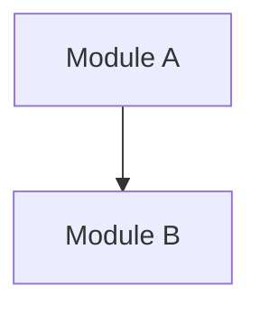
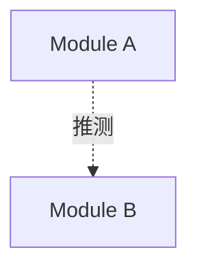
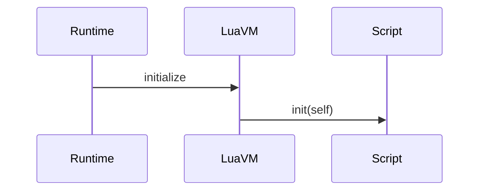

## Git commit message style

When generating git commit messages, follow the existing repository style.

### Style rules

- Use Conventional Commit prefixes when writing the commit subject.
- Preferred types include:
    - `feat:`
    - `fix:`
    - `refactor:`
    - `docs:`
    - `chore:`
    - `build:`
    - `perf:`
    - `style:`
    - `test:`
- After the prefix, write a concise Chinese description.
- Keep the message short, direct, and engineering-oriented.
- Prefer describing the actual change, not abstract goals.
- Mention the affected module, subsystem, or feature when helpful.
- Do not write overly long commit subjects.
- Do not add body text unless explicitly requested.
- Do not mention AI, ChatGPT, Codex, or the assistant.

### Preferred wording patterns

- `feat: 添加 xxx`
- `feat: 接入 xxx`
- `feat: 升级 xxx 到 x.x`
- `fix: 修正 xxx`
- `fix: 修复 xxx`
- `refactor: 调整 xxx`
- `refactor: 重构 xxx`
- `docs: 更新 xxx`
- `chore: 整理 xxx`
- `build: 添加 xxx 配置`

### Example commit subjects

- `feat: upgrade lvgl to 9.5 and wire launcher init`
- `fix: 修正 LTDC VSync 通知链路`
- `refactor: 调整 LVGL 9.5 移植代码`
- `feat: 添加 STLink 下载配置`

### Commit generation process

Before proposing a commit message:

1. Check the staged diff with `git diff --cached`.
2. Determine the single main purpose of the change.
3. Match the purpose to the most appropriate commit type.
4. Write one concise commit subject in the existing style.
5. If the staged changes are unrelated, suggest splitting them into multiple commits.

### Output format

Unless otherwise requested, output only the final commit subject.

## Documentation update policy

When adding, changing, or removing a feature, update the relevant Markdown documentation in the same change.

Required behavior:

* Update `README.md`, feature docs, API docs, usage examples, or changelog entries when user-facing or developer-facing behavior changes.
* If a feature introduces configuration, commands, lifecycle hooks, public APIs, file formats, or editor-facing behavior, document it before considering the task complete.
* Keep documentation consistent with the actual implementation. Do not describe planned behavior as if it already exists.
* If no documentation update is needed, explicitly state why in the final response.


## Architecture documentation policy

When asked to analyze or document system architecture, create or update Markdown documentation instead of generating image files.

Preferred output:

* Use Mermaid diagrams inside Markdown.
* Prefer `flowchart` for high-level architecture.
* Prefer `sequenceDiagram` for lifecycle, loading flow, or runtime execution order.
* Keep high-level architecture diagrams under 15 nodes unless explicitly requested.
* Do not create PNG, SVG, draw.io, Excalidraw, or other binary diagram files unless explicitly requested.

Required behavior:

* Do not invent modules, APIs, lifecycle callbacks, file formats, or dependencies.
* Separate confirmed facts from inferred relationships.
* Use solid arrows for confirmed relationships.
* Use dashed arrows for inferred or uncertain relationships.
* Mark uncertain sections as `推测` or `未确认`.
* Reference real repository file paths for important conclusions.
* If a file path cannot be confirmed, do not cite it as evidence.
* If documentation and implementation disagree, explicitly list the difference.

When creating architecture documentation, include these sections when relevant:

* System overview
* High-level architecture diagram
* Core module table
* Main data flow
* Runtime / main loop flow
* Lua VM lifecycle
* Cart / BIN loading flow
* Resource system
* Module dependencies
* Confirmed facts
* Inferred relationships
* Open questions
* Referenced files
* Check results

## Project architecture focus

For this project, pay special attention to:

* Program entry point
* Runtime / engine initialization
* Main loop / frame loop
* Lua VM setup and script execution
* Lua lifecycle callback dispatch
* Cart / BIN package loading
* Manifest / index / resource table parsing
* Resource loading and lookup
* Input dispatch
* Rendering boundary
* Audio boundary
* Save / persistent storage
* Tooling / packer behavior
* Hot reload / reload behavior if present

## Lua VM lifecycle analysis

When analyzing Lua VM behavior, check whether the project supports callbacks such as:

```lua
function init(self)
end

function final(self)
end

function fixed_update(self, dt)
end

function update(self, dt)
end

function late_update(self, dt)
end

function on_message(self, message_id, message, sender)
end

function on_input(self, action_id, action)
end

function on_reload(self)
end
```

Rules:

* Do not assume a callback exists unless the source code confirms it.
* If a callback appears only in documentation or examples, mark it as `文档出现，源码未确认`.
* If a callback exists but the call order is unclear, mark the order as `未确认`.
* If `fixed_update`, `update`, and `late_update` order is confirmed by code, document the exact order.
* If shutdown or cleanup behavior calls `final`, document the owner responsible for calling it.

## Cart / BIN format analysis

When analyzing cart or BIN package behavior:

* Check both format documentation and implementation.
* Identify magic, version, header, manifest, index, directory, script section, resource section, entry script, checksum, compression, or alignment fields only if they are actually present.
* Do not add fields just because they are common in similar formats.
* If a field exists in documentation but not in implementation, mark it as `文档定义，源码未确认`.
* If implementation differs from documentation, add a `文档与实现差异` section.
* Prefer citing parser, loader, packer, and format documentation files together.

## Mermaid diagram rules

Use Mermaid syntax that can render in GitHub Markdown.

For confirmed dependencies:



For inferred or uncertain dependencies:



For lifecycle or loading order:



Keep labels short. Put detailed explanation below the diagram instead of overloading diagram nodes.


## Code exploration policy

Before using grep/find/Read for project-wide exploration, use CodeGraph first.

Preferred order:
1. codegraph_status
2. codegraph_explore for architecture or "how does X work"
3. codegraph_search for locating symbols
4. codegraph_callers / codegraph_callees for call chains
5. codegraph_impact before edits
6. Read only the specific files that must be changed

Do not scan the whole repository unless CodeGraph cannot answer the question.
