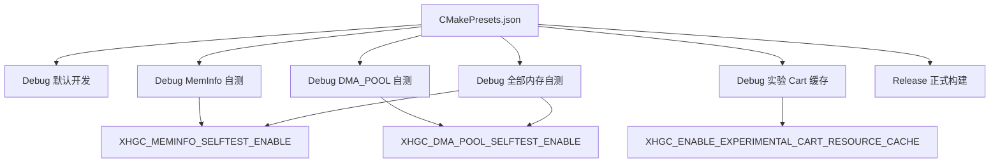

# CLion / CMake 构建配置入口

本文档说明仓库当前提供的 CMake Presets，以及在 CLion 中如何选择稳定构建、自测构建和实验构建。配置来源为 `CMakePresets.json`，CMake 选项来源为 `CMakeLists.txt`。

## 配置关系图



图中所有实线关系都已由 `CMakePresets.json` 和 `CMakeLists.txt` 确认。

## 配置总览

| 配置名称 | CMake 选项 | 用途 | 是否默认推荐 | 是否可用于实机稳定验证 |
|---|---|---|---:|---:|
| `Debug` | `CMAKE_BUILD_TYPE=Debug`；内存 selftest 和实验缓存均为 `OFF` | 默认开发构建 | 是 | 是 |
| `Debug-MemInfo-SelfTest` | `XHGC_MEMINFO_SELFTEST_ENABLE=ON` | 验证 APP_ARENA_REST / meminfo 统计 | 否 | 否 |
| `Debug-DmaPool-SelfTest` | `XHGC_DMA_POOL_SELFTEST_ENABLE=ON` | 验证 DMA_POOL 分配、对齐、contains、reset 和 meminfo | 否 | 否 |
| `Debug-All-Memory-SelfTest` | `XHGC_MEMINFO_SELFTEST_ENABLE=ON`；`XHGC_DMA_POOL_SELFTEST_ENABLE=ON` | 集中验证内存相关 Debug-only 自测 | 否 | 否 |
| `Debug-Experimental-CartCache` | `XHGC_ENABLE_EXPERIMENTAL_CART_RESOURCE_CACHE=ON` | 研究实验性 `lua_cart_resource_cache` 路径 | 否 | 否 |
| `Release` | `CMAKE_BUILD_TYPE=Release`；内存 selftest 和实验缓存均为 `OFF` | 正式发布构建 | 按发布场景使用 | 是 |

## 配置说明

### Debug

默认调试构建，不启用内存自测或实验缓存。日常开发、普通调试、实机稳定验证都优先使用这个配置。

不应在需要验证 APP_ARENA_REST / DMA_POOL 统计自测时使用，因为它会保持 selftest 关闭，默认 ELF 不包含 Debug-only 自测入口。

### Debug-MemInfo-SelfTest

启用 `XHGC_MEMINFO_SELFTEST_ENABLE=ON`，用于验证 APP_ARENA_REST、resource arena owner guard 和 meminfo 的 used、peak、reset、fail 统计。

只应在调整 app arena、meminfo 或 owner guard 后本地验证时使用；不应用作日常刷机或稳定性基线。

### Debug-DmaPool-SelfTest

启用 `XHGC_DMA_POOL_SELFTEST_ENABLE=ON`，用于验证 DMA_POOL 临时 DMA buffer 分配、64 字节以上对齐、contains 边界检查、越界失败记录和 reset 后统计行为。

只应在调整 DMA_POOL allocator、cache 规则或 DMA meminfo 接入后使用；不应用作日常刷机或发布构建。

### Debug-All-Memory-SelfTest

同时启用 `XHGC_MEMINFO_SELFTEST_ENABLE=ON` 和 `XHGC_DMA_POOL_SELFTEST_ENABLE=ON`，用于一次性跑完当前已确认的内存相关 Debug-only 自测。

只适合本地集中验证；如果只排查某一个 subsystem，优先使用更小的单项 selftest preset。

### Debug-Experimental-CartCache

启用 `XHGC_ENABLE_EXPERIMENTAL_CART_RESOURCE_CACHE=ON`，用于研究 `Core/LuaPort/lua_cart_resource_cache.c` 中的实验资源缓存路径。RESOURCE_ARENA 仍由 owner guard 保护，正式资源管理路径仍以 `resource_manager` 为准。

该配置不应用于稳定版本、普通实机验证或发布构建。

### Release

正式发布构建，关闭 Debug-only selftest 和实验性资源缓存。用于生成更接近发布状态的固件产物。

不应用于调试内存统计自测；如果要验证 selftest，请切换到对应 Debug preset。

## 命令行示例

默认 Debug：

```sh
cmake --preset Debug
cmake --build --preset Debug -j8
```

MemInfo 自测：

```sh
cmake --preset Debug-MemInfo-SelfTest
cmake --build --preset Debug-MemInfo-SelfTest -j8
```

DMA_POOL 自测：

```sh
cmake --preset Debug-DmaPool-SelfTest
cmake --build --preset Debug-DmaPool-SelfTest -j8
```

全部内存自测：

```sh
cmake --preset Debug-All-Memory-SelfTest
cmake --build --preset Debug-All-Memory-SelfTest -j8
```

实验 Cart 资源缓存：

```sh
cmake --preset Debug-Experimental-CartCache
cmake --build --preset Debug-Experimental-CartCache -j8
```

Release：

```sh
cmake --preset Release
cmake --build --preset Release -j8
```

辅助 target 仍可手动构建，不通过这些固件 build preset 自动改变：

```sh
cmake --build build/Debug --target luavm_tool
cmake --build build/Debug --target copy_luavm_to_packer
```

## CLion 使用说明

1. 打开仓库根目录后，让 CLion 读取 `CMakePresets.json`。
2. 在 `Settings | Build, Execution, Deployment | CMake` 中启用需要的 CMake profile。
3. 从 CLion 顶部配置切换器选择对应 preset。
4. 日常开发和普通实机验证默认选择 `Debug`。
5. 只有在验证内存管理器、DMA_POOL 或实验缓存时，才切换到对应 selftest / experimental preset。

仓库没有跟踪 `.idea/runConfigurations`。因此本文档不要求提交共享 Run/Debug XML 配置；CLion 应直接从 CMake Presets 导入 profile。

## 注意事项

- 默认 `Debug` 不启用 selftest。
- selftest 配置会改变启动期诊断行为，不应用于日常刷机。
- `Debug-Experimental-CartCache` 默认关闭，仅用于研究实验缓存路径。
- `Release` 不启用 Debug-only 自测。
- 每个 preset 使用独立 `build/${presetName}` 目录，避免不同 CMake cache 互相污染。
- `CMakeUserPresets.json` 适合个人本机配置，不应提交仓库。

## 文档与实现差异

未发现差异。当前文档中的 preset 名称、CMake 选项和 build directory 规则均来自 `CMakePresets.json`；选项定义来自 `CMakeLists.txt`。

## 参考文件

- `CMakePresets.json`
- `CMakeLists.txt`
- `Core/Src/main.c`
- `Core/LuaPort/app_arena.c`
- `Core/Driver/SDRAM/sdram.c`
- `Core/LuaPort/lua_cart_resource_cache.c`
- `Core/LuaPort/resource_arena_owner.c`
