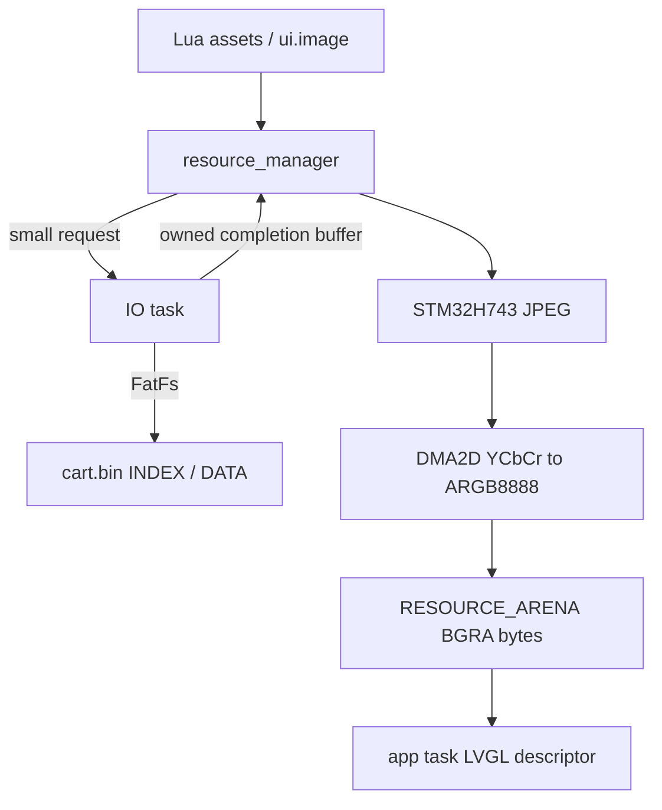
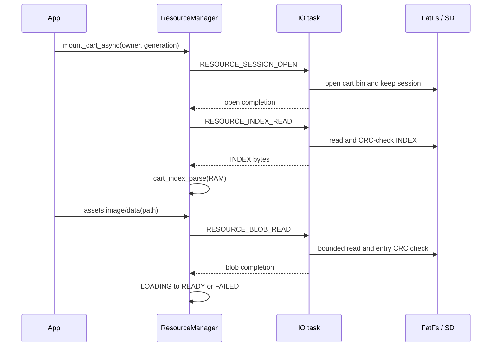

# Resource Pipeline V2

## 系统概览

Resource Pipeline V2 保持 Cart Header version 2、`XHGCIDX2` version 1 和 32-byte
entry 不变，在 INDEX 中新增 image format 5/6，并用 DATA 内的 XIMG v2 保存 JPEG
与 A8 plane 元数据。运行期 INDEX 和 resource blob 的 FatFs 读取只发生在 IO task；app
task 负责解析、状态切换、硬件 JPEG 解码、Lua handle 和 LVGL 更新。



## 二进制边界

确认的 XIMG v2 header 为 48 bytes、little-endian：

| Offset | Size | Field |
|---:|---:|---|
| 0 | 4 | `XIMG` |
| 4 | 2 | version = 2 |
| 6 | 2 | header_size = 48 |
| 8 | 2 | width |
| 10 | 2 | height |
| 12 | 1 | format = JPEG(5) / JPEG_A8(6) |
| 13 | 1 | flags = 0 |
| 14 | 2 | reserved = 0 |
| 16 | 4 | JPEG offset = 48 |
| 20 | 4 | JPEG size |
| 24 | 4 | A8 offset，JPEG 时为 0 |
| 28 | 4 | A8 size，JPEG 时为 0 |
| 32 | 4 | A8 stride，JPEG 时为 0 |
| 36 | 12 | reserved = 0 |

JPEG_A8 的 A8 offset 按 4 bytes 对齐，padding 必须为零；stride 等于 width，size
等于 `width * height`。INDEX 的 size 和 CRC32/IEEE 覆盖完整 XIMG blob。实现证据为
`Core/Cart/xhgc_cart.c` 的 `xhgc_ximg_v2_parse()` 和
`Docs/cart/xhgc-cartbin-format-spec-v2.2.md`。

## 异步 INDEX / DATA 流程



request message 保持不超过 96 bytes。open request 只携带一次 64-byte cart path；后续
操作使用 session id + generation。IO worker 分配 INDEX buffer；resource manager 为 blob
分配最多 1 MiB 的 RTOS heap staging。Submit 失败由提交方释放，completion 由 app 消费方
释放，completion queue 满由 IO worker 释放，stale completion 由 app 兜底释放。

同一路径在 `RES_LOADING` 时只提交一次 request；多个 Lua/UI handle 通过 generation 和
refcount 引用同一个 record。scene reset 先提交 session close，再 cancel owner；旧 request
只能产生可回收的 cancelled/stale completion，不能触碰旧 Lua VM 或 LVGL object。

## JPEG 与内存策略

`Core/LuaPort/cart_jpeg_decoder.c` 使用 STM32H743 JPEG peripheral 做 entropy/IDCT 解码，
接受 packer 生成的 4:4:4 和 4:2:0。硬件输出 MCU 排列的 YCbCr；DMA2D 使用
`DMA2D_INPUT_YCBCR` 转为 `DMA2D_OUTPUT_ARGB8888`。Cortex-M7 little-endian 内存字节为
`B,G,R,A`，与 LVGL `LV_COLOR_FORMAT_ARGB8888` 和旧 BGRA8888 路径一致。

最终 decoded buffer 直接分配在 RESOURCE_ARENA。受 HAL polling 输出方式限制，转换期间
还会在同一 arena 临时分配上界为 `align16(width) * align16(height) * 3` 的 YCbCr scratch；
DMA2D 完成后立即 reset 到 arena mark。blob staging 上限 1 MiB，data handle 保持 256 KiB
上限。DMA2D 前 clean YCbCr cache，并对目标做 clean+invalidate / completion invalidate；
最终 BGRA buffer 再 clean 后交给 LVGL。JPEG_A8 仅覆盖每像素 alpha byte，保持 0..255
straight alpha，不做 threshold 或 premultiply。

## Lua 与 UI 状态

`assets.image(path)` 和 `assets.data(path)` 都立即返回 userdata：

```text
INDEXED -> LOADING -> READY
                   -> FAILED
```

handle 提供 `ready()`、`status()`、`error()`、`size()`、`bytes()`。`bytes()` 只对 data
handle 有效：LOADING 返回 `nil, "not ready"`，FAILED 返回错误，READY 从已完成的 RAM
buffer 创建 Lua binary string，不访问 SD。

`ui.image` 接受 path、READY handle 或 LOADING handle。LOADING 时对象使用空 source 并
进入 app-owned pending list；`process_worker_completions()` 更新 resource 状态后，app task
安全点调用 `lua_ui_image_process_pending()`，再设置 descriptor 和 invalidate。对象提前删除
会先从 pending list 移除。

## 已确认事实

- INDEX/DATA resource read 由 `Core/APPS/TASK/cart_io_service.c` 的 IO worker 执行。
- RAM INDEX parser 为 `Core/Cart/cart_index.c` 的 `cart_index_parse()`。
- resource completion 先由 `resource_manager` 消费，再交给 storage/Launcher。
- BGRA8888 raw 和 XIMG v1 路径仍由 `resource_manager.c` 接受。
- Cart ENTRY bytecode 读取仍在 app 侧同步执行，本轮未修改。

## 未确认 / 目标板待测

- JPEG 4:4:4、4:2:0 与 JPEG+A8 的实际颜色/透明边缘仍需 STM32H743 真机验证。
- LOADING 中退出的 host ownership 路径已按 owner/session 设计，仍需真机压力测试。
- 当前 JPEG/DMA2D 使用 polling，硬件解码和转换发生在 app completion 安全点，可能造成
  短时 frame latency；SD/FatFs 本身已不在 app task。

## 存储与内存对比

使用 `xhgc-pack/examples/lua_ui_handle_test/assets/logo.png`（200 x 200）和默认 JPEG
quality 90、4:4:4 参数进行同图对比：

| Storage format | Blob bytes | 相对 BGRA8888 |
| --- | ---: | ---: |
| BGRA8888 | 160000 | 100% |
| JPEG | 27896 | 17.44%（约 5.74:1） |
| JPEG+A8 | 67896 | 42.44%（约 2.36:1） |

三种格式 READY 后的最终 RESOURCE_ARENA 像素均为 160000 bytes。JPEG/JPEG+A8 的额外
峰值由不超过 1 MiB 的 blob staging 与临时 YCbCr scratch
`align16(width) * align16(height) * 3` 构成；scratch 在 DMA2D 完成后回退。SD read、
JPEG decode、DMA2D conversion 和总延迟需要目标板上的 PerfMonitor/RuntimeStats 才能给出，
当前未验证，不以主机构建时间代替。

## 检查结果

HostTest、跨仓库 C parser compatibility 和各 firmware preset 的结果记录在本次变更最终
报告；不得把这些结果视为目标板验证。
