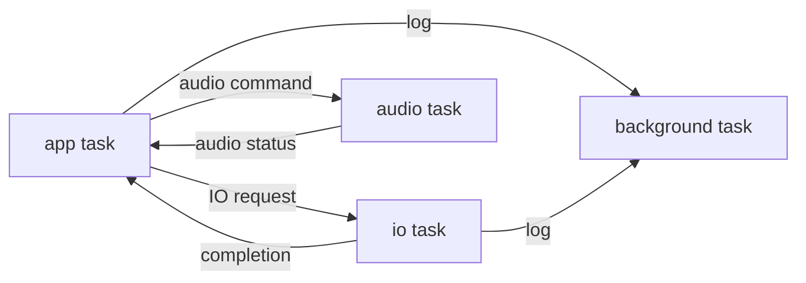

# CartDesk-OS RTOS 任务架构

## 当前任务

系统只保留四个业务任务。任务由 `Core/Src/freertos.c` 创建，业务入口位于
`Core/APPS/TASK/`，没有独立 Lua、LVGL、timer、storage 或 input task。



| 任务 | CMSIS-RTOS2 优先级 | 栈配置 | 入口 |
|---|---:|---:|---|
| `audio` | High | 8 KiB | `CartdeskAudioTask_Run()` |
| `app` | AboveNormal | 32 KiB | `CartdeskAppTask_Run()` |
| `io` | Normal | 12 KiB | `CartdeskPeripheralTask_Run()` |
| `background` | Low | 6 KiB | `CartdeskBackgroundTask_Run()` |

## app task

`app` 是 LVGL 与 Lua VM 的唯一 owner。初始化阶段最多等待 IO_READY 5 秒；失败后仍创建
LVGL、触摸和 Launcher，并使用内建字体降级。5 ms 循环顺序为：

```text
最多处理 8 条 worker completion
→ QFlash 独占窗口检查
→ lvgl_task_handler()
→ LuaRuntimeTask_Process()
→ Launcher_Task()
→ RuntimeStats_UpdateSnapshot()
→ osDelayUntil()
```

所有 completion 先由 `Core/APPS/TASK/app_task.c` 接收，再分派给 Lua foundation 或
Launcher。worker 不接触 `lua_State *`、`lv_obj_t *`，也不直接调用生命周期函数。

## io task

`io` 在调度器启动后完成 QFlash bring-up、memory-mapped 模式建立、littlefs 挂载和
LauncherStore 初始化，并处理待落盘的崩溃记录。随后永久阻塞在 IO request queue。

已迁入 io 的真实业务：

- 崩溃日志目录创建、FatFs append/sync/close；
- Launcher 周期 Cart 探测及 Header/MANF 元数据读取；
- Launcher 200×200 预览读取；
- LauncherStore 图标读取和原子 Upsert；
- Lua storage load/commit/clear 的 littlefs backend。

当前仍未迁入的路径列在“后续扩展”，不能把它们误记为已经满足 io owner。

## audio task

`audio` 没有伪造播放功能。它阻塞等待 8 深度 command queue，只实现
`CART_AUDIO_CMD_NONE`、`CART_AUDIO_CMD_STOP`、`CART_AUDIO_CMD_RESET` 的状态转换，
并通过 8 深度 completion queue 返回 `IDLE/STOPPED/RESET`。不存在 Codec、解码器、
DMA 音频流或“播放成功”状态。

## background task

`background` 阻塞消费统一日志队列，并且是正常运行期阻塞式
`HAL_UART_Transmit()` 的 owner。RuntimeStats 的文本格式化和输出也在该任务中执行。
USB CDC 日志尚未接入。

## 优先级与栈

app 保持 32 KiB，audio 保持 8 KiB。io 因 Cart/FatFs/littlefs 调用链由 4 KiB 提升到
12 KiB；background 因 `snprintf` 和 RuntimeStats 格式化由 4 KiB 提升到 6 KiB。

SizeDebug `.su` 的局部静态栈报告包括：app 入口 176 B、io worker 456 B、
`LauncherStore_Upsert()` 1040 B、background logger 432 B、RuntimeStats 文本函数 944 B。
`.su` 不能代替完整调用链和中断嵌套测量，因此配置值必须通过板上
`uxTaskGetStackHighWaterMark()` 继续收敛，本次不缩小 app 栈。

`configTOTAL_HEAP_SIZE` 仍为 98,304 B，没有修改。队列和任务继续从 AXI SRAM 中的
FreeRTOS heap 分配；没有迁移到 DTCM、ITCM 或 SDRAM，也没有修改链接脚本。

## 消息队列

| 队列 | 深度 | 消息类型 | 生产者 / 消费者 |
|---|---:|---|---|
| IO request | 16 | `cart_io_request_t`（目标端 72 B） | app → io |
| IO completion | 16 | `cart_io_completion_t`（目标端 40 B） | io → app |
| log | 24 | 限长 tag + 160 B message | 所有任务 → background |
| audio command | 8 | `cart_audio_command_t` | app → audio |
| audio completion | 8 | `cart_audio_completion_t` | audio → app |

SDMMC diskio 的 `SDQueueID` 与上述 IO request queue 不同。前者位于
`FATFS/Target/sd_diskio.c`，只把 SDMMC IDMA ISR 的完成/错误事件交回当前同步 diskio
调用；后者是业务级操作、request ID、owner、超时和 completion 的边界，二者不能互换。

## 请求和完成消息

统一定义位于 `Core/APPS/TASK/task_messages.h`。请求由
`CartIoService_NextRequestId()` 生成非零 ID，Lua 应用请求携带 owner ID。每个请求记录
提交 tick 和明确超时；io 在开始执行前拒绝过期或已取消 owner 的请求。app 每帧最多
消费 8 条 completion，剩余消息保留在队列。

队列满时提交立即失败，不阻塞 app，也不会退化为同步 I/O。completion queue 满会增加
`queue_full`；调用者拥有的固定 buffer 仍由调用者持有，RTOS heap buffer 的失败回收路径
由 storage completion/stale completion 处理。

## Buffer 所有权

`cart_task_buffer_t` 记录地址、capacity、有效 length、owner ID 和来源池。消息本身不包含
Lua/LVGL 对象，也不保存调用者局部栈地址。

```text
app 或 Lua storage 分配稳定 buffer
→ Submit 成功后所有权转移给 io
→ io 无论成功、失败、超时或取消都随 completion 返回描述符
→ app owner 使用后释放，旧 owner 只回收不派发
```

Launcher 图片使用既有 `LAUNCHER_CACHE` 固定缓冲，不建立第二套资源缓存。Lua storage
异步快照使用 FreeRTOS heap，最多 16 KiB；`CartTaskBuffer_Release()` 只释放标记为
`CART_BUFFER_SOURCE_RTOS_HEAP` 的 buffer，并清零描述符。正式应用资源 owner 仍是现有
`resource_manager`。

## Lua 与 LVGL 线程边界

只有 app 调用 LVGL、Lua C API、Lua VM 和生命周期。storage owner 创建后先提交异步
load；`lua_rt_start_runtime()` 不再立即调用 `init(self)`，而是等
`lua_foundation_storage_ready()` 后按原顺序进入 lifecycle。帧生命周期顺序未修改：
`on_input → fixed_update → update → late_update → on_message`，timer 仍由
`lua_foundation_process()` 在 app 执行。

## FatFs/littlefs 所有权

崩溃日志、Launcher 探测/预览、LauncherStore 和 Lua storage 已由 io 调用 FatFs 或
littlefs。`LauncherStore_Get()` 只复制 io 初始化时载入的 RAM 索引，允许 app 调用。

尚存例外：`Core/Src/lua_vm.c` 的 Cart ENTRY 加载、`Core/Cart/cart_index.c` 和
`Core/LuaPort/resource_manager.c` 的运行期资源读取仍在 app。它们需要先完成大资源
异步接口，当前没有冒险把 Lua loader 或 resource manager 移到 worker。

## QFlash 访问规则

QFlash handle 只由 `Core/APPS/TASK/cart_io_service.c` 持有。littlefs 操作提交成功后增加
QFlash exclusive 计数；app 在计数非零时不调用 LVGL 或 Lua，io 完成操作并恢复
memory-mapped 后再清除计数。这样 QFNT 字体渲染不会与擦除/编程并发。

这是安全静默窗口，不是并行字体写入方案：QFlash 写入期间 UI 帧会暂停，实际暂停长度
需要板测。不得绕过 service 直接调用 `LFS_EnableMappedRead()` 或 Flash erase/prog。

## 日志链路

`CartLog_TryWrite()` 只复制限长消息并零等待入队。队列满时丢弃并累计 dropped count，
不阻塞 app，不回退到同步 UART。background 添加时间、等级、tag 后使用阻塞 UART；
当前没有实现“ERROR 覆盖最旧 DEBUG”，以保持队列行为简单确定。

Fault 捕获、调度器前启动错误和 `_write()` 保留最小同步 UART 应急路径；它们不属于正常
业务日志。Lua log、Lua VM/runtime 诊断、Lua heap 统计、Launcher 点击日志、崩溃落盘结果
和 RuntimeStats 已接入 background 路径。

## 应用退出与请求取消

Lua foundation 销毁 storage owner 时调用 `CartIoService_CancelOwner(owner_id)`。未开始请求
由 io 返回 CANCELLED；已经执行的请求允许完成。app 找不到活跃 owner 时不调用旧 VM，
只释放随 completion 返回的 buffer 并增加 stale completion。owner ID 不复用，避免旧完成
消息命中新应用。

## 超时策略

集中常量位于 `cart_io_service.h`：Cart Header 500 ms、普通 SD 读 2 s、SD 写 3 s、
littlefs commit 3 s、IO_READY 5 s。超时在 io 开始执行前判断；底层 FatFs/Flash 驱动仍有
自己的硬件超时。已经交给 io 的 buffer 不能由提交者在业务超时点提前释放。

## 任务统计

`cart_task_stats_t` 记录 heartbeat、最近 heartbeat tick、处理/失败/超时、queue full、
stale completion、最大队列深度、最近/最大耗时和栈高水位。app、io、audio、background
提供快照 getter；io/audio 在 DWT 可用时记录处理耗时。统计不会在每次请求后打印。

板上真实栈高水位、队列峰值和 FreeRTOS minimum-ever-free heap 尚未采集，不能用 `.su`
或静态估算冒充实机数据。

## 后续扩展

- 将 Cart ENTRY bytecode、INDEX/DATA、`assets.data()`、`assets.image()` 和正式
  `resource_manager` 数据读取接入 io completion；LVGL descriptor 和 Lua userdata 仍回 app 创建。
- 为 running request 增加后端可中断取消点；当前取消保证内存安全，但不能中断已进入的 FatFs 调用。
- 用板级数据验证 QFlash 静默窗口、四任务高水位、FreeRTOS heap 低水位和队列峰值。
- 将 USB CDC 作为 background logger 的可选第二 transport；不新增 USB 日志 task。

## 已确认事实

- 四个业务 task 及其优先级、栈来自 `Core/Src/freertos.c`。
- app 循环和 completion 上限来自 `Core/APPS/TASK/app_task.c`。
- IO 队列、超时、取消、QFlash 策略来自 `cart_io_service.c/.h`。
- Lua 生命周期顺序来自 `Core/Src/lua_vm.c`，storage 异步桥接来自
  `Core/LuaPort/modules/lua_storage.c`。
- Launcher 异步状态机来自 `Core/Screen/Page/ui_screen_launcher.c`。
- 日志队列来自 `Core/LuaPort/cart_log.c`，UART 消费者是 `background_task.c`。

## 推测与未确认

- 12 KiB io 和 6 KiB background 栈根据 `.su` 与调用链留有余量，但实机高水位未确认。
- 98,304 B FreeRTOS heap 的启动/峰值余量根据消息大小可静态估算，实际碎片和 minimum-ever-free 未确认。
- QFlash 静默窗口从代码上避免并发访问；字体显示和写入期间的板级稳定性仍未确认。

## Open questions

- Cart ENTRY 和 INDEX/DATA 异步化后，bytecode/resource buffer 应优先使用 DMA_POOL 还是
  RESOURCE_ARENA 的哪一种现有 owner 转移接口？
- 是否需要为长时间 SD 读取增加可中断的底层取消，而不仅是开始执行前取消？
- USB CDC 日志启用后，UART 与 USB 的 backpressure 策略如何配置？

## Referenced files

- `Core/Src/freertos.c`
- `Core/APPS/TASK/app_task.c`
- `Core/APPS/TASK/cart_io_service.c`
- `Core/APPS/TASK/task_messages.h`
- `Core/APPS/TASK/audio_task.c`
- `Core/APPS/TASK/background_task.c`
- `Core/Screen/Page/ui_screen_launcher.c`
- `Core/LuaPort/modules/lua_storage.c`
- `Core/LuaPort/cart_log.c`
- `Core/Cart/launcher_store.c`
- `Core/Debug/crash_record.c`
- `FATFS/Target/sd_diskio.c`

## Check results

Release 与 SizeDebug 构建均通过。host contract test 覆盖 request ID、owner、正常完成、
超时、取消、stale completion、队列满、所有权返回、失败回收、重复完成和重复释放。
板级测试未在本次代码环境执行，相关结论均标记为未确认。
