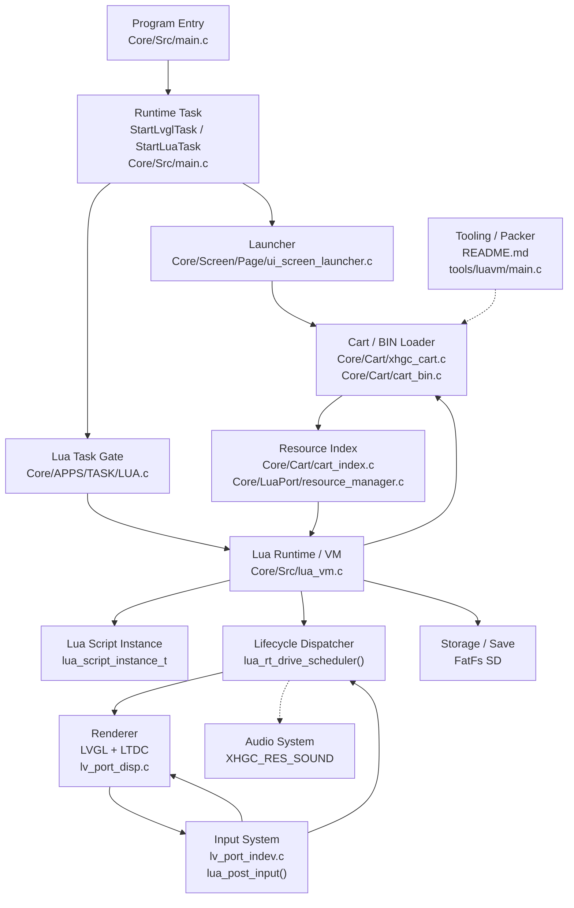
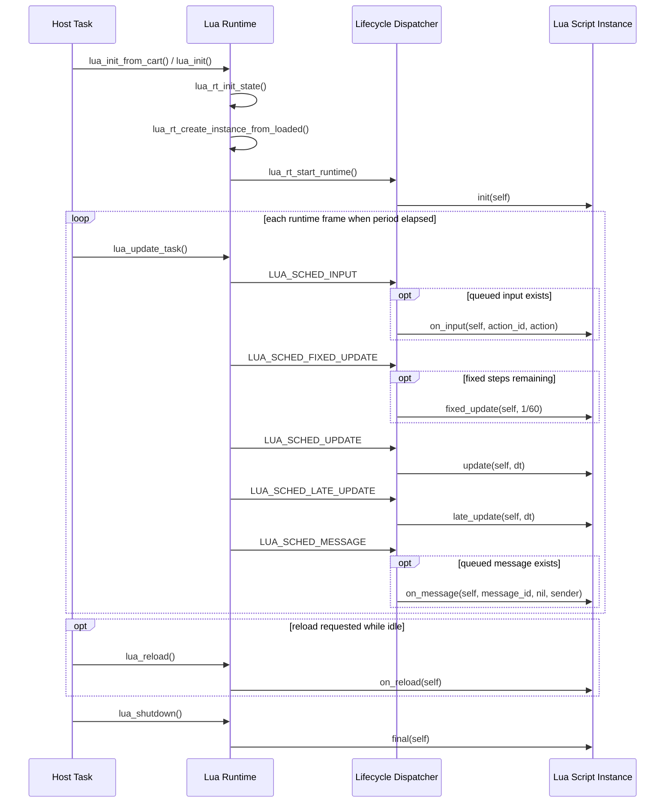
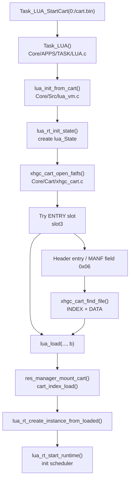
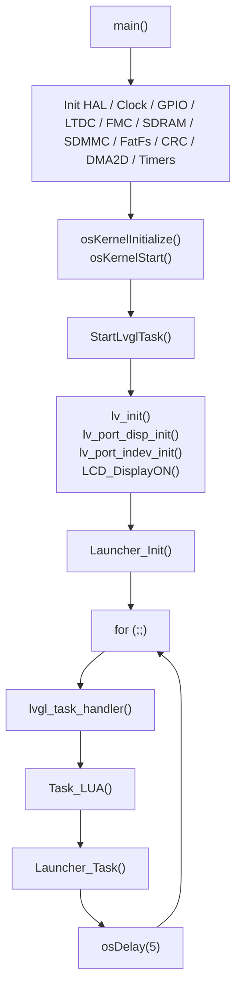
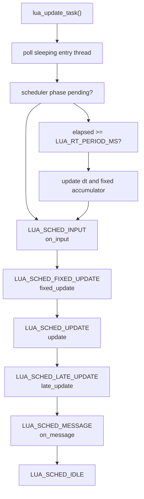
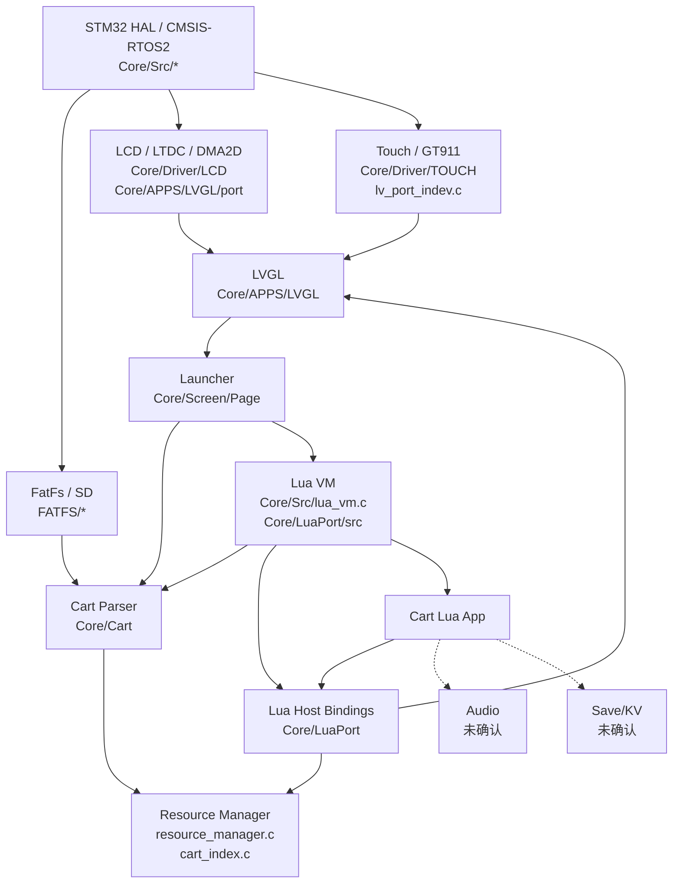

# 系统架构

本文档基于当前仓库源码、现有文档和构建配置整理。凡无法从当前仓库直接确认的内容，均标注为“推测”或“未确认”。本文只描述当前实现，不描述计划中的能力。

## 1. 系统总览

`cartdesk-os` 是面向 STM32H743 的嵌入式桌面/启动器固件。主程序入口在 `Core/Src/main.c`，启动后先完成 MPU、Cache、HAL、系统时钟和外设初始化，再启动 CMSIS-RTOS2 kernel。默认路径下创建 `StartLvglTask()`，该任务负责初始化 LVGL、显示、输入、launcher，并在循环中周期调用 LVGL、Lua task 和 launcher task。

程序启动路径已确认如下：

1. `main()` 初始化 GPIO、MDMA、LTDC、FMC/SDRAM、USART、SDMMC/FatFs、CRC、DMA2D、QSPI、I2C、RNG、TIM 等外设，见 `Core/Src/main.c`。
2. `main()` 调用 `osKernelInitialize()`，启动 TIM17/TIM16，然后根据 `CARTDESK_RUN_LUA_VM_ONLY` 选择创建 `StartLuaTask()` 或 `StartLvglTask()`，见 `Core/Src/main.c`。
3. 默认 `StartLvglTask()` 中执行 `lv_init()`、`lv_port_disp_init()`、`lv_port_indev_init()`、`LCD_DisplayON()`、`Launcher_Init()`，随后循环调用 `lvgl_task_handler()`、`Task_LUA()`、`Launcher_Task()` 并 `osDelay(5)`，见 `Core/Src/main.c`。
4. `CARTDESK_RUN_LUA_VM_ONLY` 打开时，`StartLuaTask()` 直接执行 `lua_init()`，随后循环调用 `lua_update_task()`，见 `Core/Src/main.c`。

cart/bin 包加载分为 launcher 快速读取和 runtime 入口加载两条路径：

- launcher 通过 `Core/Cart/cart_bin.c` 从 SD 卡 `cart.bin` 读取 Header 标题、固定偏移 `0x1000` 的 200x200 预览图，以及地址表摘要，用于卡槽展示。
- Lua runtime 通过 `Core/Src/lua_vm.c` 打开 cart，调用 `xhgc_cart_open_fatfs()` 解析 `XHGC_PAC` Header，再优先读取 `ENTRY` slot；如果没有 `ENTRY` slot，则使用 Header 中的 `entry` 字段，必要时退回 MANF field `0x06`，再通过 INDEX/DATA 找到入口文件。
- 资源系统通过 `Core/LuaPort/resource_manager.c` 挂载 cart index，并按需从 DATA 段读取 BGRA8888 图片到 `RESOURCE_ARENA`。

Lua VM 位于 runtime 核心。`lua_rt_init_state()` 创建 `lua_State`，打开一组 Lua 标准库，绑定宿主 API，并初始化资源管理器。每个加载脚本被创建为 `lua_script_instance_t`，拥有独立 `_ENV`、registry-owned `self` 表、协程 thread 和生命周期回调引用，见 `Core/Src/lua_vm.c`。

游戏逻辑以 Lua 生命周期函数运行。脚本 chunk 被加载并执行后，runtime 缓存 `init`、`final`、`fixed_update`、`update`、`late_update`、`on_message`、`on_input`、`on_reload` 等函数引用。`lua_update_task()` 根据 10ms runtime period、固定步长 accumulator、输入队列和消息队列推进调度。

输入、渲染、音频、存档与 Lua/runtime 的关系如下：

- 输入：GT911 触摸由 `Core/APPS/LVGL/port/lv_port_indev.c` 注册为 LVGL pointer indev。Lua UI 控件的 LVGL 事件回调会调用 `lua_post_input()` 入队，例如 `ui.button` 和 `ui.slider`，然后 runtime 在 `LUA_SCHED_INPUT` 阶段调用 `on_input(self, action_id, action)`。
- 渲染：LVGL 显示移植在 `Core/APPS/LVGL/port/lv_port_disp.c`，使用 LTDC + 双缓冲 + VBlank flush。Lua 通过 `lua_port.c` 暴露的 `ui.button`、`ui.slider`、`ui.image` 创建 LVGL 对象，渲染由 LVGL/LTDC 链路完成。
- 音频：`Core/Cart/xhgc_cart.h` 定义了 `XHGC_RES_SOUND` 资源类型，但当前未找到 Lua 音频模块、音频调度器或 runtime 音频 API。音频系统与 Lua 层的交互为“未确认”。
- 存档：当前确认的持久化路径是 SD/FatFs 读取 cart 和 Lua bytecode 文件。未找到 Lua 层 save/KV/storage API；`Docs/display/launcher_action_hints.md` 和 launcher 注释提到 favorite/KV 为未来存储层。Lua 存档能力为“未确认”。

## 2. 高层架构图



说明：

- 实线表示当前源码中可确认的调用或数据依赖。
- 虚线表示仓库中有格式、文档或资源类型线索，但缺少直接实现链路。
- `Tooling / Packer` 中，当前仓库只包含 host `luavm` 工具源码和 `packer/tools/luavm` 产物；完整 PC 打包器源码不在本仓库，README 指向外部仓库 `ExMikuPro/xhgc-pack`。

## 3. 核心模块说明

| 模块名称 | 作用 | 关键文件 | 状态 | 备注 |
|---|---|---|---|---|
| Program Entry | MCU、外设、RTOS 和任务启动入口 | `Core/Src/main.c` | 已确认 | 默认创建 `StartLvglTask()`；可配置为 Lua-only task。 |
| LVGL Runtime Task | 初始化 LVGL、显示、输入、launcher，并周期驱动 LVGL/Lua/launcher | `Core/Src/main.c` | 已确认 | 循环调用 `lvgl_task_handler()`、`Task_LUA()`、`Launcher_Task()`。 |
| Launcher | 展示 cart 标题/预览图，处理启动和退出 | `Core/Screen/Page/ui_screen_launcher.c` | 已确认 | 点击第 0 个卡槽后调用 `Task_LUA_StartCart("0:/cart.bin")`。 |
| Lua Task Gate | Lua 启停请求状态机 | `Core/APPS/TASK/LUA.c` | 已确认 | 默认 cart 路径为 `0:/cart.bin`；停止时调用 `lua_shutdown()`。 |
| Lua Runtime / VM | Lua state、脚本实例、生命周期调度、cart/file/embedded boot 加载 | `Core/Src/lua_vm.c`、`Core/Inc/lua_vm.h` | 已确认 | 支持最多 `LUA_RT_MAX_INSTANCES` 个实例，默认 4。 |
| Lua Port Bindings | 绑定 GPIO/PWM/TIM/RNG/CRC/delay/UI 到 Lua 全局环境 | `Core/LuaPort/lua_port.c` | 已确认 | 创建全局 `gpio`、`pwm`、`tim`、`rng`、`crc`、`ui`、`delay`。 |
| Lua UI Widgets | Lua 创建 LVGL button/slider/image，并向 runtime 派发输入 | `Core/LuaPort/modules/lua_ui_button.c`、`lua_ui_slider.c`、`lua_ui_image.c` | 已确认 | `ui.image` 经资源管理器加载 cart 图片。 |
| Cart Header Loader | 解析 XHGC Header、slot table、MANF、INDEX/DATA 文件 | `Core/Cart/xhgc_cart.c`、`Core/Cart/xhgc_cart.h` | 已确认 | 校验 magic、header version、header size、header CRC。 |
| Launcher BIN Reader | 快速读取标题、预览图和 Header 概要 | `Core/Cart/cart_bin.c`、`Core/Cart/cart_bin.h` | 已确认 | 预览图从固定 `0x1000` 读取，而非通过 slot0 查找。 |
| Resource Index | 加载 XHGCIDX2，建立路径到 DATA 偏移的元数据表 | `Core/Cart/cart_index.c`、`Core/Cart/cart_index.h` | 已确认 | 线性查找 path_hash + path 字符串。 |
| Resource Manager | 图片资源按需加载、handle/refcount、scene arena 管理 | `Core/LuaPort/resource_manager.c`、`resource_manager.h` | 已确认 | 目前 `res_acquire_image()` 只支持 BGRA8888 图片。 |
| Display Renderer | LVGL display port、LTDC 双缓冲、VSync flush | `Core/APPS/LVGL/port/lv_port_disp.c`、`Core/Driver/LCD/lcd.c` | 已确认 | `lv_port_disp.c` 直接设置 LTDC Layer1 地址并 VBlank reload。 |
| Input System | GT911 触摸接入 LVGL pointer indev | `Core/APPS/LVGL/port/lv_port_indev.c`、`Core/Driver/TOUCH/*` | 已确认 | Lua 层输入主要来自 Lua UI widget 的 LVGL 事件回调。 |
| Audio System | cart 格式预留 SOUND 资源类型 | `Core/Cart/xhgc_cart.h` | 未确认 | 未找到 Lua 音频 API、音频驱动调度或 sound resource loader。 |
| Storage / Save | SD/FatFs 作为 cart、Lua 文件读取介质 | `Core/Src/lua_vm.c`、`Core/Cart/*.c`、`FATFS/*` | 部分已确认 | 读取已确认；Lua 存档/保存 API 未确认。 |
| Host LuaVM Tool | PC 端 Lua 编译和脚本生命周期检查工具 | `tools/luavm/main.c`、`tools/luavm/CMakeLists.txt` | 已确认 | `--compile` 输出 luac；`--check` 模拟部分生命周期。 |
| PC Packer | 生成 cart.bin 的外部工具 | `README.md`、`Docs/cart/xhgc-cartbin-format-spec-v2.2.md` | 未确认 | 仓库没有完整 packer 源码，只含 `packer/tools/luavm`。 |

## 4. 主要数据流

### cart / bin 文件进入系统

launcher 快速路径：

1. `Launcher_Init()` 创建 launcher 页面。
2. `ui_screen_launcher.c` 中读取 `0:/cart.bin`：`cart_bin_read_title_from_sd()` 读取 Header title；`cart_bin_read_preview_from_sd()` 从 `CART_BIN_PREVIEW_OFFSET` 读取 200x200 BGRA8888 预览图；`cart_bin_read_info_from_sd()` 读取 Header 概要和 slot table。
3. launcher 将预览图放入 launcher cache，并通过 LVGL image 对象展示。

runtime 路径：

1. 用户点击卡槽后，launcher 调用 `Task_LUA_StartCart("0:/cart.bin")`。
2. `Task_LUA()` 在下一次 task tick 中调用 `lua_init_from_cart()`。
3. `lua_init_from_cart()` 调用 `lua_rt_init_state()` 初始化 VM，然后调用 `lua_run_cart_entry()` 加载入口脚本。

### 解析 manifest / index / resource table

1. `xhgc_cart_open_fatfs()` 使用 FatFs 打开文件，并将 `f_read/f_lseek` 封装为 reader。
2. `xhgc_cart_open_reader()` 读取 4096 字节 Header，校验 `XHGC_PAC` magic、version、header size、Header CRC，并解析 15 个 16 字节 slot。
3. MANF 解析由 `xhgc_cart_manf_get_string()`、`xhgc_cart_manf_get_u64()`、`xhgc_cart_read_manf()` 完成，字段通过 field id 查找。
4. INDEX 解析由 `cart_index_load()` 或 `xhgc_cart_find_file()` 完成。INDEX Header magic 为 `XHGCIDX2`，version 为 1，entry size 为 32。
5. DATA 资源读取由 INDEX entry 的 `data_off + size` 定位到 DATA slot 内的字节范围。

### 加载 Lua 脚本

runtime 入口加载顺序：

1. `lua_init()` 优先检查 `lua_get_boot_cart_path()`；如果配置了 cart path，则调用 `lua_run_cart_entry()`。
2. 如果没有 cart 或 cart 加载失败，再尝试 `lua_get_boot_bytecode_path()` 对应的 luac 文件。
3. 如果仍未成功，则使用弱符号 `lua_get_boot_script()` 返回的 embedded boot Lua 源码。
4. launcher 路径明确调用 `lua_init_from_cart("0:/cart.bin")`，因此直接走 cart entry。

cart entry 选择：

1. `lua_rt_select_cart_entry()` 先查 `XHGC_CART_SLOT_ENTRY`。
2. 如果 `ENTRY` slot 存在，直接把该 slot 作为 Lua bytecode 输入。
3. 如果 `ENTRY` slot 不存在，读取 Header `entry` 字符串；若为空，则读取 MANF field `0x06`。
4. 使用 `xhgc_cart_find_file()` 在 INDEX/DATA 中查找该 entry 路径。
5. `lua_rt_load_cart_entry()` 通过 `lua_load(..., "b")` 以二进制模式加载 bytecode。

### 初始化 Lua VM

1. `lua_rt_init_state()` 初始化 Lua VM SDRAM heap。
2. 使用 `lua_vm_newstate()` 创建 VM；封装内部使用 `lua_newstate(lua_vm_alloc, lua_vm_memory_allocator())`。
3. `lua_rt_openlibs()` 打开 base、coroutine、table、string、math、utf8。
4. `lua_port_bind()` 绑定宿主模块。
5. `res_manager_init()` 初始化资源管理器和 cart index 状态。
6. 清空脚本实例、输入队列、消息队列、scheduler 状态。

### 执行生命周期函数

1. `lua_rt_create_instance_from_loaded()` 为 chunk 设置独立 `_ENV`，执行 chunk，创建 `self` 表和 Lua thread。
2. `lua_rt_cache_callbacks()` 从实例环境中缓存生命周期函数引用。
3. `lua_rt_start_runtime()` 设置 runtime started，并进入 `LUA_SCHED_INIT`。
4. `lua_rt_drive_scheduler()` 调用 `lua_rt_begin_lifecycle()`，通过协程运行生命周期函数。

### 输入进入游戏逻辑

1. LVGL 触摸输入由 `lv_port_indev.c` 从 GT911 读取，送入 LVGL。
2. Lua UI button/slider 在 LVGL 事件回调中构造 `LuaInputAction` 并调用 `lua_post_input()`。
3. `lua_post_input()` 将事件写入固定容量环形队列。
4. `lua_rt_drive_scheduler()` 在 `LUA_SCHED_INPUT` 阶段逐个 input event 派发给已初始化实例的 `on_input(self, action_id, action)`。

### 游戏逻辑驱动渲染

1. Lua 脚本通过 `ui.button()`、`ui.slider()`、`ui.image()` 创建 LVGL 对象。
2. 脚本通过 `ui.patch(self, id, patch)` 修改已有 UI 对象。
3. LVGL 对象绘制由 `lvgl_task_handler()`/LVGL timer 机制推进。
4. `lv_port_disp.c` 的 `disp_flush()` 等待 VSync 后将 LTDC Layer1 地址切到当前 LVGL render buffer，并调用 `lv_display_flush_ready()`。

### 游戏逻辑驱动音频

未确认。当前仅能确认 `XHGC_RES_SOUND` 资源类型常量存在于 `Core/Cart/xhgc_cart.h`。未找到 Lua `audio`/`sound` 模块、音频播放 API、sound resource acquire/release 或音频帧调度代码。

### 游戏逻辑读写存档或状态

部分已确认：

- Lua 运行态状态保存在 `self` 表内，生命周期内有效，见 `Core/Src/lua_vm.c` 和 `Docs/lua/lua_lifecycle.md`。
- 文件读取路径使用 SD/FatFs，见 `lua_rt_load_file()`、`lua_rt_load_cart_entry()`、`cart_index_load()`。

未确认：

- 未找到 Lua 层保存 API、KV storage API、save file 格式或 runtime 存档回调。
- launcher 注释和文档提到 favorite/KV 为未来存储层，当前未实现。

## 5. Lua VM 生命周期

当前源码中生命周期名称数组位于 `Core/Src/lua_vm.c`：

```c
static const char *const k_lifecycle_names[LUA_LIFECYCLE_COUNT] = {
    "init",
    "final",
    "fixed_update",
    "update",
    "late_update",
    "on_message",
    "on_input",
    "on_reload",
};
```

回调确认表：

| Lua 回调 | 是否存在于 runtime 名称表 | 是否被调用 | 调用时机是否能确认 | 依据 |
|---|---:|---:|---:|---|
| `init(self)` | 已确认 | 已确认 | 已确认 | `LUA_SCHED_INIT` 中调用 `LUA_LIFECYCLE_INIT`，见 `Core/Src/lua_vm.c`。 |
| `final(self)` | 已确认 | 已确认 | 已确认 | `lua_shutdown()` 对已初始化且未 finalized 的实例调用 `LUA_LIFECYCLE_FINAL`。 |
| `fixed_update(self, dt)` | 已确认 | 已确认 | 已确认 | `LUA_SCHED_FIXED_UPDATE` 中以 `LUA_RT_FIXED_DT` 调用，固定步最多 `LUA_RT_MAX_FIXED_STEPS`。 |
| `update(self, dt)` | 已确认 | 已确认 | 已确认 | `LUA_SCHED_UPDATE` 中以 `g_frame_dt` 调用。 |
| `late_update(self, dt)` | 已确认 | 已确认 | 已确认 | `LUA_SCHED_LATE_UPDATE` 中以 `g_frame_dt` 调用。 |
| `on_message(self, message_id, message, sender)` | 已确认 | 已确认 | 已确认 | `lua_post_message()` 入队，`LUA_SCHED_MESSAGE` 派发；当前 `message` 参数为 `nil`。 |
| `on_input(self, action_id, action)` | 已确认 | 已确认 | 已确认 | `lua_post_input()` 入队，`LUA_SCHED_INPUT` 派发。 |
| `on_reload(self)` | 已确认 | 已确认 | 已确认 | `lua_reload()` 重新加载实例后调用 `LUA_LIFECYCLE_RELOAD`；要求当前无 entry thread 且 scheduler idle。 |

兼容性说明：

- 如果没有 `init`，但存在 `start`，`lua_rt_cache_callbacks()` 会把 `start` 作为 init，并设置 `legacy_callbacks = true`。
- legacy 模式下，`init/start` 和 `update` 不传 `self`，见 `lua_rt_begin_lifecycle()` 中的 `legacy_no_self` 判断。
- 缺失回调会被跳过。`init` 缺失时实例会被标记为 initialized。
- `final` 使用 `lua_rt_call_direct()` 直接调用，不走协程 scheduler。

已确认生命周期顺序图：



## 6. Cart / BIN 加载流程

### 文件头结构

当前实现和格式文档共同确认：

- magic：`"XHGC_PAC"`，8 字节，偏移 `0x0000`。
- `header_version`：u32 little-endian，偏移 `0x0008`，当前固定为 `2`。
- `header_size`：u32 little-endian，偏移 `0x000C`，当前固定为 `4096`。
- `flags`：u32，偏移 `0x0010`。
- `cart_id`：u64，偏移 `0x0014`。
- title/title_zh/publisher/version/entry/min_fw：固定长度 UTF-8 字符串副本。
- address table：偏移 `0x0F00`，15 个 slot，每个 16 字节。
- header CRC：偏移 `0x0FFC`，u32。

关键定义见 `Core/Cart/xhgc_cart.h` 和 `Docs/cart/xhgc-cartbin-format-spec-v2.2.md`。

### 版本字段

- Header version：`XHGC_CART_HEADER_VERSION = 2`。
- Header size：`XHGC_CART_HEADER_SIZE = 4096`。
- INDEX magic：`"XHGCIDX2"`。
- INDEX version：`XHGC_INDEX_VERSION = 1`。
- INDEX entry size：`XHGC_INDEX_ENTRY_SIZE = 32`。
- MANF version：源码中 `XHGC_MANF_VERSION = 1`。

### manifest / index / directory

MANF：

- slot2，`XHGC_CART_SLOT_MANF`。
- magic 为 `0x464E414D`，即 `"MANF"`。
- Header 16 字节，后接 field table，每个 field entry 8 字节。
- 当前源码读取 title、title_zh、publisher、version、cart_id、entry、min_fw 等字段。

INDEX：

- slot4，`XHGC_CART_SLOT_INDEX`。
- Header 32 字节：magic、version、entry_size、count、entries_off、strings_off、strings_size、flags。
- Entry 32 字节：path_hash、path_off、data_off、size、crc32、type、format、width、height、flags、reserved。
- string table 保存以 `\0` 终止的 cart 内相对路径。

DATA：

- slot5，`XHGC_CART_SLOT_DATA`。
- DATA 本身无 framing；文件边界由 INDEX entry 的 `data_off + size` 决定。

### Lua 脚本段

已确认有两种入口脚本来源：

- `ENTRY` slot：如果 slot3 存在，runtime 直接读取该 slot 作为 Lua bytecode。
- INDEX/DATA 文件：如果 slot3 不存在，runtime 用 Header 或 MANF 中的 entry 路径，通过 INDEX/DATA 找到脚本 blob。

`lua_rt_load_cart_entry()` 调用 `lua_load(..., "b")`，因此当前 runtime 期望加载 Lua bytecode，而不是源码文本。

### 资源段

资源类型定义见 `Core/Cart/xhgc_cart.h`：

- `XHGC_RES_IMAGE = 1`
- `XHGC_RES_SCRIPT = 2`
- `XHGC_RES_FONT = 3`
- `XHGC_RES_SOUND = 4`

图片格式定义：

- `XHGC_IMG_NONE = 0`
- `XHGC_IMG_BGRA8888 = 1`
- `XHGC_IMG_RGB565 = 2`
- `XHGC_IMG_A8 = 3`
- `XHGC_IMG_LVGL_BIN = 4`

当前 `resource_manager` 和 `ui.image` 已确认只支持 `XHGC_RES_IMAGE` + `XHGC_IMG_BGRA8888`。

### 入口脚本

入口脚本选择顺序已确认：

1. `XHGC_CART_SLOT_ENTRY`
2. Header `entry`
3. MANF field `0x06`
4. INDEX/DATA 中对应路径

如果 `ENTRY` slot 存在，则不会使用 Header/MANF entry 路径。

### 校验或压缩机制

已确认：

- `xhgc_cart_open_reader()` 校验 Header CRC32/IEEE。
- Header CRC 计算时临时把 `0x0FFC..0x0FFF` 置零。
- `xhgc_cart_open_reader()` 检查 slot offset/size 是否越过镜像大小。
- INDEX 解析检查 magic/version/entry_size/flags、entry/string table 范围、entry flags/reserved、DATA 范围。

未确认或未实现：

- `XhgcIndexEntry.crc32` 和 slot `crc32` 被解析保存，但当前读取 `xhgc_cart_read_file()`、`cart_read_data()` 时未看到对资源 blob CRC 的校验。
- 当前 DATA 压缩机制未实现。格式文档说明 `compress = "lz4"` 为后续扩展，当前 INDEX 不包含压缩元数据。

### 加载到 runtime / Lua VM 的流程



### 文档与实现差异

| 差异点 | 文档描述 | 当前实现 | 影响 |
|---|---|---|---|
| INDEX 查找方式 | 文档提到条目按字典序，可支持二分查找 | `cart_index_find()`、`xhgc_cart_find_file()` 当前线性遍历 | 性能差异；功能不冲突。 |
| 资源 CRC | 文档定义 slot CRC、entry CRC | Header CRC 已校验；资源/slot CRC 当前未见读取时校验 | 数据损坏检测能力弱于格式可表达能力。 |
| 预览图读取 | 格式定义 ICON slot0 | launcher `cart_bin_read_preview_from_sd()` 固定从 `0x1000` 读取 | 若未来 ICON 不在固定位置，launcher 快速预览会失效。 |
| PC 打包器 | 文档面向 PC 打包器 | 本仓库没有完整打包器源码，仅 README 指向外部仓库 | 打包器实际行为未确认。 |
| 压缩 | 文档说明压缩为后续扩展 | 当前 runtime 无解压路径 | DATA 必须按未压缩 blob 读取。 |
| Lua 源码入口 | 文档 entry 示例为 `app/main.lua` | runtime 使用 `lua_load(..., "b")` 二进制模式 | 当前入口应为 bytecode；源码文本入口未确认。 |

## 7. 主循环与帧循环

已确认的默认启动与帧循环：



Lua runtime 帧循环已确认：



说明：

- `init` 在 `lua_rt_start_runtime()` 后先进入 `LUA_SCHED_INIT`，可能在启动 runtime 时立即执行，也可能因 lifecycle yield/delay 由后续 `lua_update_task()` 继续推进。
- input、fixed_update、update、late_update、message 的顺序可从 `lua_rt_drive_scheduler()` 确认。
- render/audio 不在 `lua_rt_drive_scheduler()` 内直接作为生命周期阶段出现。渲染由 Lua 创建/修改 LVGL 对象后交给 LVGL task 和 display flush；音频阶段未确认。
- `final` 只在 `lua_shutdown()` 中确认调用，非普通帧循环的一部分。
- cleanup 包括 `lua_rt_delete_instance_children()`、`res_scene_reset()`、registry unref、`lua_close()`。

## 8. 资源系统

### 资源类型

格式层定义：

- image
- script
- font
- sound

当前 runtime 已确认使用：

- script：入口 bytecode 通过 `ENTRY` slot 或 INDEX/DATA 加载。
- image：`ui.image()` 通过 `resource_manager` 加载 BGRA8888 图片。

当前未确认使用：

- font：未找到 Lua/font resource 加载路径。
- sound：未找到 Lua/audio/sound resource 加载路径。

### 资源索引方式

`cart_index_load()`：

1. 打开 cart。
2. 获取 INDEX slot 和 DATA slot。
3. 读取并校验 `XHGCIDX2` Header。
4. 遍历 entries，读取 path string table，校验 path、path_hash、DATA 范围。
5. 将 `cart_res_meta_t` 和 path 缓存在静态数组中。

查找使用 FNV-1a path hash + 字符串比较。路径必须是相对路径，不允许空、绝对路径、反斜杠、冒号、`..` 段。

### 加载时机

- `lua_run_cart_entry()` 在创建 Lua 实例前调用 `res_manager_mount_cart(cart_path)`。
- `res_manager_mount_cart()` 只加载资源索引，不读取所有资源数据。
- `ui.image()` 调用 `res_acquire_image(src, RES_LIFE_SCENE)` 时才同步读取图片数据。

### 缓存机制

`resource_manager` 使用：

- `s_records[]` 保存资源记录、状态、refcount、generation、lifetime。
- `app_arena_t s_scene_arena` 从 `RESOURCE_ARENA_BASE` 分配像素内存。
- 资源状态包括 `RES_INDEXED`、`RES_LOADING`、`RES_READY`、`RES_READY_UNUSED`、`RES_FAILED`。
- 已 ready 的资源再次 acquire 会增加 refcount 并复用像素。

另有 `Core/LuaPort/lua_cart_resource_cache.c` 实现独立 cart resource cache，包含 arena block、entry refs、MDMA 拷贝、eviction；但当前从 `ui.image()` 路径看，实际使用的是 `resource_manager`。`lua_cart_resource_cache` 是否仍被 runtime 直接使用为“未确认”。

### 释放机制

- `ui.image` userdata `__gc` 或 `lua_ui_delete_children()` 会调用 `lua_ui_image_delete()`。
- `lua_ui_image_delete()` 删除 LVGL image 对象，并对持有的 resource handle 调用 `res_release()`。
- `res_release()` refcount 归零后把状态设为 `RES_READY_UNUSED`。
- `lua_shutdown()` 最后调用 `res_scene_reset()`，重置 scene lifetime 资源和 app arena。

注意：`res_scene_reset()` 会重置 arena 并把 scene 资源退回 indexed/failed 状态；没有逐块 free。

### Lua 层访问资源的方式

已确认的 Lua API：

```lua
local img, err = ui.image({
    src = "assets/images/player.png",
    rect = { 32, 32, 64, 64 },
    region = { 0, 0, 32, 32 },
    style = {
        alpha = 255,
        flip_x = false,
        flip_y = false,
    },
})
```

访问限制：

- `src` 必须是合法 cart 相对路径。
- 当前只支持 BGRA8888 图片。
- `ui.patch()` 不支持修改 image `src`；如果 patch table 包含 `src`，返回错误。

未确认点：

- Lua 是否有通用 `res`、`fs`、`audio`、`font` API。
- font/sound 是否有 runtime loader。
- 资源 CRC 是否会在加载时校验。

## 9. 模块依赖关系



强依赖：

- `Core/Src/main.c` 强依赖 HAL/CubeMX 初始化、CMSIS-RTOS2、LVGL task 入口。
- `Core/Src/lua_vm.c` 强依赖 Lua C API、FatFs、cart parser、resource manager、Lua port bindings。
- `ui.image` 强依赖 `resource_manager`、LVGL image、cart path 校验。
- launcher 强依赖 LVGL、`cart_bin` 快速读取、`Task_LUA` 启停接口。

弱依赖：

- Lua boot source 通过弱符号 `lua_get_boot_script()`、`lua_get_boot_bytecode_path()`、`lua_get_boot_cart_path()` 可被覆盖。
- `lua_rt_time_ms()`、`lua_rt_log()` 也为弱符号，可替换时间源和日志。

推测依赖：

- 外部 PC packer 依赖 `tools/luavm` 编译 Lua bytecode，并生成符合 XHGC 格式的 `cart.bin`。仓库 README 和 `copy_luavm_to_packer` 目标支持这一推测，但完整 packer 实现不在仓库。
- sound/font 资源类型可能服务于未来 runtime API，但当前未确认。

可能需要解耦的位置：

- `StartLvglTask()` 同时调用 LVGL、Lua task 和 launcher task，调度权集中；如果 Lua 运行时间变长，可能影响 LVGL 响应。
- `ui.image()` 同步读取 SD/FatFs 和分配资源，可能阻塞 LVGL task。
- launcher preview 读取固定偏移 `0x1000`，与通用 slot parser 存在重复路径。
- `resource_manager` 和 `lua_cart_resource_cache` 功能相近，当前职责边界需要确认。
- 资源 CRC 字段存在但读取路径未校验，格式能力和运行时保护不一致。

## 10. 待确认点

| 问题 | 影响 | 建议确认方式 | 相关文件 |
|---|---|---|---|
| 完整 PC 打包器实现不在仓库 | 无法确认 pack.json 到 cart.bin 的实际生成细节 | 查看外部 `ExMikuPro/xhgc-pack` 或引入打包器源码/版本锁定 | `README.md`、`Docs/cart/xhgc-cartbin-format-spec-v2.2.md` |
| runtime 是否支持 Lua 源码入口 | 当前 `lua_load(..., "b")` 只接受二进制 bytecode | 用源码 cart 做板级/host 测试，或确认 packer 总是输出 luac | `Core/Src/lua_vm.c`、`tools/luavm/main.c` |
| slot CRC / resource CRC 是否应该校验 | 当前资源读取可能不检测 blob 损坏 | 增加/运行损坏资源测试，明确 CRC 策略 | `Core/Cart/xhgc_cart.c`、`Core/Cart/cart_index.c` |
| audio/sound runtime 是否存在 | 无法说明游戏逻辑如何驱动音频 | 搜索/实现 Lua audio API、音频驱动和调度路径 | `Core/Cart/xhgc_cart.h` |
| Lua 存档/KV storage 是否存在 | 无法说明游戏如何持久化状态 | 查找或设计 save API 与文件格式 | `Core/Src/lua_vm.c`、`Docs/display/launcher_action_hints.md` |
| `lua_cart_resource_cache` 当前是否仍在使用 | 可能存在重复资源缓存实现 | 查调用者或编译链接符号，决定保留/删除/整合 | `Core/LuaPort/lua_cart_resource_cache.c`、`Core/LuaPort/resource_manager.c` |
| launcher 固定 offset 预览是否必须与 slot0 保持一致 | 格式扩展时可能破坏预览显示 | 用 `xhgc_cart_get_slot(ICON)` 替代或记录约束 | `Core/Cart/cart_bin.c`、`Docs/cart/xhgc-cartbin-format-spec-v2.2.md` |
| `Task_LUA()` tick 与 `lua_update_task()` runtime period 的组合时序 | 影响 Lua update 频率和输入延迟 | 板级测量 `TaskTicks_LUA` 和 `LUA_RT_PERIOD_MS` 实际节奏 | `Core/APPS/TASK/LUA.c`、`Core/Src/lua_vm.c` |
| `lvgl_task_handler()` 的具体实现 | README/主循环使用该函数，但另有 `Task_LVGL()` 调 `lv_timer_handler()` | 定位 `lvgl_task_handler` 实现或宏映射 | `Core/Src/main.c`、`Core/APPS/TASK/LVGL.c` |
| font resource 访问方式 | 格式定义 font，但 Lua/UI 字体加载链路未确认 | 搜索 font API 或创建资源加载设计 | `Core/Cart/xhgc_cart.h`、`Core/LuaPort/*` |

## 11. 参考文件

- `README.md`
- `Core/Src/main.c`
- `Core/Src/lua_vm.c`
- `Core/Inc/lua_vm.h`
- `Core/APPS/TASK/LUA.c`
- `Core/APPS/TASK/LVGL.c`
- `Core/Screen/Page/ui_screen_launcher.c`
- `Core/Cart/xhgc_cart.h`
- `Core/Cart/xhgc_cart.c`
- `Core/Cart/cart_bin.h`
- `Core/Cart/cart_bin.c`
- `Core/Cart/cart_index.h`
- `Core/Cart/cart_index.c`
- `Core/LuaPort/lua_port.c`
- `Core/LuaPort/resource_manager.h`
- `Core/LuaPort/resource_manager.c`
- `Core/LuaPort/lua_cart_resource_cache.h`
- `Core/LuaPort/lua_cart_resource_cache.c`
- `Core/LuaPort/modules/lua_ui_button.c`
- `Core/LuaPort/modules/lua_ui_slider.c`
- `Core/LuaPort/modules/lua_ui_image.c`
- `Core/APPS/LVGL/port/lv_port_disp.c`
- `Core/APPS/LVGL/port/lv_port_indev.c`
- `Docs/cart/xhgc-cartbin-format-spec-v2.2.md`
- `Docs/lua/lua_lifecycle.md`
- `Docs/display/DMA2D_适配逻辑.md`
- `Docs/display/launcher_action_hints.md`
- `tools/luavm/main.c`
- `tools/luavm/CMakeLists.txt`
- `CMakeLists.txt`
- `tests/xhgc_cart_host_test.c`
- `tests/lua/style_contract_lint.sh`

## 12. 检查记录

本次只创建/更新 Markdown 架构文档，仓库未发现专门的 markdown lint 或 docs build 配置。

已执行的检查命令：

| 命令 | 是否通过 | 失败原因 |
|---|---:|---|
| `rg -n "markdown\|mdlint\|docs\|doc\|test\|ctest\|add_test\|CARTDESK_BUILD_HOST_TESTS\|style_contract_lint\|luavm_tool\|xhgc_cart_host_test" CMakeLists.txt cmake tools tests README.md .github 2>/dev/null` | 未通过 | `.github` 路径不存在导致命令退出码为 2；输出仍确认未发现专门 markdown lint/docs build，且发现 host tests 与 Lua style lint。 |
| `find . -maxdepth 3 \( -name 'package.json' -o -name '.markdownlint*' -o -name 'pyproject.toml' -o -name 'Justfile' -o -name 'Makefile' \) -print` | 通过 | 仅找到 `./build/Makefile`，未找到文档检查配置。 |
| `./tests/lua/style_contract_lint.sh` | 通过 | - |
| `ctest --test-dir build/Debug --output-on-failure` | 通过 | CTest 正常运行，但当前 build tree 显示 `No tests were found!!!`。 |
| `cmake --build build/Debug --target xhgc_cart_host_test` | 未通过 | 当前 `build/Debug` 未配置 host 测试目标，Ninja 报 `unknown target 'xhgc_cart_host_test'`。 |

未运行更多检查：未找到明确的文档检查或 docs build 命令；host cart 测试需要以 `CARTDESK_BUILD_HOST_TESTS=ON` 重新配置后才有对应目标。
