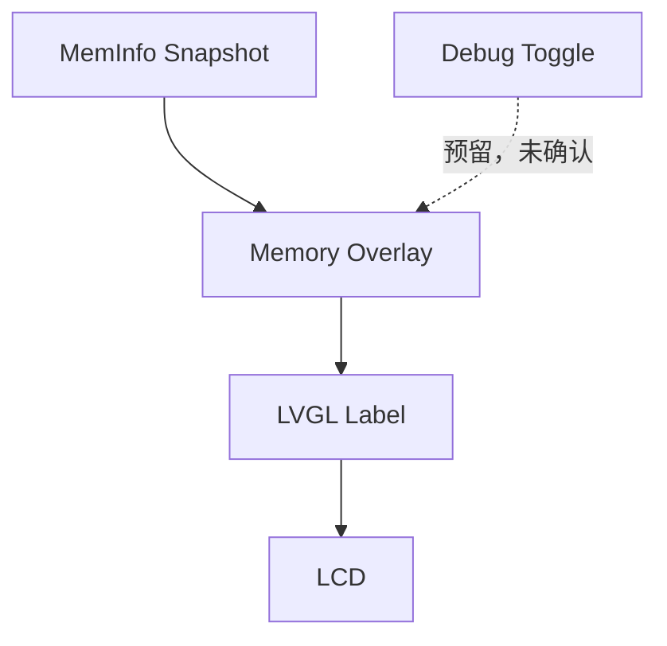

# LCD Memory Overlay

## 概述

Memory Overlay 是 LCD / LVGL 上的 Debug 功能，用于实机低频观察现有 meminfo snapshot。它默认关闭，不应用于正式发布版本，也不改变 SDRAM layout、LVGL runtime heap、DMA、Lua、resource_manager 或任何 allocator 统计。

## 编译期开关

CMake 选项：

```sh
cmake --preset Debug-Memory-Overlay
cmake --build --preset Debug-Memory-Overlay -j8
```

`XHGC_MEM_OVERLAY_ENABLE` 默认 `OFF`。默认 `Debug` 和 `Release` preset 都不启用 overlay；关闭时 `Core/Debug/xhgc_mem_overlay.c` 不参与固件编译，启动路径也不会调用 overlay init/update。

`XHGC_MEM_OVERLAY_BOOT_VISIBLE` 默认 `OFF`，控制 overlay 初始化后是否立刻显示。`Debug-Memory-Overlay` preset 会打开 `XHGC_MEM_OVERLAY_ENABLE=ON` 和 `XHGC_MEM_OVERLAY_BOOT_VISIBLE=ON`，用于实机 Debug 观察；不应用于正式发布构建。

## 运行时 API

当前只提供主 UI / LVGL 上下文 API，不绑定按键：

- `xhgc_mem_overlay_init()`
- `xhgc_mem_overlay_set_visible(bool visible)`
- `xhgc_mem_overlay_toggle()`
- `xhgc_mem_overlay_is_visible()`
- `xhgc_mem_overlay_update()`

`xhgc_mem_overlay_init()` 在 LVGL display 初始化完成、launcher 初始化后调用。overlay 创建一次 label；普通构建默认 `LV_OBJ_FLAG_HIDDEN`，`Debug-Memory-Overlay` preset 会启动后显示。显示/隐藏只切换 hidden flag，不删除或重建 LVGL 对象。

## 显示字段

第一版文本保持短小：

- `MEM`：`total_used / total_sdram`，单位 MB。
- `APP`：`APP_ARENA_REST` zone `used / peak`。
- `DMA`：`DMA_POOL` zone `used / peak`。
- `LUA`：`XHGC_MEM_TAG_LUA` tag `used / peak`。
- `RES`：`XHGC_MEM_TAG_RESOURCE` tag `used / peak`。
- `LVG`：`XHGC_MEM_TAG_LVGL` tag `used / peak`。
- `FAIL`：meminfo snapshot 的 zone fail_count 汇总。

如果 meminfo snapshot 尚未准备好，显示 `MEMINFO not ready`。

## 刷新频率

`xhgc_mem_overlay_update()` 默认 1000ms 刷新一次，不高于 1Hz。隐藏时直接返回，不更新 label 文本。

overlay 只调用 `xhgc_meminfo_get_snapshot()` 复制现有快照，不调用 reset、dump、peak/fail 清理，也不直接读写 allocator 内部变量。文本 buffer 使用静态 `char[512]`，并通过 `lv_label_set_text_static()` 更新 label。

## LVGL 上下文限制

所有 API 都必须在 LVGL/UI 线程或主 UI 上下文调用。当前项目没有为其它任务提供 UI 事件队列，因此其它任务不应直接调用这些 API；后续若需要从输入任务、DevLink 或调试命令切换 overlay，应先投递到 UI 上下文。

禁止在中断、DMA callback、LTDC callback 或非 UI 任务中直接调用 overlay API。

## 数据流



实线关系已由当前实现确认：`Core/Debug/xhgc_mem_overlay.c` 读取 `Core/Memory/xhgc_meminfo.c` 的 snapshot，并更新 LVGL label。输入切换入口尚未接入源码，因此使用虚线标注为预留。

## 接入点

- 初始化：`Core/Src/main.c` 中 `StartLvglTask()` 在 `lv_port_disp_init()`、`lv_port_indev_init()`、`LCD_DisplayON()`、`Launcher_Init()` 之后调用 `xhgc_mem_overlay_init()`。
- 刷新：同一 LVGL task loop 中，在 `Launcher_Task()` 后调用 `xhgc_mem_overlay_update()`。
- 编译保护：上述调用均位于 `#if XHGC_MEM_OVERLAY_ENABLE` 内。

## 参考文件

- `CMakeLists.txt`
- `Core/Src/main.c`
- `Core/Debug/xhgc_mem_overlay.h`
- `Core/Debug/xhgc_mem_overlay.c`
- `Core/Memory/xhgc_meminfo.h`
- `Core/Memory/xhgc_meminfo.c`
