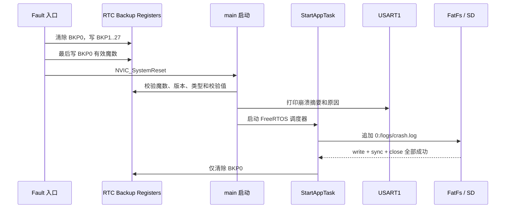

# RTC Backup Register 崩溃记录

固件在 HardFault、MemManage、BusFault 或 UsageFault 发生时，将 Cortex-M7
异常现场写入 STM32H743 的 RTC Backup Registers，并在提交完整记录后执行
软件复位。异常上下文不访问 SD、串口、FreeRTOS、外部 SDRAM、QSPI，也不使用
HAL 状态机或动态内存。

## 启动与落盘流程



`main()` 在 `MX_RTC_Init()` 和 `MX_USART1_UART_Init()` 后读取并打印记录。
SDMMC1 与 FatFs 的底层驱动依赖 CMSIS-RTOS2 信号量及消息队列，因此完整记录
在 FreeRTOS 调度器启动后、`StartAppTask()` 初始化 USB、LVGL 和 Launcher
之前尝试落盘。挂载、建目录、打开、完整写入、同步或关闭任一环节失败时，
BKP0 保持有效，系统继续正常启动，并在下次启动重试。

## Backup Register 布局

STM32H743 CMSIS 设备定义提供 BKP0R 到 BKP31R。本功能使用 BKP0..BKP27：

| BKP | 字段 | BKP | 字段 |
| --- | --- | --- | --- |
| 0 | 有效魔数（最后写入） | 14 | R3 |
| 1 | 格式版本 | 15 | R12 |
| 2 | 异常类型 | 16 | LR |
| 3 | 崩溃序号 | 17 | PC |
| 4 | EXC_RETURN | 18 | xPSR |
| 5 | MSP | 19 | CFSR |
| 6 | PSP | 20 | HFSR |
| 7 | CONTROL | 21 | DFSR |
| 8 | PRIMASK | 22 | AFSR |
| 9 | BASEPRI | 23 | MMFAR |
| 10 | FAULTMASK | 24 | BFAR |
| 11 | R0 | 25 | ICSR |
| 12 | R1 | 26 | SHCSR |
| 13 | R2 | 27 | FNV-1a 校验值 |

魔数为 `0x48464352`，版本为 `1`。校验覆盖 BKP1..BKP26。读取时必须同时
满足魔数、版本、异常类型和校验值有效。

## RTC 时钟与保持范围

工程未找到开发板装有 32.768 kHz LSE 的明确证据，因此 RTC 使用 LSI。
只有 RTC 时钟源与 LSI 不一致时才调用 HAL 的 RTC 时钟源配置；首次从未配置
状态切换至 LSI 时，HAL 会不可避免地复位一次 Backup Domain。之后的正常启动
和软件复位不会重复复位 Backup Domain。

RTC Backup Registers 可跨系统复位保存。本机制的主要目标是保留 Fault 后的
软件复位信息；如果开发板未持续给 VBAT 供电，整机断电后不保证记录仍然存在。
RTC 日历时间不是日志的准确时间源，日志只记录崩溃序号和现场。

## 受控测试

测试默认关闭。配置 Debug 构建时可启用一次性 UDF 测试：

```sh
cmake --preset Debug -DCARTDESK_CRASH_TEST_ENABLE=ON
cmake --build --preset Debug
```

固件使用 BKP28 保存一次性测试标记，避免每次复位都再次 Fault。要重新触发，
可通过 GDB 将 `RTC->BKP28R` 清零，或断开 VBAT/电源后重新刷入（是否清零取决于
板级 VBAT 供电）。正常构建必须恢复：

```sh
cmake --preset Debug -DCARTDESK_CRASH_TEST_ENABLE=OFF
cmake --build --preset Debug
```

也可在 GDB 中直接调用 `CrashRecord_TriggerTestFault()`；该函数执行 `udf #0`
后不会返回，MCU 将记录异常并复位。

## 地址解析

使用产生崩溃的同一份 ELF：

```sh
arm-none-eabi-addr2line -e build/Debug/cartdesk-os.elf -f -C 0x故障PC地址
arm-none-eabi-addr2line -e build/Debug/cartdesk-os.elf -f -C 0x故障LR地址
```

Release 固件应将路径替换为对应 preset 的 ELF。
