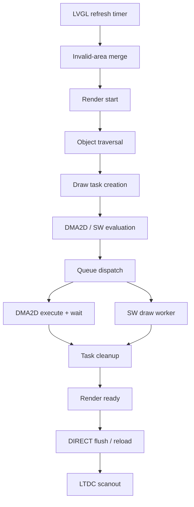

# Launcher Full Render Root-Cause Audit

## Executive Summary

本报告回答的问题是：Launcher 的一次确定性滚动刷新为什么需要约 83 ms。结论不是单一的“图片慢”，而是三个可独立定位的主成本：

1. **ARGB8888 draw buffer 预清零：35.02 ms/frame。** LVGL 认为显示格式具有 alpha，在绘制每个脏区前无条件调用 `lv_draw_buf_clear_ex()`；当前默认 handler 没有 `buf_clear_cb`，最终由 CPU 对外部 SDRAM 逐行 `lv_memzero`。这也解释了 Empty/L0 场景仍接近 60 ms。
2. **软件绘制：23.21 ms/frame。** 其中最大的单个任务是带圆角/clip 的 `content_container` 背景，280,000 pixels，12.29 ms；DMA2D 因 radius/clip 能力拒绝而回退到 SW。Border 为 3.16 ms，A8 recolor 等 SW image 约 4.04 ms。
3. **同步 DMA2D 等待：22.10 ms/frame。** backend 每提交一个任务后 busy-wait 到完成，CPU 没有与 DMA2D 重叠工作。实际 Launcher 中 ARGB blend 占 17.79 ms，R2M fill 占 4.36 ms。

14 帧目标板测量的平均 wall time 为 **83.9679 ms/frame（11.91 FPS）**。按任务运行时间和 ISR 计费后只剩 **0.0186 ms/frame**；按 LVGL exclusive category 计费后只剩 **0.0179 ms/frame**。两种独立口径都闭合到 99.98%，原先 36.32 ms 的 unattributed 时间已经拆清。

结论分类为：

> **30 FPS POSSIBLE BUT REQUIRES LVGL CORE WORK**

只改 Launcher 的图片或对象结构不够。要保留 800×480、ARGB8888、DIRECT 双 framebuffer 和画质，至少需要处理 LVGL 的 ARGB 预清零路径，并减少大面积 SW fill；自动 XRGB 还必须先落实 alpha 契约或运行时扫描。DMA2D 异步化有 22.10 ms 的理论重叠上限，但不能与 draw task 时间重复相加。

本轮只增加 Debug-only 测量和 benchmark，没有实施 production renderer、LTDC、SDRAM timing、DMA2D backend 或 framebuffer architecture 优化。

## Scope and Method

| Item | Value |
|---|---|
| Board | STM32H743 @ 480 MHz |
| Runtime | FreeRTOS / CMSIS-RTOS2 |
| Graphics | LVGL 9.6.0, 800×480 ARGB8888, DIRECT double framebuffer |
| Display engines | LTDC + DMA2D + external SDRAM |
| Branch | `codex/lvgl-refresh-performance` |
| Audit base | `11df210a0060bd24c6fb6076f2d1537d9e2e5941` |
| Main sample | 14 rendered frames: 2 settling + 12 deterministic scroll frames |
| Timer | DWT CYCCNT; cycles converted with 480 MHz |
| Instrumentation | `CARTDESK_RENDER_AUDIT_ENABLE`, enabled only by `Debug-LTDC-Full-Render-Audit` |
| Fault check | CFSR/HFSR/MMFAR/BFAR all zero in Launcher, L0–L4 and DMA2D contention runs |

Profiler category accounting is exclusive: a cycle can belong to only one top-level category. Draw-type accounting is an independent, inclusive view over task execution and must not be added to the exclusive table. In particular, DMA2D wait is already the execution part of DMA2D draw tasks.

The full profiler adds **0.636 ms/frame** relative to the existing minimal trace baseline of 83.3320 ms, below the 2 ms rejection threshold. Reported numbers are the observed instrumented values; no subtraction-based “correction” was applied.

## System Overview



All arrows above are confirmed by the vendored source and target trace.

## Confirmed Render Call Chain

| Stage | Function / file | Role | Hot path |
|---|---|---|---|
| Refresh entry | `lv_display_refr_timer()` in `Core/APPS/LVGL/src/core/lv_refr.c` | Refresh timer entry | Yes |
| Invalid processing | `lv_refr_join_area()`, `refr_sync_areas()`, `refr_invalid_areas()` in the same file | Merge/synchronize invalid regions, emit render events | Yes, but cheap |
| Area/layer render | `refr_area()`, `refr_configured_layer()` in the same file | Select draw buffer and render each area | Yes |
| ARGB clear | `lv_draw_buf_clear_ex()` from `refr_configured_layer()` | Clear alpha-capable layer before object draw | **Yes, dominant** |
| Traversal | `refr_obj_and_children()`, `lv_obj_refr()`, `lv_obj_redraw()` | Clip/cover/tree walk and object draw callbacks | Yes |
| Task creation | `lv_draw_add_task()` in `Core/APPS/LVGL/src/draw/lv_draw.c` | Allocate and enqueue draw task | Yes, cheap |
| Evaluation | DMA2D `evaluate_cb`, SW `evaluate_cb` | Select eligible draw unit | Yes, cheap |
| Dispatch | `lv_draw_dispatch()`, `lv_draw_dispatch_layer()` | Scan queue and start runnable tasks | Yes, cheap |
| DMA2D execution | `execute_drawing()` in `Core/APPS/LVGL/src/draw/dma2d/lv_draw_dma2d.c` | Configure registers, start, synchronous wait | **Yes, dominant** |
| SW execution | worker in `Core/APPS/LVGL/src/draw/sw/lv_draw_sw.c` | CPU rasterization | **Yes, dominant** |
| Completion | draw task cleanup followed by `LV_EVENT_RENDER_READY` | Free completed tasks and close render window | Yes, cheap |

The decisive clear chain is `refr_configured_layer()` → `lv_draw_buf_clear_ex()` → default draw buffer handler → row-by-row `lv_memzero` in `Core/APPS/LVGL/src/draw/lv_draw_buf.c`. The configured ARGB8888 descriptor is in `Core/Screen/Page/ui_screen_launcher.c`.

## Full 83 ms Accounting

### Wall-clock accounting

| Wall-time owner | ms/frame | Share |
|---|---:|---:|
| App task running | 60.5496 | 72.11% |
| SW draw worker running | 23.3093 | 27.76% |
| Other tasks | 0.0001 | 0.00% |
| SysTick ISR | 0.0782 | 0.09% |
| LTDC ISR | 0.0122 | 0.01% |
| Other measured ISR | 0.0000 | 0.00% |
| Remaining wall-time unknown | **0.0186** | **0.02%** |
| **Total** | **83.9679** | **100.00%** |

No audio, I/O, background or idle runtime was observed inside the render windows. The app task is therefore not losing 10–20 ms to scheduling. DMA2D synchronous wait occurs while the app task is running and is a subset of its 60.55 ms.

```text
83.9679 ms wall time
├─ app task: 60.5496 ms
│  ├─ draw-buffer clear: 35.0225 ms
│  ├─ DMA2D synchronous wait: 22.1037 ms
│  ├─ DMA2D setup and LVGL orchestration
│  └─ cache / allocation / bookkeeping
├─ SW draw worker: 23.3093 ms
├─ other tasks: 0.0001 ms
├─ ISR: 0.0904 ms
└─ unaccounted: 0.0186 ms
```

### Exclusive LVGL internal accounting

| Exclusive category | Total cycles / 14 frames | ms/frame | Classification |
|---|---:|---:|---|
| Draw-buffer clear | 235,351,427 | **35.0225** | CONFIRMED BOTTLENECK |
| SW execute | 155,960,230 | **23.2084** | CONFIRMED BOTTLENECK |
| DMA2D wait | 148,536,674 | **22.1037** | CONFIRMED BOTTLENECK |
| Cache maintenance | 8,561,018 | 1.2740 | NOT SIGNIFICANT (<2 ms) |
| Object traversal | 6,110,544 | 0.9093 | NOT SIGNIFICANT |
| Style lookup | 3,884,466 | 0.5780 | NOT SIGNIFICANT |
| Dispatch / queue scan | 1,630,778 | 0.2427 | NOT SIGNIFICANT |
| Allocation / free | 1,203,214 | 0.1790 | NOT SIGNIFICANT |
| Refresh bookkeeping | 742,630 | 0.1105 | NOT SIGNIFICANT |
| DMA2D setup | 606,350 | 0.0902 | NOT SIGNIFICANT |
| Draw-unit evaluation | 242,164 | 0.0360 | NOT SIGNIFICANT |
| Cover checks | 232,476 | 0.0346 | NOT SIGNIFICANT |
| Task creation | 222,406 | 0.0331 | NOT SIGNIFICANT |
| Descriptor init | 137,287 | 0.0204 | NOT SIGNIFICANT |
| Task cleanup | 115,452 | 0.0172 | NOT SIGNIFICANT |
| **Category sum** | **563,537,116** | **83.8597** | 99.87% of wall time |
| ISR | — | 0.0904 | Separate wall-time owner |
| **Remaining unknown** | — | **0.0179** | **0.02%** |

### Draw execution accounting (orthogonal view)

This table groups draw-task execution by semantic type. It overlaps the `SW execute` and `DMA2D wait/setup` categories above and must not be added to them.

| Draw type / unit | ms/frame | Notes |
|---|---:|---|
| Fill | 20.6553 | Includes DMA2D card fills and the large SW content fill |
| Image | 22.4472 | ARGB blend plus A8/recolor SW images |
| Border | 3.1556 | Software border rendering |
| Label | 0.4572 | Text is not a main cause |
| DMA2D unit total | 23.4905 | Includes setup + synchronous transfer/wait |
| SW unit total | 23.2248 | Consistent with worker runtime |

The three tables answer different questions: wall owner, exclusive pipeline phase, and draw content type. They are deliberately not flattened into one additive table.

## Object, Task, Queue and Invalidation Evidence

Per 14 measured frames:

| Metric | Total | Per frame / derived value |
|---|---:|---:|
| Objects considered | 863 | 61.64 |
| Hidden objects | 299 | 21.36 |
| Clip rejected | 222 | 15.86 |
| Objects drawn | 342 | 24.43 |
| Traversal calls | 564 | 40.29 |
| Traversal CPU | 6,110,544 cycles | 0.9093 ms/frame; 7,081 cycles/considered object |
| Cover checks | 92 | 66 hit / 26 miss; 0.0346 ms/frame |
| Style gets | 13,950 | 996.43/frame; 0.5780 ms/frame |
| Draw tasks | 420 | 30/frame |
| Alloc / free | 420 / 420 | 72,336 bytes total; 0.1790 ms/frame |
| Dispatches | 446 | 31.86/frame |
| Queue entries scanned | 840 | 60/frame |
| Queue depth | max 2 | inferred mean 1.883 entries/dispatch |
| Blocked tasks | 0 | no dependency bottleneck |

Task mix is 157 fill, 131 border, 10 label and 122 image tasks over 14 frames. Both DMA2D and SW evaluate every task: DMA2D accepts 125 and rejects 295; SW accepts 295 and rejects 125. Evaluation costs only 0.0360 ms/frame, so “try DMA2D then fall back” is not itself expensive.

DMA2D reject buckets:

| Reject mask | Meaning | Count | Pixels | Result |
|---|---|---:|---:|---|
| `0x002` | radius / clip-radius limitation | 84 | 13,253,520 | Includes the large content fill; important because fallback execution is expensive |
| `0x001` | unsupported task type | 141 | 2,709,520 | Mostly normal SW-only task classes |
| `0x220` | recolor + source format | 70 | 112,000 | A8 circle icons; execution is secondary, evaluation is cheap |

Invalidation merging took 6,772 cycles total (**0.0010 ms/frame**), with 50 comparisons. There were 26 areas before and after merge: two single-area settling frames plus twelve deterministic two-area frames. No area was merged. This confirms the two flush areas originate directly from the two invalid regions, not from an expensive merge algorithm.

## Fill and Image Coverage

The representative steady frame uses dirty area `(0,26)–(799,375)`, 280,000 pixels or 72.92% of the panel.

Fill rectangles consist of the full content background, four visible/clipped card rectangles, and five lower hint rectangles. Host coverage calculation from the recorded effective rectangles gives:

| Coverage | Pixels |
|---|---:|
| Total filled pixels | 440,880 |
| Unique filled pixels | 280,000 |
| True overdraw factor | **1.5746×** |
| Covered exactly once | 119,120 |
| Covered exactly twice | 160,880 |
| Covered 3× or more | 0 |

Image rectangles total 127,560 pixels and cover 127,560 unique pixels: **1.0000× image overdraw**, with no 2× or 3× overlap. The earlier 1.142× figure was not a true total/unique coverage calculation and must not be used as overdraw.

## DMA2D Throughput and SDRAM Pressure

### Actual Launcher DMA2D work

| Mode | Tasks | Pixels total | ms/frame | cycles/pixel | Throughput | Estimated traffic |
|---|---:|---:|---:|---:|---:|---:|
| R2M fill | 73 | 2,044,768 | 4.3583 | 14.323 | 33.51 Mpix/s | ~134 MB/s output |
| M2M_PFC | 0 | 0 | 0 | — | — | Not exercised by Launcher |
| M2M_BLEND | 52 | 1,876,000 | 17.7886 | 63.72 | 7.53 Mpix/s | ~90.4 MB/s at 12 B/pixel |

DMA2D is active for about **22.15 ms/frame**, or **26.38%** of the 83.97 ms wall window. Because `execute_drawing()` busy-waits for each transfer, nearly all of that is app-task CPU time in `DMA2D_WAIT`. Perfect asynchronous overlap therefore has a **22.10 ms/frame upper bound**, not a guaranteed saving, and it overlaps the existing fill/image draw costs.

### Largest fill task

The largest content fill is `(0,26)–(799,375)`:

| Metric | Value |
|---|---:|
| Effective pixels | 280,000 |
| Execution | 5,899,114 cycles = **12.2898 ms** |
| Cost | 21.07 cycles/pixel |
| Effective throughput | 22.78 Mpix/s |
| Minimum output bytes | 1.12 MB |
| Effective output rate | ~91.1 MB/s |

This task is rendered in software because the radius/clip condition rejects DMA2D. At the standalone R2M rate with normal LTDC scanout, the same pixel count would take about **8.49 ms**; the real SW path is **3.80 ms / 45% slower**. With LTDC disabled, standalone R2M would take about 2.72 ms. The latter is a diagnostic upper bound, not a valid normal-render prediction.

### Controlled LTDC contention benchmark

The Debug-only standalone benchmark compares the same 40,000-pixel transfers with LTDC scanout on and temporarily off:

| Mode | LTDC on | LTDC off | Effect of scanout |
|---|---:|---:|---:|
| R2M | 1.2133 ms, 32.97 Mpix/s | 0.3886 ms, 102.94 Mpix/s | 3.12× slower with LTDC; 68.0% throughput loss |
| M2M tight copy | 3.6674 ms, 10.91 Mpix/s | 3.5214 ms, 11.36 Mpix/s | 4.15% throughput loss |
| M2M_PFC | 2.2753 ms, 17.58 Mpix/s | 2.2734 ms, 17.60 Mpix/s | ~0.09%, negligible |

A standalone blend case was not implemented, so no standalone blend contention number is claimed. Actual LVGL blend throughput is reported above. The data proves that LTDC is a **performance amplifier for write-dominated R2M**, not that presentation/reload is the wall-time root cause.

At the measured panel refresh interval (~16.98 ms), LTDC continuously reads about **90.4 MB/s**. A conservative per-Launcher-frame traffic lower bound is approximately:

- LTDC scanout during 83.97 ms: ~7.59 MB read.
- ARGB dirty-buffer clear: at least 1.12 MB CPU write.
- R2M: ~0.58 MB output write.
- ARGB blend: ~1.61 MB foreground read + background read + output write.
- SW content/circle fills: at least ~1.18 MB output write.

That is roughly **12.1 MB/frame of known traffic**, before border/image source reads, cache-line effects, burst inefficiency and other CPU accesses. This is estimated pressure, not a claim about theoretical SDRAM bandwidth. Cache maintenance itself covers 31,366,144 bytes over 14 frames (2.24 MB/frame in address ranges), 250 calls total, and costs 1.2740 ms/frame; range size is not equivalent to external bus traffic.

## Pure LVGL Benchmark L0–L5

Each L0–L4 scene is Debug-only and contains no Launcher, Lua, cart, resource or font work. Twelve measured frames are used per scene. `Non-fill/image` below is `render - fill - image`; it deliberately includes draw-buffer clear, borders and pipeline work and is **not** the 0.018 ms final audit residual.

| Scene | Render avg | Tasks/frame | Dirty pixels/frame | Fill | Image | Non-fill/image |
|---|---:|---:|---:|---:|---:|---:|
| L0 solid background, forced full refresh | 59.8567 ms | 1.0 | 384,000 | 11.7732 ms | 0 | 48.0835 ms |
| L1 one moving 200×200 opaque rect | 5.6126 ms | 1.5 | 40,000 | 2.3377 ms | 0 | 3.2749 ms |
| L2 five Launcher-geometry rectangles | 51.3306 ms | 5.0 | 280,000 | 16.0813 ms | 0 | 35.2493 ms |
| L3 four XRGB images | 58.2008 ms | 5.0 | 280,000 | 10.6450 ms | 12.1963 ms | 35.3595 ms |
| L4 four ARGB images | 67.3608 ms | 5.0 | 280,000 | 10.5999 ms | 21.1264 ms | 35.6345 ms |
| L5 full Launcher | 83.9679 ms | 30.0 | 280,000 | 20.6553 ms | 22.4472 ms | 40.8654 ms |

Interpretation:

- L0 being ~60 ms confirms a severe base integration cost independent of Launcher complexity: full-screen ARGB clear plus full-screen fill.
- L1 is fast because only 40,000 pixels are dirty.
- L2 being 51.33 ms confirms that large-area scrolling through the current ARGB draw pipeline is intrinsically expensive.
- L4 minus L3 is **9.16 ms** in the pure scene. The existing full Launcher A/B measures about **7.9 ms** recoverable by XRGB.
- Launcher is **16.61 ms** slower than L4. That delta is consistent with the extra rounded content fill, border, A8/recolor icons, label and object structure; traversal/style together are only 1.49 ms.

## Preview Alpha Contract

The cart format specification defines ICON data as ARGB8888/BGRA bytes but only **recommends** `A=0xFF`; it does not require opacity. The reader in `Core/APP/cart/cart_bin.c` exposes the raw bytes, and Launcher creates an ARGB8888 LVGL image descriptor in `Core/Screen/Page/ui_screen_launcher.c`. No packer implementation is present in this repository, so writer-side normalization cannot be confirmed.

Target instrumentation scanned all four previews used by the current test carts:

| Metric | Result |
|---|---:|
| Preview count seen | 4 |
| Opaque previews | 4 |
| Transparent previews | 0 |
| Minimum alpha | 255 for all four |
| Non-255 alpha pixels | 0 |
| Pixels normalized by runtime | 0 |

Therefore the current samples are opaque, but the protocol permits `alpha < 255`. Blindly relabeling every preview XRGB would be incorrect. A production candidate must use a runtime alpha scan/cache, explicit per-cart metadata, or a future format contract that requires opacity. The measured recovery is ~7.9 ms/frame in Launcher (9.16 ms in L3/L4), conditional on that correctness guard.

## Confirmed Bottlenecks

| Issue | Cost | Evidence | Status |
|---|---:|---|---|
| ARGB dirty draw-buffer clear | **35.02 ms/frame** | Exclusive DWT category; `lv_draw_buf_clear_ex()` → row-wise CPU zero | CONFIRMED BOTTLENECK, P0 |
| Synchronous DMA2D wait | **22.10 ms/frame** | Exclusive DWT category; backend busy-wait; 26.38% wall utilization | CONFIRMED BOTTLENECK, P0/P1 core work |
| SW drawing | **23.21 ms/frame** | SW worker runtime and exclusive execution agree | CONFIRMED BOTTLENECK, P0 |
| Large rounded content fill | **12.29 ms/frame** | 280k-pixel top task, reject mask `0x002`, SW unit | CONFIRMED BOTTLENECK, P0; subset of SW draw |
| ARGB preview blend versus XRGB | **~7.9 ms/frame** | Existing Launcher A/B; pure L4–L3 = 9.16 ms | CONFIRMED BOTTLENECK, P1; alpha guard required |
| A8/recolor SW images | **~4.04 ms/frame** | Five SW image tasks; reject mask `0x220` | SECONDARY BOTTLENECK, P2 |
| Software borders | **3.16 ms/frame** | 131 tasks / 14 frames, SW execution | SECONDARY BOTTLENECK, P2 |
| LTDC contention on R2M | up to **0.825 ms/40k R2M** | Standalone on/off test | PERFORMANCE AMPLIFIER; mode-dependent |

The first three rows are independent exclusive categories. The content fill, ARGB image and border rows are subsets/cross-sections of SW or DMA2D execution and cannot be summed with those categories.

## Disproved Suspects

| Suspect | Result |
|---|---|
| LTDC VBlank presentation / reload handshake | DISPROVED as main cause: request/event/done = 14/14/14, timeout and ownership errors zero |
| DIRECT steady-state framebuffer sync | DISPROVED: prior measurement ~0.006–0.007 ms |
| DMA2D basic correctness | DISPROVED: standalone cases pass; faults zero |
| Mixed-generation framebuffer / premature flush | DISPROVED by prior exact framebuffer capture |
| Off-screen slots / missing virtualization | DISPROVED: eight fully off-screen slots do not draw; at most five participate |
| Layout pass | DISPROVED: actual layout pass count zero |
| QFlash font | DISPROVED: ~0.042 ms/frame |
| Text | NOT SIGNIFICANT: 0.457 ms/frame in this audit |
| Shadow / mask | DISPROVED: no work observed |
| Scroll callback business logic / SD/JPEG warm read | DISPROVED by prior trace and pure-LVGL comparison |
| Object traversal / style / allocation / evaluation / dispatch | NOT SIGNIFICANT individually; all quantified above |
| FreeRTOS preemption | DISPROVED: other tasks 0.0001 ms/frame |
| Static transparent scroll background | DISPROVED and reverted previously: 83.43 → 91.48 ms |

## Fix Roadmap (not implemented)

| Priority | Issue | Measured cost | Expected saving | Risk / complexity | Recommended direction |
|---|---|---:|---:|---|---|
| P0 | CPU ARGB dirty-area clear | 35.02 ms | Up to 35.02 ms ideal ceiling; accelerated clear saves less | High correctness risk, medium/high core work | First prove which pixels require transparent initialization; then avoid redundant clear or provide a DMA2D-aware clear callback without changing visible semantics |
| P0 | Rounded full-content SW fill | 12.29 ms | Up to 12.29 ms ceiling | Medium UI/clip correctness risk | Restructure geometry/clip so the large opaque region is DMA2D-compatible; preserve rounded appearance at edges |
| P1 | Opaque preview ARGB blend | ~7.9 ms | ~7.9 ms measured Launcher A/B | Low/medium implementation, high contract risk if unguarded | Scan alpha once and cache format, add explicit metadata, or tighten a future format version |
| P1 | Synchronous DMA2D backend | 22.10 ms wait | Up to 22.10 ms overlap ceiling, not additive | High LVGL/core scheduling complexity | Interrupt-driven completion or pipelining only after dependency and buffer lifetime proof |
| P2 | A8/recolor SW icons | ~4.04 ms | ≤4.04 ms | Medium asset/render semantics | Consider a DMA2D-compatible representation or specialized path after P0/P1 |
| P2 | Software borders | 3.16 ms | ≤3.16 ms | Medium visual risk | Reduce redundant border work or use compatible geometry; retain appearance |
| P2 | LTDC/R2M SDRAM contention | R2M 3.12× slower in isolated test | Actual Launcher R2M theoretical ceiling ~2.96 ms | High system risk | Only after core wins: measure memory placement, bursts, MPU/cache and FMC behavior; do not guess timing values |

Savings in this table overlap. In particular, async DMA2D overlaps DMA draw execution, and changing geometry or clear behavior changes the later task mix. They must be remeasured sequentially rather than arithmetically accumulated.

## FPS Projection

| Projection | Frame time | FPS | Qualification |
|---|---:|---:|---|
| Current measured | 83.97 ms | 11.91 | Target data |
| Ideal removal of current clear cost | 48.95 ms | 20.43 | Upper bound; correctness not yet proven |
| Plus ideal removal of current large SW content fill | 36.66 ms | 27.28 | Overlap-sensitive upper bound |
| Plus measured opaque-preview XRGB recovery | 28.76 ms | 34.78 | Requires safe alpha decision and remeasurement |

The arithmetic shows enough identified cost to cross 33.3 ms in an ideal sequence, but the dominant clear and DMA scheduling work live in LVGL integration/core behavior. Launcher-only cleanup does not provide the required ~50.6 ms. Stable 30 FPS is therefore possible in principle but requires LVGL core/integration work and correctness-preserving revalidation.

## Answers to the 40 Required Questions

1. **App task真正运行多少？** 60.5496 ms/frame。
2. **其他 task 抢占多少？** 0.0001 ms/frame；未观察到 audio/I/O/background/idle 在 render window 内运行。
3. **ISR 多少？** 0.0904 ms/frame：SysTick 0.0782，LTDC 0.0122，其余测量 IRQ 为零。
4. **DMA2D wait 多少？** 22.1037 ms/frame，包含在 app task 和 DMA draw task 内，不能再次相加。
5. **Object traversal 多少？** 0.9093 ms/frame。
6. **Objects considered 多少？** 863/14 = 61.64/frame。
7. **Objects actually drawn 多少？** 342/14 = 24.43/frame。
8. **Cover-check 多少？** 0.0346 ms/frame；92 次，66 hit、26 miss。
9. **Style lookup 多少？** 0.5780 ms/frame；13,950 次，996.43/frame。
10. **Task create 多少？** 0.0331 ms/frame；30 tasks/frame。
11. **Descriptor init 多少？** 0.0204 ms/frame。
12. **Allocator 多少？** 0.1790 ms/frame；420 alloc/free pairs，72,336 bytes total。
13. **Draw-unit evaluate 多少？** 0.0360 ms/frame。
14. **DMA2D evaluate 多少？** 420 次，125 accept / 295 reject；与 SW 合计时间 0.0360 ms/frame，当前插桩不把二者 cycle 再拆开。
15. **SW evaluate 多少？** 420 次，295 accept / 125 reject；同上，单元独立 cycle 未分离，合计已证明不显著。
16. **Reject 后 fallback 成本？** Evaluate/fallback 选择本身包含在 0.0360 ms/frame；昂贵的是 fallback 后执行，例如 content SW fill 12.29 ms 和 A8 SW image ~4.04 ms。
17. **Dispatch 多少？** 0.2427 ms/frame。
18. **Queue scanning 多少？** 840 entries/14 = 60 entries/frame；dispatch 31.86/frame，推导平均 1.883 entries/dispatch。
19. **Dependency blocking 多少？** 0 blocked tasks；max queue depth 2，未形成瓶颈。
20. **DMA2D register setup 多少？** Setup category 0.0902 ms/frame；包含 register configuration/start 的 CPU 部分，未进一步拆成寄存器写与 start 两个低价值子项。
21. **DMA2D fill throughput？** Launcher R2M 33.51 Mpix/s、14.323 cycles/pixel、约 134 MB/s output。
22. **DMA2D PFC throughput？** Launcher 未使用；standalone LTDC-on 为 17.58 Mpix/s，LTDC-off 17.60 Mpix/s。
23. **DMA2D blend throughput？** 实际 Launcher 为 7.53 Mpix/s、63.72 cycles/pixel、估算 90.4 MB/s；未声称 standalone blend 值。
24. **Cache maintenance 多少？** 1.2740 ms/frame；250 calls/14，range bytes 31,366,144 total。
25. **Task cleanup 多少？** 0.0172 ms/frame。
26. **Invalid area merge 多少？** 6,772 cycles total = 0.0010 ms/frame；50 comparisons，26 before / 26 after。
27. **Event/bookkeeping 多少？** Bookkeeping category 0.1105 ms/frame；merge 另计但仅 0.0010 ms/frame。
28. **Remaining unknown 多少？** 任务/ISR口径 0.0186 ms/frame；category/ISR口径 0.0179 ms/frame。
29. **真实 fill overdraw factor？** 440,880 / 280,000 = **1.5746×**。
30. **Content fill 为什么贵？** 280k pixels 且带 radius/clip，DMA2D reject `0x002`，由 CPU 在外部 SDRAM 软件填充，耗时 12.29 ms。
31. **与 standalone R2M 相比慢多少？** 正常 LTDC 下预计 R2M 8.49 ms，实际 SW 12.29 ms，慢 3.80 ms / 45%；LTDC-off 的 2.72 ms 仅为诊断上限。
32. **LTDC scanout 影响多少？** 40k R2M 从 0.3886 ms 变 1.2133 ms，慢 3.12×、吞吐下降 68.0%；PFC 几乎不受影响，说明模式相关。
33. **Empty 为什么仍有 64.6 ms？** 即使对象很少，ARGB full dirty area 仍先由 CPU 清零，再绘制背景；L0 复现为 59.86 ms，其中非 fill 48.08 ms，exclusive audit 定位 clear 为 35.02 ms，余量主要是该场景 full-screen fill 和 pipeline 差异。
34. **Pure LVGL L1/L2？** L1 5.6126 ms；L2 51.3306 ms。
35. **Launcher 比等价纯 LVGL 慢多少？** 相比 L4 ARGB 的 67.3608 ms，多 16.6071 ms。
36. **Preview alpha 协议允许 XRGB？** 不允许无条件当 XRGB；规范只建议 alpha=255，协议允许小于 255。
37. **XRGB 真正可回收多少？** Launcher A/B ~7.9 ms/frame；纯 scene L4–L3 9.16 ms/frame。
38. **独立 ≥5 ms 瓶颈？** Exclusive：draw-buffer clear 35.02、SW execute 23.21、DMA wait 22.10；SW 中的 content fill 12.29 与 preview format delta 7.9 是可操作子问题。
39. **2–5 ms 次级瓶颈？** A8/recolor SW image ~4.04 ms、software border 3.16 ms；cache 1.27 ms 不达阈值。
40. **稳定 30 FPS 现实吗？** **POSSIBLE BUT REQUIRES LVGL CORE WORK**；只优化 Launcher 不够，清零语义、SW 大填充与可能的 DMA pipeline 必须按顺序验证。

## Confirmed Facts, Inferences and Open Questions

### Confirmed facts

- 83.97 ms 已由两种口径闭合至 99.98%。
- ARGB layer clear、SW draw 和 synchronous DMA wait 是三个 exclusive 主成本。
- 当前四个 preview 全 opaque，但 cart 格式没有强制 opacity。
- LTDC 对 R2M 的争用显著，对 PFC 很小；影响是 mode-dependent。
- Reload request/event/done 1:1，fault/error/timeout 为零。

### Inferred relationships

- **推测：** 如果可完全避免当前 dirty-area clear，35.02 ms 是理想收益上限；实际安全实现可能只能加速而非消除。
- **推测：** 将 content background 重构为 DMA2D-compatible geometry 可接近回收 12.29 ms 上限，但边缘/clip 处理会保留部分成本。
- **推测：** 约 12.1 MB/frame 是已知 traffic 下界；没有硬件 SDRAM transaction counter，因此不能把它当作完整带宽账单。

### Open questions

- ARGB layer 的哪些像素在当前 DIRECT path 上必须保持透明初始化语义，哪些 clear 可被证明冗余？
- 目标版本应选择运行时 alpha scan、manifest metadata，还是新 cart-format opacity contract？
- DMA2D interrupt-driven completion 在 LVGL 9.6 当前 task dependency/layer lifetime 下可隐藏多少，而不是只看 22.10 ms 理论上限？
- Standalone M2M_BLEND 在 LTDC on/off 下的模式特定争用尚未测量。

## Referenced Files

- `Core/APPS/LVGL/src/core/lv_refr.c` — refresh, invalidation, traversal and ARGB clear trigger.
- `Core/APPS/LVGL/src/draw/lv_draw_buf.c` — default row-wise CPU clear.
- `Core/APPS/LVGL/src/draw/lv_draw.c` — task allocation, queue scan, dispatch and cleanup.
- `Core/APPS/LVGL/src/draw/dma2d/lv_draw_dma2d.c` — evaluation, register setup and synchronous wait.
- `Core/APPS/LVGL/src/draw/sw/lv_draw_sw.c` — SW worker execution.
- `Core/APPS/LVGL/src/osal/lv_cmsis_rtos2.c` — CMSIS worker creation; supplied `swdraw` name is not forwarded.
- `Core/Screen/Page/ui_screen_launcher.c` — Launcher preview descriptor and Debug benchmark poll.
- `Core/APP/cart/cart_bin.c` — raw preview reader.
- `Docs/cart/xhgc-cartbin-format-spec-v2.2.md` — ICON ARGB/BGRA definition and recommended, not mandatory, alpha.
- `Core/Debug/render_audit.c`, `Core/Debug/render_audit.h` — Debug-only exclusive profiler.
- `Core/Debug/lvgl_render_benchmark.c`, `Core/Debug/lvgl_render_benchmark.h` — L0–L4 Debug-only scenes.
- `tools/gdb/launcher_full_render_audit.gdb` — deterministic Launcher capture.
- `tools/gdb/lvgl_render_benchmark.gdb` — pure LVGL capture.
- `tools/gdb/dma2d_ltdc_contention.gdb` — LTDC on/off standalone benchmark.

## Check Results

Final working-tree verification:

| Check | Result |
|---|---|
| HostTest | **15/15 passed** |
| Debug | Build passed |
| Release | Build passed |
| SizeDebug | Build passed |
| Debug-USB-SD-MSC | Build passed |
| Debug-LTDC-Sync-Trace | Build passed |
| SizeDebug-DMA2D-SelfTest | Build passed |
| Debug-LTDC-Full-Render-Audit | Build passed |
| Release symbol audit | No `render_audit`, `lvgl_render_bench`, profiler mailbox or top-N diagnostic symbols |
| `git diff --check` | Passed; only existing checkout line-ending conversion notices were printed |
| Cortex faults | CFSR/HFSR/MMFAR/BFAR all zero in target audit runs |

After the instrumentation change, a fresh normal-ARGB before/mid/after capture was stored under the ignored build artifact path `build/Debug-LTDC-Sync-Trace/captures/20260929_full_render_audit_post`. Channel calibration passed for both framebuffers at all three points. The sampled slot results were:

| Capture | Expected dx | Measured dx | Exact match | SAD |
|---|---:|---:|---:|---:|
| before, slots 0/1/2 | 0 | 0 | 1.0 | 0 |
| mid, slots 1/2/3 | -20 | -20 | 1.0 | 0 |
| after, slots 1/2/3 | +20 | +20 | 1.0 | 0 |

Thus the major profiler instrumentation preserves the established framebuffer correctness contract: `expected dx == measured dx`, `SAD = 0`, `exact match = 1.0`.
