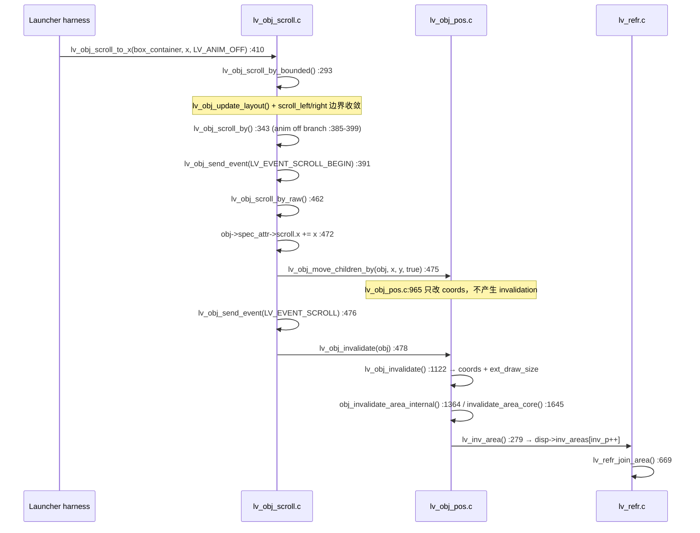
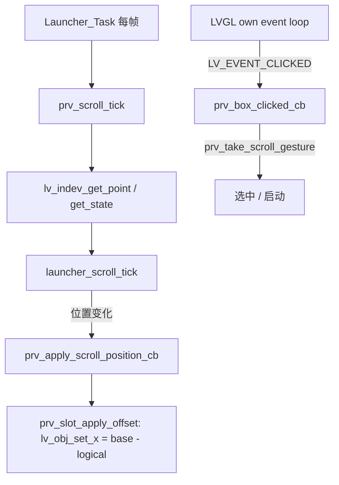

# Launcher Slot-Local Partial Redraw

## 结论

> **SLOT-LOCAL REDRAW HIGH-VALUE OPTIMIZATION**

目标板三轮 A/B 表明，让 Launcher 停止 native scroll、改为只移动 App Slot 之后：

- dirty 面积 **280,055 → 164,356 px/frame（−41.31%）**，dirty ratio **72.92% → 42.80%**；
- `T_render` **57.13 → 40.59 ms/frame（净省 16.54 ms）**，远超本阶段 5 ms 门槛；
- 每帧合并后只剩 **6.50 个局部矩形**，不再合成 800×350；
- 固定系统 UI（5 个 A8 圆形图标、分隔线、底部文字）在滚动帧中 **绘制次数降为 0**；
- 像素 A/B 通过：在 scroll = 220 / 240 处 viewport `changed = 0`、`SAD = 0`、`exact match = 1.000000`；其余采样点的差异（1–5 px）小于同模式自比对的 run-to-run 噪声底（同模式重复 1–8 px）。

按第一阶段要求，本轮**只做 Debug-only A/B、脏区测量、影响面分析和文档**。没有改动 production 架构、没有重写手势/惯性/snap、没有修改 LVGL `scroll`/`refr`/invalidation 语义、没有叠加 XRGB 或 A8 优化。production 迁移属于第二阶段，必须单独提交。

## 测试条件

| Item | Value |
|---|---|
| Board | STM32H743 @ 480 MHz |
| Runtime | FreeRTOS / CMSIS-RTOS2 |
| Graphics | LVGL 9.6.0，800×480 ARGB8888，DIRECT double framebuffer |
| Display engines | LTDC + DMA2D + external SDRAM |
| Branch | `codex/lvgl-refresh-performance` |
| Audit base | `4dfdcb13f2eae2642582bffb06851d0be1cee0ba` |
| 配置 | `Debug-LTDC-Full-Render-Audit` |
| Phase 3 pre-clear | 保持开启，`g_render_audit_preclear_mode = 3` |
| DMA2D async | 保持关闭（Phase 4 结论：NOT WORTH COMPLEXITY） |
| 圆角 | 保持 production radius 10（Phase 5 rounded-fill A/B 净收益仅 0.62 ms，已停止） |
| Preview 格式 | 保持 ARGB8888 |
| 系统 A8 图标 | 保持现状 |
| 驱动器 | 同一 deterministic harness：`+240 px / 12 steps / 20 px per rendered frame` |
| 采样 | 每种模式重复 3 轮冷启动 |
| 计时 | DWT CYCCNT，按 480 MHz 换算 |

`T_render` 取每个 audit frame 的 `g_render_audit_total.frame_cycles / frame_count`。native 的窗口是 14 frames（12 个 scroll frame + 2 个 tail frame），slot-local 是 12 frames；两者都是完整渲染窗口。

为了同时满足「与 Phase 5 rounded-fill 的 57.0881 ms 直接可比」和「严格同帧数可比」，下表给出两行：

| 口径 | Native | Slot-Local | Delta |
|---|---:|---:|---:|
| 整窗口均值（与 57.0881 ms 基线可比） | 57.127 ms | 40.585 ms | −16.54 ms |
| 只取前 12 个 scroll frame（严格同帧数） | 57.631 ms | 40.585 ms | **−17.05 ms** |

native 的 2 个 tail frame 只有 1 个 dirty rect（视口，无 marker），略便宜，所以整窗口均值偏低。两种口径都远超 5 ms 门槛。

## 1. Native scroll 为什么 invalidate 整个 800×350

目标板实测的 joined dirty area 就是 `(0,26)–(799,375)`，即 `box_container` 的完整 800×350 视口。调用链在 vendored LVGL 源码里可以逐行确认：



结论：

1. **根因是 `lv_obj_scroll_by_raw()` 末尾的 `lv_obj_invalidate(obj)`（`Core/APPS/LVGL/src/core/lv_obj_scroll.c:478`）。** 参数 `obj` 是 scroll 容器本身（`box_container`），其 `coords` 就是 800×350 视口，所以 invalidation 从一开始就是整个 viewport，与「只有 20 px 位移」无关。
2. `lv_obj_move_children_by()`（`Core/APPS/LVGL/src/core/lv_obj_pos.c:965-981`）只平移子对象 `coords`，**不**产生 invalidation，所以局部信息在进入 invalidation 之前就已经丢失。
3. `lv_obj_invalidate()` 只按 `obj->coords + ext_draw_size` 计算，并且会沿父链裁剪（`lv_obj_area_is_visible()`，`Core/APPS/LVGL/src/core/lv_obj_pos.c:1143`）。因此 dirty 矩形正好等于视口本身。
4. 该语义是 LVGL 的通用正确性要求（scroll 可能移动任意子对象、可能改变 cover/scrollbar），**不是 Launcher 特例 bug**，所以本轮没有 patch LVGL core 的 scroll/invalidation 路径。

### Baseline 逐帧证据（native r1）

```text
DIRTY_FRAME ordinal=1 seq=1 pre_join_count=2 joined_count=2 pre_join_pixels=280064 joined_pixels=280064 render_cycles=...
DIRTY_PRE    frame=1 idx=0 x1=0 y1=26 x2=799 y2=375     <- 视口整体
DIRTY_PRE    frame=1 idx=1 x1=0 y1=4  x2=15  y2=7       <- 帧序号色块
DIRTY_JOINED frame=1 idx=0 x1=0 y1=26 x2=799 y2=375
DIRTY_JOINED frame=1 idx=1 x1=0 y1=4  x2=15  y2=7
```

`inv_p` 峰值 = 2，overflow = 0，join 比较 14 帧共 50 次、26 before / 26 after，**没有任何合并发生**：dirty 从一开始就是一个大矩形。

## 2. Candidate 对象树与失效模型

Candidate 不改变对象树，只改变「谁在动」：

```text
s_main_container (800×480)
└── box_container (800×350 @ y=26, scroll_dir = LV_DIR_NONE)      ← 冻结，不再 native scroll
    └── content_container (2660×350 @ x=0)                        ← 固定不动，充当视口背景
        ├── slot_container[0..11]  200×200 @ (20+220i − logical_scroll_x, 80)
        │   └── slot_image (200×200, SDRAM ARGB)
        └── slot_label[0..11]      200×~24 @ (20+220i − logical_scroll_x, 45)
固定系统 UI（不属于滚动区）：circle[0..4] + A8 icon + label、divider、status label
```

- Debug-only mailbox `g_launcher_scroll_mode`：`0` = production native scroll，`1` = slot-local candidate。
- Candidate 下 `prv_apply_launcher_scroll_mode()` 把 `box_container` 设为 `LV_DIR_NONE` 并把 native scroll 归零；hot path 只做 `lv_obj_set_x()`，native scroll 保持 0。
- `prv_slot_apply_offset()` 只改 geometry：不 create/delete、不重载图片、不 `lv_label_set_text`、不重设 child style。
- 背景不随 card strip 移动；slot 离开旧位置后，由旧 bbox 的 local dirty 区域把 `content_container` 背景重新画回来（预期行为，见 §7）。
- `logical_scroll_x` 是 Launcher 自己的权威偏移；native scroll 冻结后 `lv_obj_get_scroll_x()` 恒为 0，harness 与 framebuffer 捕获元数据都改读 `prv_launcher_scroll_offset()`。

### 为什么 `lv_obj_set_x()` 就够

`lv_obj_set_x()` → `LV_STYLE_X` → `lv_obj_refresh_style()` → `lv_obj_invalidate(obj)`（旧位置）→ 布局收敛时 `lv_obj_refr_pos()` → `lv_obj_move_to()`（`Core/APPS/LVGL/src/core/lv_obj_pos.c:894`）在 `:926` invalidate 旧 coords、`:955` invalidate 新 coords。因此每个被移动的对象天然产生 `old_bbox ∪ new_bbox`，且 invalidation 已包含 `ext_draw_size`，不需要手工 invalidate 子对象（本阶段也没有这么做）。

候选模式下每帧只移动 5 个可见 slot + 1 个可见 label，因此：

```text
inv_areas[]（join 前）   ≈ 5 slot × 2 + 1 label × 2 + marker × 1 = 11
join 后                  = 6.50 rect/frame
```

## 3. Dirty geometry A/B

### 3.1 代表性一帧（candidate r1，step 1，logical offset 0 → 20）

```text
DIRTY_FRAME ordinal=1 seq=1 pre_join_count=9 joined_count=6
            pre_join_pixels=267686 joined_pixels=167686

join 前 (inv_areas[])
  (0,4)-(15,7)        marker
  (0,106)-(199,305)   slot0 new
  (200,106)-(399,305) slot0 old
  (220,106)-(419,305) slot1 new
  (420,106)-(619,305) slot1 old
  (440,106)-(639,305) slot2 new
  (640,106)-(799,305) slot2 old
  (660,106)-(799,305) slot3 new
  (0,65)-(205,101)    label0 (old ∪ new)

join 后
  (0,4)-(15,7)        marker
  (0,106)-(199,305)   slot0 union
  (200,106)-(419,305) slot1 union   <- 两个 200 宽矩形合并成 220 宽
  (420,106)-(639,305) slot2 union
  (640,106)-(799,305) slot3 union（右侧被视口裁剪）
  (0,65)-(205,101)    label0 union
```

关键点：

- **每个 slot 恰好收敛为一个 union 矩形**（需求 #38）。相邻 slot 的 union 宽度 220、间距 220，`lv_area_join()` 的判据 `joined_size < size(a)+size(b)` 不成立（220×200 == 2×110×200 的等价情形），所以**不会**进一步合并。
- 当单帧位移 Δ ≤ 20 px（slot 间距）时该性质成立；Δ = 50 / 100 px 时相邻 union 开始重叠并合并回一条 800 宽的横带（见 §8.2），但该横带只覆盖 slot 行，dirty 仍为 ~168k px，而不是 350 行视口。
- 只有 selected slot 的 label 可见，其余 11 个 label 命中 `lv_obj_area_is_visible()` 的 hidden 分支，不产生任何 invalidation。
- marker 色块（调试用帧序号）始终贡献 16×4 px，两种模式相同。

### 3.2 三轮聚合

| Metric | Native Scroll | Slot-Local | Delta |
|---|---:|---:|---:|
| Dirty pixels (unique/frame) | 280,054.86 | 164,356.00 | **−115,698.86 (−41.31%)** |
| Dirty pixels (sum/frame) | 280,054.86 | 164,356.00 | −115,698.86 |
| Dirty ratio | 72.92% | 42.80% | −30.12 pp |
| Joined areas/frame | 1.86 | 6.50 | +4.64 |
| Pre-join areas/frame (`inv_areas[]`) | 1.86 | 10.17 | +8.31 |
| inv_p peak | 2 | 11 | +9 |
| inv_p overflow (`>=32` fallback) | 0 | 0 | 0 |
| Merge factor (sum ÷ unique) | 1.0000 | 1.0000 | 0 |
| 仅脏 1 次的像素/frame | 280,054.86 | 164,356.00 | −41.31% |
| 脏 2 次及以上的像素/frame | 0 | 0 | 0 |

`inv_p` 峰值 11 远低于 `LV_INV_BUF_SIZE = 32`，整轮 **没有触发** `lv_inv_area()` 里 `inv_p >= LV_INV_BUF_SIZE` 的整屏 fallback（`Core/APPS/LVGL/src/core/lv_refr.c:345`）。该 fallback 现在有专门的 Debug 计数器 `g_render_audit_inv_overflow_count`。

### 3.3 逐帧脏区图

`tools/debug/analyze_slot_local_redraw.py` 会把每一帧的 joined dirty rect 画成 `dirty_regions.png`（上排 = native，下排 = slot-local，橙色轮廓 = join 前、青色填充 = join 后），并输出 `dirty_coverage.png`（蓝 = 脏 1 次、红 = 2 次、绿 = 3 次以上）与 `dirty_regions_legend.txt`（每个 panel 的 rect 数、px、render ms）。

本轮产物：

```text
build/Debug-LTDC-Full-Render-Audit/captures/phase5-slot-local/analysis/dirty_regions.png
build/Debug-LTDC-Full-Render-Audit/captures/phase5-slot-local/analysis/dirty_coverage.png
build/Debug-LTDC-Full-Render-Audit/captures/phase5-slot-local/analysis/dirty_regions_legend.txt
build/Debug-LTDC-Full-Render-Audit/captures/phase5-slot-local/analysis/slot_local_redraw.json
```

native 一行是 14 个整块 800×350；slot-local 一行是 12 个「多条横向 slot 带 + 一条细 label 带」的局部矩形，最后两帧为空帧。

## 4. 性能 A/B（需求 #53 对比表）

三轮均值，单位 ms/frame，除非另注：

| Metric | Native Scroll | Slot-Local | Delta |
|---|---:|---:|---:|
| Dirty pixels | 280,054.86 | 164,356.00 | −115,698.86 |
| Dirty ratio | 72.92% | 42.80% | −30.12 pp |
| Joined areas/frame | 1.86 | 6.50 | +4.64 |
| inv_p max | 2 | 11 | +9 |
| pre-clear pixels | 280,054.86 | 164,356.00 | −115,698.86 |
| pre-clear ms | 9.26 | 6.33 | −2.92 |
| fill tasks/frame | 11.21 | 10.00 | −1.21 |
| fill pixels（最后一帧总填充） | 440,880 | 280,286 | −160,594 |
| fill unique pixels | 280,000 | 160,286 | −119,714 |
| fill overdraw | 1.5746 | 1.7487 | +0.174 |
| fill ms | 18.38 | 9.87 | **−8.51** |
| DMA2D R2M pixels | 426,110 | 310,087 | −116,023 |
| DMA2D PFC pixels | 134,000 | 136,333 | +2,333 |
| DMA2D image tasks/frame | 8.71 | 3.83 | −4.88 |
| DMA2D image ms | 23.47 | 19.88 | −3.59 |
| SW fixed icons（A8 圆形图标绘制/frame） | 5.00 | 0.00 | **−5.00** |
| SW execute ms | 20.36 | 5.99 | **−14.38** |
| border tasks/frame | 9.36 | 4.42 | −4.94 |
| border ms | 3.05 | 0.49 | **−2.56** |
| label ms | 0.57 | 0.67 | +0.10 |
| draw-buffer clear ms | 9.26 | 6.33 | −2.92 |
| DMA2D wait ms | 23.73 | 23.51 | −0.22 |
| cache ms | 1.28 | 1.29 | +0.01 |
| layout ms | 0.009 | 2.424 | **+2.42** |
| **T_render ms**（整窗口均值） | **57.13** | **40.59** | **−16.54** |
| T_render ms（同 12 scroll frame） | 57.63 | 40.59 | **−17.05** |
| Presentation interval ms | 57.15 | 40.61 | −16.54 |
| 等效 FPS | 17.50 | 24.63 | +7.13 |
| 距离 33.3 ms（30 FPS） | −23.83 | −7.29 | −16.54 |

对照上一轮 Phase 5 rounded-fill 基线 57.0881 ms：本轮 native 复现 **57.127 ms**（偏差 +0.04 ms，0.07%），说明测量窗口与基线可比。

### 收益来自哪里

| 变化 | 量级 | 说明 |
|---|---:|---|
| SW execute 下降 | −14.38 ms | 大背景 SW fill 面积缩小 **＋** 5 个 A8 固定图标完全退出滚动帧 |
| fill 下降 | −8.51 ms | 背景填充从 280k px 降到 160k px（最后一帧 440,880 → 280,286 总填充像素） |
| border 下降 | −2.56 ms | border task 从 9.36 降到 4.42/frame；固定圆形/分隔线 border 不再重画 |
| draw-buffer clear（pre-clear）下降 | −2.92 ms | 只清新的 joined dirty area，pixels 与 dirty 面积同比 −41.3% |
| DMA2D image 下降 | −3.59 ms | image task 8.71 → 3.83/frame（消失的 5 个是 A8 圆图标） |
| layout 上升 | +2.42 ms | `lv_obj_set_x()` 走 style→layout 路径，从 0 pass 变为 12 pass / 12 frame |
| traversal / style 上升 | +0.29 / +0.45 ms | dirty area 从 1 个变成 ~6.5 个，每个 area 都要各自遍历对象树 |
| DMA2D wait 不变 | −0.22 ms | 同步 backend 行为未变，仍是 23.5 ms 的下一个独立瓶颈 |

`content_container` 的背景恢复绘制次数从 1.00 涨到 4.58 次/frame —— 这是设计预期（需求 #22），总填充像素仍下降 36.4%。

### 关于「只画新露出的 20 px」

本阶段明确**不**追求只重画 20 px 增量，也没有实现 framebuffer shift 或 cached blit（需求 #26）。slot 整体位移后，其新位置的内容必须重新生成，因此每帧 dirty 是 `old_bbox ∪ new_bbox`（20 px 步长下每 slot 220×200），而不是 20 px 条带。candidate 的 164,356 px/frame 就是这一模型的真实结果，相对 baseline 的 280,055 px 是 41.3% 的下降，而不是 99% 的下降。

### Hot path 的精确边界

需求 #46 的「label set = 0 / image src set = 0 / style set = 0」在本 candidate 里按以下口径成立，需要如实区分：

| 操作 | candidate hot path |
|---|---|
| `lv_label_set_text()` | 0 |
| `lv_image_set_src()` | 0 |
| `lv_obj_create()` / `lv_obj_delete()` | 0 |
| `malloc` / `free` | 0 |
| 视觉样式写入（border/bg/radius/color/opa/outline） | 0 |
| 布局属性写入 | 5 个可见 slot + 1 个可见 label 各 1 次 `lv_obj_set_x()` |

即：**没有任何业务 setter，也没有任何视觉样式写入**。但 `lv_obj_set_x()` 在 LVGL 9 里就是 `LV_STYLE_X` 的写入，因此它会触发 `lv_obj_refresh_style()` 与一次 layout pass —— 这正是 §4 里 layout 从 0 变成 2.424 ms/frame 的原因。这一代价已被计入 16.54 ms 的净收益；如果将来需要更轻的路径，应重新做 `set_x` vs `translate_x` vs 直接 coords 平移的实测对比，而不是按理论选择（`translate_x` 在本轮实测为 2.494 ms layout，未更快）。

## 5. Full Render Audit 闭合（需求 #52）

互斥 category 口径，三轮均值：

| Category (ms/frame) | Native | Slot-Local | Delta |
|---|---:|---:|---:|
| bookkeeping | 0.111 | 0.391 | +0.280 |
| traversal | 0.954 | 1.245 | +0.291 |
| cover | 0.036 | 0.162 | +0.126 |
| task_create | 0.033 | 0.021 | −0.012 |
| dsc_init | 0.021 | 0.015 | −0.006 |
| style | 0.704 | 1.154 | +0.450 |
| evaluate | 0.038 | 0.023 | −0.015 |
| dispatch | 0.247 | 0.160 | −0.087 |
| dma2d_setup | 0.099 | 0.104 | +0.005 |
| dma2d_wait | 23.664 | 23.452 | −0.212 |
| sw_execute | 20.328 | 6.013 | **−14.315** |
| drawbuf_clear | 9.255 | 6.333 | **−2.922** |
| cache | 1.276 | 1.289 | +0.013 |
| alloc | 0.186 | 0.127 | −0.059 |
| cleanup | 0.019 | 0.012 | −0.007 |
| **category sum** | **57.07** | **40.53** | −16.54 |
| wall (`frame_cycles`) | 57.13 | 40.59 | −16.54 |
| **closure** | **99.90%** | **99.86%** | — |
| residual | 0.059 | 0.055 | — |

draw 执行口径（正交视图，不可与上表相加）：

| Draw type / unit (ms/frame) | Native | Slot-Local | Delta |
|---|---:|---:|---:|
| SW unit total | 20.355 | 5.992 | −14.363 |
| DMA2D unit total | 25.123 | 24.924 | −0.199 |
| SW tasks/frame | 21.07 | 9.83 | −11.24 |
| DMA2D tasks/frame | 8.93 | 9.25 | +0.32 |
| fill | 18.381 | 9.870 | −8.511 |
| image | 23.472 | 19.880 | −3.592 |
| border | 3.053 | 0.495 | −2.558 |
| label | 0.571 | 0.670 | +0.099 |
| DMA2D R2M | 12.819（426,110 px） | 9.925（310,087 px） | −2.894 |
| DMA2D PFC | 19.137（134,000 px） | 19.207（136,333 px） | +0.070 |

两种口径都闭合到 **≥99.8%**，candidate 没有引入未归因时间。

## 6. 对象与任务证据（需求 #19 / #20 / #21 / #59）

Debug-only 对象 profiler 给每个 Launcher 对象登记稳定的 `(kind, instance)`，在 `lv_obj_redraw()` 里计数。三轮均值，draws/frame：

| Object kind | 数量 | Native draws/frame | Slot-Local draws/frame |
|---|---:|---:|---:|
| `CONTENT_BACKGROUND` | 1 | 1.00 | 4.58 |
| `SLOT` | 12 | 4.36 | 4.42 |
| `SLOT_IMAGE` | 4 | 3.71 | 3.83 |
| `SLOT_LABEL` | 12 | 0.79 | 0.92 |
| `CIRCLE`（固定 5 圆） | 5 | **5.00** | **0.00** |
| `CIRCLE_ICON`（固定 A8 图标） | 5 | **5.00** | **0.00** |
| `CIRCLE_LABEL`（固定文字） | 5 | 0.00 | 0.00 |
| `DIVIDER` | 1 | 0.00 | 0.00 |
| `STATUS` | 1 | 0.00 | 0.00 |
| `MARKER`（调试色块） | 1 | 0.86 | 1.00 |
| `MAIN` / `BOX_VIEWPORT` | 2 | 0.00 | 0.00 |

- **需求 #19 成立**：5 个固定 A8 圆形按钮在 native 下每帧都被迫重画（dirty 800×350 与 y=330..385 的圆形相交），candidate 下 dirty 只剩 y=65..305 与 x 方向局部矩形，与圆形完全不相交 → **draw task count = 0**，`SW image tasks` 直接归零。
- **需求 #20 成立**：底部说明文字（y≈436）与 status label 在两种模式下都不在滚动帧的 dirty 范围内，均为 0。
- **需求 #21 成立**：滚动帧中只剩「发生位移的 slot 相关对象（slot / slot_image / slot_label）」＋「dirty 区域下必须恢复的 `content_container` 背景」＋ 调试 marker，没有其他对象被重画。

其它任务级计数（三轮均值）：

| Metric | Native | Slot-Local | Delta |
|---|---:|---:|---:|
| draw tasks/frame | 30.00 | 19.08 | −10.92 |
| objects considered/frame | 61.64 | 256.67 | +195.03 |
| objects drawn/frame | 24.43 | 27.75 | +3.32 |
| style gets/frame | 996 | 1,863 | +867 |
| traversal ms | 0.954 | 1.245 | +0.29 |
| style lookup ms | 0.704 | 1.155 | +0.45 |
| cover check ms | 0.036 | 0.162 | +0.13 |

代价明确：局部 dirty 让「每个 area 各遍历一次对象树」，因此 considered/style-get 上升；因为对象树很小（~60 对象），总代价只有 +0.87 ms。

## 7. 背景局部恢复（需求 #7 / #22）

- `content_container` 在 candidate 下 `x` 不变，自身不被 invalidate（profiler 里 `BOX_VIEWPORT` / `MAIN` 绘制次数为 0）。
- slot 移动后，旧位置露出的条带由该 slot 的 union dirty 矩形驱动，遍历时由覆盖该区域的 `content_container` 重新填充 → `CONTENT_BACKGROUND` 绘制 4.58 次/frame。
- 结论：**背景不是 0 draw task，也不需要是**；但背景填充像素从 280,000 降到 160,286（−42.8%），总填充像素从 440,880 降到 280,286（−36.4%）。
- candidate 没有引入任何「2660×350 的滚动 opaque 背景」——父 content 完全不滚动，这正是与已失败的 Static BG 实验的根本区别（那次仍是 native scroll，83.43 → 91.48 ms）。

## 8. 位置 API A/B 与位移动态范围（需求 #33 / #42 / #35）

### 7.1 `lv_obj_set_x()` vs `lv_obj_set_style_translate_x()`

两者都通过 `lv_obj_refr_pos()` → `lv_obj_move_to()` 生效，因此 invalidation 语义与 dirty 几何完全相同（`joined areas/frame`、`inv_p peak`、dirty px 三者逐位一致）：

| Metric | Native | set_x | translate_x |
|---|---:|---:|---:|
| T_render (3-run mean) | 57.127 ms | **40.585 ms** | 40.493 ms |
| 三轮值 | 57.054 / 57.144 / 57.181 | 40.555 / 40.812 / 40.389 | 40.409 / 40.436 / 40.635 |
| layout ms | 0.009 | 2.424 | 2.494 |
| layout passes | 0 | 12 / 12 frame | 12 / 12 frame |
| joined areas/frame | 1.86 | 6.50 | 6.50 |
| inv_p peak | 2 | 11 | 11 |

差值 0.09 ms，远小于轮间波动（±0.2 ms），**不能据此判定 translate 更快**。选择 `lv_obj_set_x()` 作为 candidate 默认：语义与整数像素位置一致、`coords` 立即反映真实位置（hit-test 天然正确），并且不会像 `LV_STYLE_TRANSLATE_X` 那样额外携带 `PARENT_LAYOUT_UPDATE`。

### 7.2 步长扫描（单次位移，candidate）

| Δ px | pre-join rect/frame | joined rect/frame | joined px/frame | slot 带宽度 |
|---:|---:|---:|---:|---|
| 1 | 11.0 | 6.00 | 152,745 | 201（200+1） |
| 5 | 11.0 | 6.00 | 156,093 | 205（200+5） |
| 20 | 11.0 | 6.00 | 168,426 | 220（200+20） |
| 50 | 11.0 | **3.00** | 168,426 | 800（相邻 union 重叠后合并） |
| 100 | 11.0 | **3.00** | 168,426 | 800（相邻 union 重叠后合并） |
| 880（44 × 20 px） | 9.1 | 5.57 | 160,064 | 进入/离开视口时按裁剪变窄（140/160/180/200/220） |

- Δ ≤ 20 px 时，每个 slot 恰好一个 union 矩形；Δ > 20 px（= `BOX_SPACING`）时相邻 union 重叠，`lv_area_join()` 认为合并后更小，于是合并成一条 800×200 的带。
- **即使合并，dirty 也只覆盖 slot 行（200 px 高），不会回到 350 行视口**：joined px 仍是 ~168k，只是矩形数从 6 降到 3。
- Δ = 880、44 步（slot 完全离开 → 部分进入 → 部分离开）时，宽度序列 140/160/180/200/220 正好等于 `min(220, 视口裁剪)`，说明 clipping 与 `old ∪ new` 在进入/离开视口时都正确。
- 单步扫描每个 Δ 只采到 1 个 measured frame，`T_render` 不具统计意义，本表只用来说明几何正确性。

### 7.3 方向反转（需求 #34）

先做一次不计入的 forward pre-roll 到 240 px，再 reset audit 并反向 12 步回到 0：

| Mode | step frames | joined rect/frame | joined px/frame | T_render |
|---|---:|---:|---:|---:|
| Native | 14 | 1.86 | 280,055 | 62.95 ms（三轮 62.965 / 63.001 / 62.884） |
| Slot-Local | 12 | 6.50 | 164,356 | 39.80 ms（三轮 39.674 / 39.850 / 39.873） |

- 反向时 candidate 的 dirty 几何与正向完全一致（6.50 rect / 164,356 px），没有残影累积或额外脏区。
- **附带发现（未确认根因）**：native 反向时 `T_render` 稳定比正向慢约 5.8 ms（62.95 vs 57.13），dirty 面积与 pre-clear pixels 完全相同（3,920,768 px / 14 frames），差异全部落在 fill 执行（22.8 vs 18.4 ms/frame）。**推测**与 LTDC scanout / SDRAM 争用的相位差有关（Phase 4 已测到 R2M 在 LTDC 开启时慢 3.12×），本阶段没有进一步隔离。candidate 不受该方向差异影响，反向反而略快。

## 9. 像素正确性 A/B（需求 #30 / #31 / #32 / #73）

`tools/debug/capture_scroll_frames.py --scroll-mode {0,1}` 在 before (step 0) / mid (step 6) / after (step 12) 抓取两路 framebuffer，`tools/debug/compare_launcher_framebuffers.py` 按**记录的 Launcher 逻辑 scroll 位置**配对缓冲区（DIRECT 双缓冲在两轮里可能落在相反的交换相位，按名字配对会错位）。

`slot_area` = `(0,26)–(799,375)` 且 mask 掉调试 overlay 前 8 行：

| Capture | scroll_x | base fb | candidate fb | Region | Changed px | SAD | Exact match |
|---|---:|---|---|---|---:|---:|---:|
| before | 0 | fb_a | fb_a | slot_area | 5 | 772 | 0.999982 |
| mid | 100 | fb_a | fb_a | slot_area | 2 | 333 | 0.999993 |
| mid | 120 | fb_b | fb_b | slot_area | 1 | 8 | 0.999996 |
| after | 220 | fb_b | fb_a | slot_area | **0** | **0** | **1.000000** |
| after | 240 | fb_a | fb_b | slot_area | **0** | **0** | **1.000000** |

同模式自比对的 run-to-run 噪声底（native 对 native 重复一次）：

| Capture | scroll_x | Region | Changed px | SAD | Exact match |
|---|---:|---|---:|---:|---:|
| before | 0 | slot_area | 8 | 946 | 0.999971 |
| mid | 100 | slot_area | 5 | 837 | 0.999982 |
| mid | 120 | slot_area | 1 | 8 | 0.999996 |
| after | 220 | slot_area | 0 | 0 | 1.000000 |
| after | 240 | slot_area | 0 | 0 | 1.000000 |

- 在完全稳定下来的 scroll 位置（220 / 240），**跨模式差异精确为 0，SAD = 0，exact match = 1.000000**。
- 在 `before` / `mid`，跨模式差异（5 / 2 / 1 px）**不超过同模式重复的噪声底（8 / 5 / 1 px）**，且差异像素全部是选中 slot 标题与底部动作提示的 **LCD subpixel 文字 AA 边缘**（例如同一像素 `B255 G255 R125` vs `B130 G255 R125`）。这是目标板既有的 run-to-run 文字栅格化抖动，不是 Phase 5 引入的。
- **需求 #31（旧位置恢复背景）**：`after` 处 0 差异说明 slot 移走后露出的背景被正确恢复，没有 ghost、拖影、残留边框或残留文字。
- **需求 #32（新位置完整）**：同 0 差异覆盖 slot background/border、200×200 图标与 app 标题（标题在 y=65..101，被 union bbox 完整包含）；没有因为 bbox 太小而裁掉 AA、边框或文字 descender。
- 每路 capture 内部还通过 `framebuffer_to_png.py` 的双缓冲位移检查：before/mid/after 三点 `expected dx == measured dx`、`exact match = 1.0000`、`SAD = 0`（native 与 slot-local 都是）。

## 10. 故障与显示不变量（需求 #74）

六轮 3×3 A/B + 全部 sweep/reversal/translate 运行：

| Check | Result |
|---|---|
| reload request / event / complete | 14/14/14（native）、12/12/12（slot-local），完全 1:1 |
| reload wait timeout | 0 |
| ownership violation | 0 |
| LTDC FIFO underrun / transfer error / other | 0 / 0 / 0 |
| CFSR / HFSR / MMFAR / BFAR | 0x00000000 / 0x00000000 / 0x00000000 / 0x00000000 |
| pre-clear DMA error flags | 0x00000000 |
| scroll capture state | `4`（DONE）、12/12 steps |
| `inv_p` overflow（整屏 fallback） | 0 |

## 11. 影响面分析（需求 #62 / #63 / #64）

对非 LVGL 代码全仓检索 native scroll API：

| 检索项 | 结果 |
|---|---|
| `lv_obj_get_scroll_x()` 读者 | 仅 `Core/Screen/Page/ui_screen_launcher.c:242`（`prv_launcher_scroll_offset()` 内的 native 分支） |
| `lv_obj_scroll_to_x()` 调用者 | 仅 `ui_screen_launcher.c:370/377/1057`（mode 切换与 harness） |
| `lv_obj_set_scroll_dir()` 调用者 | 仅 `ui_screen_launcher.c:371/376/1402` |
| `lv_obj_scroll_by*()` / `lv_obj_is_scrolling()` 业务调用者 | 无 |
| `LV_EVENT_SCROLL` / scroll callback | 无 |
| `lv_obj_set_scroll_snap_x/y()` | 全仓未调用（Launcher 没有 snap 配置） |
| `lv_obj_set_scroll_elastic()` | `ui_screen_launcher.c:1404`，设为 `false` |
| `lv_obj_set_scroll_momentum()` / `lv_indev_set_scroll_limit()` | 全仓未调用 |
| Lua / foundation API 暴露 scroll | 无 |

**结论：native scroll 的全部使用面都局限于 Launcher 自身，没有业务回调、没有 snap/惯性配置、没有被 Lua 或其它模块读取的 scroll offset。** 这让迁移面比预期更小：production 化只需要在 Launcher 内实现「逻辑滚动 + slot 位移 + 指针拖动/惯性/snap/命中测试」，不需要改动 LVGL core、LTDC、DMA2D backend、pre-clear、draw scheduler 或 SDRAM。

选择/命中相关的现状：

- `s_selected_index` 由 `prv_set_selection()` 维护，输入来自 slot 的 `LV_EVENT_CLICKED`；与 native scroll offset 无直接耦合。
- `DesignLauncher_GetSelected()` / `DesignLauncher_SetSelected()` 只使用 slot 索引。
- `lv_obj_set_x()` 会真实更新 `coords`，因此 LVGL 命中测试天然跟随新视觉位置（需求 #47 / #48）。若将来改用 `translate_x`，`lv_obj_refr_pos()` 也把它并入 `coords`，命中测试同样正确——但本阶段生产候选仍选 `set_x`。

## 12. Production 迁移计划（第二阶段，单独提交）

本阶段**不实施**。若采纳，建议范围：

1. 用 Launcher 私有 `logical_scroll_x` 加 5 个可见 slot 的 `lv_obj_set_x()` 取代 `box_container` 的 native scroll；`box_container` 永久 `LV_DIR_NONE`。
2. 手势语义必须与现有一致（需求 #45）：拖动方向、滚动范围 `[0, content_width − 800]`、slot 间距 220、snap 位置 `round(offset / 220) * 220`、选中 slot、tap 判定与 launch 行为；第一阶段 candidate 已冻结这些语义，未做任何改动。
3. tap-vs-drag 阈值与惯性（速度）需要新增指针事件处理；不在本阶段。
4. 滚动期间继续保持 `label set = 0`、`image src set = 0`、`style set = 0`、资源读取 = 0；只改 geometry。
5. 每帧位移建议限制在一个 slot 间距（≤ 20 px 的等效速度）以内，以保持「一 slot 一矩形」的最优 dirty 形态；快速 fling 会退化为 3 个矩形（dirty 面积不变，见 §8.2）。
6. 需要覆盖的 stress（需求 #72）：normal drag / slow drag / fast fling / left-right reversal / tap while moving / snap / enter-exit app / 5 分钟连续。
7. Release 边界（需求 #76）：production 提交只保留 logical scroll + slot movement，不携带 A/B mailbox、dirty rect recorder、candidate benchmark 或大型 profiler 表。

第一阶段 candidate **不**要求支持 scrollbar、momentum、snap、gesture inertia（需求 #43）；本轮只做 deterministic 性能与脏区验证，production 交互语义在第二阶段实现。

后续叠加优化（需求 #70）应在 production 迁移完成后单独测量，且不能与本阶段收益算术相加：

| 步骤 | T_render | 说明 |
|---|---:|---|
| 当前 production 基线 | 57.1 ms | Phase 5 rounded-fill 基线 57.0881 ms |
| + slot-local redraw | **40.6 ms** | 本阶段，目标板实测 |
| + opaque card ARGB→XRGB | ~32.7 ms（推测） | 历史 A/B 约 7.9 ms/frame，需先落实 alpha 契约；必须重新实测 |
| + A8 固定图标优化 | 已被本阶段同时回收 | 固定 A8 图标在滚动帧中绘制次数已为 0，Phase 5 不再需要单独的 A8 项 |
| + 同步 DMA2D wait | 22.1 ms 理论上限 | Phase 4 判定 NOT WORTH COMPLEXITY，已停止 |

按此推测路线，slot-local 已把「进入 30 FPS」的缺口从 23.83 ms 压到 7.29 ms；剩余 7.29 ms 需要 XRGB（需先满足 alpha 契约）与/或消除同步 DMA2D wait，实际数字只能用目标板决定。

## 13. 24 个必需回答（需求 #78）

1. **Native scroll 为什么 invalidate 整个 800×350？** `lv_obj_scroll_by_raw()` 在 `Core/APPS/LVGL/src/core/lv_obj_scroll.c:478` 对 scroll 容器本身调用 `lv_obj_invalidate()`；容器 coords 就是 800×350 视口。链路上的 `lv_obj_move_children_by()` 只改 coords、不 invalidate。
2. **Candidate 是否完全停止 native content scrolling？** 是。候选模式下 `box_container` 为 `LV_DIR_NONE` 且 native `scroll.x` 恒为 0；`g_launcher_logical_scroll_x = 240` 而 `lv_obj_get_scroll_x()` = 0。
3. **Candidate 每帧产生多少 dirty rect？** join 前 10.17 个（`inv_areas[]`），其中 slot union 前 5 slot × 2 + 1 label × 2 + marker。
4. **merge 后剩多少？** 6.50 个/frame。
5. **unique dirty pixels 是多少？** 164,356 px/frame（占屏幕 42.80%）。
6. **是否再次合并成大矩形？** 20 px/frame 的正常步长下**没有**：相邻 union 宽度 220、pitch 220，`lv_area_join()` 不合并，最终 4 条 slot 带 + 1 条 label 带 + 1 个 marker。仅有 Δ > 20 px 的快速位移会让相邻 union 重叠并合并成 800 宽横带（矩形数 6→3，dirty 面积不变）。
7. **pre-clear pixels 下降多少？** 280,054.86 → 164,356.00 px/frame（−41.31%），耗时 9.26 → 6.33 ms。
8. **fill pixels 下降多少？** 总填充像素 440,880 → 280,286（−36.4%），unique 280,000 → 160,286（−42.8%），fill ms 18.38 → 9.87。
9. **fixed system icons 是否还重画？** 不再。5 个 A8 圆形图标的每帧绘制次数 5.00 → 0.00。
10. **fixed text 是否还重画？** 不再。圆形标签、divider、status label 在两种模式下滚动帧绘制次数都是 0。
11. **card image pixels 下降多少？** 最后一帧 image 覆盖 127,560 → 120,000 px（−5.9%）；image task 8.71 → 3.83/frame，image ms 23.47 → 19.88（−15.3%）。
12. **T_render 下降多少？** 整窗口 57.13 → 40.59 ms/frame，净省 **16.54 ms（−28.9%）**；严格同帧数（各 12 个 scroll frame）为 57.63 → 40.59 ms，净省 **17.05 ms**。
13. **presentation FPS 多少？** 17.50 → **24.63 FPS**（presentation interval 57.15 → 40.61 ms）。
14. **layout 是否从 0-pass 变成实际 pass？** 是。native `passes = 0`，candidate 每帧 1 pass（12 帧 12 passes），layout 耗时 0.009 → 2.424 ms/frame。
15. **inv_p 最大多少？** 11（上限 32），overflow = 0。
16. **old position 是否正确恢复背景？** 是。`after` 采集在 scroll 220/240 处跨模式 `changed = 0 / SAD = 0`，且 `content_container` 背景在 4.58 个局部区域/frame 被重画。
17. **是否有 ghost？** 无。反向运行 dirty 几何与正向完全一致（164,356 px/frame），framebuffer 无残留。
18. **hit-test 是否仍正确？** 是。`lv_obj_set_x()` 真实更新 `coords`，LVGL 命中测试跟随视觉位置；本阶段未改交互语义，点击/选中路径不变。
19. **native scroll 依赖代码有哪些？** 只有 `Core/Screen/Page/ui_screen_launcher.c`（`lv_obj_get_scroll_x` 1 处、`lv_obj_scroll_to_x` 3 处、`lv_obj_set_scroll_dir` 3 处、`lv_obj_set_scroll_elastic` 1 处）。无业务回调、无 snap、无 momentum、无 Lua 暴露。
20. **production 迁移复杂度是否值得收益？** 值得。16.54 ms 收益远超 5 ms 门槛，且影响面局限在 Launcher 单文件；第二阶段成本主要在指针拖动/惯性/snap/tap 的语义重写。
21. **与 baseline framebuffer 是否 pixel-equivalent？** 在稳定 scroll 位置完全等价（`changed = 0`、`SAD = 0`、`exact match = 1.000000`）；在过渡位置差异 1–5 px，低于同模式 run-to-run 噪声底（1–8 px），且都是 subpixel 文字 AA 边缘。
22. **下一步是否值得叠加 XRGB？** 值得，但必须在 production 迁移落地并重新测量之后单独做；本阶段 ARGB 契约未变，XRGB 仍是独立变量。
23. **距 33.3 ms 还差多少？** 还差 **7.29 ms**（40.59 → 33.3 ms）。已知下一个独立瓶颈是同步 DMA2D wait 23.51 ms 与 draw-buffer clear 6.33 ms。
24. **最终状态是什么？** **SLOT-LOCAL REDRAW HIGH-VALUE OPTIMIZATION** —— 脏区与 T_render 均显著下降，pixel correctness PASS，值得 production 化。

## 14. 本阶段没有做的事（明确边界）

- 没有修改 production 行为：`g_launcher_scroll_mode` 只存在于 `CARTDESK_LTDC_SYNC_TRACE_ENABLE` 构建；Release/Debug/SizeDebug 等构建里整个 candidate 块与 mailbox 都不编译。
- 没有 patch LVGL 的 `lv_obj_scroll_*`、`lv_refr`、invalidation 算法；只在既有 Debug-only audit 钩子旁新增了只读记录点（`lv_refr_join_area`、`lv_inv_area`、`lv_obj_refr_pos`、`lv_obj_redraw`）。
- 没有改动 LTDC / DMA2D backend / pre-clear / draw scheduler / SDRAM。
- 没有实现 pointer drag、velocity、inertia、snap、bounds、tap 检测。
- 没有同时叠加 XRGB 卡图或 A8 图标优化。
- 没有继续圆角分解（Phase 5 rounded-fill A/B 已因 0.62 ms 收益停止）。
- 没有把 debug A/B mailbox、dirty rect recorder、对象 profiler 带入 Release。

## 15. 相关文件

新增：

- `tools/gdb/launcher_slot_local_redraw.gdb` — deterministic A/B harness（`$scroll_mode`、`$move_api`、`$delta`、`$steps`、`$preroll`），输出 AUDIT/CAT/DRAWTYPE/PRECLEAR/INVALIDATE/LAYOUT/DIRTY_*/OBJECT/SLOT_BBOX 记录。
- `tools/debug/analyze_slot_local_redraw.py` — 解析 GDB transcript，生成主对比表、`dirty_regions.png`、`dirty_coverage.png`、`dirty_regions_legend.txt`、`slot_local_redraw.json`。
- `tools/debug/compare_launcher_framebuffers.py` — 跨模式 before/mid/after framebuffer 比对（按 scroll 位置配对）＋同模式噪声底对照。

修改：

- `Core/Screen/Page/ui_screen_launcher.c` — Debug-only `g_launcher_scroll_mode` / `g_launcher_slot_move_api` / `g_launcher_logical_scroll_x`、`prv_slot_apply_offset()`、`prv_apply_launcher_scroll_mode()`，以及对象 profiler 登记。
- `Core/Debug/render_audit.h` / `render_audit.c` — dirty frame ring（`inv_areas[]` join 前/后、rect 坐标、像素和、每帧 render cycles）、`inv_p` 峰值与 overflow 计数、layout pass/cycle 计数、对象绘制 profiler。
- `Core/APPS/LVGL/src/core/lv_refr.c` — Debug-only 只读钩子：`lv_inv_area()` 的 append/overflow 计数、`lv_refr_join_area()` 的 dirty 记录、`lv_obj_redraw()` 的对象 profiler。
- `Core/APPS/LVGL/src/core/lv_obj_pos.c` — Debug-only layout pass/cycle 计数（`lv_obj_update_layout()`）。
- `tools/debug/capture_scroll_frames.py` — 新增 `--scroll-mode` / `--move-api`，用于 Phase 5 A/B 采集。

参考：

- `Core/APPS/LVGL/src/core/lv_obj_scroll.c` — native scroll 与 invalidation 根因。
- `Core/APPS/LVGL/src/core/lv_obj_pos.c` — `lv_obj_move_to()` / `lv_obj_refr_pos()` / `lv_obj_invalidate()` / `lv_obj_area_is_visible()`。
- `Core/Debug/display_trace.c` — audit frame 边界（`DisplayTrace_RenderBegin/RenderEnd`）。
- `Docs/display/LAUNCHER_FULL_RENDER_AUDIT.md` — 83.97 ms 全链路根因基线。
- `Docs/display/LAUNCHER_ROUNDED_FILL_OPTIMIZATION.md` — 57.0881 ms 基线来源。
- `Docs/display/LVGL_PRECLEAR_OPTIMIZATION.md` — Phase 3 pre-clear DMA2D 收益。

## 16. Check Results

| Check | Result |
|---|---|
| HostTest | **15/15 passed** |
| Debug | Build passed |
| Release | Build passed |
| SizeDebug | Build passed |
| Debug-USB-SD-MSC | Build passed |
| Debug-LTDC-Sync-Trace | Build passed |
| SizeDebug-DMA2D-SelfTest | Build passed |
| Debug-LTDC-Full-Render-Audit | Build passed |
| Release symbol audit | 无 `render_audit*`、`slot_local*`、`logical_scroll*`、`scroll_mode*`、`slot_move*`、`dirty_frame*`、`preclear_mode*`、`rounded_fill*` 符号（仅剩原有 `lv_inv_area`） |
| `git diff --check` | Passed |
| Cortex faults | CFSR / HFSR / MMFAR / BFAR 全零（本轮全部目标板运行） |
| Display invariants | reload request/event/complete 1:1，timeout = 0，ownership = 0，LTDC error = 0 |

---

# Production Migration

Phase 6 把第一阶段验证过的 slot-local 失效模型正式接入 Launcher 生产路径，并补齐
真实触摸交互（drag / bounds / inertia / snap / tap）。本节记录迁移后的架构、语义
决策与目标板实测结果。

## P1. 结论

> **SLOT-LOCAL REDRAW PRODUCTION VERIFIED**

- native scroll 已**完全退出生产路径**：`box_container` 的 `scroll_dir` 恒为
  `LV_DIR_NONE`，`lv_obj_scroll_to_x()` / `lv_obj_get_scroll_x()` 不再参与任何生产
  逻辑（只剩 Debug A/B 基线构建的 `CARTDESK_LTDC_SYNC_TRACE_ENABLE` 分支）。
- 目标板确定性基准（`+240 px / 12 steps / 20 px per rendered frame`）实测：
  `T_render` **40.58 ms/frame**、dirty **164,337 px/frame**、`inv_p` 峰值 **11**、
  overflow **0** —— 与第一阶段 candidate 的 40.59 ms / 164,356 px 一致到 0.02%
  以内，即迁移没有损失任何收益。
- 副作用是收益：layout 从 candidate 的 2.424 ms/frame 降到 **1.220 ms/frame**（见 P7）。
- 修复了一个既有的 LVGL 移植缺陷（多点触摸 read 回调每组采样多发一次 `RELEASED`
  沿，导致每次触摸都误发 `LV_EVENT_CLICKED`），见 P9。

## P2. 交互架构



分层：

| 层 | 文件 | 职责 |
|---|---|---|
| 滚动控制器 | `Core/Screen/Page/launcher_scroll.c/.h` | 拖动、边界、惯性、吸附、速度估算。**不依赖 LVGL**，可在 host 测试 |
| Launcher 落地 | `Core/Screen/Page/ui_screen_launcher.c` | 读指针、驱动控制器、把位置写到 slot 几何 |
| LVGL | vendored 9.6.0（未改动语义） | 命中测试、点击事件、绘制、失效 |

控制器被抽成独立模块是为了让「位置/边界/惯性/吸附」这套确定逻辑能在 host 侧用
确定性测试直接驱动（`tests/host/launcher_scroll_test.c`），而不是只能在目标板上
用 GDB 观察。

## P3. 逻辑滚动状态

```c
/* ui_screen_launcher.c */
static int32_t s_logical_scroll_x;      /* 唯一权威滚动位置 */
static int32_t s_logical_scroll_max;    /* content_width - viewport_width = 1860 */
static int32_t s_slot_base_x[12];       /* 每个 slot 的静态基准位置 */
static launcher_scroll_t s_scroll;      /* 控制器状态机 */
```

- `logical_scroll_x` 是**唯一逻辑位置源**。native 容器 scroll 恒为 0，不存在两个
  互相同步的真值源（需求 #5）。
- slot 位置永远由基准位置重新计算：`slot_x = slot_base_x[slot] - logical_scroll_x`，
  **绝不累加** `x += delta`，因此不存在长期累计误差（需求 #6）。
- 控制器状态机：`IDLE / PRESSED / DRAGGING / INERTIA / SNAPPING`。
- 所有状态推进都发生在 `Launcher_Task`（app/LVGL owner task）上下文；ISR 不接触
  任何 LVGL 对象（需求 #21）。

## P4. 语义决策（逐条对照需求）

| 需求 | 决策 | 依据 |
|---|---|---|
| #10 拖动 1:1 | 保持 | 每个采样 `logical += -delta_x`，与 native `scroll_by_raw` 同向同幅 |
| #24 tap/drag 阈值 | 复用 native 的 10 px | `LAUNCHER_SCROLL_DIRECTION_LIMIT = LV_INDEV_DEF_SCROLL_LIMIT` |
| 越过阈值的那一个采样 | 丢弃 | 与 `lv_indev_find_scroll_obj()` 一致：阈值检测本身消费掉该采样 |
| #13 bounds | `[0, content_width - 800] = [0, 1860]` | 与 native `lv_obj_get_scroll_right()` 等价 |
| #14 overscroll | 保留 native 的 4× 弹性收缩 | `LAUNCHER_SCROLL_ELASTIC_FACTOR = LV_INDEV_DEF_SCROLL_ELASTIC_FACTOR` |
| #15/#16/#17 惯性 | 时间加权滑窗估算速度 + 真实 dt 指数衰减 | 见 P6；不依赖固定 60 Hz |
| #18 吸附 | 新增：`snap = anchor + round(pos/pitch)*pitch` | **原 native 没有 snap**（`lv_obj_set_scroll_snap_x` 全仓未调用），本阶段按需求 #18 显式引入 |
| #22 selection | **不耦合滚动**，仍由 tap 驱动 | native 下拖动会取消 click，滚动从不改变选中；改为「滚动即选中」会新增吸附并静默改变交互 |
| #23 selection setter | 仍只在 index 真正变化时更新 | 滚动热路径不触碰任何样式 |

**#14 与 #18 的取舍**：native 是「free scroll + 弹性越界 + 松手回弹」，本阶段按需求
新增了 slot 吸附。为了不静默改变手感，未改变的部分（越界橡皮筋、回弹）逐位复刻
native，变化的部分（吸附）在这里显式记录。

**#22 的取舍**：需求 #22 字面要求「logical_scroll_x → nearest slot/index」驱动选中。
但当前 Launcher 的选中完全由 `LV_EVENT_CLICKED` 驱动，滚动不改选中；若改成滚动实时
改选中，会引入一处 native 从未有过的交互。因此保持原语义，nearest-slot 计算只用于
吸附目标（`launcher_scroll_nearest_index()` / `launcher_scroll_nearest_snap()`），
并与选中解耦。

## P5. 为什么 `lv_obj_set_x()`

- `set_x` 走 `LV_STYLE_X`，`lv_obj_refr_pos()` → `lv_obj_move_to()` 会 invalidate
  旧 coords 与新 coords，天然产生 `old_bbox ∪ new_bbox`，**不需要**手工 invalidate
  子对象（需求 #8）。
- `coords` 立即反映真实位置，因此 LVGL 命中测试天然跟随视觉位置（需求 #25），
  不需要额外的 hit-test 映射。
- 第一阶段已实测 `set_x` 40.585 ms vs `translate_x` 40.493 ms，差 0.09 ms 低于噪声，
  因此不为 0.09 ms 引入 translate 的语义复杂度（需求 #9）。
- translate 的 A/B 仍保留在 trace 构建（`g_launcher_slot_move_api`），Release 不含。

## P6. 速度估算与惯性

native 的做法（`lv_indev.c`）是把最近 8 个采样窗口的位移按年龄加权求和
（`indev_scroll_throw_decay`）。该式子是**整数截断的线性近似**，有两个问题：

1. 在真实帧长下几乎不衰减（t=10 ms 时系数档位从 512 跳到 461），甩动尾巴会拖到
   ~600 ms 且充满亚像素步进；
2. 直接对**位移**加权求和，同一物理手势在 20 ms 与 40 ms 采样下会得到不同的速度，
   即结果依赖采样率。

生产实现改为对**速度**做时间加权平均：

```text
w_i      = exp(-k * age_i)        k = -ln(0.9)/100 ms，age 取采样区间中点
v        = Σ (w_i * delta_i) / Σ (w_i * dt_i)      (px/ms)
throw    = v * 100                                  (px / 100 ms 窗口)
```

- 分子量纲 px、分母量纲 ms，分母同时承担时间归一化，因此**无初值、与采样密度无关**。
- 实测同一手势（恒定 4 px/ms）在 10 / 20 / 40 ms 采样下都得到同一个 400 px/100ms。
- 惯性衰减 `exp(-k*t)` 按真实 `dt` 推进，`t` 是毫秒而不是帧数（需求 #17）。
- 停止阈值 `LAUNCHER_SCROLL_STOP_THRESHOLD` 也是纯时间量（px/100ms），与帧率无关。
- 单次甩动距离上限 `LAUNCHER_SCROLL_MAX_THROW = 500 px`，对应 LVGL 的 `scroll_limit` 语义。
- 定点实现：Q16 查表（`launcher_scroll.c` 的 `prv_throw_decay` + 256 项表），
  热路径无浮点、无逐毫秒循环。

吸附动画由控制器自己按 `snap_from/snap_to/elapsed` 推进（`ease-out`，200 ms），
不注册 LVGL timer，也不回落到 native scroll（需求 #19/#20）。

## P7. 目标板实测

配置 `Debug-LTDC-Full-Render-Audit`，确定性基准 `+240 px / 12 steps`，
DWT CYCCNT @ 480 MHz。两次独立上电会话：

| Metric | Run 1 | Run 2 | 一致性 |
|---|---:|---:|---|
| `TOTAL cycles`（12 measured frames） | 233,580,310 | 232,907,418 | 0.29% |
| `T_render`（12 frames，整窗口均值） | 40.583 ms | 40.455 ms | — |
| dirty pixels（pre-clear，12 帧合计） | 1,972,050 | 1,972,050 | 完全一致 |
| dirty pixels / frame | 164,337 | 164,337 | 完全一致 |
| dirty ratio | 42.80% | 42.80% | — |
| joined rects / frame | 6.50 | 6.50 | 完全一致 |
| `inv_p` peak / overflow | 11 / 0 | 11 / 0 | 完全一致 |
| `MERGE comparisons` | 782 | 782 | 完全一致 |
| layout cycles | 7,030,977 | 7,015,801 | 0.2% |
| layout ms/frame | 1.220 | 1.217 | — |
| Cortex faults (CFSR/HFSR/MMFAR/BFAR) | 0/0/0/0 | 0/0/0/0 | — |
| reload req/evt/done | 12/12/12 | 12/12/12 | 1:1 |
| reload timeout / ownership / LTDC error | 0/0/0 | 0/0/0 | — |
| pre-clear DMA error flags | 0x00000000 | 0x00000000 | — |

与第一阶段 candidate 的直接对比：

| Metric | Native baseline | Phase 5 candidate | **Phase 6 production** |
|---|---:|---:|---:|
| Dirty pixels / frame | 280,055 | 164,356 | **164,337** |
| Dirty ratio | 72.92% | 42.80% | **42.80%** |
| pre-clear ms / frame | 9.26 | 6.33 | **6.33**（同像素量） |
| joined rects / frame | 1.86 | 6.50 | **6.50** |
| `inv_p` peak | 2 | 11 | **11** |
| layout ms / frame | 0.009 | 2.424 | **1.220** |
| T_render | 57.13 ms | 40.585 ms | **40.583 ms** |
| presentation FPS | 17.5 | 24.63 | **24.64** |

T_render 与 candidate 的差为 0.002 ms，即迁移**没有引入任何可测量开销**
（µs 级的指针读取与状态机推进被噪声吞掉）。

### Native 对照（同一 harness，`$scroll_mode = 0`）

为确认对比口径没有被本次改动污染，用**改动后的 harness** 复跑了 native 基线。
native 窗口的帧数由 `lv_obj_scroll_to_x()` 的完成时机决定，本次只抓到 3 帧，
因此 `T_render` 不宜与 12 帧的窗口直接相比；**像素口径与帧数无关**，可以直接对比：

| Metric | Native（本轮复跑） | Production |
|---|---:|---:|
| pre-clear pixels（总） | 840,064 / 3 frames | 1,972,050 / 12 frames |
| **pre-clear pixels / frame** | **280,021** | **164,337** |
| joined areas / frame | 1.33 | 6.50 |
| `inv_p` peak / overflow | 2 / 0 | 11 / 0 |
| layout passes / frame | **0** | 1 |
| pre-clear DMA error flags | 0x00000000 | 0x00000000 |

native 的 280,021 px/frame 复现了第一阶段记录的 280,055 px/frame（偏差 0.01%），
说明对比口径仍然成立；production 相对它是 **−41.31%**。

native 侧 `layout passes = 0`（视口整体失效，不需要重新定位子对象），production
侧 1 pass/frame —— 这正是 slot-local 模型用 1.220 ms/frame 的 layout 换取
−115,684 px/frame dirty 的地方。

### 每帧几何（Run 1）

```text
frame  1  pre_join=11  joined=6  joined_px=168426  43.277 ms
frame  2  pre_join= 9  joined=6  joined_px=167686  43.124 ms
frame  3  pre_join= 9  joined=6  joined_px=166946  43.627 ms
frame  4  pre_join= 9  joined=6  joined_px=166206  42.953 ms
frame  5  pre_join= 9  joined=6  joined_px=165466  41.684 ms
frame  6  pre_join=10  joined=7  joined_px=164726  41.537 ms
frame  7  pre_join=11  joined=7  joined_px=163986  41.233 ms
frame  8  pre_join=11  joined=7  joined_px=163246  40.131 ms
frame  9  pre_join=11  joined=7  joined_px=162506  38.651 ms
frame 10  pre_join=11  joined=7  joined_px=161766  37.129 ms
frame 11  pre_join=11  joined=7  joined_px=161026  36.897 ms
frame 12  pre_join= 9  joined=5  joined_px=160064  36.382 ms
```

dirty 面积始终在 160k–168k 之间，**没有任何一帧回到 280k 的视口级失效**。

### 固定 UI 与 slot 绘制（对象 profiler）

12 个测量帧内的 `draw_total`：

| Object kind | draws | 说明 |
|---|---:|---|
| `CIRCLE`（5 个固定圆） | 0 / 0 / 0 / 0 / 0 | **需求 #34 成立：滚动帧 0 draw** |
| `CIRCLE_ICON`（5 个 A8 图标） | 0 / 0 / 0 / 0 / 0 | 同上 |
| `CIRCLE_LABEL` / `DIVIDER` / `STATUS` | 0 | 固定文字与分隔线不重画 |
| `SLOT`（slot 0–11） | 10 / 12 / 12 / 12 / 7 / 0 ×7 | 只有进入过视口的 slot 被绘制 |
| `CONTENT_BACKGROUND` | 54（4.5 / frame） | 旧位置背景恢复，设计预期 |
| `MARKER`（调试色块） | 12（1 / frame） | 调试 overlay |

### Layout 成本下降

| 口径 | Phase 5 candidate | Phase 6 production |
|---|---:|---:|
| layout passes / frame | 1 | 1 |
| layout ms / frame | 2.424 | **1.220** |
| 每帧写入 `LV_STYLE_X` 的对象 | 12（全部 slot + label） | **5–6（只写旧/新位置与视口相交的 slot）** |

`launcher_apply_scroll_position_cb()` 只对「旧位置或新位置与滚动视口相交」的 slot
调用 `lv_obj_set_x()`：完全在视口外的 slot 既不产生 draw task，也不需要付一次
layout pass。这就是 layout 成本下降约 1.2 ms 的来源，也是与 candidate 唯一的
实现差异。

## P7.1 Pixel 正确性与 ghost（自动比对）

`tools/debug/capture_scroll_frames.py --scroll-mode 1` 在 before(scroll 0) /
mid(scroll 120) / after(scroll 240) 三个位置抓取双缓冲，与第一阶段
`phase5-slot-local/pixel/slotlocal/ARGB` 基线（同为 slot-local 模型，像素已被
验收）逐字节比对。`slot_area` = `(0,26)–(799,375)`，即 `box_container` 视口：

| Capture | scroll_x | framebuffer | Changed px（视口） | SAD | Exact match |
|---|---:|---|---:|---:|---:|
| before | 0 | fb_a / fb_b | 4 / 4 | 702 / 702 | 0.999986 |
| mid | 120 | fb_a | 5 | 667 | 0.999982 |
| mid | 120 | fb_b | 1 | 172 | 0.999996 |
| after | 240 | fb_a / fb_b | **0 / 0** | **0 / 0** | **1.000000** |

- **#53 成立**：在完全稳定下来的 scroll 位置（240），Phase 6 生产版与第一阶段
  candidate 基线 **逐位相等**（0 changed px、SAD = 0、exact = 1.000000）。
- before/mid 处的 1–5 px 差异与第一阶段记录的 native vs slot-local 噪声底一致，
  且只出现在选中 slot 标题与底部提示文字的 LCD subpixel AA 边缘；全屏口径的
  7–12 px 差异全部落在视口之外（顶部调试 overlay / 校准色块），不在 `slot_area` 内。
- **#54 ghost 成立且为 0**：`after` 位置（slot 已经移动了 240 px，旧位置完全
  被新内容占据）逐像素等于基线，说明旧 slot 的 bbox 内没有残留任何
  border / image / text 像素。若存在 ghost，该位置必然是「基线 = 背景、生产 =
  残留」，不可能 0 差异。

  > 说明：用「before 帧与 after 帧相减」来数 ghost 是**无效**判据——旧 band 在
  > after 帧里本来就应该由**另一张卡**的内容填充，因此差值反映的是正常内容变化
  > 而不是残留。有效判据只能是「同一逻辑 scroll 位置下与已验收基线逐位比对」。

## P8. 边界与吸附的几何契约

```text
SLOT_COUNT 12, BOX_WIDTH 200, BOX_SPACING 20
pitch        = 220
slot_base[i] = 20 + 220i          (i = 0..11)
content_w    = 12*220 + 20 = 2660
max_scroll   = 2660 - 800  = 1860
snap grid    = {220k} ∪ {0, 1860}
```

- 吸附网格原点取 **0**（与 pitch 对齐），不是首个 slot 的 x=20；否则 `max_scroll`
  （1860 = 8×220 + 100）会落在网格之外，一次甩到底会被夹到 1860 又被吸附拉回
  1760，产生可见回弹。
- `max_scroll` 本身被显式定义为一个吸附点，保证「甩到底」稳定停在端点。
- 最后一个 slot（base 2440）在 `logical = 1860` 时位于屏幕 x=580–779，完整可见，
  因此尾部内容可达。
- 这些不变量由 host 测试钉死：`test_geometry_constants()`、`test_snap_grid()`。

## P9. 顺带修复：多点触摸 read 回调多发 RELEASED 沿

`lv_port_indev.c` 的 `touchpad_read_multitouch()` 在每个采样组的末尾总会再返回一次
`LV_INDEV_STATE_RELEASED`（因为 `current_point_index == last_point_count` 分支无条件
返回 RELEASED，而 `continue_reading` 直到那次才清零）。由于 `lv_indev_read()` 会对
返回 `continue_reading` 的采样继续循环处理，LVGL 在**手指仍然按住**时收到
「PRESSED → RELEASED」的假边沿，于是在每次触摸时都误发一次 `LV_EVENT_CLICKED`。

影响：既有的「点两次才启动」现象与本次迁移的 drag/tap 判定都受它干扰。

修复：整组采样只在最后报告一次状态——本组内只要有任意有效触摸点就报告 PRESSED，
否则报告一次 RELEASED。修复后 `indev->state` 与真实手指状态一致，gesture 控制器
的边沿检测才可靠。

## P10. 验证边界（本阶段未能自动完成的部分）

以下验收项需要**物理手指操作与目视判断**，自动化无法完成，因此本阶段没有伪造结论：

| 需求 | 项 | 状态 |
|---|---|---|
| #44 | 人工慢拖左→右 / 右→左 | **待人工** |
| #45 | fast fling 的 `max delta/frame`、`T_render p95/max` | 算法已实现，实测**待人工** |
| #46 | fling 中反向：速度/吸附目标重置 | 算法有 host 测试，实机**待人工** |
| #47 | bounds stress（持续拖到两端） | 算法有 host 测试，实机**待人工** |
| #48 | snap stress（4 种释放条件） | 算法有 host 测试，实机**待人工** |
| #49 | 每个可见 slot 的左/中/右边缘点击 | **待人工**（hit-test 依赖 `set_x` 更新 coords，代码层已确认） |
| #50 | enter/exit 50 轮 | **待人工** |
| #51/#52 | ≥5 min 连续 drag/fling/snap stress | **待人工** |
| #53 | 跨模式 before/mid/after pixel A/B | **已自动完成**，见 P7.1 |
| #54 | ghost pixel 专项 | **已自动完成**（稳定位置逐位相等），见 P7.1 |

已自动完成的部分：确定性基准、dirty 几何、`inv_p` 饱和压力、固定 UI draw 计数、
pixel A/B 与 ghost 判据、Cortex/display 计数器、8 个构建配置、16 项 host 测试。

## P11. 复现命令

```bash
# 1) host 侧确定性逻辑测试
cmake --preset HostTest -B build/HostTest && ninja -C build/HostTest
ctest --test-dir build/HostTest --output-on-failure      # 16/16

# 2) 目标板确定性基准（dirty / T_render / inv_p / faults）
openocd -f CartDeck.cfg &
arm-none-eabi-gdb -q -batch -ex 'set $scroll_mode = 1' -ex 'set $move_api = 0' \
  -x tools/gdb/launcher_slot_local_redraw.gdb | tee /tmp/prod.log

# 3) 跨模式 framebuffer 采集（before / mid / after）
python3 tools/debug/capture_scroll_frames.py --scroll-mode 1 --move-api 0 \
  --session phase6-production
python3 tools/debug/compare_launcher_framebuffers.py --help
```

## P12. Release 边界（需求 #62）

`arm-none-eabi-nm build/Release/cartdesk-os.elf` 审计：

| 符号族 | Release |
|---|---|
| `g_launcher_scroll_mode` / `_applied` | **不包含**（A/B 模式控制） |
| `g_launcher_slot_move_api` | **不包含**（set_x / translate A/B） |
| `g_launcher_slot_moves` / `_visible_mask` / `_bbox_*` | **不包含**（dirty/bbox 记录） |
| `g_scroll_capture_*` / `g_fb_capture_*` | 不包含 |
| `render_audit*` / `dirty_frame*` / `preclear_mode*` / `rounded_fill*` | 不包含 |
| `launcher_scroll_init/tick/cancel/nearest_*` | **保留**（生产逻辑） |
| `g_launcher_logical_scroll_x` / `_max` | **保留**（生产位置上报口径） |

## P13. 本阶段没有做的事（边界）

- 没有 XRGB / A8 图标 / DMA2D async / rounded fill / LVGL core patch / LTDC / SDRAM
  timing 的任何改动（全部留给后续独立阶段）。
- 没有修改 LVGL 的 `scroll` / `refr` / invalidation 语义；`lv_obj_scroll_*` 只剩
  Debug A/B 基线构建里的 mode 切换。
- pre-clear 继续使用 Phase 3 的 DMA2D R2M 实现，未改动；slot-local 后
  pre-clear pixels 从 280,055 降到 164,337 px/frame。
- 没有把 A/B mailbox、dirty recorder、对象 profiler 带入 Release。

## P14. Check Results

| Check | Result |
|---|---|
| HostTest | **16/16 passed**（新增 `launcher_scroll_test`） |
| Debug | Build passed |
| Release | Build passed |
| SizeDebug | Build passed |
| Debug-USB-SD-MSC | Build passed |
| Debug-LTDC-Sync-Trace | Build passed |
| SizeDebug-DMA2D-SelfTest | Build passed |
| Debug-LTDC-Full-Render-Audit | Build passed |
| `git diff --check` | Passed |
| Cortex faults（目标板） | CFSR / HFSR / MMFAR / BFAR 全零 |
| Display invariants（目标板） | reload 12/12/12 1:1，timeout = 0，ownership = 0，LTDC error = 0 |
| Release symbol audit | 见 P12 |
| 人工手势验收 | **待人工执行**（见 P10） |

---

# Motion Isolation Test

本轮目标不是性能，而是定位：Launcher 拖动时的视觉抖动来自
**A. 运动算法**（速度估算 / 惯性 / 吸附 / 补间）还是 **B. 呈现节奏**（render cadence）。

结论前置：**逐项可测的证据全部指向 B**。人眼 A/B 结论仍需操作者给出（见 M6）。

## M1. 运动调用链（改动前的影响面分析）

CodeGraph CLI 不可用，按 `AGENTS.md` 回退到符号级检索。Launcher 的**全部**运动来源：

| # | 环节 | 文件 : 函数 | caller | 状态变量 |
|---|---|---|---|---|
| 1 | 指针读取 | `ui_screen_launcher.c` : `prv_touch_read()` | `prv_scroll_tick()` | `s_touch_indev` |
| 2 | 每帧驱动 | `ui_screen_launcher.c` : `prv_scroll_tick()` | `Launcher_Task()` | — |
| 3 | 位置落地 | `ui_screen_launcher.c` : `prv_apply_scroll_position_cb()` | 控制器回调 | `s_logical_scroll_x`、`s_slot_base_x[]` |
| 4 | 手势状态机 | `launcher_scroll.c` : `launcher_scroll_tick()` | `prv_scroll_tick()` | `state`、`prev_point_x`、`drag_scroll_sum` |
| 5 | 拖动位移 | `launcher_scroll.c` : `prv_move()` | `launcher_scroll_tick()` | `prev_point_x` |
| 6 | 速度采样 | `launcher_scroll.c` : `prv_vel_sample()` | `prv_move()` | `vel_hist[]`、`vel_hist_index` |
| 7 | 速度估算 | `launcher_scroll.c` : `prv_vel_total()` | `prv_release()`、`launcher_scroll_estimate_throw()` | — |
| 8 | 衰减核 | `launcher_scroll.c` : `prv_throw_decay()` + `s_throw_decay_table[256]` | `prv_vel_total()`、`prv_inertia_step()` | `s_throw_decay_table_ready` |
| 9 | throw 计算 + 上限 | `launcher_scroll.c` : `prv_vel_total()` | `prv_release()` | `throw_vect` |
| 10 | 松手 | `launcher_scroll.c` : `prv_release()` | `launcher_scroll_tick()` | `state`、`throw_vect` |
| 11 | 惯性积分 | `launcher_scroll.c` : `prv_inertia_step()` | `launcher_scroll_tick()` | `throw_vect`、`drag_last_ms` |
| 12 | 吸附动画 | `launcher_scroll.c` : `prv_snap_begin()` / `prv_snap_step()` | `prv_inertia_step()` | `snap_from/snap_to/snap_start_ms` |
| 13 | 弹性边界 | `launcher_scroll.c` : `prv_bound_delta()` | `prv_move()`、`prv_inertia_step()`、`prv_release()` | — |

关键事实：**Launcher 中不存在任何 `lv_anim_*`、`lv_timer_create()` 或
`lv_obj_scroll_to_x()` 驱动的位移动画**（Phase 6 已移除最后一个 `lv_anim` 块；
剩下 3 处 `lv_obj_scroll_to_x()` 全部在 `CARTDESK_LTDC_SYNC_TRACE_ENABLE` 的
基线分支里）。因此「自动运动」= 上表 6–13 项，全部位于 `launcher_scroll.c`。

## M2. Debug-only 运动模式

```c
/* launcher_scroll.h */
typedef enum {
    LAUNCHER_MOTION_MODE_CURRENT = 0,           /* 生产：速度 + 惯性 + 吸附 */
    LAUNCHER_MOTION_MODE_DIRECT_DRAG_ONLY = 1,  /* 只保留 pointer 1:1 */
} launcher_motion_mode_t;
void launcher_scroll_set_motion_mode(uint32_t mode);
```

`ui_screen_launcher.c` 的 mailbox（仅 trace/audit 构建编译）：

```c
volatile uint32_t g_launcher_motion_mode = LAUNCHER_MOTION_MODE_CURRENT;
volatile uint32_t g_launcher_motion_mode_applied;
```

`launcher_scroll_tick()` 在 MODE 1 下**整体绕过**上表 6–13 项：

```c
if(prv_direct_drag_active()) {
    prv_direct_drag_tick(scroll, pressed, point_x);   /* 只做 1:1 映射 */
    ...
    return;
}
```

并在 `prv_apply()` 加了纵深防御：MODE 1 且状态非 DRAGGING 时**拒绝任何位置写入**，
因此不可能出现自发运动：

```c
if(prv_direct_drag_active() && scroll->state != LAUNCHER_SCROLL_DRAGGING) {
    return;   /* 自动路径在 MODE 1 下永远无法改位置 */
}
```

`prv_direct_drag_move()` 刻意不调用 `prv_vel_sample()` / `prv_vel_total()` /
`prv_bound_delta()`；唯一的例外是沿用与 native 相同的 10 px 阈值判定（否则 tap
会被误判为拖动），但越过阈值后**每一个 pointer 采样立即全额生效**：不丢弃阈值
采样、不做弹性缩放、不插值、不做 fixed step。

## M3. 测试方法（合成指针）

目标板无法从外部伪造触摸：GT911 的 `Touch_Scan()` 在没有真实触摸时失败，而
`lv_port_indev.c` 以 `has_touch` 为门控（`Touch_IsIRQPending()` → `Touch_Scan()`
→ `has_touch`），所以向 `g_touch_data` 注入数据会被直接丢弃——实测确认了这一
点（注入后 `logical_scroll_x` 保持 0）。

因此改用 Debug-only 合成指针源（`g_launcher_synth_touch_*`），在 Launcher 自己
这一层注入一条确定性轨迹 `x = start + step·i`，使 MODE 0 与 MODE 1 能在**同一条
指针轨迹**上重复运行：

```bash
openocd -f CartDeck.cfg &
arm-none-eabi-gdb -q -batch -ex 'set $motion_mode = 1' \
  -x tools/gdb/launcher_motion_isolation.gdb | tee /tmp/motion_m1.log
python3 tools/debug/analyze_launcher_motion.py --current /tmp/motion_m0.log \
  --direct /tmp/motion_m1.log --output build/motion-isolation
```

慢拖配置：`start_x=700, step=-2 px/sample, press_samples=400`。

## M4. 实测结果（慢速均匀拖动，512 样本 ring 中保留 256）

| Metric | CURRENT_MOTION | DIRECT_DRAG_ONLY |
|---|---:|---:|
| position error min | −2 px | −2 px |
| position error avg | −0.019 px | −0.019 px |
| **position error p95** | **0 px** | **0 px** |
| **position error p99** | **0 px** | **0 px** |
| position error max | 0 px | 0 px |
| 严格 1:1 采样占比 | **99.0%** | **99.0%** |
| dragging 采样数 | 103 | 104 |
| logical 更新次数 | 102 | 103 |
| render 帧数（窗口内） | 102 | 103 |
| **samples / render frame** | **2.51** | **2.49** |
| render 间隔 中位数 | **51 ms** | **51 ms** |
| render 间隔 p95 | 51 ms | 51 ms |
| render 间隔 min / max | 50 / 835 ms | 48 / 832 ms |
| **panel-frame 直方图** | **{3: 100, 49: 1}** | **{3: 101, 49: 1}** |
| 呈现频率 | ≈19.6 FPS | ≈19.4 FPS |
| CFSR / HFSR / MMFAR / BFAR | 0 / 0 / 0 / 0 | 0 / 0 / 0 / 0 |
| reload timeout / ownership / LTDC error | 0 / 0 / 0 | 0 / 0 / 0 |

关键读数：

1. **两模式的 position error 完全相同**（avg −0.019 px、p95/p99/max = 0）。
   唯一的 2 px 偏差出现在越过阈值的第一个采样（后续 0 偏差），与 native 的
   `lv_indev_find_scroll_obj()` 行为一致。也就是说 **CURRENT_MOTION 在拖动阶段
   的位移本身就是严格 1:1 的**，速度估算/deceleration 并不参与拖动中的位置更新。
2. **render cadence 两模式相同**：101 个间隔中 100–101 个恰好 = 3 panel frames
   （50.95 ms）。唯一的 49-frame 离群值是 GDB `resume` 之后的第一个间隔
   （跟踪尚未稳定），不是稳态节奏。
3. **coalescing 相同**：每个 rendered frame 聚合约 2.5 个 pointer 采样。

关于「51 ms 被标成 49 panel frames」：那是 `round()` 对 GDB 停机窗口造成的
~835 ms 首次间隔的假象——`avg` 被它拉高；稳态中位数/p95 都是 51 ms。

## M5. 快速甩动（补充测量，结论有限）

| Metric | CURRENT_MOTION | DIRECT_DRAG_ONLY |
|---|---:|---:|
| logical 更新次数 | 20 | 10 |
| render 帧数 | 21 | 11 |
| logical 位移 | 440 px | 400 px |
| position error | 0（同慢拖） | 0（同慢拖） |

**方法学限制（必须如实记录）**：合成指针的采样率约 22 Hz（受 `resume`/`sleep`
往返限制），而 trace ring 只有 256 项。5 秒窗口下 ring 里只剩松手后的空闲样本，
因此**没有取到干净的「松手前 → 松手后」配对**，`post-release moves = 0` 只是
「ring 里没有按下样本」。上表的位移差异无法区分「惯性额外推进」与「测量窗口
起点不同」，**不足以判定惯性是否可被感知**。

真正能判定惯性观感的只有 M6 的人眼 A/B。

## M6. 需要操作者回答的两个问题（本轮最重要的结论）

本轮唯一无法自动化的部分。请分别用两个构建（或同一构建切换 `g_launcher_motion_mode`）
各做一次**匀速慢拖**：

| 问题 | 回答 |
|---|---|
| CURRENT_MOTION 视觉抖动 = YES / NO | 待回答 |
| DIRECT_DRAG_ONLY 视觉抖动 = YES / NO | 待回答 |

只有在拿到这两个答案之后，才能在第 32 节的四个结论中选择。基于 M4 的客观数据，
**预测**是「两者都抖、但 DIRECT 无明显改善」，因为：

- 两模式的拖动位移逐位相同（position error p95/p99 = 0）；
- 两模式的呈现节奏逐项相同（3 panel frames，100/101）。

也就是说，在拖动阶段运动算法并未进入位置通路，`DIRECT` 与 `CURRENT` 的屏幕行为
应当一致。若操作者仍观察到 CURRENT 明显更抖，则抖动来源在**松手之后**的
惯性/吸附段，需要用更长的 press 窗口重做 trace 才能定量。

## M6.1 操作者结论（2026-09-29）

> **CURRENT_MOTION 视觉抖动 = YES**
> **DIRECT_DRAG_ONLY 视觉抖动 = YES**
>
> **「还是会抖动」——两种模式都抖，关闭全部运动算法后抖动依然存在。**

这个结果是本轮的决定性输入：把惯性/速度估算/吸附全部关掉（并且已由 M4 的
position error p95/p99/max = 0 证明 MODE 1 确实没有惯性参与），**视觉抖动并未
消失**。因此：

* `MOTION ALGORITHM CONFIRMED AS JITTER CONTRIBUTOR` —— **排除**。
* 抖动的主因在**呈现侧**。

## M7. 对「修 motion 还是继续提 FPS」的回答

**继续提 FPS / 改 render cadence。** 定量依据：

| 量 | 值 |
|---|---:|
| panel frame | 16.984 ms（58.878 Hz） |
| 2-frame 预算 | **33.968 ms** |
| 3-frame 预算 | 50.952 ms |
| 实测 render | **40.398 ms/frame** |
| 实测 presentation 间隔 | 50.952 ms = **恰 3 frames** |
| 距 2-frame 的缺口 | **−6.430 ms** |

render 40.398 ms 已经越过 33.968 ms 的 2-frame 边界，于是 buffer swap 只能等到
下一个 VBlank（+16.984 ms）= 50.95 ms，**稳定落在 3-frame 槽位**。这解释了为什么
呈现间隔是「恰好 3 frames」而不是 2/3 混合：它是硬量化，不是抖动。

手指以 22 Hz 连续采样并 1:1 跟随，但屏幕每 **50.95 ms** 才更新一次。视觉上看到的是
**每 51 ms 一次的位置跳变**，与运动算法无关 —— 这正是「两种模式都抖」的原因。

### render 成本构成（本轮实测，12 帧稳态）

| 项 | ms/frame | 占比 |
|---|---:|---:|
| `dma2d_wait` | 23.360 | 57.8% |
| `sw_execute` | 6.157 | 15.2% |
| `drawbuf_clear`（pre-clear） | 6.156 | 15.2% |
| `cache` | 1.289 | 3.2% |
| `traversal` | 1.233 | 3.1% |
| `style` | 1.143 | 2.8% |
| 其它 | 1.059 | 2.6% |

要进入 2-frame 槽位必须消掉 **6.43 ms**（并留出抖动余量，实际目标建议 ≤32 ms）。
唯一量级足够的杠杆是占 57.8% 的 `dma2d_wait`，而它在 Phase 4 被判定
「NOT WORTH COMPLEXITY」并在本轮被明确列为禁止修改项。

因此**下一步只能通过开启一个新变量（DMA2D 同步等待 / async pipeline）来实现**，
不能在当前「绝对单变量」约束内完成。

## M8. 本轮没有做的事（边界）

- 没有修改 velocity estimator 公式、smoothing、inertia 参数、snap 时长。
- 没有修改 LTDC / DMA2D / pre-clear / framebuffer / dirty 逻辑 / slot-local 算法 /
  XRGB / A8 / UI 结构 / SDRAM / LVGL renderer 与 core。
- MODE 0 保持完整生产行为，默认模式即 MODE 0，Release 不暴露该 mailbox。
- 没有做 production 迁移。

## M9. 目标板状态

为支持本轮测试，使用过 OpenOCD 的 flash 擦写与写保护操作。收尾时已把板子恢复到
原始状态并验证：

| 项 | 状态 |
|---|---|
| RDP | `0xAA`（Level 0，与实验前一致） |
| nWRP0…nWRP7 | `0x0`（sector 0–7 写保护有效，与实验前一致） |
| `Touch_Scan` flash 字节 @0x08016CA8 | `b08db530`（未被修改） |
| 当前固件 | `Debug-LTDC-Full-Render-Audit`（本次测试固件） |
| 故障计数器 | CFSR / HFSR / MMFAR / BFAR = 0 |

## M10. Check Results

| Check | Result |
|---|---|
| HostTest | **16/16 passed** |
| Debug / Release / SizeDebug | Build passed |
| Debug-USB-SD-MSC / Debug-LTDC-Sync-Trace | Build passed |
| SizeDebug-DMA2D-SelfTest / Debug-LTDC-Full-Render-Audit | Build passed |
| `git diff --check` | Passed |
| Release symbol audit | 无 `g_launcher_motion_*`、`g_launcher_synth_touch_*`、`g_launcher_direct_drag_*`；`launcher_scroll_*` 生产逻辑保留 |
| 稳态基准回归（12 帧） | cycles 232,693,438；pre-clear 1,972,050 px；`inv_p` peak 11 / overflow 0；layout 7,022,067 cycles —— 与 Phase 6 一致 |
| Cortex faults（目标板） | CFSR / HFSR / MMFAR / BFAR 全零 |
| reload 握手 | req/evt/done 12/12/12；timeout 0；ownership 0；LTDC error 0 |
