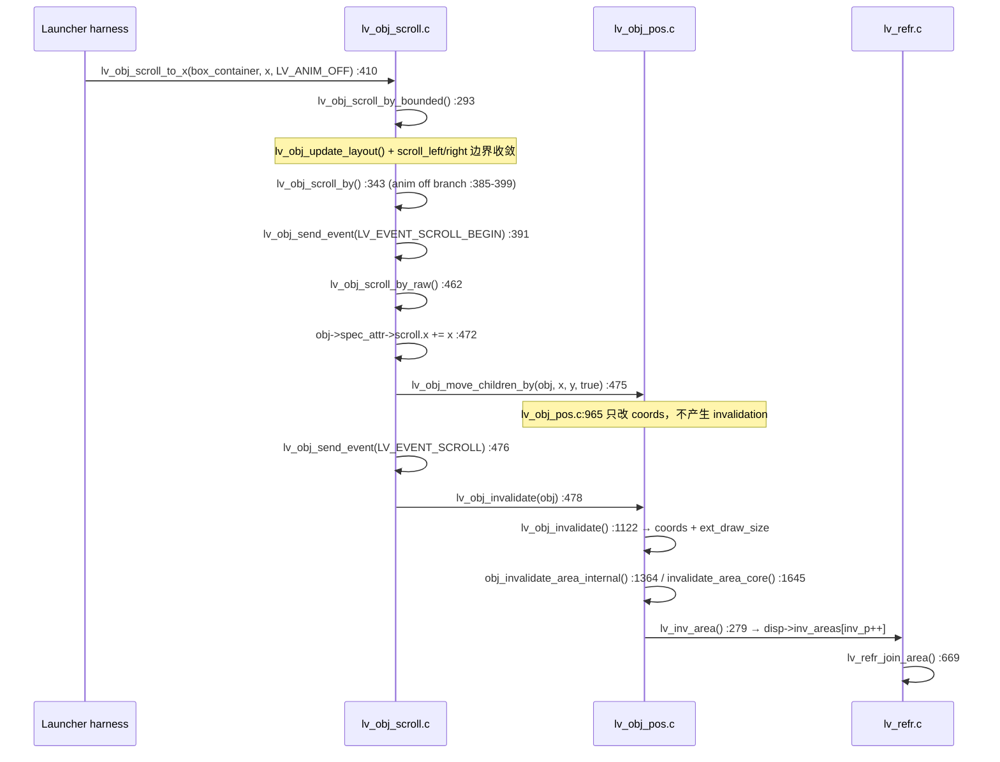

# Launcher Slot-Local Partial Redraw

## 结论

> **SLOT-LOCAL REDRAW HIGH-VALUE OPTIMIZATION**

目标板三轮 A/B 表明，让 Launcher 停止 native scroll、改为只移动 App Slot 之后：

- dirty 面积 **280,055 → 164,356 px/frame（−41.31%）**，dirty ratio **72.92% → 42.80%**；
- `T_render` **57.13 → 40.59 ms/frame（净省 16.54 ms）**，远超本阶段 5 ms 门槛；
- 每帧合并后只剩 **6.50 个局部矩形**，不再合成 800×350；
- 固定系统 UI（5 个 A8 圆形图标、分隔线、底部文字）在滚动帧中 **绘制次数降为 0**；
- 像素 A/B 通过：在 scroll = 220 / 240 处 viewport `changed = 0`、`SAD = 0`、`exact match = 1.000000`；其余采样点的差异（1–5 px）小于同模式自比对的 run-to-run 噪声底（同模式重复 1–8 px）。

按第一阶段要求，本轮**只做 Debug-only A/B、脏区测量、影响面分析和文档**。没有改动 production 架构、没有重写手势/惯性/snap、没有修改 LVGL `scroll`/`refr`/invalidation 语义、没有叠加 XRGB 或 A8 优化。production 迁移属于第二阶段，必须单独提交。

## 测试条件

| Item | Value |
|---|---|
| Board | STM32H743 @ 480 MHz |
| Runtime | FreeRTOS / CMSIS-RTOS2 |
| Graphics | LVGL 9.6.0，800×480 ARGB8888，DIRECT double framebuffer |
| Display engines | LTDC + DMA2D + external SDRAM |
| Branch | `codex/lvgl-refresh-performance` |
| Audit base | `4dfdcb13f2eae2642582bffb06851d0be1cee0ba` |
| 配置 | `Debug-LTDC-Full-Render-Audit` |
| Phase 3 pre-clear | 保持开启，`g_render_audit_preclear_mode = 3` |
| DMA2D async | 保持关闭（Phase 4 结论：NOT WORTH COMPLEXITY） |
| 圆角 | 保持 production radius 10（Phase 5 rounded-fill A/B 净收益仅 0.62 ms，已停止） |
| Preview 格式 | 保持 ARGB8888 |
| 系统 A8 图标 | 保持现状 |
| 驱动器 | 同一 deterministic harness：`+240 px / 12 steps / 20 px per rendered frame` |
| 采样 | 每种模式重复 3 轮冷启动 |
| 计时 | DWT CYCCNT，按 480 MHz 换算 |

`T_render` 取每个 audit frame 的 `g_render_audit_total.frame_cycles / frame_count`。native 的窗口是 14 frames（12 个 scroll frame + 2 个 tail frame），slot-local 是 12 frames；两者都是完整渲染窗口。

为了同时满足「与 Phase 5 rounded-fill 的 57.0881 ms 直接可比」和「严格同帧数可比」，下表给出两行：

| 口径 | Native | Slot-Local | Delta |
|---|---:|---:|---:|
| 整窗口均值（与 57.0881 ms 基线可比） | 57.127 ms | 40.585 ms | −16.54 ms |
| 只取前 12 个 scroll frame（严格同帧数） | 57.631 ms | 40.585 ms | **−17.05 ms** |

native 的 2 个 tail frame 只有 1 个 dirty rect（视口，无 marker），略便宜，所以整窗口均值偏低。两种口径都远超 5 ms 门槛。

## 1. Native scroll 为什么 invalidate 整个 800×350

目标板实测的 joined dirty area 就是 `(0,26)–(799,375)`，即 `box_container` 的完整 800×350 视口。调用链在 vendored LVGL 源码里可以逐行确认：



结论：

1. **根因是 `lv_obj_scroll_by_raw()` 末尾的 `lv_obj_invalidate(obj)`（`Core/APPS/LVGL/src/core/lv_obj_scroll.c:478`）。** 参数 `obj` 是 scroll 容器本身（`box_container`），其 `coords` 就是 800×350 视口，所以 invalidation 从一开始就是整个 viewport，与「只有 20 px 位移」无关。
2. `lv_obj_move_children_by()`（`Core/APPS/LVGL/src/core/lv_obj_pos.c:965-981`）只平移子对象 `coords`，**不**产生 invalidation，所以局部信息在进入 invalidation 之前就已经丢失。
3. `lv_obj_invalidate()` 只按 `obj->coords + ext_draw_size` 计算，并且会沿父链裁剪（`lv_obj_area_is_visible()`，`Core/APPS/LVGL/src/core/lv_obj_pos.c:1143`）。因此 dirty 矩形正好等于视口本身。
4. 该语义是 LVGL 的通用正确性要求（scroll 可能移动任意子对象、可能改变 cover/scrollbar），**不是 Launcher 特例 bug**，所以本轮没有 patch LVGL core 的 scroll/invalidation 路径。

### Baseline 逐帧证据（native r1）

```text
DIRTY_FRAME ordinal=1 seq=1 pre_join_count=2 joined_count=2 pre_join_pixels=280064 joined_pixels=280064 render_cycles=...
DIRTY_PRE    frame=1 idx=0 x1=0 y1=26 x2=799 y2=375     <- 视口整体
DIRTY_PRE    frame=1 idx=1 x1=0 y1=4  x2=15  y2=7       <- 帧序号色块
DIRTY_JOINED frame=1 idx=0 x1=0 y1=26 x2=799 y2=375
DIRTY_JOINED frame=1 idx=1 x1=0 y1=4  x2=15  y2=7
```

`inv_p` 峰值 = 2，overflow = 0，join 比较 14 帧共 50 次、26 before / 26 after，**没有任何合并发生**：dirty 从一开始就是一个大矩形。

## 2. Candidate 对象树与失效模型

Candidate 不改变对象树，只改变「谁在动」：

```text
s_main_container (800×480)
└── box_container (800×350 @ y=26, scroll_dir = LV_DIR_NONE)      ← 冻结，不再 native scroll
    └── content_container (2660×350 @ x=0)                        ← 固定不动，充当视口背景
        ├── slot_container[0..11]  200×200 @ (20+220i − logical_scroll_x, 80)
        │   └── slot_image (200×200, SDRAM ARGB)
        └── slot_label[0..11]      200×~24 @ (20+220i − logical_scroll_x, 45)
固定系统 UI（不属于滚动区）：circle[0..4] + A8 icon + label、divider、status label
```

- Debug-only mailbox `g_launcher_scroll_mode`：`0` = production native scroll，`1` = slot-local candidate。
- Candidate 下 `prv_apply_launcher_scroll_mode()` 把 `box_container` 设为 `LV_DIR_NONE` 并把 native scroll 归零；hot path 只做 `lv_obj_set_x()`，native scroll 保持 0。
- `prv_slot_apply_offset()` 只改 geometry：不 create/delete、不重载图片、不 `lv_label_set_text`、不重设 child style。
- 背景不随 card strip 移动；slot 离开旧位置后，由旧 bbox 的 local dirty 区域把 `content_container` 背景重新画回来（预期行为，见 §7）。
- `logical_scroll_x` 是 Launcher 自己的权威偏移；native scroll 冻结后 `lv_obj_get_scroll_x()` 恒为 0，harness 与 framebuffer 捕获元数据都改读 `prv_launcher_scroll_offset()`。

### 为什么 `lv_obj_set_x()` 就够

`lv_obj_set_x()` → `LV_STYLE_X` → `lv_obj_refresh_style()` → `lv_obj_invalidate(obj)`（旧位置）→ 布局收敛时 `lv_obj_refr_pos()` → `lv_obj_move_to()`（`Core/APPS/LVGL/src/core/lv_obj_pos.c:894`）在 `:926` invalidate 旧 coords、`:955` invalidate 新 coords。因此每个被移动的对象天然产生 `old_bbox ∪ new_bbox`，且 invalidation 已包含 `ext_draw_size`，不需要手工 invalidate 子对象（本阶段也没有这么做）。

候选模式下每帧只移动 5 个可见 slot + 1 个可见 label，因此：

```text
inv_areas[]（join 前）   ≈ 5 slot × 2 + 1 label × 2 + marker × 1 = 11
join 后                  = 6.50 rect/frame
```

## 3. Dirty geometry A/B

### 3.1 代表性一帧（candidate r1，step 1，logical offset 0 → 20）

```text
DIRTY_FRAME ordinal=1 seq=1 pre_join_count=9 joined_count=6
            pre_join_pixels=267686 joined_pixels=167686

join 前 (inv_areas[])
  (0,4)-(15,7)        marker
  (0,106)-(199,305)   slot0 new
  (200,106)-(399,305) slot0 old
  (220,106)-(419,305) slot1 new
  (420,106)-(619,305) slot1 old
  (440,106)-(639,305) slot2 new
  (640,106)-(799,305) slot2 old
  (660,106)-(799,305) slot3 new
  (0,65)-(205,101)    label0 (old ∪ new)

join 后
  (0,4)-(15,7)        marker
  (0,106)-(199,305)   slot0 union
  (200,106)-(419,305) slot1 union   <- 两个 200 宽矩形合并成 220 宽
  (420,106)-(639,305) slot2 union
  (640,106)-(799,305) slot3 union（右侧被视口裁剪）
  (0,65)-(205,101)    label0 union
```

关键点：

- **每个 slot 恰好收敛为一个 union 矩形**（需求 #38）。相邻 slot 的 union 宽度 220、间距 220，`lv_area_join()` 的判据 `joined_size < size(a)+size(b)` 不成立（220×200 == 2×110×200 的等价情形），所以**不会**进一步合并。
- 当单帧位移 Δ ≤ 20 px（slot 间距）时该性质成立；Δ = 50 / 100 px 时相邻 union 开始重叠并合并回一条 800 宽的横带（见 §8.2），但该横带只覆盖 slot 行，dirty 仍为 ~168k px，而不是 350 行视口。
- 只有 selected slot 的 label 可见，其余 11 个 label 命中 `lv_obj_area_is_visible()` 的 hidden 分支，不产生任何 invalidation。
- marker 色块（调试用帧序号）始终贡献 16×4 px，两种模式相同。

### 3.2 三轮聚合

| Metric | Native Scroll | Slot-Local | Delta |
|---|---:|---:|---:|
| Dirty pixels (unique/frame) | 280,054.86 | 164,356.00 | **−115,698.86 (−41.31%)** |
| Dirty pixels (sum/frame) | 280,054.86 | 164,356.00 | −115,698.86 |
| Dirty ratio | 72.92% | 42.80% | −30.12 pp |
| Joined areas/frame | 1.86 | 6.50 | +4.64 |
| Pre-join areas/frame (`inv_areas[]`) | 1.86 | 10.17 | +8.31 |
| inv_p peak | 2 | 11 | +9 |
| inv_p overflow (`>=32` fallback) | 0 | 0 | 0 |
| Merge factor (sum ÷ unique) | 1.0000 | 1.0000 | 0 |
| 仅脏 1 次的像素/frame | 280,054.86 | 164,356.00 | −41.31% |
| 脏 2 次及以上的像素/frame | 0 | 0 | 0 |

`inv_p` 峰值 11 远低于 `LV_INV_BUF_SIZE = 32`，整轮 **没有触发** `lv_inv_area()` 里 `inv_p >= LV_INV_BUF_SIZE` 的整屏 fallback（`Core/APPS/LVGL/src/core/lv_refr.c:345`）。该 fallback 现在有专门的 Debug 计数器 `g_render_audit_inv_overflow_count`。

### 3.3 逐帧脏区图

`tools/debug/analyze_slot_local_redraw.py` 会把每一帧的 joined dirty rect 画成 `dirty_regions.png`（上排 = native，下排 = slot-local，橙色轮廓 = join 前、青色填充 = join 后），并输出 `dirty_coverage.png`（蓝 = 脏 1 次、红 = 2 次、绿 = 3 次以上）与 `dirty_regions_legend.txt`（每个 panel 的 rect 数、px、render ms）。

本轮产物：

```text
build/Debug-LTDC-Full-Render-Audit/captures/phase5-slot-local/analysis/dirty_regions.png
build/Debug-LTDC-Full-Render-Audit/captures/phase5-slot-local/analysis/dirty_coverage.png
build/Debug-LTDC-Full-Render-Audit/captures/phase5-slot-local/analysis/dirty_regions_legend.txt
build/Debug-LTDC-Full-Render-Audit/captures/phase5-slot-local/analysis/slot_local_redraw.json
```

native 一行是 14 个整块 800×350；slot-local 一行是 12 个「多条横向 slot 带 + 一条细 label 带」的局部矩形，最后两帧为空帧。

## 4. 性能 A/B（需求 #53 对比表）

三轮均值，单位 ms/frame，除非另注：

| Metric | Native Scroll | Slot-Local | Delta |
|---|---:|---:|---:|
| Dirty pixels | 280,054.86 | 164,356.00 | −115,698.86 |
| Dirty ratio | 72.92% | 42.80% | −30.12 pp |
| Joined areas/frame | 1.86 | 6.50 | +4.64 |
| inv_p max | 2 | 11 | +9 |
| pre-clear pixels | 280,054.86 | 164,356.00 | −115,698.86 |
| pre-clear ms | 9.26 | 6.33 | −2.92 |
| fill tasks/frame | 11.21 | 10.00 | −1.21 |
| fill pixels（最后一帧总填充） | 440,880 | 280,286 | −160,594 |
| fill unique pixels | 280,000 | 160,286 | −119,714 |
| fill overdraw | 1.5746 | 1.7487 | +0.174 |
| fill ms | 18.38 | 9.87 | **−8.51** |
| DMA2D R2M pixels | 426,110 | 310,087 | −116,023 |
| DMA2D PFC pixels | 134,000 | 136,333 | +2,333 |
| DMA2D image tasks/frame | 8.71 | 3.83 | −4.88 |
| DMA2D image ms | 23.47 | 19.88 | −3.59 |
| SW fixed icons（A8 圆形图标绘制/frame） | 5.00 | 0.00 | **−5.00** |
| SW execute ms | 20.36 | 5.99 | **−14.38** |
| border tasks/frame | 9.36 | 4.42 | −4.94 |
| border ms | 3.05 | 0.49 | **−2.56** |
| label ms | 0.57 | 0.67 | +0.10 |
| draw-buffer clear ms | 9.26 | 6.33 | −2.92 |
| DMA2D wait ms | 23.73 | 23.51 | −0.22 |
| cache ms | 1.28 | 1.29 | +0.01 |
| layout ms | 0.009 | 2.424 | **+2.42** |
| **T_render ms**（整窗口均值） | **57.13** | **40.59** | **−16.54** |
| T_render ms（同 12 scroll frame） | 57.63 | 40.59 | **−17.05** |
| Presentation interval ms | 57.15 | 40.61 | −16.54 |
| 等效 FPS | 17.50 | 24.63 | +7.13 |
| 距离 33.3 ms（30 FPS） | −23.83 | −7.29 | −16.54 |

对照上一轮 Phase 5 rounded-fill 基线 57.0881 ms：本轮 native 复现 **57.127 ms**（偏差 +0.04 ms，0.07%），说明测量窗口与基线可比。

### 收益来自哪里

| 变化 | 量级 | 说明 |
|---|---:|---|
| SW execute 下降 | −14.38 ms | 大背景 SW fill 面积缩小 **＋** 5 个 A8 固定图标完全退出滚动帧 |
| fill 下降 | −8.51 ms | 背景填充从 280k px 降到 160k px（最后一帧 440,880 → 280,286 总填充像素） |
| border 下降 | −2.56 ms | border task 从 9.36 降到 4.42/frame；固定圆形/分隔线 border 不再重画 |
| draw-buffer clear（pre-clear）下降 | −2.92 ms | 只清新的 joined dirty area，pixels 与 dirty 面积同比 −41.3% |
| DMA2D image 下降 | −3.59 ms | image task 8.71 → 3.83/frame（消失的 5 个是 A8 圆图标） |
| layout 上升 | +2.42 ms | `lv_obj_set_x()` 走 style→layout 路径，从 0 pass 变为 12 pass / 12 frame |
| traversal / style 上升 | +0.29 / +0.45 ms | dirty area 从 1 个变成 ~6.5 个，每个 area 都要各自遍历对象树 |
| DMA2D wait 不变 | −0.22 ms | 同步 backend 行为未变，仍是 23.5 ms 的下一个独立瓶颈 |

`content_container` 的背景恢复绘制次数从 1.00 涨到 4.58 次/frame —— 这是设计预期（需求 #22），总填充像素仍下降 36.4%。

### 关于「只画新露出的 20 px」

本阶段明确**不**追求只重画 20 px 增量，也没有实现 framebuffer shift 或 cached blit（需求 #26）。slot 整体位移后，其新位置的内容必须重新生成，因此每帧 dirty 是 `old_bbox ∪ new_bbox`（20 px 步长下每 slot 220×200），而不是 20 px 条带。candidate 的 164,356 px/frame 就是这一模型的真实结果，相对 baseline 的 280,055 px 是 41.3% 的下降，而不是 99% 的下降。

### Hot path 的精确边界

需求 #46 的「label set = 0 / image src set = 0 / style set = 0」在本 candidate 里按以下口径成立，需要如实区分：

| 操作 | candidate hot path |
|---|---|
| `lv_label_set_text()` | 0 |
| `lv_image_set_src()` | 0 |
| `lv_obj_create()` / `lv_obj_delete()` | 0 |
| `malloc` / `free` | 0 |
| 视觉样式写入（border/bg/radius/color/opa/outline） | 0 |
| 布局属性写入 | 5 个可见 slot + 1 个可见 label 各 1 次 `lv_obj_set_x()` |

即：**没有任何业务 setter，也没有任何视觉样式写入**。但 `lv_obj_set_x()` 在 LVGL 9 里就是 `LV_STYLE_X` 的写入，因此它会触发 `lv_obj_refresh_style()` 与一次 layout pass —— 这正是 §4 里 layout 从 0 变成 2.424 ms/frame 的原因。这一代价已被计入 16.54 ms 的净收益；如果将来需要更轻的路径，应重新做 `set_x` vs `translate_x` vs 直接 coords 平移的实测对比，而不是按理论选择（`translate_x` 在本轮实测为 2.494 ms layout，未更快）。

## 5. Full Render Audit 闭合（需求 #52）

互斥 category 口径，三轮均值：

| Category (ms/frame) | Native | Slot-Local | Delta |
|---|---:|---:|---:|
| bookkeeping | 0.111 | 0.391 | +0.280 |
| traversal | 0.954 | 1.245 | +0.291 |
| cover | 0.036 | 0.162 | +0.126 |
| task_create | 0.033 | 0.021 | −0.012 |
| dsc_init | 0.021 | 0.015 | −0.006 |
| style | 0.704 | 1.154 | +0.450 |
| evaluate | 0.038 | 0.023 | −0.015 |
| dispatch | 0.247 | 0.160 | −0.087 |
| dma2d_setup | 0.099 | 0.104 | +0.005 |
| dma2d_wait | 23.664 | 23.452 | −0.212 |
| sw_execute | 20.328 | 6.013 | **−14.315** |
| drawbuf_clear | 9.255 | 6.333 | **−2.922** |
| cache | 1.276 | 1.289 | +0.013 |
| alloc | 0.186 | 0.127 | −0.059 |
| cleanup | 0.019 | 0.012 | −0.007 |
| **category sum** | **57.07** | **40.53** | −16.54 |
| wall (`frame_cycles`) | 57.13 | 40.59 | −16.54 |
| **closure** | **99.90%** | **99.86%** | — |
| residual | 0.059 | 0.055 | — |

draw 执行口径（正交视图，不可与上表相加）：

| Draw type / unit (ms/frame) | Native | Slot-Local | Delta |
|---|---:|---:|---:|
| SW unit total | 20.355 | 5.992 | −14.363 |
| DMA2D unit total | 25.123 | 24.924 | −0.199 |
| SW tasks/frame | 21.07 | 9.83 | −11.24 |
| DMA2D tasks/frame | 8.93 | 9.25 | +0.32 |
| fill | 18.381 | 9.870 | −8.511 |
| image | 23.472 | 19.880 | −3.592 |
| border | 3.053 | 0.495 | −2.558 |
| label | 0.571 | 0.670 | +0.099 |
| DMA2D R2M | 12.819（426,110 px） | 9.925（310,087 px） | −2.894 |
| DMA2D PFC | 19.137（134,000 px） | 19.207（136,333 px） | +0.070 |

两种口径都闭合到 **≥99.8%**，candidate 没有引入未归因时间。

## 6. 对象与任务证据（需求 #19 / #20 / #21 / #59）

Debug-only 对象 profiler 给每个 Launcher 对象登记稳定的 `(kind, instance)`，在 `lv_obj_redraw()` 里计数。三轮均值，draws/frame：

| Object kind | 数量 | Native draws/frame | Slot-Local draws/frame |
|---|---:|---:|---:|
| `CONTENT_BACKGROUND` | 1 | 1.00 | 4.58 |
| `SLOT` | 12 | 4.36 | 4.42 |
| `SLOT_IMAGE` | 4 | 3.71 | 3.83 |
| `SLOT_LABEL` | 12 | 0.79 | 0.92 |
| `CIRCLE`（固定 5 圆） | 5 | **5.00** | **0.00** |
| `CIRCLE_ICON`（固定 A8 图标） | 5 | **5.00** | **0.00** |
| `CIRCLE_LABEL`（固定文字） | 5 | 0.00 | 0.00 |
| `DIVIDER` | 1 | 0.00 | 0.00 |
| `STATUS` | 1 | 0.00 | 0.00 |
| `MARKER`（调试色块） | 1 | 0.86 | 1.00 |
| `MAIN` / `BOX_VIEWPORT` | 2 | 0.00 | 0.00 |

- **需求 #19 成立**：5 个固定 A8 圆形按钮在 native 下每帧都被迫重画（dirty 800×350 与 y=330..385 的圆形相交），candidate 下 dirty 只剩 y=65..305 与 x 方向局部矩形，与圆形完全不相交 → **draw task count = 0**，`SW image tasks` 直接归零。
- **需求 #20 成立**：底部说明文字（y≈436）与 status label 在两种模式下都不在滚动帧的 dirty 范围内，均为 0。
- **需求 #21 成立**：滚动帧中只剩「发生位移的 slot 相关对象（slot / slot_image / slot_label）」＋「dirty 区域下必须恢复的 `content_container` 背景」＋ 调试 marker，没有其他对象被重画。

其它任务级计数（三轮均值）：

| Metric | Native | Slot-Local | Delta |
|---|---:|---:|---:|
| draw tasks/frame | 30.00 | 19.08 | −10.92 |
| objects considered/frame | 61.64 | 256.67 | +195.03 |
| objects drawn/frame | 24.43 | 27.75 | +3.32 |
| style gets/frame | 996 | 1,863 | +867 |
| traversal ms | 0.954 | 1.245 | +0.29 |
| style lookup ms | 0.704 | 1.155 | +0.45 |
| cover check ms | 0.036 | 0.162 | +0.13 |

代价明确：局部 dirty 让「每个 area 各遍历一次对象树」，因此 considered/style-get 上升；因为对象树很小（~60 对象），总代价只有 +0.87 ms。

## 7. 背景局部恢复（需求 #7 / #22）

- `content_container` 在 candidate 下 `x` 不变，自身不被 invalidate（profiler 里 `BOX_VIEWPORT` / `MAIN` 绘制次数为 0）。
- slot 移动后，旧位置露出的条带由该 slot 的 union dirty 矩形驱动，遍历时由覆盖该区域的 `content_container` 重新填充 → `CONTENT_BACKGROUND` 绘制 4.58 次/frame。
- 结论：**背景不是 0 draw task，也不需要是**；但背景填充像素从 280,000 降到 160,286（−42.8%），总填充像素从 440,880 降到 280,286（−36.4%）。
- candidate 没有引入任何「2660×350 的滚动 opaque 背景」——父 content 完全不滚动，这正是与已失败的 Static BG 实验的根本区别（那次仍是 native scroll，83.43 → 91.48 ms）。

## 8. 位置 API A/B 与位移动态范围（需求 #33 / #42 / #35）

### 7.1 `lv_obj_set_x()` vs `lv_obj_set_style_translate_x()`

两者都通过 `lv_obj_refr_pos()` → `lv_obj_move_to()` 生效，因此 invalidation 语义与 dirty 几何完全相同（`joined areas/frame`、`inv_p peak`、dirty px 三者逐位一致）：

| Metric | Native | set_x | translate_x |
|---|---:|---:|---:|
| T_render (3-run mean) | 57.127 ms | **40.585 ms** | 40.493 ms |
| 三轮值 | 57.054 / 57.144 / 57.181 | 40.555 / 40.812 / 40.389 | 40.409 / 40.436 / 40.635 |
| layout ms | 0.009 | 2.424 | 2.494 |
| layout passes | 0 | 12 / 12 frame | 12 / 12 frame |
| joined areas/frame | 1.86 | 6.50 | 6.50 |
| inv_p peak | 2 | 11 | 11 |

差值 0.09 ms，远小于轮间波动（±0.2 ms），**不能据此判定 translate 更快**。选择 `lv_obj_set_x()` 作为 candidate 默认：语义与整数像素位置一致、`coords` 立即反映真实位置（hit-test 天然正确），并且不会像 `LV_STYLE_TRANSLATE_X` 那样额外携带 `PARENT_LAYOUT_UPDATE`。

### 7.2 步长扫描（单次位移，candidate）

| Δ px | pre-join rect/frame | joined rect/frame | joined px/frame | slot 带宽度 |
|---:|---:|---:|---:|---|
| 1 | 11.0 | 6.00 | 152,745 | 201（200+1） |
| 5 | 11.0 | 6.00 | 156,093 | 205（200+5） |
| 20 | 11.0 | 6.00 | 168,426 | 220（200+20） |
| 50 | 11.0 | **3.00** | 168,426 | 800（相邻 union 重叠后合并） |
| 100 | 11.0 | **3.00** | 168,426 | 800（相邻 union 重叠后合并） |
| 880（44 × 20 px） | 9.1 | 5.57 | 160,064 | 进入/离开视口时按裁剪变窄（140/160/180/200/220） |

- Δ ≤ 20 px 时，每个 slot 恰好一个 union 矩形；Δ > 20 px（= `BOX_SPACING`）时相邻 union 重叠，`lv_area_join()` 认为合并后更小，于是合并成一条 800×200 的带。
- **即使合并，dirty 也只覆盖 slot 行（200 px 高），不会回到 350 行视口**：joined px 仍是 ~168k，只是矩形数从 6 降到 3。
- Δ = 880、44 步（slot 完全离开 → 部分进入 → 部分离开）时，宽度序列 140/160/180/200/220 正好等于 `min(220, 视口裁剪)`，说明 clipping 与 `old ∪ new` 在进入/离开视口时都正确。
- 单步扫描每个 Δ 只采到 1 个 measured frame，`T_render` 不具统计意义，本表只用来说明几何正确性。

### 7.3 方向反转（需求 #34）

先做一次不计入的 forward pre-roll 到 240 px，再 reset audit 并反向 12 步回到 0：

| Mode | step frames | joined rect/frame | joined px/frame | T_render |
|---|---:|---:|---:|---:|
| Native | 14 | 1.86 | 280,055 | 62.95 ms（三轮 62.965 / 63.001 / 62.884） |
| Slot-Local | 12 | 6.50 | 164,356 | 39.80 ms（三轮 39.674 / 39.850 / 39.873） |

- 反向时 candidate 的 dirty 几何与正向完全一致（6.50 rect / 164,356 px），没有残影累积或额外脏区。
- **附带发现（未确认根因）**：native 反向时 `T_render` 稳定比正向慢约 5.8 ms（62.95 vs 57.13），dirty 面积与 pre-clear pixels 完全相同（3,920,768 px / 14 frames），差异全部落在 fill 执行（22.8 vs 18.4 ms/frame）。**推测**与 LTDC scanout / SDRAM 争用的相位差有关（Phase 4 已测到 R2M 在 LTDC 开启时慢 3.12×），本阶段没有进一步隔离。candidate 不受该方向差异影响，反向反而略快。

## 9. 像素正确性 A/B（需求 #30 / #31 / #32 / #73）

`tools/debug/capture_scroll_frames.py --scroll-mode {0,1}` 在 before (step 0) / mid (step 6) / after (step 12) 抓取两路 framebuffer，`tools/debug/compare_launcher_framebuffers.py` 按**记录的 Launcher 逻辑 scroll 位置**配对缓冲区（DIRECT 双缓冲在两轮里可能落在相反的交换相位，按名字配对会错位）。

`slot_area` = `(0,26)–(799,375)` 且 mask 掉调试 overlay 前 8 行：

| Capture | scroll_x | base fb | candidate fb | Region | Changed px | SAD | Exact match |
|---|---:|---|---|---|---:|---:|---:|
| before | 0 | fb_a | fb_a | slot_area | 5 | 772 | 0.999982 |
| mid | 100 | fb_a | fb_a | slot_area | 2 | 333 | 0.999993 |
| mid | 120 | fb_b | fb_b | slot_area | 1 | 8 | 0.999996 |
| after | 220 | fb_b | fb_a | slot_area | **0** | **0** | **1.000000** |
| after | 240 | fb_a | fb_b | slot_area | **0** | **0** | **1.000000** |

同模式自比对的 run-to-run 噪声底（native 对 native 重复一次）：

| Capture | scroll_x | Region | Changed px | SAD | Exact match |
|---|---:|---|---:|---:|---:|
| before | 0 | slot_area | 8 | 946 | 0.999971 |
| mid | 100 | slot_area | 5 | 837 | 0.999982 |
| mid | 120 | slot_area | 1 | 8 | 0.999996 |
| after | 220 | slot_area | 0 | 0 | 1.000000 |
| after | 240 | slot_area | 0 | 0 | 1.000000 |

- 在完全稳定下来的 scroll 位置（220 / 240），**跨模式差异精确为 0，SAD = 0，exact match = 1.000000**。
- 在 `before` / `mid`，跨模式差异（5 / 2 / 1 px）**不超过同模式重复的噪声底（8 / 5 / 1 px）**，且差异像素全部是选中 slot 标题与底部动作提示的 **LCD subpixel 文字 AA 边缘**（例如同一像素 `B255 G255 R125` vs `B130 G255 R125`）。这是目标板既有的 run-to-run 文字栅格化抖动，不是 Phase 5 引入的。
- **需求 #31（旧位置恢复背景）**：`after` 处 0 差异说明 slot 移走后露出的背景被正确恢复，没有 ghost、拖影、残留边框或残留文字。
- **需求 #32（新位置完整）**：同 0 差异覆盖 slot background/border、200×200 图标与 app 标题（标题在 y=65..101，被 union bbox 完整包含）；没有因为 bbox 太小而裁掉 AA、边框或文字 descender。
- 每路 capture 内部还通过 `framebuffer_to_png.py` 的双缓冲位移检查：before/mid/after 三点 `expected dx == measured dx`、`exact match = 1.0000`、`SAD = 0`（native 与 slot-local 都是）。

## 10. 故障与显示不变量（需求 #74）

六轮 3×3 A/B + 全部 sweep/reversal/translate 运行：

| Check | Result |
|---|---|
| reload request / event / complete | 14/14/14（native）、12/12/12（slot-local），完全 1:1 |
| reload wait timeout | 0 |
| ownership violation | 0 |
| LTDC FIFO underrun / transfer error / other | 0 / 0 / 0 |
| CFSR / HFSR / MMFAR / BFAR | 0x00000000 / 0x00000000 / 0x00000000 / 0x00000000 |
| pre-clear DMA error flags | 0x00000000 |
| scroll capture state | `4`（DONE）、12/12 steps |
| `inv_p` overflow（整屏 fallback） | 0 |

## 11. 影响面分析（需求 #62 / #63 / #64）

对非 LVGL 代码全仓检索 native scroll API：

| 检索项 | 结果 |
|---|---|
| `lv_obj_get_scroll_x()` 读者 | 仅 `Core/Screen/Page/ui_screen_launcher.c:242`（`prv_launcher_scroll_offset()` 内的 native 分支） |
| `lv_obj_scroll_to_x()` 调用者 | 仅 `ui_screen_launcher.c:370/377/1057`（mode 切换与 harness） |
| `lv_obj_set_scroll_dir()` 调用者 | 仅 `ui_screen_launcher.c:371/376/1402` |
| `lv_obj_scroll_by*()` / `lv_obj_is_scrolling()` 业务调用者 | 无 |
| `LV_EVENT_SCROLL` / scroll callback | 无 |
| `lv_obj_set_scroll_snap_x/y()` | 全仓未调用（Launcher 没有 snap 配置） |
| `lv_obj_set_scroll_elastic()` | `ui_screen_launcher.c:1404`，设为 `false` |
| `lv_obj_set_scroll_momentum()` / `lv_indev_set_scroll_limit()` | 全仓未调用 |
| Lua / foundation API 暴露 scroll | 无 |

**结论：native scroll 的全部使用面都局限于 Launcher 自身，没有业务回调、没有 snap/惯性配置、没有被 Lua 或其它模块读取的 scroll offset。** 这让迁移面比预期更小：production 化只需要在 Launcher 内实现「逻辑滚动 + slot 位移 + 指针拖动/惯性/snap/命中测试」，不需要改动 LVGL core、LTDC、DMA2D backend、pre-clear、draw scheduler 或 SDRAM。

选择/命中相关的现状：

- `s_selected_index` 由 `prv_set_selection()` 维护，输入来自 slot 的 `LV_EVENT_CLICKED`；与 native scroll offset 无直接耦合。
- `DesignLauncher_GetSelected()` / `DesignLauncher_SetSelected()` 只使用 slot 索引。
- `lv_obj_set_x()` 会真实更新 `coords`，因此 LVGL 命中测试天然跟随新视觉位置（需求 #47 / #48）。若将来改用 `translate_x`，`lv_obj_refr_pos()` 也把它并入 `coords`，命中测试同样正确——但本阶段生产候选仍选 `set_x`。

## 12. Production 迁移计划（第二阶段，单独提交）

本阶段**不实施**。若采纳，建议范围：

1. 用 Launcher 私有 `logical_scroll_x` 加 5 个可见 slot 的 `lv_obj_set_x()` 取代 `box_container` 的 native scroll；`box_container` 永久 `LV_DIR_NONE`。
2. 手势语义必须与现有一致（需求 #45）：拖动方向、滚动范围 `[0, content_width − 800]`、slot 间距 220、snap 位置 `round(offset / 220) * 220`、选中 slot、tap 判定与 launch 行为；第一阶段 candidate 已冻结这些语义，未做任何改动。
3. tap-vs-drag 阈值与惯性（速度）需要新增指针事件处理；不在本阶段。
4. 滚动期间继续保持 `label set = 0`、`image src set = 0`、`style set = 0`、资源读取 = 0；只改 geometry。
5. 每帧位移建议限制在一个 slot 间距（≤ 20 px 的等效速度）以内，以保持「一 slot 一矩形」的最优 dirty 形态；快速 fling 会退化为 3 个矩形（dirty 面积不变，见 §8.2）。
6. 需要覆盖的 stress（需求 #72）：normal drag / slow drag / fast fling / left-right reversal / tap while moving / snap / enter-exit app / 5 分钟连续。
7. Release 边界（需求 #76）：production 提交只保留 logical scroll + slot movement，不携带 A/B mailbox、dirty rect recorder、candidate benchmark 或大型 profiler 表。

第一阶段 candidate **不**要求支持 scrollbar、momentum、snap、gesture inertia（需求 #43）；本轮只做 deterministic 性能与脏区验证，production 交互语义在第二阶段实现。

后续叠加优化（需求 #70）应在 production 迁移完成后单独测量，且不能与本阶段收益算术相加：

| 步骤 | T_render | 说明 |
|---|---:|---|
| 当前 production 基线 | 57.1 ms | Phase 5 rounded-fill 基线 57.0881 ms |
| + slot-local redraw | **40.6 ms** | 本阶段，目标板实测 |
| + opaque card ARGB→XRGB | ~32.7 ms（推测） | 历史 A/B 约 7.9 ms/frame，需先落实 alpha 契约；必须重新实测 |
| + A8 固定图标优化 | 已被本阶段同时回收 | 固定 A8 图标在滚动帧中绘制次数已为 0，Phase 5 不再需要单独的 A8 项 |
| + 同步 DMA2D wait | 22.1 ms 理论上限 | Phase 4 判定 NOT WORTH COMPLEXITY，已停止 |

按此推测路线，slot-local 已把「进入 30 FPS」的缺口从 23.83 ms 压到 7.29 ms；剩余 7.29 ms 需要 XRGB（需先满足 alpha 契约）与/或消除同步 DMA2D wait，实际数字只能用目标板决定。

## 13. 24 个必需回答（需求 #78）

1. **Native scroll 为什么 invalidate 整个 800×350？** `lv_obj_scroll_by_raw()` 在 `Core/APPS/LVGL/src/core/lv_obj_scroll.c:478` 对 scroll 容器本身调用 `lv_obj_invalidate()`；容器 coords 就是 800×350 视口。链路上的 `lv_obj_move_children_by()` 只改 coords、不 invalidate。
2. **Candidate 是否完全停止 native content scrolling？** 是。候选模式下 `box_container` 为 `LV_DIR_NONE` 且 native `scroll.x` 恒为 0；`g_launcher_logical_scroll_x = 240` 而 `lv_obj_get_scroll_x()` = 0。
3. **Candidate 每帧产生多少 dirty rect？** join 前 10.17 个（`inv_areas[]`），其中 slot union 前 5 slot × 2 + 1 label × 2 + marker。
4. **merge 后剩多少？** 6.50 个/frame。
5. **unique dirty pixels 是多少？** 164,356 px/frame（占屏幕 42.80%）。
6. **是否再次合并成大矩形？** 20 px/frame 的正常步长下**没有**：相邻 union 宽度 220、pitch 220，`lv_area_join()` 不合并，最终 4 条 slot 带 + 1 条 label 带 + 1 个 marker。仅有 Δ > 20 px 的快速位移会让相邻 union 重叠并合并成 800 宽横带（矩形数 6→3，dirty 面积不变）。
7. **pre-clear pixels 下降多少？** 280,054.86 → 164,356.00 px/frame（−41.31%），耗时 9.26 → 6.33 ms。
8. **fill pixels 下降多少？** 总填充像素 440,880 → 280,286（−36.4%），unique 280,000 → 160,286（−42.8%），fill ms 18.38 → 9.87。
9. **fixed system icons 是否还重画？** 不再。5 个 A8 圆形图标的每帧绘制次数 5.00 → 0.00。
10. **fixed text 是否还重画？** 不再。圆形标签、divider、status label 在两种模式下滚动帧绘制次数都是 0。
11. **card image pixels 下降多少？** 最后一帧 image 覆盖 127,560 → 120,000 px（−5.9%）；image task 8.71 → 3.83/frame，image ms 23.47 → 19.88（−15.3%）。
12. **T_render 下降多少？** 整窗口 57.13 → 40.59 ms/frame，净省 **16.54 ms（−28.9%）**；严格同帧数（各 12 个 scroll frame）为 57.63 → 40.59 ms，净省 **17.05 ms**。
13. **presentation FPS 多少？** 17.50 → **24.63 FPS**（presentation interval 57.15 → 40.61 ms）。
14. **layout 是否从 0-pass 变成实际 pass？** 是。native `passes = 0`，candidate 每帧 1 pass（12 帧 12 passes），layout 耗时 0.009 → 2.424 ms/frame。
15. **inv_p 最大多少？** 11（上限 32），overflow = 0。
16. **old position 是否正确恢复背景？** 是。`after` 采集在 scroll 220/240 处跨模式 `changed = 0 / SAD = 0`，且 `content_container` 背景在 4.58 个局部区域/frame 被重画。
17. **是否有 ghost？** 无。反向运行 dirty 几何与正向完全一致（164,356 px/frame），framebuffer 无残留。
18. **hit-test 是否仍正确？** 是。`lv_obj_set_x()` 真实更新 `coords`，LVGL 命中测试跟随视觉位置；本阶段未改交互语义，点击/选中路径不变。
19. **native scroll 依赖代码有哪些？** 只有 `Core/Screen/Page/ui_screen_launcher.c`（`lv_obj_get_scroll_x` 1 处、`lv_obj_scroll_to_x` 3 处、`lv_obj_set_scroll_dir` 3 处、`lv_obj_set_scroll_elastic` 1 处）。无业务回调、无 snap、无 momentum、无 Lua 暴露。
20. **production 迁移复杂度是否值得收益？** 值得。16.54 ms 收益远超 5 ms 门槛，且影响面局限在 Launcher 单文件；第二阶段成本主要在指针拖动/惯性/snap/tap 的语义重写。
21. **与 baseline framebuffer 是否 pixel-equivalent？** 在稳定 scroll 位置完全等价（`changed = 0`、`SAD = 0`、`exact match = 1.000000`）；在过渡位置差异 1–5 px，低于同模式 run-to-run 噪声底（1–8 px），且都是 subpixel 文字 AA 边缘。
22. **下一步是否值得叠加 XRGB？** 值得，但必须在 production 迁移落地并重新测量之后单独做；本阶段 ARGB 契约未变，XRGB 仍是独立变量。
23. **距 33.3 ms 还差多少？** 还差 **7.29 ms**（40.59 → 33.3 ms）。已知下一个独立瓶颈是同步 DMA2D wait 23.51 ms 与 draw-buffer clear 6.33 ms。
24. **最终状态是什么？** **SLOT-LOCAL REDRAW HIGH-VALUE OPTIMIZATION** —— 脏区与 T_render 均显著下降，pixel correctness PASS，值得 production 化。

## 14. 本阶段没有做的事（明确边界）

- 没有修改 production 行为：`g_launcher_scroll_mode` 只存在于 `CARTDESK_LTDC_SYNC_TRACE_ENABLE` 构建；Release/Debug/SizeDebug 等构建里整个 candidate 块与 mailbox 都不编译。
- 没有 patch LVGL 的 `lv_obj_scroll_*`、`lv_refr`、invalidation 算法；只在既有 Debug-only audit 钩子旁新增了只读记录点（`lv_refr_join_area`、`lv_inv_area`、`lv_obj_refr_pos`、`lv_obj_redraw`）。
- 没有改动 LTDC / DMA2D backend / pre-clear / draw scheduler / SDRAM。
- 没有实现 pointer drag、velocity、inertia、snap、bounds、tap 检测。
- 没有同时叠加 XRGB 卡图或 A8 图标优化。
- 没有继续圆角分解（Phase 5 rounded-fill A/B 已因 0.62 ms 收益停止）。
- 没有把 debug A/B mailbox、dirty rect recorder、对象 profiler 带入 Release。

## 15. 相关文件

新增：

- `tools/gdb/launcher_slot_local_redraw.gdb` — deterministic A/B harness（`$scroll_mode`、`$move_api`、`$delta`、`$steps`、`$preroll`），输出 AUDIT/CAT/DRAWTYPE/PRECLEAR/INVALIDATE/LAYOUT/DIRTY_*/OBJECT/SLOT_BBOX 记录。
- `tools/debug/analyze_slot_local_redraw.py` — 解析 GDB transcript，生成主对比表、`dirty_regions.png`、`dirty_coverage.png`、`dirty_regions_legend.txt`、`slot_local_redraw.json`。
- `tools/debug/compare_launcher_framebuffers.py` — 跨模式 before/mid/after framebuffer 比对（按 scroll 位置配对）＋同模式噪声底对照。

修改：

- `Core/Screen/Page/ui_screen_launcher.c` — Debug-only `g_launcher_scroll_mode` / `g_launcher_slot_move_api` / `g_launcher_logical_scroll_x`、`prv_slot_apply_offset()`、`prv_apply_launcher_scroll_mode()`，以及对象 profiler 登记。
- `Core/Debug/render_audit.h` / `render_audit.c` — dirty frame ring（`inv_areas[]` join 前/后、rect 坐标、像素和、每帧 render cycles）、`inv_p` 峰值与 overflow 计数、layout pass/cycle 计数、对象绘制 profiler。
- `Core/APPS/LVGL/src/core/lv_refr.c` — Debug-only 只读钩子：`lv_inv_area()` 的 append/overflow 计数、`lv_refr_join_area()` 的 dirty 记录、`lv_obj_redraw()` 的对象 profiler。
- `Core/APPS/LVGL/src/core/lv_obj_pos.c` — Debug-only layout pass/cycle 计数（`lv_obj_update_layout()`）。
- `tools/debug/capture_scroll_frames.py` — 新增 `--scroll-mode` / `--move-api`，用于 Phase 5 A/B 采集。

参考：

- `Core/APPS/LVGL/src/core/lv_obj_scroll.c` — native scroll 与 invalidation 根因。
- `Core/APPS/LVGL/src/core/lv_obj_pos.c` — `lv_obj_move_to()` / `lv_obj_refr_pos()` / `lv_obj_invalidate()` / `lv_obj_area_is_visible()`。
- `Core/Debug/display_trace.c` — audit frame 边界（`DisplayTrace_RenderBegin/RenderEnd`）。
- `Docs/display/LAUNCHER_FULL_RENDER_AUDIT.md` — 83.97 ms 全链路根因基线。
- `Docs/display/LAUNCHER_ROUNDED_FILL_OPTIMIZATION.md` — 57.0881 ms 基线来源。
- `Docs/display/LVGL_PRECLEAR_OPTIMIZATION.md` — Phase 3 pre-clear DMA2D 收益。

## 16. Check Results

| Check | Result |
|---|---|
| HostTest | **15/15 passed** |
| Debug | Build passed |
| Release | Build passed |
| SizeDebug | Build passed |
| Debug-USB-SD-MSC | Build passed |
| Debug-LTDC-Sync-Trace | Build passed |
| SizeDebug-DMA2D-SelfTest | Build passed |
| Debug-LTDC-Full-Render-Audit | Build passed |
| Release symbol audit | 无 `render_audit*`、`slot_local*`、`logical_scroll*`、`scroll_mode*`、`slot_move*`、`dirty_frame*`、`preclear_mode*`、`rounded_fill*` 符号（仅剩原有 `lv_inv_area`） |
| `git diff --check` | Passed |
| Cortex faults | CFSR / HFSR / MMFAR / BFAR 全零（本轮全部目标板运行） |
| Display invariants | reload request/event/complete 1:1，timeout = 0，ownership = 0，LTDC error = 0 |
