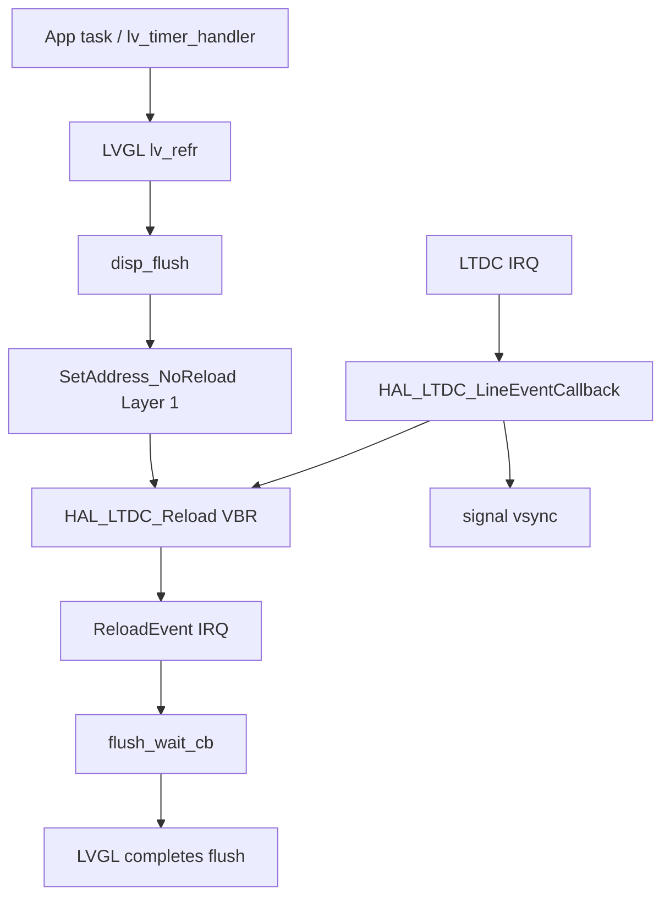
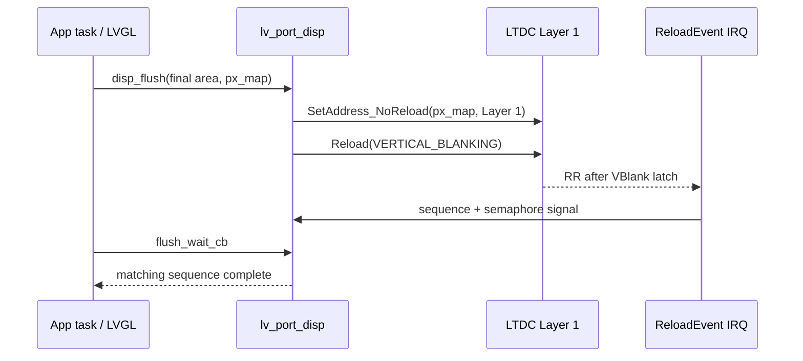

# LTDC + LVGL DIRECT 双帧缓冲同步审计

## 状态

`STATIC FIX IMPLEMENTED; TARGET VALIDATION PENDING`。本文记录 2026-09-28 在
`codex/ltdc-vblank-sync-audit` 分支基于提交 `426a905` 的审计，以及随后实施的
LTDC/LVGL presentation 修复。尚未执行目标板 A/B 实验，不能将静态修复等同于
目标板 tearing、flicker 或 jitter 已消失。

## 审计范围

- LVGL 9.6.0 的 `DIRECT` 双帧缓冲刷新语义；
- Layer 1 的 framebuffer 地址、LTDC reload 与中断路径；
- `lv_display_flush_ready()` 与 LVGL buffer ownership 的关系。

不在本阶段重审 DMA2D L1--L4 的既有通过结论，也未改动 Resource Pipeline、
SDRAM 布局、色彩格式或渲染模式。

## 系统概览

实线均为当前源码中可确认的调用或寄存器写入。production 的 Layer 1 flip 使用
`HAL_LTDC_SetAddress_NoReload()`，随后才请求 `LTDC_RELOAD_VERTICAL_BLANKING`；
正常 LVGL presentation 路径不再写 `SRCR.IMR`。

## 已确认的 framebuffer 配置

| 项目 | 值 | 证据 |
|---|---:|---|
| LVGL render mode | `LV_DISPLAY_RENDER_MODE_DIRECT` | `Core/APPS/LVGL/port/lv_port_disp.c:75-77` |
| LVGL color format | `LV_COLOR_FORMAT_ARGB8888` | `Core/APPS/LVGL/port/lv_port_disp.c:70-77` |
| LTDC active layer | Layer 1（HAL index `1`） | `Core/APPS/LVGL/port/lv_port_disp.c:136` |
| 图像尺寸 / 单帧大小 | 800 x 480 / 1,536,000 B (`0x177000`) | `Core/Src/ltdc.c:82-93`、`Core/Driver/LCD/lcd.h:60-79` |
| FB_A（初始 Layer 1 front / `g_fb0`） | `0xD0177000`--`0xD02EDFFF` | `Core/Inc/sdram_layout.h:21-23`、`Core/Driver/LCD/lcd.c:167-170` |
| FB_B（初始 Layer 1 back / `g_fb1`） | `0xD02EE000`--`0xD0464FFF` | `Core/Inc/sdram_layout.h:25-27`、`Core/Driver/LCD/lcd.c:167-170` |

FB_A 末尾为 `0xD02EDFFF`、FB_B 起点为 `0xD02EE000`，二者相邻但不 overlap，
均为 256-byte 对齐。两个完整缓冲被传给 `lv_display_set_buffers()`；LVGL 对
`DIRECT` 模式会校验每个缓冲至少覆盖完整屏幕。

SDRAM 的 MPU region 5（`0xD0000000`, 64 MiB）继承 region 4 的属性，因而当前
framebuffer 为 **non-cacheable、non-bufferable、non-shareable**。静态审计没有发现
必须依赖 D-Cache clean 的 framebuffer 路径；这不替代目标板 cache/coherency 验证。

## 修复前时序（静态基线）

### `T_request` 与 `T_latched`

修复前 `disp_flush()` 的实际顺序为：

1. 调用 `disp_wait_for_vsync()`；它清 `g_vsync_flag`，以忙等方式最多等待
   `VSYNC_WAIT_TIMEOUT`（100 ms）的下一次 LineEvent。超时后仍继续。
2. 调用 `HAL_LTDC_SetAddress(&hltdc, (uint32_t)px_map, 1)`。
3. HAL 将 Layer 1 配置（含 CFBAR）写入 shadow，并写 `SRCR = LTDC_SRCR_IMR`。
4. 调用 `HAL_LTDC_Reload(&hltdc, LTDC_RELOAD_VERTICAL_BLANKING)`。
5. 在同一 `disp_flush()` 调用中立即执行 `lv_display_flush_ready(disp)`。

因此：

- `T_request`：步骤 2 调用 `HAL_LTDC_SetAddress()`；
- `T_latched`：步骤 3 的 immediate reload，而不是步骤 4 的 vertical-blank request；
- 步骤 4 只是后续再请求一次 VBlank reload。当前代码没有把本次 `px_map` 的可重用性
  绑定到 LTDC reload-complete 事件。

`HAL_LTDC_SetAddress()` 的实现位于
`Drivers/STM32H7xx_HAL_Driver/Src/stm32h7xx_hal_ltdc.c:1361-1392`，其第 1384 行明确写入
`LTDC_SRCR_IMR`。所以当前 framebuffer reload mode 是 **MIXED：address swap 为
IMMEDIATE，随后额外请求 VERTICAL_BLANK**；它不是严格 VBlank-latched swap。

### 连续 frame 的 ownership

把初始两个 LVGL buffer 记为 FB_A 和 FB_B。对常态（非首帧）而言，LVGL 在完成
`flush_cb` 后立即切换内部 `buf_act`：

| Frame | LVGL render / `px_map` | driver 提交 | LVGL 下一绘制 buffer |
|---|---|---|---|
| N | FB_A 或 FB_B | `HAL_LTDC_SetAddress(px_map)` | 另一个 buffer |
| N+1 | 另一个 buffer | 同上 | 前一个 buffer |
| N+2 | 前一个 buffer | 同上 | 另一个 buffer |

LVGL 9.6 在 `DIRECT + double buffer` 下会保存 dirty area；下一刷新开始时，
`refr_sync_areas()` 先等待前一次 flush 完成，再把未重绘区域从 on-screen buffer
同步到 off-screen buffer（默认 `lv_draw_buf_copy()`）。这是 LVGL 为避免修改仍在显示的
buffer 设置的 ownership 栅栏，见 `Core/APPS/LVGL/src/core/lv_refr.c:428-445` 和
`:675-790`。

修复前 driver 在真正的安全 / reload-complete 状态未知时已调用 `flush_ready`，使该栅栏
立即放行。若 LineEvent 未在 100 ms 内到达，或者 immediate reload 已落入 active scan，
LVGL 可以在 LTDC 仍扫描的旧 buffer 上开始同步或下一次绘制。这是 **CONFIRMED 的代码级
ownership 漏洞**；是否已在目标板上实际发生尚未验证。

## 修复后的提交与 completion 路径

### 确认的硬件与 HAL 语义

- `HAL_LTDC_SetAddress_NoReload()` 写 Layer 1 的 shadow `CFBAR` 配置，但实现不写
  `SRCR`；其 HAL 注释明确要求随后由 `HAL_LTDC_Reload()` 统一应用配置。
- `HAL_LTDC_Reload(..., LTDC_RELOAD_VERTICAL_BLANKING)` 写 `SRCR.VBR`。HAL 文档说明
  该请求在下一个 vertical blanking period 应用，以避免 flicker。
- HAL 在 Register Reload interrupt（`RRIF`）时分发
  `HAL_LTDC_ReloadEventCallback()`。本项目用它作为 VBR reload-complete acknowledgement，
  而不是把 LineEvent 当作 reload completion。

### Production 流程

`flush_wait_cb` 运行在 app/LVGL owner task。LVGL 9.6 在 callback 返回后自行清除
`disp->flushing`（`Core/APPS/LVGL/src/core/lv_refr.c:1488-1503`），所以最终路径不在 ISR
也不在 callback 内调用 `lv_display_flush_ready()`。非 final area 仍立即 ready，且绝不触发
完整 framebuffer flip。

每次请求维护 `reload_request_seq` 与 `reload_complete_seq`；提交前会 drain semaphore 中的
stale token，并在短临界区清 RR flag、arm 新 generation、请求 VBR，避免旧 token 确认新帧。
若超过 100 ms 未收到 RR，代码只接受 `SRCR.VBR` 已由硬件清零这一确认；否则记录 trace fault
并复位，绝不退回 IMR 或伪造 flush completion。该 fail-safe 避免 LVGL 在未知 scanout ownership
下重用 framebuffer。

核心 invariant：

1. LTDC 正在 scanout 的 front framebuffer 不得被 LVGL 写入。
2. 新 framebuffer 只能通过 VBlank latch 成为 front。
3. LTDC 确认 presentation 前，LVGL 不得结束对应 flush lifecycle。
4. ISR 只做 timestamp/counter、generation 状态更新和 ISR-safe semaphore signaling。

## LTDC IRQ 与 VBlank 路径

- `LTDC_IRQHandler()` 先调用 `HAL_LTDC_IRQHandler(&hltdc)`，之后只调用空的兼容
  hook `LTDC_IRQHandler_Callback()`：`Core/Src/stm32h7xx_it.c:192-201`。
- `HAL_LTDC_ReloadEventCallback()` 会记录 RR trace，再调用
  `lv_port_disp_signal_reload_complete()`；后者只更新 matching generation 并释放
  CMSIS-RTOS2 semaphore，不触碰 LVGL API。
- `LCD_DoubleBufferInit()` 将 line event 配置为
  `AccumulatedActiveH + 1`，当前是 `504`，并启用 LineEvent：
  `Core/Driver/LCD/lcd.c:1244-1277`。
- `HAL_LTDC_LineEventCallback()` 增加 VBlank 计数、置 `g_vsync_flag`，处理
  `LCD_Refresh()` 的 legacy `pending_swap`，仅在它实际修改 legacy CFBAR 时请求 VBlank
  reload，并重新 arm line event。这样不会每个 VBlank 产生与 LVGL presentation 无关的 RR。

LVGL `disp_flush()` 没有调用 `LCD_Refresh()`，也没有更新 `layer_info[1]` 的 front/back
元数据；因此 legacy swap state machine 不代表 LVGL 的实际 buffer ownership，且 LineEvent
不作为本次 LVGL flush 的 completion acknowledgement。

## LTDC 时序

| 项目 | 代码值 | 物理周期计数 |
|---|---:|---:|
| HSYNC | 0 | 1 |
| HBP（含 sync 后累计至 active 前） | 46 | active 起于第 47 pixel clock |
| ActiveW | 800 | 800 |
| TotalWidth | 886 | 887 |
| VSYNC | 0 | 1 |
| VBP（含 sync 后累计至 active 前） | 23 | active 起于第 24 line |
| ActiveH | 480 | 480 |
| TotalHeight | 516 | 517 |

LTDC pixel clock 来自 25 MHz HSE 的 PLL3R：`25 / 25 * 270 / 10 = 27 MHz`。
因此完整 frame 为 `887 * 517 = 458,579` pixel clocks，刷新率约 **58.878 Hz**，
frame period 约 **16.984 ms**。配置证据在 `Core/Src/ltdc.c:43-55,120-128` 和
`Core/Src/system_stm32h7xx.c:55-57`。

## LVGL 9.6 flush / sync contract

- display 已安装 `flush_wait_cb`；LVGL 在需要重用 DIRECT buffer 时调用它，并在 callback
  返回后清零 `disp->flushing`，见 `Core/APPS/LVGL/src/core/lv_refr.c:1488-1503`。
- 当前 port 也未设置 `sync_cb` 或 `sync_wait_cb`。在 DIRECT 双缓冲下，LVGL 已有内置的
  dirty-area software copy；若注册同步 callback，LVGL 将对每个同步区域调用它并等待
  `lv_display_sync_ready()`，见 `Core/APPS/LVGL/src/core/lv_refr.c:771-785`。
- `sync_cb` 解决的是两个 full framebuffer 之间 dirty-area 内容同步，不是替代
  LTDC scanout completion 的 API。当前问题的首要最小改动方向应是 flush completion
  / VBlank acknowledgement，而不是无依据地接入 `sync_cb`。

## 初步分类与证据等级

| 分类 | 结论 | 证据等级 |
|---|---|---|
| A：LTDC immediate framebuffer reload | 修复前确实发生；production 已改为 NoReload + VBR | CONFIRMED（HAL source / port source） |
| B：`flush_ready` too early | 修复前确实发生；production 已绑定 RR acknowledgement | CONFIRMED（LVGL / port source） |
| C：front/back ownership overlap | 代码允许发生 | STRONGLY INDICATED；待 DWT / target trace 抓取 |
| D：DIRECT integration error | 可能是 A+B 导致的 integration error | STRONGLY INDICATED |
| E：LVGL 9.6 DMA2D backend | 本阶段没有直接证据 | NOT VERIFIED |
| F：D-Cache coherency | framebuffer MPU 非 cacheable | 静态上不支持为首要假设；target 未验证 |
| G：LTDC underrun / SDRAM bandwidth | 未查询 runtime LTDC error / FIFO 状态 | NOT VERIFIED |
| H：full-screen redraw performance jitter | 尚未取得 RuntimeStats | NOT VERIFIED |

## Phase A instrumentation（已完成，未采样）

Phase A 观察代码保留。Phase B production 仅修复 NoReload/VBR 提交与 flush lifetime：
`disp_wait_for_vsync()` 的 100 ms busy-wait 刻意保留，未纳入本轮 jitter 优化。

- CMake option `CARTDESK_LTDC_SYNC_TRACE_ENABLE` 默认 `OFF`；
  `Debug-LTDC-Sync-Trace` preset 才会编入追踪，普通 Debug / Release 不含 ring、mailbox
  或 LVGL event observers。
- 固定 256-entry static-RAM ring 以 `DWT->CYCCNT` 记录 render/refresh、flush、VSync
  wait、SetAddress、reload request/event 与 LineEvent。entry 中的 framebuffer 值为
  `none=0`、`FB_A=1`、`FB_B=2`、`unknown=3`；实际地址另由 mailbox 导出。ring 是最近
  256 个事件的 timing tail；整个 test window 的 request/event、flush、timeout、pixels 和
  error 计数持续累计，故 100+ frame 采样时须同时保存 counters。
- `LV_EVENT_REFR_START` 位于 LVGL DIRECT buffer sync 之前，`LV_EVENT_RENDER_START/READY`
  覆盖实际 render 区间。因此 `NEXT_RENDER_BEGIN` 可用于判断上一次 presentation 尚 pending
  时，下一次 refresh/sync 是否开始；只有它的 active draw buffer 恰等于 pending buffer
  时才计为 `potential_ownership_violations`，不把它称为已确认硬件 collision。
- `HAL_LTDC_ReloadEventCallback()` 记录 RR 后发布 matching completion；
  `HAL_LTDC_ErrorCallback()` 只计数/记录。RR 是全局 reload completion，不应将
  `front_fb` 解读为可读取的即时 Layer 1 scanout register。
- `tools/gdb/ltdc_sync_trace.gdb` 只写 `g_display_trace_command=1`；LineEvent 消费命令。
  它会在 Ctrl-C 后打印 request/event、flush/ready、wait min/max、错误计数、first potential
  violation 和完整 ring。cycles 用 dump 的 `SystemCoreClock` 转为 microseconds。

## Image Slot Trigger Analysis

### 静态预检查（非目标板 A/B 结果）

以下结论来自当前源码，尚不能替代 Empty / Rect / Image 的目标板 trace。

- Launcher 槽位图标不是 Resource V2 的 `ui.image` / JPEG runtime 路径。
  `Core/Screen/Page/ui_screen_launcher.c` 通过
  `CART_IO_OP_LAUNCHER_STORE_READ_ICON` 或 `CART_IO_OP_CART_READ_RESOURCE` 将固定 preview
  读入 `launcher_get_big_icon()` 返回的 SDRAM 缓冲，随后 `prv_configure_slot_image()` 将该
  缓冲绑定为 LVGL image source。preview 的尺寸、stride 和容量固定为 200×200×4
  （`Core/Cart/cart_bin.h`），且与 `BOX_WIDTH` / `BOX_HEIGHT` 均为 200 对应。
- 图片已被绑定后，创建和滚动路径中没有新的 icon SD-read、Resource V2 handle 获取或 JPEG
  decode 调用；图片指针一直指向 launcher cache。因此 warm-scroll 不应因图标本身重新 decode。
  不过 `Launcher_Task()` 仍有周期性 cart probe，最终报告仍须通过专用计数器确认测试窗口内
  没有额外 icon read，不能只凭此静态结论写成 target 已确认。
- 槽位 image object 和源图同为 200×200，当前创建路径未调用 image scale、rotation、transform、
  recolor 或 crop API。因此已确认没有该路径的 draw-time scale / transform；后续若变更 object
  或 image style，必须重新核对。
- `prv_configure_slot_image()` 固定把 descriptor color format 设为
  `LV_COLOR_FORMAT_ARGB8888`。LVGL 9.6 的
  `src/draw/dma2d/lv_draw_dma2d_img.c` 按 **color format** 而不是逐像素 alpha 值选择模式：
  `ARGB8888` 会进入 `MEMORY_TO_MEMORY_WITH_BLENDING`。这说明实际 alpha 值仍未确认，但当前
  image draw 的 DMA2D 路径有 per-pixel-alpha blend 语义。
- 因此前述 Test D 不能只保证 image bytes 的 `A=255`；那仍是 ARGB descriptor，仍会走 blend。
  要隔离 copy/PFC 与 blend，Debug-only opaque-image A/B 必须将相同 4-byte-pixel source 的
  descriptor 改为 `LV_COLOR_FORMAT_XRGB8888`（并保证源 alpha 为 255），以让 LVGL 选择
  `MEMORY_TO_MEMORY_WITH_PFC`。这只改变 renderer path，不改变几何或 buffer layout。
- `LV_USE_DRAW_DMA2D=1` 已启用，但现有 trace 只有 presentation timing 和总 flush pixels，
  没有 image/fill/blend dispatch counter。因此它足以比较 render、flush、reload 与 ownership
  时序，却不能单凭 counter 证明某个 image task 实际由 DMA2D 或 software unit 执行；该项仍为
  **NOT VERIFIED**，除非补充最小 draw-dispatch 计数。

### Debug-only Empty / Rect / Image control

`Debug-LTDC-Sync-Trace` 额外导出 GDB mailbox
`g_launcher_slot_trace_visual_mode`；它不进入普通 Debug / Release。app task 在读取该 mailbox
后才调用 LVGL，GDB 不直接触碰 LVGL object。模式为：`0=image`、`1=empty`、`2=opaque rect`。
所有模式保留相同的 slot、label、scroll container 和预创建的 image/rect children；`empty` 隐藏
有图标的 image，`opaque rect` 仅将这些 image 替换为同为 200×200 的不透明 rectangle。须在所有
目标 slot 的 image 已显示后切换模式，然后才通过 `ltdc_trace_arm` 清零并启用 trace，确保不将
缓存恢复或 cart read 记入 warm-scroll。

`tools/gdb/ltdc_sync_trace.gdb` 现在在显示初始化后保持交互式调试会话，提供
`ltdc_trace_set_slot_visual 0|1|2`、`ltdc_trace_arm` 和 `ltdc_trace_dump`。一轮采样顺序为：
启动并等待图标出现 → Ctrl-C → 设模式并短暂 continue 使重绘完成 → Ctrl-C → arm → continue
执行单个短 scroll 窗口 → Ctrl-C → dump。每个模式均须独立 arm，且应在相同速度/距离下测试。

### 当前假设边界

图片使 tearing 更明显至少有两个尚待区分的候选：它提高绘制/混合成本并改变不安全 IMR 的
发生相位，或其 draw path 自身有正确性问题。当前已确认的 IMR 与过早 `flush_ready` 缺陷对
两种候选都成立；没有 Empty / Rect / Image 的目标板数据前，图片只能标为
**suspected trigger/amplifier，not root cause**。

## Trace results

### 2026-09-28：真实图片、人工正常横向滚动（部分目标板结果）

> 本小节仅记录已采集的目标板计数器；由于采样停止前 ring 被后续 LineEvent 填满，不能从这次
> 256-entry tail 恢复单个 presentation 的逐事件 cycle 表。视觉结论也尚未由操作者逐项确认，
> 因而本次结果不能升级为最终 target-verified。

| 项目 | 实测值 |
|---|---:|
| 板级调试链路 | ST-LINK V2J46S7，目标电压 3.249572 V |
| OpenOCD / GDB | OpenOCD 0.12.0 / GNU GDB 14.2.90 |
| 采样时间 | 2026-09-28 22:34 JST |
| 固件 | `build/Debug-LTDC-Sync-Trace/cartdesk-os.elf` |
| ELF SHA-256 | `c79b09bf07d76dcbb338390da30292f8e9709de418b178d3d5b179ed7f97b768` |
| BIN | 此 CMake 预设未生成 BIN；以 ELF 经 GDB `load` 刷写 |
| LVGL / MCU | 9.6.0 / STM32H743 |
| framebuffer | FB_A `0xD0177000`，FB_B `0xD02EE000` |
| trace 内 normal presentation | request=50，ReloadEvent=50，complete signal=50 |
| generation（全局累计） | request=107，complete=107，pending=0 |
| reload timeout / while pending | 0 / 0 |
| potential ownership violation | 0（另有 `NEXT_RENDER` while pending=47，均未使用 pending FB） |
| LTDC FIFO underrun / transfer / other error | 0 / 0 / 0 |
| Cortex fault status | CFSR=`0`，HFSR=`0` |
| VSync busy-wait | 50 次；79,126--7,974,780 cycles，即约 0.165--16.614 ms（`SystemCoreClock=480 MHz`） |

实测 `LTDC->SRCR` 在 halt 时为 `0`（既无挂起 VBR 也无 IMR）。该即时寄存器快照不能单独证明
整个正常 flip 路径从未写 IMR；该结论仍需在下一次交互窗口对 `HAL_LTDC_SetAddress()` 设置硬件
breakpoint 或保留逐-event ring 后再作目标板确认。代码路径的静态结论仍为 normal LVGL flip 只调用
`HAL_LTDC_SetAddress_NoReload()` 与 `HAL_LTDC_Reload(...VBR)`。

这次 target 计数器已支持以下有限结论：在 50 次实际 presentation 中，ReloadEvent 与 completion
严格一一配对，未出现 timeout、重复 pending reload 或 trace 定义的 ownership violation。它尚不足以
回答视觉 tearing/flicker/jitter、Empty/Rect 对比、busy-wait 删除效果、五分钟压力或 DMA2D L1--L4
回归。后续采样应在手势结束后四秒内 halt，或减少 LineEvent tail 占用，以保留代表性 event sequence。

## Check results

- 普通 `Debug` 与 `Debug-LTDC-Sync-Trace` 构建通过；`git diff --check` 通过。
- 已执行目标板 ARGB/XRGB deterministic timing 与双 framebuffer capture；presentation counters、
  DMA2D dispatch/register snapshot、raw size、RGB calibration、pixel diff 和 icon displacement 均已保存。
- 尚未执行本阶段之后的 5 分钟压力测试、同步 LCD 面板照片匹配或 standalone alpha/BGOR；
  因此当前 root cause 仍为未确认。

## ARGB/XRGB deterministic framebuffer A/B

后续第一轮已使用 app-task mailbox 对真实 Launcher `box_container` 执行
`+240 px / 12 steps / 20 px per rendered frame`，并在独立 capture run 的 before/mid/after
同时 dump FB_A 与 FB_B。ARGB task 全部进入 DMA2D M2M blend，XRGB 同像素 descriptor
全部进入 M2M_PFC；full/left/right clip 的 FGOR、BGOR、OOR、NLR 均与实际 visible width
一致。

两种模式的 mid/after framebuffer 都是完整 generation。三个完整图标的 measured dx 与
expected dx 完全相等，`SAD=0`、exact match=1.0；相同 scroll=120 的 ARGB/XRGB 图标 region
也逐像素一致。未发现 raw framebuffer 内部的水平断层、异常额外位移或 mixed-generation
dirty-sync splice。uninterrupted timing run 继续保持 reload request/event/complete 一一对应，
无 timeout、ownership violation 或 LTDC error。

因此当前 evidence 将 ARGB blend 定位为可能的 render-cost amplifier，而不是已确认的
correctness root cause。完整方法、raw SHA-256、diff/row profile 与 20 项结论见
[FRAMEBUFFER_CAPTURE_ANALYSIS.md](FRAMEBUFFER_CAPTURE_ANALYSIS.md)。下一步优先调查
LTDC/panel presentation 与旧 VSync busy-wait 的 frame pacing 影响，仍不修改 production
renderer。
