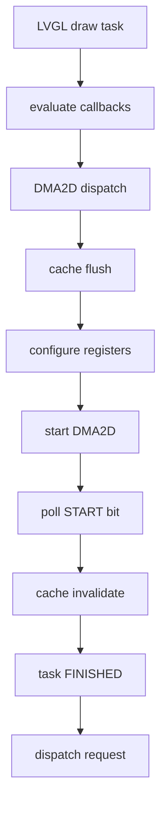

# LVGL DMA2D wait / CPU-DMA2D pipeline 审计

## 结论

最终状态：**PIPELINE NOT WORTH COMPLEXITY**。

本阶段只增加 `CARTDESK_RENDER_AUDIT_ENABLE` 下的 DMA2D 类型、等待和 region hazard 统计；没有打开 `LV_USE_DRAW_DMA2D_INTERRUPT`，没有修改 production draw ordering，也没有执行 SW draw overlap。目标板审计表明，Normal ARGB Launcher 中 draw-task 的同步等待约 80% 来自 ARGB `M2M_BLEND`，约 20% 来自 R2M fill；所有 DMA2D job 的下一 framebuffer 消费者都存在 region overlap 或帧尾 fence，没有可直接跳过的执行 fence。

Phase 4-A 只允许 overlap task preparation。把 bookkeeping、object traversal、cover check、task creation、descriptor init、style lookup、evaluate、dispatch、allocation 和 cleanup 全部视为可隐藏，绝对上限也只有 **2.2358 ms/frame**，低于 5 ms/frame 的复杂度收益门槛，因此未实现 pipeline。

## 基线与复测

平台为 STM32H743 480 MHz、FreeRTOS/CMSIS-RTOS2、LVGL 9.6.0、800×480 ARGB8888 DIRECT double framebuffer、LTDC + DMA2D + external SDRAM。

Phase 3 已提交为：

- `31c2103 test: 添加 LVGL 全渲染与 pre-clear 性能验证`
- `9895900 perf: 使用 DMA2D 加速 LVGL 脏区预清零`

历史验收基线为 57.0393 ms/frame、23.6834 ms/frame draw-task DMA2D wait、9.5862 ms/frame pre-clear。Phase 4 计数器加入后的同场景 14-frame audit 为 57.1199 ms/frame、23.6657 ms/frame draw-task DMA2D wait；差值属于重复运行波动。

独立 12-step timing trace：

| Metric | avg | p95 | p99 | max |
|---|---:|---:|---:|---:|
| Render | 57.7201 ms | 61.5709 ms | 61.5709 ms | 61.5709 ms |
| Presentation interval | 66.6722 ms | 67.9378 ms | 67.9378 ms | 67.9378 ms |

11 个 presentation intervals 中，1 个占 3 panel frames，10 个占 4 panel frames；actual presentation FPS 为约 15.0，render FPS equivalent 为 17.51–17.53。

## 当前调用链



确认位置：

- task finalize/evaluate/dispatch：`Core/APPS/LVGL/src/draw/lv_draw.c`
- DMA2D evaluate、dispatch、wait、completion：`Core/APPS/LVGL/src/draw/dma2d/lv_draw_dma2d.c`
- fill R2M / blend 配置：`Core/APPS/LVGL/src/draw/dma2d/lv_draw_dma2d_fill.c`
- image blend / PFC 配置：`Core/APPS/LVGL/src/draw/dma2d/lv_draw_dma2d_img.c`
- IRQ path：`Core/Src/stm32h7xx_it.c`
- debug-only 分类器：`Core/Debug/render_audit.c`

## LVGL 9.6 async contract

vendored LVGL 已有 async draw-unit contract：当 `LV_USE_DRAW_DMA2D_INTERRUPT && LV_USE_OS` 时，task 保持 `IN_PROGRESS`，DMA2D TC ISR 仅调用 `lv_thread_sync_signal_isr()`，owner context 的 `wait_finish_cb()` 等待 signal、invalidate cache、把 task 置为 `FINISHED`，随后 scheduler 重新 dispatch。

当前 production 配置 `Core/APPS/LVGL/lv_conf.h` 明确设置 `LV_USE_DRAW_DMA2D_INTERRUPT=0`，所以实际路径在 `dispatch_cb()` 内轮询 `DMA2D->CR & DMA2D_CR_START`。`DMA2D_IRQHandler()` 先交给 HAL 清硬件状态，仅在 TCIF 时通知 LVGL；IRQ priority 为 5，等于 `configLIBRARY_MAX_SYSCALL_INTERRUPT_PRIORITY=5`，允许当前 FreeRTOS ISR-safe signal 路径。

一个重要限制是：vendored async 分支启动 transfer 后返回 `LV_DRAW_UNIT_IDLE`。在当前 scheduler 中，如果没有其他 draw unit 同时取到 task，`lv_draw_dispatch()` 会立即调用 `lv_draw_wait_for_finish()`。因此仅把 interrupt 开关置 1 主要是把 busy poll 变成 RTOS wait，不自动形成“DMA2D running + app task prepare next task”的 pipeline；要实现 Phase 4-A 仍需 local scheduler/return-contract patch。

## Wait decomposition

以下是 14-frame Normal ARGB、+240 px、12 steps、20 px/frame 的目标板结果。`setup` 是 DMA2D register configuration；`active` 从 START 写入到硬件完成；`wait` 是 CPU 实际同步等待。

| DMA2D type | jobs/frame | pixels/frame | setup ms | active ms | wait ms | % draw-task wait |
|---|---:|---:|---:|---:|---:|---:|
| Pre-clear R2M | 1.857 | 280,054.9 | 0.0017 | 8.3184 | 8.3170 | 0%* |
| Fill R2M | 5.214 | 146,054.9 | 0.0038 | 4.7187 | 4.7121 | 19.91% |
| M2M_BLEND | 3.714 | 134,000.0 | 0.0025 | 18.9914 | 18.9724 | 80.17% |
| M2M_PFC | 0 | 0 | 0 | 0 | 0 | 0% |
| Other | 0 | 0 | 0 | 0 | 0 | 0% |

`*` Phase 3 的 23.68 ms “DMA2D wait”是 draw-task exclusive category，不含 pre-clear；pre-clear wait 被包含在独立的 pre-clear/draw-buffer-clear category 中。若按所有物理 DMA2D wait 相加，本次为 32.0015 ms/frame，不能再与 pre-clear category 相加。

## Dependency classification

分类器使用连续任务的实际 destination rectangles，并按下一任务是否读取 destination 区分 RAW；只按 task type 推断语义、不检查 region overlap 的结果不会被采用。Normal Launcher 资源 image source 位于 launcher cache，不指向 framebuffer，因此本场景 WAR 为 0。

14 帧统计：

| Dependency | count | overlap pixels | attributed wait |
|---|---:|---:|---:|
| Independent | 0 | 0 | 0 ms |
| RAW | 127 | 7,840,000 | 31.9983 ms/frame** |
| WAR | 0 | 0 | 0 ms |
| WAW | 139 | 7,840,768 | 32.0001 ms/frame** |
| Unknown / frame-end fence | 11 | — | 0.0012 ms/frame |

`**` blend pairs can be both RAW and WAW，故这两行不能相加。去重后的 hard wait 为 **32.0014 ms/frame**，region-independent hideable wait 为 **0 ms/frame**。稳定帧 queue depth max 为 2。

典型顺序为：

```text
pre-clear R2M -> rounded/background SW fill (RAW + WAW)
card R2M fill -> ARGB image blend (RAW + WAW)
ARGB image blend -> border/text/SW consumer (RAW + WAW)
last DMA2D job -> render/flush fence
```

因此不能并行两个 DMA2D job，也不能让后继 SW draw 越过当前 job。

## CPU overlap audit

| CPU work | Decision | Evidence |
|---|---|---|
| next task creation | SAFE TO OVERLAP | 创建 descriptor，不读写 framebuffer |
| draw-unit evaluate | SAFE TO OVERLAP | 只选择 draw unit / preference |
| descriptor preparation | SAFE TO OVERLAP | 只写 task-owned metadata |
| object traversal / style lookup | SAFE TO OVERLAP | 不消费 DMA2D destination |
| queue bookkeeping | SAFE TO OVERLAP | 不消费 framebuffer；仍需保持 task order |
| independent SW draw | DEPENDENCY BLOCKED | 连续 consumer 的 independent count 为 0 |
| cache work touching current destination | DEPENDENCY BLOCKED | DMA2D ownership与结果可见性要求 fence |
| unrelated cache work | NOT WORTH IT | 当前 trace 未出现足以形成 pipeline 的独立工作 |

task-preparation 理论上限 2.2358 ms/frame 是把上述所有安全类别完整相加得到的乐观上界；实际可隐藏量只会更小。Phase 4-B 的保守可执行 SW overlap 为 0。

## Correctness model

保留以下 invariant：

1. blend 的 BG==OUT；任何读 destination 的后继必须等待前一写完成。
2. 相交 destination 的 draw order 不改变。
3. `LV_EVENT_RENDER_READY`、flush submit 和 LTDC swap 不能早于本帧最后一个 DMA2D completion。
4. scene teardown / mode change 前必须 drain DMA2D。
5. DMA2D 仍由 LVGL/app display pipeline 单一拥有。

本阶段没有启用 async candidate，因此 production pixel output 与 Phase 3 完全相同。复测 fault=0、timeout=0、ownership violation=0、LTDC FIFO/transfer/other error=0、pre-clear TEIF/CEIF=0。Phase 3 已通过的 framebuffer exact、alpha<255、A8 recolor、text AA、rounded edge 和 self-test 结论保持有效；10k-frame async stress、generation matching、scene-exit drain 和 async pixel A/B 不适用，因为没有 async implementation。

## Pipeline result

| Mode | T_render | DMA2D draw wait | Hidden | Hazards blocked | FPS |
|---|---:|---:|---:|---:|---:|
| Sync baseline | 57.1199 ms | 23.6657 ms | 0 | — | 17.51 render / 15.0 actual |
| Prepare pipeline | 未实现 | — | theoretical <=2.2358 ms | 127 RAW / 139 WAW | — |
| SW overlap | 未实现 | — | 0 ms proven | all immediate consumers blocked | — |

即使乐观地隐藏全部 task preparation，`T_render` 也只能约到 54.88 ms，不可能达到 50 ms 第一目标，更不可能接近 40 ms。为不足 2.24 ms 的上限修改 LVGL scheduler return/dispatch contract 不值得。

## 30 个问题

1. 23.68 ms 来自什么？draw-task wait 约 4.7121 ms fill R2M + 18.9724 ms M2M_BLEND；重复运行总计 23.6657 ms。
2. pre-clear wait？8.3170 ms/frame，单独计入 pre-clear category。
3. fill wait？4.7121 ms/frame。
4. blend wait？18.9724 ms/frame。
5. PFC wait？0。
6. hard dependency？去重后所有 32.0014 ms/frame 物理 wait 都被相交 consumer 或帧尾 fence 阻塞。
7. 可隐藏？region-independent execution wait 为 0；只剩 task preparation。
8. 理论最大 hideable？Phase 4-A 乐观上限 2.2358 ms/frame。
9. CPU 可安全做什么？task create/evaluate、descriptor、traversal、style lookup、queue bookkeeping。
10. task preparation 可隐藏多少？不超过 2.2358 ms/frame。
11. SW draw 可安全 overlap 多少？当前顺序下为 0。
12. RAW hazard？127。
13. WAR hazard？0。
14. WAW hazard？139；可与 RAW 同时出现。
15. queue 最大深度？2。
16. LVGL 9.6 有 async contract？有。
17. 是否复用？未启用，因为仅开 interrupt 不会形成要求的 app-task preparation pipeline，local scheduler patch 的收益上限不足。
18. ISR 做什么？HAL 处理 flags；TCIF 时调用 LVGL ISR-safe sync signal。
19. ISR 调 LVGL API？没有调用 object/draw API，只调用 `lv_thread_sync_signal_isr()`。
20. generation 严格匹配？当前同步路径无 outstanding generation；async generation 未实现。
21. last complete 早于 flush？同步路径由 dispatch poll 和 render completion 顺序保证；14/14 reload、timeout/ownership error=0。
22. scene exit drain？同步路径退出 dispatch 前已完成；async drain 不适用。
23. pixel-perfect？production 未改变，沿用 Phase 3 PASS。
24. alpha<255？沿用 Phase 3 L5 PASS。
25. 10k stress？未运行；没有 async candidate。
26. 新 T_render？没有 production 新值；复测 sync 57.1199 ms，12-step timing avg 57.7201 ms。
27. presentation interval？avg 66.6722 ms，10/11 为 4 panel frames。
28. 净收益？0 ms/frame；未保留 pipeline。
29. complexity 值得？不值得，理论上限 <5 ms/frame。
30. 下一 P0？rounded SW fill（约 12.29 ms/frame）；保持单变量进入下一 phase。

## Check results

- HostTest 15/15 PASS。
- Debug、Release、SizeDebug、Debug-USB-SD-MSC、Debug-LTDC-Sync-Trace、SizeDebug-DMA2D-SelfTest、Debug-LTDC-Full-Render-Audit 构建 PASS（最终复验见提交记录）。
- target audit：fault=0、timeout=0、ownership=0、LTDC errors=0、pre-clear DMA errors=0。
- Release 不包含 audit global arrays 或 dependency matrix；计数 API 在 non-audit build 中为 inline no-op。

## 下一瓶颈

DMA2D draw wait 本身以 ARGB blend 为主，但当前每个 job 都被立即 consumer 的 RAW/WAW ordering 约束，不能通过简单 CPU/DMA2D pipeline 回收。下一 P0 是保持 XRGB/A8/LTDC/SDRAM 不变，单独处理 rounded SW fill。
