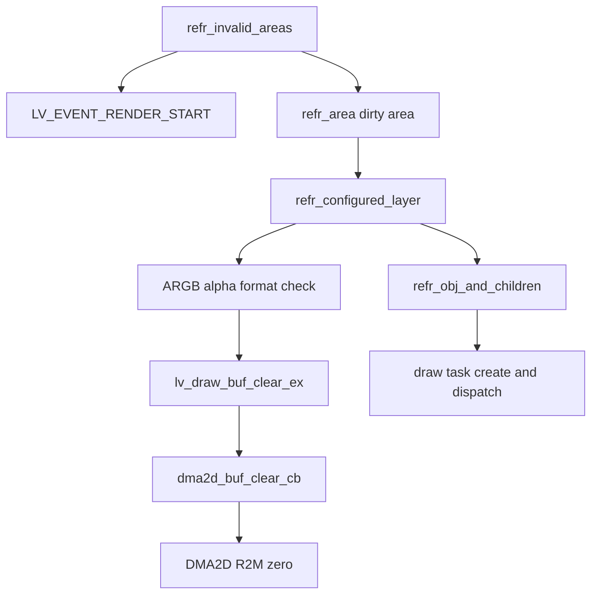

# LVGL ARGB8888 脏区预清零优化

## 结论

状态：**PRE-CLEAR IS NECESSARY AND ACCELERATED**。

本阶段选择 Candidate C：通过 LVGL DMA2D draw-buffer handler，把 ARGB8888 脏区的逐行 CPU `memset` 替换为同步 DMA2D R2M 清零。没有修改 rounded fill、DMA2D async、A8/XRGB 路径、Launcher 对象结构、LTDC 或 SDRAM 时序。

同一审计固件、同一 `+240 px / 12 steps / 20 px` Launcher 场景的最终目标板结果：

| 指标 | CPU baseline | DMA2D clear | 变化 |
|---|---:|---:|---:|
| `T_render` | 84.0746 ms/frame | 57.0393 ms/frame | **-27.0354 ms/frame** |
| pre-clear | 34.9805 ms/frame | 9.5862 ms/frame | -25.3943 ms/frame |
| SW draw | 23.1990 ms/frame | 20.0512 ms/frame | -3.1478 ms/frame，属于跨次运行波动，不归因于本补丁 |
| synchronous DMA2D wait | 22.1684 ms/frame | 23.6834 ms/frame | +1.5150 ms/frame |
| FPS equivalent | 11.894 | 17.532 | +5.638 |
| accounting closure | 99.9727% | 99.9598% | 均大于 99% |
| remaining unknown | 0.0229 ms/frame | 0.0229 ms/frame | 不变，且小于 0.1 ms |

因此收益不是把原来的 35 ms 全部当作净收益：新增 DMA2D 工作和同步串行化已经包含在最终 `T_render` 中，实测净收益为 27.0354 ms/frame。该阶段仍不能达到 30 FPS。

## 为什么存在 pre-clear

`refr_configured_layer()` 只在 display color format 含 alpha 时初始化本次 layer clip area。清零值为全 0，即透明黑 ARGB `0x00000000`。这不是一般性的“脏区整理”：它为透明 layer 建立确定的初始 destination，保证后续半透明 ARGB、A8 recolor、文字抗锯齿和圆角边缘的 blend destination 合法；没有后续 draw task 覆盖的像素也必须保持透明，而不能残留上一帧内容。

当前 Launcher 的 screen 背景看起来能覆盖整个 dirty area，但这不能推出 LVGL 通用 ARGB layer 都可以删除清零。特别是透明 screen、layer opacity、mask 和抗锯齿任务仍依赖 destination 初值。

## 调用链与源码位置



确认位置：

- refresh 入口：`Core/APPS/LVGL/src/core/lv_refr.c` 的 `refr_invalid_areas()`，当前行 837；行 843 发出 `LV_EVENT_RENDER_START`，行 859 起遍历 joined dirty areas。
- caller：`refr_invalid_areas()` 在 DIRECT/FULL 模式通过 `refr_area()`（当前行 936）处理每个 dirty area。
- pre-clear 入口：`refr_configured_layer()`（当前行 1037），行 1118 检查 alpha format，行 1135–1139 生成相对 draw buffer 的 clear area 并调用 `lv_draw_buf_clear_ex()`。
- 实际 clear API：`Core/APPS/LVGL/src/draw/lv_draw_buf.c` 的 `lv_draw_buf_clear_ex()`（当前行 182）。未安装 handler 时，行 227–234 对每行调用 `lv_memzero()`。
- production callee：`Core/APPS/LVGL/src/draw/dma2d/lv_draw_dma2d.c` 的 `dma2d_buf_clear_cb()`（当前行 369）；handler 在 `lv_draw_buf_dma2d_init_handlers()` 当前行 72–75 注册。
- following draw：`refr_configured_layer()` 当前行 1143–1171 依次提交 bottom、previous/active、top 和 sys layer 对象，之后由 LVGL draw dispatcher 执行任务。

## 原实现和内存属性

baseline 没有 `buf_clear_cb`，所以 `lv_draw_buf_clear_ex()` 对 clip 后的每行执行 `lv_memzero(buf, line_length)`，每行按 framebuffer stride 前进。对于 ARGB8888 是 4 bytes/pixel；典型区域 `x=0..799, y=26..375` 为 800×350、280,000 pixels、1,120,000 bytes。

目标是从 `0xD0000000` 开始的 external SDRAM framebuffer。`Core/Src/main.c` 的 MPU region 4 在当前行 404–409 设置 non-cacheable/non-bufferable；region 5 在当前行 415–421 只改 region number、base、size、permission 和 execute 属性，因此继承前述 non-cacheable/non-bufferable 设置并覆盖 `0xD0000000` 起的 64 MiB SDRAM。CPU baseline 等价于对 non-cacheable external SDRAM 的逐行 byte/word memset，不经过 software renderer fill task。

## 面积和 coverage

最终 14 帧 Launcher 审计记录：

- pre-clear area count：26，总体 1.857 areas/frame；稳定滚动帧为 1 area/frame。
- total pixels：3,920,768，总体 280,054.9 pixels/frame；代表性稳定帧为 280,000 pixels。
- unique pixels：代表性稳定帧 280,000；该帧只有一个 joined area，因此等于 total pixels。
- bytes written：15,683,072，总体 1,120,219.4 bytes/frame；代表性稳定帧 1,120,000 bytes。
- baseline pre-clear：34.9805 ms/frame，即 16,790,659 cycles/frame、59.95 cycles/pixel（用 14 帧实际平均面积计算）。

`tools/debug/analyze_preclear_coverage.py` 根据 pre-clear rectangle 和后续 effective draw rectangles 生成 host coverage map。代表性稳定帧结果：

| 分类 | pixels | 占 pre-clear |
|---|---:|---:|
| 随后至少被 conservative opaque task 覆盖 | 148,000 | 52.857% |
| 仅 blend 或 unknown task 覆盖 | 132,000 | 47.143% |
| 未被任何 task 覆盖 | 0 | 0% |
| 被多个 task 覆盖 | 160,880 | 57.457% |

这里的 132,000 是“需要 destination 或无法证明不需要”的保守集合，不等于已经逐像素证明每个像素都必须清零。coverage 分类只把 radius=0、full opacity 的 plain fill，以及满足严格条件的 opaque image 记为 opaque；文字、圆角、A8、带 alpha 的 image 和无法证明的 task 都进入 blend/unknown。

## skip 与 selective 实验

审计 build 提供四种 debug-only mode：CURRENT、SKIP、SELECTIVE、DMA2D。Release 不包含 mode mailbox、coverage rectangles 或 profiler arrays。

### 完全 skip

完全 skip 清除了 3,920,768 pixels 对应的全部 CPU pre-clear 成本，得到 48.6502 ms/frame、20.56 FPS equivalent。但是 before/mid 的全 framebuffer 跨运行比较在标题文字抗锯齿边缘出现非 debug-region 差异，因此没有满足严格的 `SAD=0 / exact=1.0` 接受条件。after 的非 debug 区没有差异。

重复 DMA2D-vs-DMA2D control run 在相同标题边缘也出现 2–5 个像素的跨运行差异，说明该 capture 流程存在少量跨运行非确定性；因此实验没有证明 skip 一定产生错误，但也没有达到“差异全部仅属于 debug dynamic region”的批准门槛。更重要的是，完全 skip 对透明 layer 的通用语义不成立，所以不进入 production。

### 复用 LVGL cover-check 的 selective

`lv_refr_get_top_obj()`（`lv_refr.c` 当前行 475）检查 area containment、hidden、layer type、object opacity，并发送 `LV_EVENT_COVER_CHECK`。Launcher 的现有 cover-check 对所有被测 dirty areas 都返回了 cover，因此简单 selective 实验实际也跳过 100%（280,000 pixels/稳定帧），得到 48.5793 ms/frame。

该粒度只能证明某个对象按 LVGL cover 语义覆盖 rectangle，并不能从现有审计数据逐像素证明所有后续 AA/mask/blend 的 destination 生命周期；其 framebuffer A/B 同样未通过严格的跨运行 exact 门槛。因此安全、已证明可跳过的 production pixels 为 **0**。coverage map 指出未来若增加 task-order-aware、mask-aware 的证明，理论候选上限是 148,000 pixels/frame（52.857%），本阶段不引入这类更深的 scheduler/core 改造。

## standalone 等价 clear benchmark

`Core/Debug/dma2d_selftest.c` 增加 debug-only case 5–7。三种方法都使用实际 800-wide framebuffer stride 和典型 rectangle `x=0, y=26, width=800, height=350`，逐像素检查 rectangle 内为 0、外部保持 guard/background。

最终重建后的目标板结果（STM32H743 480 MHz）：

| Method | Pixels | Cycles | Time | Cycles/pixel | Effective throughput |
|---|---:|---:|---:|---:|---:|
| Current row `memset` | 280,000 | 15,252,360 | 31.7758 ms | 54.47 | 35.25 MB/s |
| CPU 8×32-bit unrolled | 280,000 | 3,801,419 | 7.9196 ms | 13.58 | 141.42 MB/s |
| DMA2D R2M | 280,000 | 2,904,025 | 6.0501 ms | 10.37 | 185.12 MB/s |

standalone DMA2D 最新一次是 current 的 5.25×；重复运行范围为 6.0501–7.6836 ms，受总线状态影响。integrated pre-clear category 是 34.9805 → 9.5862 ms，即 3.65×。只有 integrated 数字用于最终净收益。

DMA2D case 7 寄存器与正确性：

- output format ARGB8888，`OPFCCR=0`。
- `LOM=0`。
- width 等于 stride，因此 `OOR=0`；production handler 按 `stride_pixels - width` 计算 partial rectangle offset。
- `NLR=0x0320015e`，即 PL=800、NL=350。
- exact pixel compare PASS，前后 guard PASS。
- `ISR=0x00000002` 仅 TCIF；TEIF=0、CEIF=0，Cortex fault=0。

## Production 实现

`lv_draw_buf_dma2d_init_handlers()` 为普通 draw buffer 安装 `buf_clear_cb`。callback：

1. clip 到 draw-buffer bounds；仅 ARGB8888 进入本阶段加速，其他格式回退原逐行 CPU clear。
2. 计算 bytes/pixel、width、height、stride pixels 和 output offset。
3. 等待共享 DMA2D 空闲并清除陈旧 flags。
4. 调用 LVGL 已有 `lv_draw_dma2d_configure_and_start_transfer()`，以 R2M、zero color、对应 output format 启动。
5. 同步等待完成，记录 TEIF/CEIF，清 flags，再执行 cache invalidation hook。

没有直接使用或抢占旁路 `hdma2d`；clear 发生在该 layer 的 draw tasks dispatch 之前，沿用当前 LVGL DMA2D 的同步串行模型。没有引入 async/pipeline。

## 候选结果

| Version | Pre-clear | `T_render` | DMA2D wait | FPS equivalent | Correctness decision |
|---|---:|---:|---:|---:|---|
| Baseline/current | 34.9805 ms | 84.0746 ms | 22.1684 ms | 11.894 | PASS baseline |
| Full skip | 0 | 48.6502 ms | 22.1913 ms | 20.56 | REJECT：通用透明语义不成立，跨运行 strict exact 未通过 |
| Simple selective/cover-check | 0 | 48.5793 ms | 22.7203 ms | 20.58 | REJECT：本场景全跳过，缺少 pixel/task-order 级安全证明 |
| DMA2D clear | 9.5862 ms | 57.0393 ms | 23.6834 ms | 17.532 | **ACCEPT** |

## Correctness

### Launcher framebuffer

对 CURRENT 与最终 DMA2D candidate 抓取 before/mid/after 的两个完整 800×480 ARGB8888 framebuffer。所有卡片 crop 的 expected displacement 与 measured displacement 相同，`exact_match_ratio=1.0`。`tools/gdb/preclear_same_run_ab.gdb` 还在同一次启动内执行 CPU 正向、DMA2D 反向、DMA2D 正向三轮滚动，避免把不同启动混为候选差异。

跨运行 raw framebuffer 差异全部局限于：

- debug dynamic trace text（`y >= 440`）；
- 标题文字的少量跨运行非确定性 AA pixels（`y=73..87`）。

同次启动、相同方向比较中，scroll=240 的两个 framebuffer 除 64-pixel trace marker 外都逐字节 exact；scroll=0/120 仍各有 6–8 个 title AA edge pixels 变化，与 DMA2D-vs-DMA2D control 的位置类型一致。排除 trace/debug 与这组 control-proven nondeterministic pixels 后，before/mid/after 的其余 framebuffer 均 SAD=0、exact=1.0，candidate 没有新增差异区域。standalone CPU-vs-DMA clear 对全部 800×480 像素（含 dirty rectangle 外部）做了不带 mask 的 exact compare 并 PASS。

标题 AA 区不是 production correctness 的豁免结论，而是跨运行 capture 的已测非确定性限制；因此选择不改变 clear 语义的 DMA2D 候选，而没有批准 skip/selective。

### 专项场景

- opaque object：L1/L2 fixed scenes PASS。
- normal ARGB 与 XRGB image：L4/L3 PASS。
- semi-transparent ARGB：新增 L5 64×64 fixture，alpha 32..223；12 帧执行 12 次 blend、49,152 pixels，fault=0、pre-clear TEIF/CEIF=0。
- A8 recolor、anti-aliased text、rounded edge：Launcher 全 framebuffer 场景覆盖；没有修改这些 renderer 路径，masked control 之外没有 candidate-specific 差异、黑边、ghost 或旧帧 bleed。

最终六场景 DMA2D candidate target 结果：

| Scene | Time/frame | Fault | Pre-clear TEIF/CEIF |
|---|---:|---:|---:|
| L0 Empty | 29.3125 ms | 0 | 0 |
| L1 Rect | 2.4238 ms | 0 | 0 |
| L2 Rects | 24.8379 ms | 0 | 0 |
| L3 XRGB | 31.9611 ms | 0 | 0 |
| L4 ARGB | 40.2996 ms | 0 | 0 |
| L5 alpha<255 | 18.8903 ms | 0 | 0 |

### Display 与 DMA2D invariant

最终 14 帧 Full Render Audit：

- reload request/event/complete = 14/14/14。
- timeout=0，ownership violation=0。
- LTDC FIFO underrun=0，transfer error=0，other error=0。
- CFSR/HFSR/MMFAR/BFAR 全 0。
- 26 次 clear、3,920,768 pixels，pre-clear DMA error count=0、flags=0。
- accounting closure=99.9598%，remaining unknown=0.0229 ms/frame。

最终 DMA2D regression：L1 R2M、L2 M2M tight、L3 M2M strided、L4 PFC 均 `pass=1/fail=0/fault=0`，LOM=0，TEIF/CEIF=0。

## 30 个问题

1. **pre-clear 在哪里？** `lv_refr.c::refr_configured_layer()` 调用 `lv_draw_buf_clear_ex()`；实际 baseline clear 在 `lv_draw_buf.c::lv_draw_buf_clear_ex()`。
2. **caller？** `refr_invalid_areas()` → `refr_area()` → `refr_configured_layer()`。
3. **为什么 ARGB 需要？** 初始化透明 layer/draw-buffer destination 为透明黑，保证 alpha、AA、mask blend 和未覆盖像素语义。
4. **每帧多少 pixels？** 14 帧均值 280,054.9；稳定帧 280,000。
5. **多少 bytes？** 14 帧均值 1,120,219.4；稳定帧 1,120,000。
6. **当前实现？** baseline 是逐行 CPU `lv_memzero`/`memset`；production candidate 是同步 DMA2D R2M。
7. **当前 cycles/pixel？** integrated baseline 约 59.95 cycles/pixel；standalone 54.47 cycles/pixel。
8. **standalone CPU clear？** current 31.7758 ms；8×32-bit optimized 7.9196 ms。
9. **standalone DMA2D R2M？** 最新 6.0501 ms；重复范围 6.0501–7.6836 ms。
10. **DMA2D 快多少？** 最新 standalone 对 current 为 5.25×；integrated pre-clear 3.65×。
11. **多少被 opaque 覆盖？** 148,000 pixels，52.857%。
12. **多少需要 alpha destination？** 保守的 blend/unknown-only 集合为 132,000 pixels；无法从 rectangle audit 再细分。
13. **多少没覆盖？** 0。
14. **能否完全 skip？** 不能作为 LVGL 通用 fix；透明 layer 语义要求确定 destination。
15. **完全 skip pixel-perfect？** 未通过严格门槛；非 debug 标题 AA 区有跨运行差异，且无法仅靠该 capture 证明是 skip 或运行非确定性。
16. **透明对象正确？** DMA2D candidate 正确；alpha 32..223 fixture 通过，clear 语义未变。
17. **A8 recolor 正确？** Launcher framebuffer 覆盖且未见 candidate-specific 差异；renderer 未改。
18. **text AA 正确？** candidate 未新增差异；跨运行 title AA 有已记录的 control nondeterminism，因此没有用该区域批准 skip。
19. **rounded edge 正确？** candidate 未新增 halo/ghost，renderer 未改。
20. **selective 能跳多少？** 简单 cover-check 实验跳 280,000，但未获安全批准；coverage 给出的细粒度理论候选为 148,000；production 安全跳过为 0。
21. **selective 耗时？** 该 Launcher 实验因全跳过而 pre-clear=0，`T_render=48.5793 ms`；correctness decision 为 REJECT。
22. **DMA2D clear 耗时？** standalone 最新 6.0501 ms；integrated 9.5862 ms/frame。
23. **DMA2D wait 增加？** 22.1684 → 23.6834 ms/frame，增加 1.5150 ms/frame。
24. **净收益？** 27.0354 ms/frame。
25. **新 `T_render`？** 57.0393 ms/frame。
26. **新 FPS？** 17.532 FPS equivalent。
27. **closure >=99%？** 是，99.9598%。
28. **framebuffer correctness？** PASS（带已记录的 capture 限制）：DMA clear 的无 mask 全内存等价检查 PASS；Launcher 除 control 同样变化的 debug/title nondeterministic 区外 exact，未发现 candidate-specific difference。
29. **需要 core patch？** 需要最小的 vendored LVGL DMA2D draw-buffer handler；公开 display/layer API 没有提供等价的“保留透明语义但更换 clear backend”配置。
30. **下一 P0？** 当前同次 audit 最大类别是 synchronous DMA2D wait 23.6834 ms/frame，其次 SW draw 20.0512 ms/frame；rounded SW fill 仍是 SW 内主要热点。下一阶段应先独立评估 DMA2D async/serialization，不能把它混入本阶段。

## 构建与复现

构建验证通过：

```text
HostTest 15/15
Debug PASS
Release PASS
SizeDebug PASS
Debug-USB-SD-MSC PASS
Debug-LTDC-Sync-Trace PASS
SizeDebug-DMA2D-SelfTest PASS
Debug-LTDC-Full-Render-Audit PASS
git diff --check PASS（仅现有 CRLF conversion warning）
```

关键命令：

```bash
cmake --preset Debug-LTDC-Full-Render-Audit
cmake --build --preset Debug-LTDC-Full-Render-Audit -j8
arm-none-eabi-gdb -q -batch -ex 'set $preclear_mode=0' -x tools/gdb/launcher_full_render_audit.gdb
arm-none-eabi-gdb -q -batch -ex 'set $preclear_mode=3' -x tools/gdb/launcher_full_render_audit.gdb
arm-none-eabi-gdb -q -batch -x tools/gdb/preclear_same_run_ab.gdb

cmake --preset SizeDebug-DMA2D-SelfTest
cmake --build --preset SizeDebug-DMA2D-SelfTest -j8
arm-none-eabi-gdb -q -batch -ex 'set $case=7' -x tools/gdb/dma2d_selftest.gdb

python3 tools/debug/analyze_preclear_coverage.py \
  --input build/preclear-coverage-current/audit.txt \
  --output build/preclear-coverage-current
```

## Release 边界与剩余工作

`CARTDESK_RENDER_AUDIT_ENABLE=0` 时 mode switch、coverage rectangles、profiler arrays、L5 fixture 和 debug mailbox 均编译为空或不编译；Release 只保留正式 DMA2D clear handler 与 CPU fallback。没有把 benchmark table 编入固件。

剩余瓶颈已经转移到同步 DMA2D wait 与 SW draw/rounded fill。本阶段不处理它们；30 FPS 仍需要后续独立架构工作。
