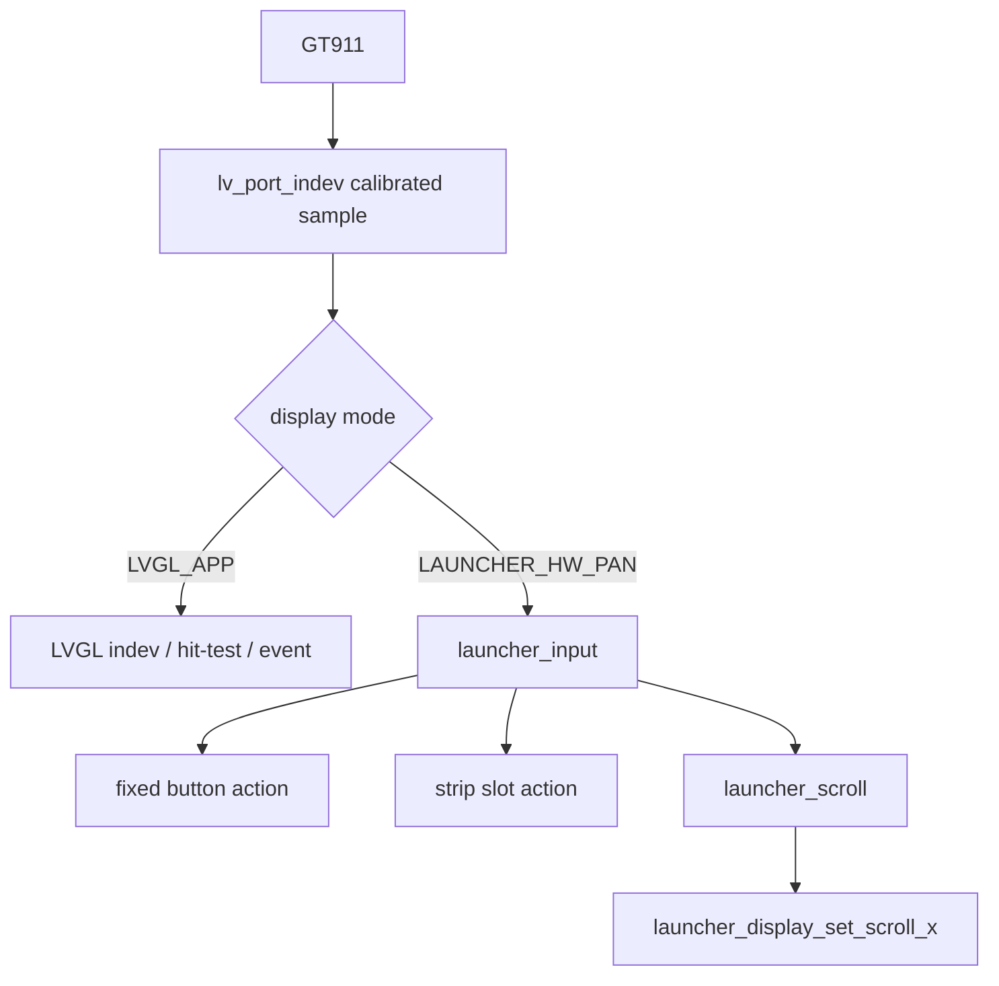

# Launcher Hardware-Pan Input Router

## 输入所有权

Launcher 的两个稳定显示模式使用不同的 pointer owner：

`Core/APPS/LVGL/port/lv_port_indev.c` 在原 LVGL read callback 内保存最近一次已经
完成 swap / invert / clamp 的坐标和触点数。`launcher_input` 只读取这份采样，不再次
变换坐标，也不直接访问 GT911。`DISPLAY_MODE_TO_LAUNCHER_HW_PAN` 和
`DISPLAY_MODE_TO_LVGL_APP` 都不接受 Launcher action；跨模式仍保持按下的手势会被
取消，必须完全释放后才能开始新手势。

Lua App 仍使用 `GT911 -> lv_port_indev -> LVGL`，`launcher_input` 在
`DISPLAY_MODE_LVGL_APP` 下不消费 Lua pointer。

## 命中坐标

几何在 Launcher 对象创建和 layout 完成后快照一次：

- 5 个固定圆按钮从 `s_circles[]` 的 LVGL object coords 推导圆心和半径，并使用
  screen-space 圆形命中；固定按钮优先于 strip。
- 12 个 slot 从 `s_slots[]` 的初始 object coords 推导 strip-space rect，不在平移时
  查询 LVGL screen coords，也没有第二份 slot 坐标表。
- strip 命中只在真实可见窗口内执行；坐标公式为
  `content_x = screen_x + s_logical_scroll_x`、
  `content_y = screen_y - viewport_y`。
- `s_logical_scroll_x` 仍由 `launcher_scroll` 控制，并通过原 apply callback 交给
  `launcher_display_set_scroll_x()`；没有从 LTDC CFBAR 反推位置。

## 手势仲裁

状态为 `IDLE / PRESSED / DRAGGING / CANCELLED`。press 时锁定 target；移动达到
`LAUNCHER_SCROLL_DIRECTION_LIMIT`（10 px，和现有 Launcher/LVGL scroll limit
一致）后永久锁存 drag，本序列不再产生 click。release 只有在单指、未 drag、未
cancel 且 press/release 命中同一 target 时触发一次 action。重复 release 被 idle
状态忽略；出现第二触点后保持 cancelled，直到所有触点释放。

固定按钮上的移动只取消按钮 tap，不会接管为 strip drag。slot 或 strip 空白区域
发起的 drag 继续使用 `launcher_scroll` 的既有惯性、边界和吸附逻辑；视觉位置仍只
通过 LTDC CFBAR 硬件平移更新。

## 选择视觉现状

路由器复用原 slot / circle 业务 action，所以 selected index、二次点击启动和按钮
选择语义已经统一。硬件平移 steady state 仍关闭 LVGL invalidation，当前 cached
strip / Layer0 不会因这些 LVGL style 变化自动重建；因此选择框、标题和圆按钮持久
选中态的缓存内局部更新仍待实现。本改动没有为此重新开启整帧 LVGL render，也没有
在点击时重建完整 2660×350 strip。

## 回归检查

`tests/host/launcher_input_test.c` 覆盖固定按钮中心/边缘、多个 scroll position 的
slot 映射、屏幕与 strip 边界、tap、微小抖动、drag 抑制、跨 target release、按钮
drag-out、多点取消、重复 release、模式 gate 和 10k action stress。
