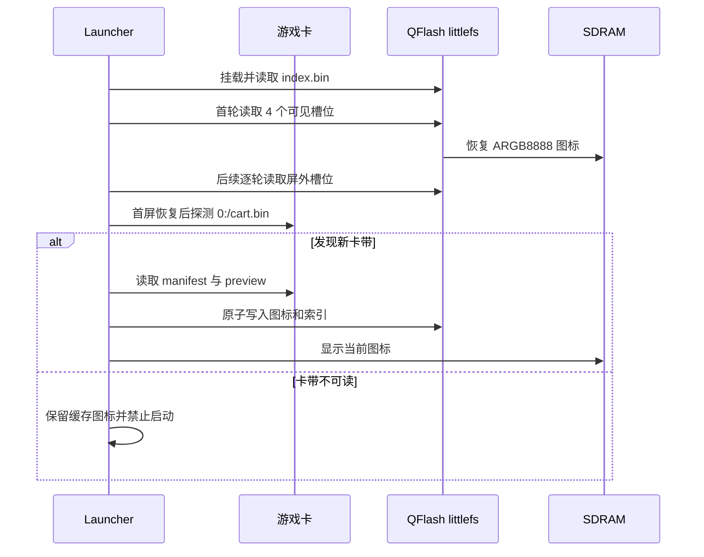

# Launcher 卡带图标缓存

Launcher 会把已插入卡带的元数据和预览图保存到 QFlash littlefs。卡带拔出后，
对应卡槽、标题和图标继续显示；只有当前实际插入的卡带可以启动。

## 存储内容

littlefs 中使用以下文件：

| 路径 | 内容 |
| --- | --- |
| `/launcher/index.bin` | 最多 12 个卡带记录、版本、代次和 CRC32 |
| `/launcher/<cart-id>-<icon-crc>.argb` | 160 × 120、ARGB8888 预览图 |

每个图标固定占用 `160 × 120 × 4 = 76,800` 字节，不包含 littlefs 元数据和
磨损均衡开销。当前 Launcher 最多保留 12 个卡槽，因此图标原始数据最多约
900 KiB。

记录包含 `cart_id`、标题、中英文标题、发行方、版本、入口、最低固件版本、
卡带文件大小以及图标大小和 CRC32。索引和图标都不保存可执行脚本或其他卡带
资源。

## 运行流程

当前板级 `BSP_SD_IsDetected()` 不能可靠区分卡带是否插入，因此 Launcher 使用
`0:/cart.bin` 的实际读取结果作为卡带状态，并以 1 秒为周期探测。读取失败时会
使 FatFs 挂载失效，使下一次探测可以重新挂载刚插入的卡带。

启动时先批量恢复屏幕内可见的前 4 个槽位，其余槽位每轮恢复一个。首次 SD
探测延后 150 ms，避免 FatFs 挂载或无卡超时阻塞首屏图标。图标和索引 CRC32
使用 STM32 CRC 外设计算，算法仍为 IEEE CRC32，与已有缓存格式兼容。

## 一致性与 QFlash 映射

- 图标文件名包含图标 CRC。新图标先写入临时文件，再重命名为最终文件。
- 索引同样通过临时文件、同步和重命名更新，并带有整表 CRC32。
- 索引提交失败时会恢复内存中的旧记录；旧索引仍然引用旧图标。
- LittleFS 仅在挂载返回 `LFS_ERR_CORRUPT` 时格式化；总线或 I/O 错误不会触发
  格式化。
- LittleFS 操作使用间接 QSPI 读写。每次操作结束都会恢复 Memory-Mapped
  模式，保证位于 QFlash 前 16 MiB 的系统字体可以继续读取。

## 手动验证

1. 启动到 Launcher，插入包含合法 `0:/cart.bin` 的卡带。
2. 等待标题和图标出现；Launcher 底部不显示卡带缓存提示。
3. 拔出卡带，确认底部不显示拔卡提示。
4. 确认图标和信息弹窗仍可查看，同时启动操作不可用。
5. 复位设备且保持卡带拔出，确认缓存图标会从 QFlash 恢复。
6. 插入另一张卡带，确认它进入新的空卡槽；重新插入旧卡带时回到原卡槽。
