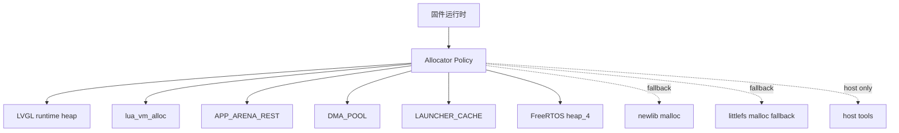

# Allocator Policy（Phase 9）

> 目标：管控 newlib / FreeRTOS / littlefs / RNG 等残余分配入口，避免 fallback allocator 变成固件业务主路径。本文只描述当前源码已确认的实现，不改变 SDRAM 主布局和既有 owner 模型。

## 系统总览

- `LVGL runtime heap`：位于片内 RAM，仅用于 LVGL 元数据、小对象、style、event、label text、descriptor 等。
- `lua_vm_alloc`：Lua VM 主 allocator，入口为 `lua_vm_newstate()`，内部调用 `lua_newstate(lua_vm_alloc, lua_vm_memory_allocator())`。
- `APP_ARENA_REST`：cart / scene / resource 主资源区，`RESOURCE_ARENA` 默认 owner 为 `resource_manager`。
- `DMA_POOL`：临时 DMA buffer 专用，不作为通用 heap。
- `LAUNCHER_CACHE`：launcher 图标缓存和相关像素缓存。
- `FreeRTOS heap_4`：仅用于 RTOS 对象、任务、队列、timer、同步原语和 CMSIS-RTOS2 包装层动态对象。
- `newlib malloc`：fallback only，保留 `_sbrk`，固件业务源码不得直接调用。
- `littlefs malloc fallback`：fallback only；正常挂载路径应优先使用 cold pool 提供的 read/prog/lookahead buffer。
- `host tools`：`tools/` 下 PC 侧工具不受固件 allocator policy 约束。

## Allocator 分类表

| Allocator | 所属区域 / 后端 | 允许用途 | 禁止用途 | 运行时状态 |
|---|---|---|---|---|
| LVGL runtime heap | 片内 RAM | LVGL 元数据、小对象 | 大图像、像素 buffer、DMA buffer | 固件运行时 |
| `lua_vm_alloc` | Lua heap / APP_ARENA_REST 子区 | Lua VM 创建与 Lua 对象 | `luaL_newstate()` 默认 allocator | 固件运行时 |
| `app_arena` / `RESOURCE_ARENA` | APP_ARENA_REST | cart / scene / resource / image scratch | 非 owner 直接管理 `RESOURCE_ARENA` | 固件运行时 |
| `SDRAM_DmaPoolAlloc` | DMA_POOL | 临时 DMA buffer | 通用 CPU 临时内存、RNG scratch、大图像 | 固件运行时 |
| LAUNCHER_CACHE | SDRAM launcher cache zone | launcher 图标缓存 | 通用 heap | 固件运行时 |
| `pvPortMalloc` / `vPortFree` | FreeRTOS heap_4 | RTOS 内核对象和 CMSIS-RTOS2 动态对象 | 游戏资源、图片、Lua、LVGL 大对象、DMA buffer | 固件运行时 |
| `malloc` / `calloc` / `realloc` / `free` | newlib C heap / `_sbrk` | fallback only，少量 C 库后端 | 固件业务模块直接使用 | fallback |
| `lfs_malloc` / `lfs_free` | littlefs fallback | littlefs 未提供 buffer 时兜底 | 正常文件系统路径依赖 fallback | fallback |
| 第三方内部 allocator | LVGL / Lua / HAL / FatFs / FreeRTOS 等源码内部 | 第三方库内部实现 | 固件业务绕过 policy 直接使用 | 受库边界限制 |
| host allocator | `tools/`、packer、host tests | PC 侧工具 | 固件构建路径 | host only |

## 禁止规则

- 固件业务模块不得直接调用 `malloc/free/calloc/realloc`。
- DMA buffer 不得来自 newlib malloc。
- 大图像、Lua cart 图片、解码后像素资源不得来自 newlib malloc 或 LVGL runtime heap。
- Lua VM 不得通过 `luaL_newstate()` 创建。
- LVGL 大像素 buffer 不得使用 LVGL runtime heap。
- `resource_manager` 以外模块不得直接 claim 或管理 `RESOURCE_ARENA`。
- fallback allocator 不得静默成为业务主路径。

## 残余 allocator 审查表

| 文件路径 | 函数名 | allocator | 当前用途 | 是否在固件运行时 | 是否允许保留 | 建议处理方式 | 风险 |
|---|---|---|---|---|---|---|---|
| `Core/Src/sysmem.c` | `_sbrk` | newlib heap backend | C 库 / malloc fallback 后端 | 是 | 是 | 保留为 fallback，禁止业务直接 malloc | LOW |
| `Core/Driver/RNG/rng_port.c` | `RNG_Shuffle` | 栈 scratch | 小元素 Fisher-Yates 交换缓冲 | 是 | 是 | 已移除 `malloc/free`，大元素改用 caller scratch API | LOW |
| `Core/Driver/RNG/rng_port.c` | `RNG_ShuffleWithScratch` | caller buffer | 大元素或显式 scratch 洗牌 | 是 | 是 | 调用方提供 scratch，不接入 APP_ARENA_REST / DMA_POOL | LOW |
| `Core/Driver/FLASH/lfs_util.h` | `lfs_malloc` | newlib fallback | littlefs 未提供 buffer 时分配缓存 | 是 | 是 | 保留 fallback，增加 `lfs_malloc_fallback_count` | MEDIUM |
| `Core/Driver/FLASH/lfs_util.h` | `lfs_free` | newlib fallback | littlefs fallback 缓存释放 | 是 | 是 | 保留 fallback，增加 `lfs_free_fallback_count` | MEDIUM |
| `Core/Driver/FLASH/lfs_port.c` | `lfs_cold_buffers_init` | `cold_calloc` | read/prog/lookahead 固定缓存 | 是 | 是 | 正常路径继续使用 cold pool | LOW |
| `Core/Driver/SDRAM/sdram_cold_pool.c` | `cold_alloc` / `cold_calloc` | COLD_POOL | cold pool 线性分配 | 是 | 是 | 保留，不改变子区模型 | LOW |
| `Core/Src/freertos_heap.c` | `ucHeap` | FreeRTOS heap_4 backing store | 96 KiB RTOS heap，`.ram_runtime` | 是 | 是 | 仅供 RTOS 对象使用 | LOW |
| `Middlewares/Third_Party/FreeRTOS/Source/portable/MemMang/heap_4.c` | `pvPortMalloc` / `vPortFree` | FreeRTOS heap_4 | RTOS 动态分配实现 | 是 | 是 | 保留 heap_4，不替换 | LOW |
| `Middlewares/Third_Party/FreeRTOS/Source/*.c` | 多处 | `pvPortMalloc` / `vPortFree` | task / queue / timer / event group / CMSIS wrapper | 是 | 是 | 第三方 RTOS 内部允许 | LOW |
| `Core/Src/lua_vm_memory.c` | `lua_vm_newstate` | `lua_newstate(lua_vm_alloc, ...)` | Lua VM 主入口 | 是 | 是 | 保持主路径，Debug 检查禁止业务直接 `luaL_newstate` | LOW |
| `Core/LuaPort/src/lauxlib.c` | `luaL_newstate` | Lua 默认 `l_alloc` | Lua 官方源码实现 | 作为库源码存在 | 是 | 仅允许源码内存在，不作为固件主路径 | LOW |
| `Core/LuaPort/src/lstate.c` | `lua_newstate` | Lua allocator hook | Lua 官方 VM 创建实现 | 作为库源码存在 | 是 | 业务入口必须经 `lua_vm_newstate()` | LOW |
| `Core/APPS/LVGL/src/**` | 多处 | `lv_malloc` / `lv_free` / `lv_realloc` | LVGL 内部对象和第三方组件 | 是 | 是 | 第三方内部保留；大像素 buffer 由项目 policy 禁止进入 LVGL heap | MEDIUM |
| `Core/APPS/LVGL/src/stdlib/clib/lv_mem_core_clib.c` | LVGL clib backend | `malloc` / `realloc` / `free` | LVGL 可选 C library backend | 取决于 LVGL 配置 | 是 | 第三方可选实现保留，不作为本项目主策略 | MEDIUM |
| `Core/APPS/LVGL/src/drivers/libinput/**`、`Core/APPS/LVGL/src/drivers/opengles/glad/**` | 多处 | `malloc` / `realloc` / `free` | LVGL host/Linux/OpenGL 驱动源码 | 非板级主路径 | 是 | 第三方源码保留，allocator 检查排除 | LOW |
| `tools/luavm/main.c` | `luavm_alloc` / `luavm_newstate` | host `realloc/free` | PC 侧 Lua bytecode 工具 | 否 | 是 | host-only 排除固件检查 | LOW |
| `CMakeLists.txt` | source list | `heap_4.c` | 选择 FreeRTOS heap_4 | 构建配置 | 是 | 保留 | LOW |
| `Core/Inc/FreeRTOSConfig.h` | 配置宏 | `configTOTAL_HEAP_SIZE` | FreeRTOS heap 96 KiB | 是 | 是 | 文档记录用途，禁止业务资源使用 | LOW |
| `cartdesk-os.ioc` | CubeMX 配置 | `configTOTAL_HEAP_SIZE` | CubeMX 中的 FreeRTOS heap 配置 | 配置文件 | 是 | 与 `FreeRTOSConfig.h` 保持一致 | LOW |
| `Docs/**` | 文档段落 | 多个 allocator 名称 | allocator policy 和阶段记录 | 否 | 是 | 仅文档说明 | LOW |
| `FATFS/**` | 注释 | `ff_memalloc` / `ff_memfree` 字样 | FatFs 配置说明 | 否 | 是 | 注释，不触发固件检查 | LOW |

## newlib malloc 管控

`cmake/check_allocator_usage.cmake` 在 Debug 构建中通过 `check_allocator_usage` 目标执行。检查范围覆盖固件业务源码路径，包括 `Core/Src`、`Core/Inc`、`Core/Driver`、`Core/LuaPort`、`Core/Cart`、`Core/Memory`、`Core/APPS/TASK`、`Core/Screen`、`Drivers` 和 FatFs app/target。

白名单 / 排除项：

- `Core/Src/sysmem.c`：保留 `_sbrk` 作为 newlib fallback 后端。
- `Core/Driver/FLASH/lfs.c`、`lfs_util.c`、`lfs_util.h`：littlefs 第三方源码和 fallback 包装。
- `Core/LuaPort/src`：Lua 官方源码。
- `Core/APPS/LVGL`：LVGL 第三方源码。
- `Drivers/CMSIS`、`Drivers/STM32H7xx_HAL_Driver`、`Middlewares/Third_Party`：第三方库。
- `tools/`、`build/`：host tools 和生成产物。

如果固件业务源码出现直接 `malloc/calloc/realloc/free`，Debug 构建会失败并输出文件路径与行号。极少数例外可以在源码行添加 `XHGC_ALLOCATOR_ALLOW_NEWLIB` 并写明原因，但默认不应使用。

## littlefs fallback

`Core/Driver/FLASH/lfs_port.c` 已为 `g_cfg.read_buffer`、`g_cfg.prog_buffer` 和 `g_cfg.lookahead_buffer` 绑定 cold pool buffer，正常挂载路径不应依赖 `lfs_malloc`。

`Core/Driver/FLASH/lfs_util.h` 中的 fallback 保留，并增加计数器：

- `lfs_malloc_fallback_count`
- `lfs_free_fallback_count`

这两个计数器用于 Debug / bring-up 观察 fallback 是否被触发。若正常文件系统路径持续增长，应优先检查是否有文件对象未提供 cache buffer，不能把 fallback 当作常规分配路径。

## FreeRTOS heap_4

`Core/Inc/FreeRTOSConfig.h` 确认：

- `configSUPPORT_DYNAMIC_ALLOCATION = 1`
- `configTOTAL_HEAP_SIZE = 96 KiB`
- `configAPPLICATION_ALLOCATED_HEAP = 1`

`Core/Src/freertos_heap.c` 定义 `ucHeap[configTOTAL_HEAP_SIZE]`，位于 `.ram_runtime` 并 32 字节对齐。`Middlewares/Third_Party/FreeRTOS/Source/portable/MemMang/heap_4.c` 提供 `pvPortMalloc` / `vPortFree`。

允许用途：任务、队列、timer、event group、semaphore、mutex、CMSIS-RTOS2 memory pool 等 RTOS 对象。可通过 FreeRTOS heap stats API（例如 `xPortGetFreeHeapSize()` 和 `xPortGetMinimumEverFreeHeapSize()`）观察余量。

禁止用途：游戏资源、图片、Lua VM、LVGL 大对象、DMA buffer。

## host tools

`tools/luavm/main.c` 使用 host `realloc/free` 创建 PC 侧 Lua VM，仅用于 packer / host utility，不进入固件 allocator 检查。若未来共享源码给固件构建，必须保证 host allocator 不被固件路径编译使用。

## 文档与实现差异

- 未发现文档声称 newlib malloc 可作为业务主路径。
- `RNG_Shuffle` 历史实现曾直接使用 `malloc/free`；Phase 9 已改为小栈 scratch + caller scratch API。
- littlefs 文档和源码均允许未提供 buffer 时回退 `lfs_malloc`；本项目 port 已提供 cold pool buffer，因此 fallback 是保留兜底，不是正常路径。

## 参考文件

- `CMakeLists.txt`
- `cmake/check_allocator_usage.cmake`
- `cmake/check_lua_allocator_usage.cmake`
- `Core/Src/sysmem.c`
- `Core/Src/freertos_heap.c`
- `Core/Inc/FreeRTOSConfig.h`
- `Core/Src/lua_vm_memory.c`
- `Core/LuaPort/src/lauxlib.c`
- `Core/Driver/RNG/rng_port.c`
- `Core/Driver/RNG/rng_port.h`
- `Core/Driver/FLASH/lfs_port.c`
- `Core/Driver/FLASH/lfs_util.h`
- `Core/Driver/FLASH/lfs_util.c`
- `Core/Driver/SDRAM/sdram_cold_pool.c`
- `Middlewares/Third_Party/FreeRTOS/Source/portable/MemMang/heap_4.c`
- `tools/luavm/main.c`

## 检查结果

- `cmake/check_allocator_usage.cmake`：已通过，输出 `Allocator usage check passed`。
- `cmake/check_lua_allocator_usage.cmake`：已通过，输出 `Lua allocator entry usage check passed`。
