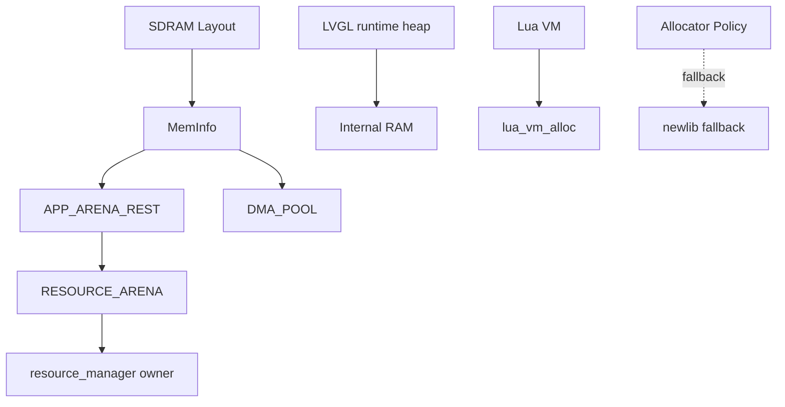

# Memory System 回归验收清单

## 概述

本文是 Phase 1~9 后的 Memory System 验收与回归清单，用于核验 SDRAM layout、meminfo、LVGL runtime heap、Lua allocator、APP_ARENA_REST、RESOURCE_ARENA、DMA_POOL 和残余 allocator policy 是否与当前实现和文档一致。本文不是新功能设计，不要求继续重构 allocator，也不要求迁移内存区域。

## 验收总览表

| 子系统 | 验收目标 | 自动检查方式 | 实机检查方式 | 当前状态 |
|---|---|---|---|---|
| SDRAM layout | 固定分区 base/size/end、紧贴、不重叠、不越界、对齐 | `xhgc_mem_layout_validate()`；`cmake --build --preset Debug` | 启动日志 `[XHGC SDRAM LAYOUT]` | PASS |
| meminfo | zone/tag used/peak/fail、framebuffer fixed reserve、dump 输出 | `xhgc_meminfo_init()`；`Debug-MemInfo-SelfTest` | 启动日志 `[XHGC MEMINFO]`；自测日志 PASS/FAIL | PASS |
| LVGL runtime heap | runtime heap 固定片内 RAM，`SDRAM_LVGL_HEAP` reserved/future-use | `lv_conf.h` 配置审查；`SDRAM_LVGL_HEAP used=0` | 长时间 UI 运行无撕裂/HardFault | 代码 PASS，实机未验证 |
| Lua allocator | 固件主路径经 `lua_vm_newstate()` + `lua_vm_alloc()`，误用被 Debug 检查拦截 | `cmake/check_lua_allocator_usage.cmake`；CodeGraph callers/callees | cart 加载、OOM 日志观察 | PASS |
| APP_ARENA_REST | 线性分配/reset；meminfo used reset 回基线，peak/fail 保留 | `Debug-MemInfo-SelfTest` | scene reset 后 used 回基线 | 代码 PASS，实机未验证 |
| RESOURCE_ARENA owner | 默认 owner 为 `resource_manager`，防双 owner；cart cache 默认 disabled | `resource_arena_owner_selftest()`；preset 宏审查 | 加载/卸载 cart 后 handle 失效 | PASS |
| DMA_POOL | zone table 驱动的 bump/reset allocator，64-byte 以上对齐，越界 NULL | `Debug-DmaPool-SelfTest` | 临时 DMA buffer 压测 | PASS |
| residual allocator policy | 业务源码禁用直接 newlib allocator；FreeRTOS/littlefs/RNG 边界清晰 | `cmake/check_allocator_usage.cmake`；Debug 构建 | 文件系统/RNG/RTOS 长跑观察 | PASS |
| CLion / CMake Presets | Debug/Release 默认 OFF，自测与实验 preset 独立 | `cmake --list-presets`；preset configure/build | CLion 从 `CMakePresets.json` 导入 | PASS |

## Mermaid 总览图

实线关系由当前源码确认；虚线关系表示 fallback 策略，不是默认业务主路径。

## 启动验收

| 项目 | 期望 | 证据 | 当前状态 |
|---|---|---|---|
| SDRAM init | `SDRAM_Init()` 在 layout/meminfo 前完成 | `Core/Src/main.c` | PASS |
| layout validate | 启动调用 `xhgc_mem_layout_validate()`，失败进入 `Error_Handler()` | `Core/Src/main.c`、`Core/Memory/xhgc_memory_layout.c` | PASS |
| meminfo init | layout validate 后调用 `xhgc_meminfo_init()` | `Core/Src/main.c`、`Core/Memory/xhgc_meminfo.c` | PASS |
| LVGL heap location | `LV_MEM_ADR=0U`，内建静态池，未绑定 SDRAM_LVGL_HEAP | `Core/APPS/LVGL/lv_conf.h` | PASS |
| framebuffer reserve | 三块 framebuffer 初始化 fixed reserve，总计 `0x00465000` | `Core/Memory/xhgc_meminfo.c` | PASS |
| 启动日志 | dump layout 后 dump meminfo | `Core/Src/main.c` | 代码 PASS，实机未验证 |

## 内存分区验收

| zone | base | size | exclusive end | 状态 | 对齐 | 当前状态 |
|---|---:|---:|---:|---|---|---|
| Layer1_FB0 | `0xD0000000` | `0x00177000` | `0xD0177000` | fixed framebuffer | 256-byte | PASS |
| Layer1_FB1 | `0xD0177000` | `0x00177000` | `0xD02EE000` | fixed framebuffer | 256-byte | PASS |
| Layer2_FB0 | `0xD02EE000` | `0x00177000` | `0xD0465000` | fixed framebuffer | 256-byte | PASS |
| SDRAM_LVGL_HEAP | `0xD0465000` | `0x01000000` | `0xD1465000` | reserved/future-use | 32-byte | PASS |
| DMA_POOL | `0xD1465000` | `0x00400000` | `0xD1865000` | temporary DMA buffer | 64-byte | PASS |
| LAUNCHER_CACHE | `0xD1865000` | `0x00400000` | `0xD1C65000` | fixed cache zone | 32-byte | PASS |
| APP_ARENA_REST | `0xD1C65000` | `0x0239B000` | `0xD4000000` | arena zone | 32-byte | PASS |

全局 SDRAM base 为 `0xD0000000`，size 为 `0x04000000`，exclusive end 为 `0xD4000000`。当前 zone table 顺序紧贴、不重叠、不越界；`xhgc_mem_layout_validate()` 同时检查 zone id、base/size/end、紧贴关系和对齐。

## 运行时验收

| 场景 | 自动/代码检查 | 实机检查 | 当前状态 |
|---|---|---|---|
| launcher 启动 | `Debug` preset 构建通过，启动路径包含 layout/meminfo dump | 进入 launcher，无 HardFault | 未验证 |
| 页面切换 | 禁止使用 LVGL runtime heap 承载大图像 | 切换页面无撕裂，meminfo used 不单调增长 | 未验证 |
| Lua cart 加载 | `lua_rt_init_state()` 调用 `lua_vm_newstate()` | cart 正常运行，OOM 有受控日志 | 未验证 |
| scene reset | `resource_manager` 使用 `app_arena_reset()` | reset 后旧 resource handle 失效 | 未验证 |
| resource handle 失效 | `res_scene_reset()` bump generation 并 reset arena | 旧 handle 不再被接受 | 未验证 |
| DMA_POOL selftest | `SDRAM_DmaPoolSelftest()` 覆盖 alloc/contains/oversize/reset | 串口输出 PASS | 未验证 |
| allocator check | Debug 构建挂载 allocator / Lua allocator 检查脚本 | 不适用 | PASS |

## 长时间稳定性验收

| 项目 | 判定标准 | 当前状态 |
|---|---|---|
| 空闲运行 1 小时 | 无 HardFault、无屏幕撕裂、meminfo fail_count 不异常增长 | 未验证 |
| launcher 页面切换 1000 次 | framebuffer 正常，APP_ARENA_REST used 不单调增长 | 未验证 |
| cart 加载/卸载 100 次 | Lua heap peak 可解释，RESOURCE_ARENA reset 后 used 回基线 | 未验证 |
| scene reset 100 次 | 旧 handle 失效，资源区 used 回基线，peak/fail 保留 | 未验证 |
| DMA_POOL 压测 | reset 后 used 回 0 或基线，peak/fail 保留 | 未验证 |
| LVGL heap 观察 | peak 可解释，不进入 `0xD0465000` 到 `0xD1465000` | 未验证 |

## 故障判定

出现以下任一现象，本轮验收应判定为 FAIL 并保留串口日志、构建 preset 和复现步骤：

- 屏幕撕裂、错帧、framebuffer 地址异常。
- HardFault、UsageFault、MemManage fault。
- `xhgc_mem_layout_validate()` 失败。
- meminfo `fail_count` 在正常路径持续增长。
- APP_ARENA_REST / DMA_POOL reset 后 used 不回落到基线。
- RESOURCE_ARENA 出现双 owner 或 owner mismatch。
- Lua allocator 检查失败，或固件业务代码直接调用 `luaL_newstate()` / 未授权 `lua_newstate()`。
- allocator 检查失败，或固件业务代码直接调用 `malloc/calloc/realloc/free`。
- DMA_POOL 越界未返回 `NULL`，或非 2 的幂 align 未被修正/拒绝。

## Phase 1~9 验收表

| 维度 | 结论 | 状态 |
|---|---|---|
| A. SDRAM layout | 实现与文档地址、大小、exclusive end、紧贴和对齐要求一致 | PASS |
| B. meminfo | framebuffer reserve、LVGL reserved/future-use、APP_ARENA_REST、DMA_POOL、Lua tag、dump 输出均有实现；`TEXTURE` tag 未发现实际写入路径 | PASS，TEXTURE 未验证 |
| C. LVGL | runtime heap 位于片内 RAM，SDRAM_LVGL_HEAP 不作默认 `lv_mem` 主池，大图/view buffer 走 resource arena | 代码 PASS，实机未验证 |
| D. APP_ARENA_REST / RESOURCE_ARENA | 线性/reset 模型、默认 owner、双 owner guard、cart cache 默认 disabled 已确认 | PASS |
| E. Lua VM | 主路径经 `lua_vm_newstate()`；Debug 脚本拦截误用；OOM 返回 `NULL` 并记录 fail | PASS |
| F. DMA_POOL | 从 zone table 读取 base/size，bump/reset，align 至少 64，越界 NULL，cache helper 32-byte 覆盖 | PASS |
| G. residual allocator | Debug 检查脚本、newlib fallback、FreeRTOS heap_4、littlefs cold pool、RNG scratch 策略均有证据 | PASS |
| H. CLion / CMake Presets | 请求中的 Debug/Release/selftest/experimental preset 均存在并带中文说明 | PASS |

## 文档与实现差异

- 路径已调整：请求中的 `Docs/build/CLion_Build_Presets.md` 实际为 `Docs/CLion_Build_Presets.md`。
- 路径已调整：请求中的 `architecture.md` 实际为 `Docs/architecture.md`。
- 路径已调整：请求中的 `Core/LuaPort/lua_vm_memory.c` 实际为 `Core/Src/lua_vm_memory.c`。
- 路径已调整：未发现 `Core/LuaPort/lua_vm_runtime.c`；Lua VM runtime 主文件为 `Core/Src/lua_vm.c`。
- `Core/Memory/xhgc_meminfo.h` 定义了 `XHGC_MEM_TAG_TEXTURE`，但当前审查未发现业务路径调用 `xhgc_meminfo_alloc_record(..., XHGC_MEM_TAG_TEXTURE)`；资源和 image view buffer 目前以 `XHGC_MEM_TAG_RESOURCE` 记录。
- 未发现 SDRAM layout、allocator policy、CLion presets 文档与当前实现的地址、宏开关或主要生命周期存在矛盾。

## 参考文件

- `Docs/memory/SDRAM_Layout_Spec_v1.0.md`
- `Docs/memory/Allocator_Policy.md`
- `Docs/CLion_Build_Presets.md`
- `Docs/architecture.md`
- `CMakePresets.json`
- `CMakeLists.txt`
- `cmake/check_lua_allocator_usage.cmake`
- `cmake/check_allocator_usage.cmake`
- `Core/Memory/xhgc_memory_layout.h`
- `Core/Memory/xhgc_memory_layout.c`
- `Core/Memory/xhgc_meminfo.h`
- `Core/Memory/xhgc_meminfo.c`
- `Core/Memory/xhgc_dcache.h`
- `Core/Memory/xhgc_dcache.c`
- `Core/Inc/sdram_layout.h`
- `Core/LuaPort/app_arena.c`
- `Core/LuaPort/resource_manager.c`
- `Core/LuaPort/resource_arena_owner.c`
- `Core/Src/lua_vm_memory.c`
- `Core/Src/lua_vm.c`
- `Core/LuaPort/modules/lua_ui_image.c`
- `Core/Driver/SDRAM/sdram.c`
- `Core/Driver/SDRAM/sdram.h`
- `Core/Driver/RNG/rng_port.c`
- `Core/Driver/RNG/rng_port.h`
- `Core/Driver/FLASH/lfs_util.c`
- `Core/Driver/FLASH/lfs_util.h`
- `Core/Driver/FLASH/lfs_port.c`
- `Core/Src/sysmem.c`
- `Core/Src/freertos_heap.c`
- `Middlewares/Third_Party/FreeRTOS/Source/portable/MemMang/heap_4.c`

## Check Results

- CodeGraph status：索引健康，覆盖 1891 个文件、40367 个节点、92755 条边。
- CodeGraph callers/callees：`lua_vm_newstate()` 只有 `lua_rt_init_state()` 调用；`lua_vm_newstate()` 调用 `lua_vm_memory_init()`、`lua_newstate()` 和 `lua_vm_memory_allocator()`。
- CodeGraph callers/callees：`SDRAM_DmaPoolAlloc()` 调用 `sdram_dma_pool_alloc_internal()`；调用者为 `SDRAM_DmaPoolCalloc()` 和 `SDRAM_DmaPoolSelftest()`。
- CodeGraph callers：`resource_arena_claim()` 调用者为 `resource_arena_owner_selftest()`、`res_manager_init()`、`lua_cart_resource_cache_preload()`。
- CodeGraph impact：修改或调用 `xhgc_meminfo_dump()` 影响 `main()`、`app_arena_meminfo_selftest()`、`SDRAM_DmaPoolSelftest()` 等诊断路径；本轮未修改运行路径。
- 构建验证命令和结果记录在最终验收报告中。
