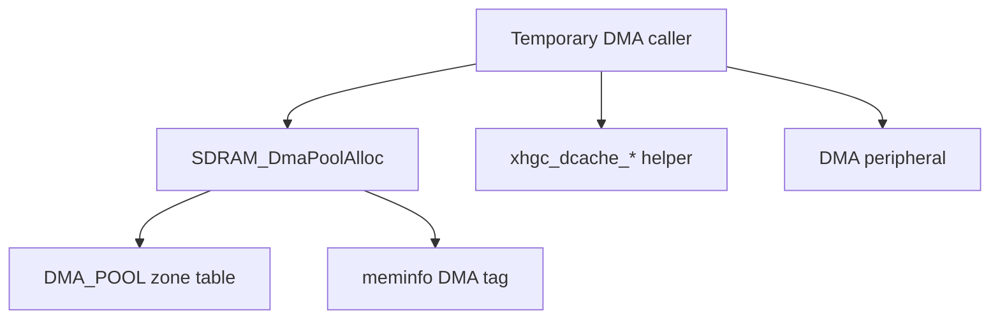

# SDRAM 内存布局规范 v1.0（中文）

> 适用范围：本规范描述 STM32H7 系统中外部
> SDRAM（64MiB）的固定分区结构。\
> 目标：保证 LTDC / LVGL / DMA / 资源加载
> 在同一套地址约束下稳定运行，并避免运行期碎片化问题。

------------------------------------------------------------------------

## 1. 总览

SDRAM 物理地址范围：

    0xD0000000 ～ 0xD3FFFFFF

总容量：

    64 MiB (0x04000000 bytes)

SDRAM 采用"固定锚点 + 顺序紧贴"的布局策略，分为以下逻辑区：

1.  FB 区（显存区）
2.  LVGL_HEAP
3.  DMA_POOL
4.  LAUNCHER_CACHE
5.  APP_ARENA_REST

------------------------------------------------------------------------

## 2. 固定分区总览表

| 区域 | 起始地址 | 终止地址 | 容量 (MiB) | 用途 |
|------|------------|------------|------------|--------------|
| Layer1_FB0 | 0xD0000000 | 0xD0176FFF | 1.46 | 主图层缓冲0 |
| Layer1_FB1 | 0xD0177000 | 0xD02EDFFF | 1.46 | 主图层缓冲1 |
| Layer2_FB0 | 0xD02EE000 | 0xD0464FFF | 1.46 | 背景层单缓冲 |
| LVGL_HEAP | 0xD0465000 | 0xD1464FFF | 16 | 保留/future-use |
| DMA_POOL | 0xD1465000 | 0xD1864FFF | 4 | DMA 专用区 |
| LAUNCHER_CACHE | 0xD1865000 | 0xD1C64FFF | 4 | 图标缓存 |
| APP_ARENA_REST | 0xD1C65000 | 0xD3FFFFFF | 约 35.6 | 资源加载 |

------------------------------------------------------------------------

## 3. 布局策略

### 3.1 锚点原则

-   FB 区必须（MUST）从 SDRAM 起始地址开始。
-   FB 区为固定大小，不得在运行期扩展。

### 3.2 紧贴原则

-   所有区域必须（MUST）顺序紧贴排列。
-   不允许人工预留空洞。
-   仅允许对齐填充（Alignment Padding）。

### 3.3 对齐规则

-   FB 区：必须 256 字节对齐。
-   DMA_POOL：必须 64 字节以上对齐。
-   其它区域：建议 32 字节对齐。

------------------------------------------------------------------------

## 4. FB 区规范

### 4.1 图层结构

-   Layer1：双缓冲
-   Layer2：单缓冲

### 4.2 显存容量说明

当前配置：

    800 × 480 × 4 bytes
    = 1,536,000 bytes / frame
    = 4.39 MiB total (三帧)

### 4.3 使用限制

-   FB 区不得作为通用内存使用。
-   不允许 DMA 写入未 cache clean 的区域。
-   不允许 CPU 算法临时缓冲写入显存区。

------------------------------------------------------------------------

## 5. LVGL_HEAP 规范

-   当前固定容量为 16 MiB，地址范围 `0xD0465000` -- `0xD1464FFF`。
-   实机验证发现将 LVGL builtin/TLSF heap 放入本区会引入显示撕裂/不稳定。
-   当前策略：LVGL runtime heap 使用片内 RAM，`SDRAM_LVGL_HEAP` 保留为 reserved/future-use，不作为默认 lv_mem 主池。
-   meminfo 中本区应保持 `total=0x01000000`，`used=0`，并在 dump 文本中标注 `RESERVED/FUTURE_USE`。
-   LVGL 输出 framebuffer 不属于 LVGL runtime heap，Layer1_FB0/Layer1_FB1 双缓冲仍使用独立 FB 区。
-   LVGL runtime heap 仅用于 LVGL 元数据和小对象，例如 `lv_obj`、`lv_image`、style、event、label text 和 descriptor 小结构。
-   大图像禁止进入 LVGL 片内 heap；Lua cart 图片、解码后像素资源，以及 Lua UI image 的 copied/cropped/flipped view buffer 应继续使用 APP_ARENA_REST/LAUNCHER_CACHE 等专用区。
-   禁止作为 DMA buffer 使用，DMA buffer 必须来自 DMA_POOL。

------------------------------------------------------------------------

## 6. DMA_POOL 规范

DMA_POOL 仅用于临时 DMA buffer，不作为通用 heap，也不接收 LVGL 对象或 framebuffer allocation。

### 6.1 DMA buffer 分类

固定 DMA 目标（Fixed DMA Target）不需要来自 DMA_POOL，但允许作为 DMA2D / MDMA / LTDC / 外设 DMA 的源或目标，前提是满足 cache 和对齐规则：

-   Layer1_FB0
-   Layer1_FB1
-   Layer2_FB0
-   LAUNCHER_CACHE
-   APP_ARENA_REST 中的资源区

临时 DMA buffer（Temporary DMA Buffer）必须来自 DMA_POOL：

-   USB 临时 RX/TX buffer
-   SDMMC / SPI / QSPI 临时 RX/TX buffer
-   AUDIO DMA buffer
-   解码 staging buffer
-   外设 DMA 中转 buffer
-   任何没有固定 zone 所属关系的 DMA 临时内存

注意：固定 DMA 目标不计入 DMA_POOL used；framebuffer fixed reserve 已由 meminfo 初始化统计，LAUNCHER_CACHE / APP_ARENA_REST 作为 DMA 目标时也不额外计入 DMA_POOL。

### 6.2 DMA_POOL allocator

-   `SDRAM_DmaPoolInit()` / `SDRAM_DmaPoolReset()` 管理整个池的生命周期。
-   `SDRAM_DmaPoolAlloc(size, align)` 和 `SDRAM_DmaPoolCalloc(count, size, align)` 使用线性 / bump allocator。
-   不支持单块 free；回收只能通过 reset。
-   DMA_POOL base/size 来自 `Core/Memory/xhgc_memory_layout.c` 中的 `g_xhgc_mem_zones[XHGC_MEM_ZONE_DMA_POOL]`。
-   对齐至少 64 bytes；小于 64 的 align 自动提升，非 2 的幂 align 会向上修正到合法 2 的幂。
-   越界或非法请求返回 `NULL`，不得 HardFault。
-   `SDRAM_DmaPoolContains(ptr, size)` 用于检查逻辑范围是否完整位于 DMA_POOL。
-   `SDRAM_DmaPoolUsed()` 返回当前 bump used；`SDRAM_DmaPoolPeak()` 返回 reset 后仍保留的峰值。

### 6.3 cache 维护规则

-   CPU 写、DMA 读：DMA 开始前 clean DCache。
-   DMA 写、CPU 读：DMA 完成后 invalidate DCache。
-   双向 DMA：开始前 clean，完成后 invalidate。
-   `xhgc_dcache_clean_range()`、`xhgc_dcache_invalidate_range()`、`xhgc_dcache_clean_invalidate_range()` 统一按 Cortex-M7 32-byte cache line 向外对齐覆盖。
-   cache line 对齐覆盖可能触及调用方逻辑范围相邻的同一 cache line 字节；调用方仍以原始 `ptr + size` 作为 DMA 逻辑范围。
-   Debug 下 helper 可提示地址不在 SDRAM、不在 DMA_POOL 且不属于固定 DMA target、或 size 未 32-byte 对齐。

DMA_POOL allocator 与 meminfo 数据流：

说明：调用者先通过 DMA_POOL 获取临时 DMA buffer，再按 DMA 方向调用 cache helper；本阶段只提供统一 helper，不自动改写现有 DMA2D / MDMA / LTDC 调用路径。

------------------------------------------------------------------------

## 7. LAUNCHER_CACHE 规范

-   存放 ARGB8888 解码后像素。
-   设计容量 ≥ 2 MiB。
-   当前预留 4 MiB。

------------------------------------------------------------------------

## 8. APP_ARENA_REST 规范

-   默认提供线性分配模型。
-   支持 reset()。
-   允许上层在本区内实现可释放的专用子分配器。
-   吃剩余全部空间。
-   禁止跨区写入。

Lua cart 图片资源使用 `APP_ARENA_REST` 中的资源区作为 scene 资源 arena：

-   cart 入口脚本加载后，宿主解析 Header、地址表和 INDEX，生成图片资源目录。
-   第一版使用同步懒加载；`ui.image()` 创建时才把 BGRA8888 图片从 DATA 段读入资源区。
-   RESOURCE_ARENA 运行期必须只有一个 owner；默认 owner 固定为 `resource_manager`。
-   `resource_manager` 负责 scene 资源 arena 的 claim、线性分配、scene reset 和资源 handle 失效。
-   `lua_cart_resource_cache` 当前为 legacy/experimental/disabled；默认不得 claim 或直接管理 `RESOURCE_ARENA_BASE`，也不得与 `resource_manager` 同时维护同一段 arena offset/free list。
-   `ui.image()` 需要生成 copied/cropped/flipped view buffer 时，必须从 APP_ARENA_REST 的资源区或基于该区的 image scratch 分配，不得使用 `lv_malloc()` / LVGL runtime heap。
-   同一个 Drawable 频繁 rebuild view 时应优先复用已有 scratch buffer；容量不足时才追加申请，旧块随 scene reset 统一回收。
-   cart 脚本运行期间，该资源管理器独占资源区；其它代码不得同时通过线性 arena 接口在资源区分配。
-   第一版不启用 MDMA、LRU、eviction、异步加载、压缩资源或 tile streaming。
-   `ui.image()` Drawable 引用对应资源块，并维护引用计数。
-   Drawable 销毁后释放引用；引用计数归零只标记为未使用，不释放 arena 中间块。
-   场景结束时，宿主先销毁 `self.children`，再统一 reset scene arena 并让旧资源 handle 失效。

------------------------------------------------------------------------

## 9. 调试定位规则

  地址范围     可能问题来源
  ------------ --------------
  0xD000xxxx   FB 区
  0xD04xxxxx   LVGL
  0xD14xxxxx   DMA
  0xD18xxxxx   Launcher
  0xD2xxxxxx   Arena 溢出

------------------------------------------------------------------------

## 10. Meminfo 统计

`Core/Memory/xhgc_meminfo.h` 提供 SDRAM zone 和 memory tag 的运行期统计骨架。

-   `xhgc_meminfo_init()` 必须在 `xhgc_mem_layout_validate()` 通过后调用。
-   初始化时从 `g_xhgc_mem_zones` 读取每个 zone 的 `total`。
-   三块 framebuffer zone 初始化为 fixed reserved，tag 为 `FRAMEBUFFER`，总占用 `0x00465000`。
-   fixed framebuffer 不允许通过 `xhgc_meminfo_release()` 释放。
-   `xhgc_meminfo_alloc_record()` / `xhgc_meminfo_free_record()` 只记录已发生的分配和释放。
-   `xhgc_meminfo_fail_record()` 只记录失败次数。
-   meminfo 不分配内存，不替换 `malloc/free`，不接管 LVGL、DMA、Lua、newlib 或 FreeRTOS heap。
-   LVGL runtime heap 当前位于片内 RAM，不计入任何 SDRAM zone；`SDRAM_LVGL_HEAP` 作为 reserved/future-use 区域显示，`used` 保持 0。
-   DMA_POOL 分配成功会记录 `XHGC_MEM_ZONE_DMA_POOL` + `XHGC_MEM_TAG_DMA` 的 used、peak 和 alloc_count；记录大小为 bump allocator 实际消耗空间，包含对齐 padding。
-   DMA_POOL 分配失败会记录 `XHGC_MEM_ZONE_DMA_POOL` + `XHGC_MEM_TAG_DMA` 的 fail_count。
-   DMA_POOL reset 会将 `XHGC_MEM_ZONE_DMA_POOL` used 归零或回到基线；peak 和 fail_count 保留。
-   固定 DMA 目标不进入 DMA_POOL meminfo used，避免 framebuffer reserve、LAUNCHER_CACHE 或 APP_ARENA_REST 资源重复计数。
-   APP_ARENA_REST 第一阶段 meminfo 统计以总 zone 为单位，`app_arena_alloc()` 成功、失败和 reset 会同步该 zone 的 used、peak 和 fail；Lua UI image view buffer 申请成功会增加 APP_ARENA_REST used/peak，申请失败会增加 fail_count。
-   RESOURCE_ARENA owner guard 不改变 meminfo 模型；统计仍以 APP_ARENA_REST 总 zone + `RESOURCE`/`TEXTURE` tag 为准。
-   大图像 view buffer 不应增加 `LVGL` tag；当前通过资源区接口分配，tag 计入 `RESOURCE`。
-   Lua VM heap 位于 APP_ARENA_REST 内的 `LUA_HEAP` 子区；当前 meminfo 仍按 APP_ARENA_REST 总 zone 统计，并以 `XHGC_MEM_TAG_LUA` 记录 `lua_vm_alloc()` 的成功、释放和失败。
-   RESOURCE_ARENA、LUA_HEAP、COLD_POOL 等 APP_ARENA_REST 内部子区级统计留到后续阶段，不在本阶段重排地址或改变子区模型。
-   Debug 构建可通过 CMake 选项 `XHGC_MEMINFO_SELFTEST_ENABLE=ON` 打开 APP_ARENA_REST meminfo 自测；默认关闭。
-   Debug 构建可通过 CMake 选项 `XHGC_DMA_POOL_SELFTEST_ENABLE=ON` 打开 DMA_POOL meminfo 自测；默认关闭，默认构建不包含 selftest 符号。

### 10.1 Lua VM allocator 约束

-   固件业务代码必须通过 `lua_vm_newstate()` 创建主 `lua_State`。
-   `lua_vm_newstate()` 内部使用 `lua_newstate(lua_vm_alloc, lua_vm_memory_allocator())`，不得回退到 `luaL_newstate()` 或 newlib heap。
-   `luaL_newstate()` 和 Lua 默认 `l_alloc` 只允许作为 `Core/LuaPort/src` 中 Lua 官方源码实现存在，不作为固件主路径使用。
-   业务源码不得直接调用 `luaL_newstate()`；Debug 构建会运行 `cmake/check_lua_allocator_usage.cmake` 检查固件业务源码中的误用。
-   `lua_vm_alloc()` OOM 时返回 `NULL`，并通过 meminfo 记录 `APP_ARENA_REST` + `XHGC_MEM_TAG_LUA` 的失败次数；Lua VM 创建失败时由运行时输出明确日志。

启动串口日志会先输出 `[XHGC SDRAM LAYOUT]`，再输出 `[XHGC MEMINFO]`。
自测启用时，日志会额外输出 `[XHGC MEMINFO SELFTEST] baseline`、`after_alloc`、`after_reset` 和 PASS/FAIL。

------------------------------------------------------------------------

## 版本记录

-   v1.0 回退 LVGL runtime heap 到片内 RAM，SDRAM_LVGL_HEAP 保留为 reserved/future-use
-   v1.0 补充 DMA_POOL 临时 DMA buffer 规则、cache helper 和 meminfo 接入
-   v1.0 添加 meminfo 统计骨架说明
-   v1.0 初始发布版本
