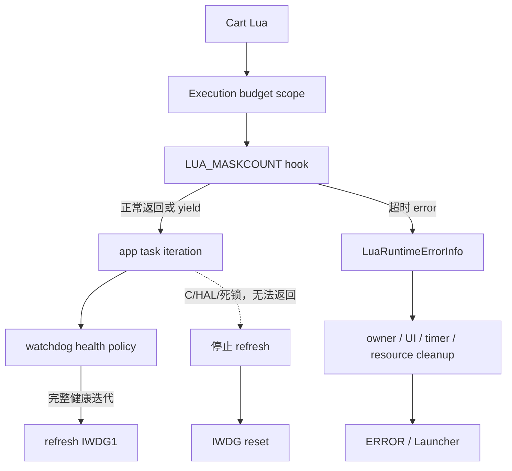

# Lua 执行预算与 IWDG

## 系统概览

CartDesk 使用两层防卡死机制。Lua debug hook 在受保护边界内按真实连续执行时间终止可抢占的 Lua 代码，并复用现有 runtime error 与 owner 清理流程；Lua 无法抢占的 C/HAL/RTOS 卡死由 STM32H743 IWDG 在 app task 停止完成健康迭代后复位整机。



实线为源码确认关系，虚线标注的是 IWDG 兜底场景。

## 威胁模型

| Cart hang path | 当前调用链 | Lua hook | IWDG | 处理方式 |
|---|---|---:|---:|---|
| ENTRY chunk / metamethod / `__gc` 中 Lua 循环 | loader → `lua_pcall` | 是 | 否 | LOAD scope 超时，进入 runtime error |
| `init` | scheduler → lifecycle thread → `lua_resume` | 是 | 否 | INIT scope 超时并清理 owner |
| `fixed_update` / `update` / `late_update` | scheduler → lifecycle thread → `lua_resume` | 是 | 否 | UPDATE scope 超时并清理 owner |
| `on_input` | input queue → lifecycle thread → `lua_resume` | 是 | 否 | INPUT scope 超时并清理 owner |
| `on_message` | message queue → lifecycle thread → `lua_resume` | 是 | 否 | MESSAGE scope 超时并清理 owner |
| `timer.after/every` callback | timer process → `lua_pcall` | 是 | 否 | TIMER scope 超时，停用 timer 并清理 owner |
| `final` | shutdown/direct callback → `lua_pcall` | 是 | 否 | FINAL scope 超时，EXIT 继续完成 |
| Cart `coroutine.create/resume` | lifecycle Lua → coroutine library → `lua_resume` | 是 | 否 | 新 thread 继承 hook；外层 slice 仍记录超时 |
| coroutine yield 后再次 resume | 每次 lifecycle resume 建立新 scope | 是 | 否 | 每个连续执行 slice 独立计时，不累计等待时间 |
| 有界 C binding 返回过慢 | Lua → C binding → 返回 | 可信阻塞区间暂停计时 | 是 | Lua CPU 时间继续累计；不返回则 IWDG 复位 |
| C binding 永不返回、HAL/driver 卡死、app task 死锁 | app task → C/HAL/RTOS | 否 | 是 | 健康迭代无法结束，不再 refresh |
| resource image 同步装载 / MDMA 等长路径 | assets/UI binding → resource cache | 仅返回后 | 是 | 保留 IWDG 兜底，后续可继续异步化 |
| Lua allocator / GC 极端耗时 | Lua VM allocator/GC | 执行 Lua 指令时可检查；C 内部不可抢占 | 是 | hook 优先，IWDG 兜底 |
| QFlash exclusive 永久不释放 | app loop 跳过 LVGL/Lua | 不适用 | 是 | 只在 IO heartbeat 5 秒内有进展时 refresh |
| `Error_Handler` 卡死 | disable IRQ → loop | 否 | IWDG 启动后是 | 不在 Error_Handler 喂狗；IWDG 启动前的早期故障仍保持原行为 |

## Lua 执行预算

预算集中定义于 `Core/LuaPort/lua_execution_budget.h`：

| 阶段 | 单次连续执行预算 |
|---|---:|
| LOAD | 50 ms |
| INIT | 50 ms |
| UPDATE / FIXED_UPDATE / LATE_UPDATE | 20 ms |
| INPUT / MESSAGE / TIMER | 20 ms |
| FINAL | 20 ms |

hook 每 1000 条 Lua 指令检查一次 wall-clock。目标板使用 `DWT->CYCCNT` 与 `SystemCoreClock`，HostTest 使用 `CLOCK_MONOTONIC`。20 ms 的帧内 callback 预算对当前约 10 ms Lua update 调度较严格，但仍给有限重计算留下空间；LOAD/INIT 使用 50 ms，并保证纯 Lua 无限循环明显早于 10 秒 IWDG 超时结束。

hook 永久安装在主 `g_L` 上，但只有 execution scope active 时检查。项目内置 Lua 5.4 的 `lua_newthread` 会复制父 thread 的 `hookmask`、`basehookcount` 和 `hook`，因此 lifecycle thread 以及 Cart 通过 `coroutine.create` 创建的 thread 都继承 hook。工程没有向 Cart 开放 debug library，Cart 不能调用 `debug.sethook` 覆盖它。未修改 Lua upstream core。

每次 `lua_pcall`、`lua_resume` 或 timer callback 进入不可信 Lua 前调用 `LuaExecutionBudget_Begin`，在返回、yield 或 error 后调用 `LuaExecutionBudget_End`。yield 会结束本次 slice；下次 resume 重新计时，因此 sleep/yield 等待时间不进入预算。scope 保存 stage、owner、generation、开始时间、预算、hook 次数和 active/expired 状态，并支持嵌套恢复。

`assets.image`、`assets.data` 的同步 Cart/SD 读取以及有明确输入上限的硬件 CRC 计算，使用 `LuaExecutionBudget_PauseForBlockingCall` / `LuaExecutionBudget_ResumeAfterBlockingCall` 标记可信且有边界的原生执行区间。暂停前后的 Lua CPU 时间仍累计在同一 scope 内，只有这些原生区间不计入 50 ms Lua 指令预算。若调用永不返回，app loop 无法完成，IWDG 仍会复位主机。

hook 内只读取时钟、更新固定静态状态、从 registry 取预创建错误对象并调用 `lua_error`；不分配内存、不日志、不访问文件/LVGL/RTOS blocking API。格式化与日志均在 protected boundary 返回后完成。

## 错误与资源清理

超时保持原 callback stage，并把 `LuaRuntimeErrorInfo.reason` 设置为 `LUA_RUNTIME_ERROR_REASON_BUDGET_EXCEEDED`。诊断包含 stage、owner、generation、elapsed、budget、hook count 和 instruction interval。`LuaRuntimeTask` 将其映射为 `LUA_RUNTIME_ERROR_BUDGET_EXCEEDED`，继续使用现有 ERROR / Launcher 恢复路径。

callback/timer 超时沿现有 `lua_rt_stop_after_callback_error` 路径销毁 Foundation owner 和 UI owner，并清除调度与事件状态。Foundation owner 销毁继续负责 timer、storage、assets/resource 等 owner 生命周期。`final` 超时时不阻断 `lua_shutdown` 后续的全局资源 reset 与 `lua_close`。

## 仍需 IWDG 兜底的 C 路径

Lua hook 不能在一个尚未返回的 C 函数内部执行。当前审计确认的有界但可能较长路径包括：日志 UART 发送最长 100 ms、resource cache 的 MDMA poll 最长 1000 ms、image view 像素复制循环，以及 ENTRY/resource 的 FatFs 同步读取。storage 写入继续走 `CartIoService` request/completion。`assets.image` / `assets.data` 的有界资源读取显式暂停 Lua 预算，其余路径返回后 execution scope 仍会识别已超预算；驱动若永久不返回，则 app task 无法完成健康迭代，由 IWDG 复位。

## IWDG 硬件配置

`cartdesk-os.ioc` 启用 H743 的 `IWDG1`，配置为：

- LSI nominal frequency：32 kHz；
- prescaler：256；
- reload：1249；
- window：4095（非 window 模式限制）；
- nominal timeout：`(1249 + 1) × 256 / 32000 = 10.0 s`。

10 秒名义值高于 app 启动阶段 `CartIoService_WaitReady` 的 5 秒上限，并为 scheduler、USB、LVGL、QFlash font 和 Launcher 初始化保留余量。LSI 有器件与温度偏差，10 秒是按标称 32 kHz 计算的值；目标板验收需要实测复位时间，不能把它当作精密时基。

IWDG 在外设初始化末尾、scheduler 启动前启动。唯一正常 refresh 入口是 `WatchdogPolicy_CompleteAppIteration`，位于 app loop 尾部：只有 `lvgl_task_handler`、`LuaRuntimeTask_Process`、`Launcher_Task` 和统计更新全部返回后才调用。SysTick、ISR、Lua hook、callback 和其他 task 都不会喂狗。因此 app 卡在 Lua C binding、LVGL、Launcher、锁或 HAL 时不会形成 fake healthy。

QFlash exclusive 期间本来会跳过 UI/Lua。policy 现在要求 IO worker heartbeat 在 5 秒窗口内持续前进；无进展超过 5 秒后停止 refresh。该阈值与现有 5 秒 IO ready 上限一致，最终硬件复位还需要一个 IWDG 周期。

启动时在清除 RCC reset flags 前捕获 `RCC_FLAG_IWDG1RST`，待 UART/logger 可用后输出 `reset_reason=IWDG`。Debug 和 SizeDebug（RelWithDebInfo）设置 `DBGMCU` 的 IWDG1 freeze 位，只在 debugger halt 时暂停计数；Release 不定义该配置，IWDG 始终运行。

## 验证

HostTest 覆盖 init/update/timer/Cart coroutine 无限循环、yield 后恢复、有限重计算、final 无限循环，以及 100 次“超时 Cart → 清理 → 正常 Cart → exit”循环。标准命令：

```bash
cmake --preset HostTest
cmake --build --preset HostTest
ctest --preset HostTest --output-on-failure
```

目标板仍必须完成两项独立 smoke：

1. Lua timeout：运行纯 Lua `while true do end`，确认小于 100 ms 进入 ERROR、MCU 未 reset、Launcher 可恢复、Fault 寄存器无异常且 owner/heap 无持续增长。
2. IWDG：Debug/SizeDebug 配置 `-DCARTDESK_WATCHDOG_STALL_TEST_ENABLE=ON` 并运行，受控 C stall 会主动取消 debug freeze 后停止 app 进展；确认约 10 秒后 IWDG reset、启动日志出现 `reset_reason=IWDG`、无 reset loop 且 Launcher 可再次运行。验收后必须关闭该选项。

SizeDebug 下的 Lua timeout smoke 通过现有 GDB/OpenOCD mailbox 启动：写 `g_lua_budget_board_command=1`。完成后 `g_lua_budget_board_completed` 应为 1、`g_lua_budget_board_failures` 应为 0；`g_lua_budget_board_last_stage` / `last_reason` / `elapsed_us` / `budget_us` 保留本次超时证据。写 command 2 可中止并清理测试 Cart。

Launcher 重复启动 mailbox（`g_phase3_repeat_command=1`）会在收到命令时快照当前选择框的游戏，并在每次重建 Launcher 后恢复该选择再启动；不会固定启动第 0 槽，也不会自动改为当前插卡槽。

## 已知边界与开放问题

- IWDG 启动前发生的早期 `Error_Handler` 仍会保持原来的永久停机行为；这不是 Cart 可达路径，但属于 boot fault 架构的已知边界。
- Lua C binding 和第三方库中的 C 代码仍无法被 hook 抢占，依赖 IWDG；后续应优先缩短同步 resource/FatFs/MDMA 路径。
- 目标板 Lua timeout、实际 LSI timeout、reset reason 与 reboot 恢复尚需硬件 smoke 验证。

## 参考文件

- `Core/LuaPort/lua_execution_budget.c`
- `Core/LuaPort/lua_execution_budget.h`
- `Core/Src/lua_vm.c`
- `Core/LuaPort/modules/lua_timer.c`
- `Core/APPS/TASK/lua_runtime_task.c`
- `Core/APPS/TASK/app_task.c`
- `Core/System/watchdog_policy.c`
- `Core/Src/iwdg.c`
- `cartdesk-os.ioc`
- `tests/host/lua_vm_lifecycle_test.c`
- `tests/host/lua_timer_test.c`
