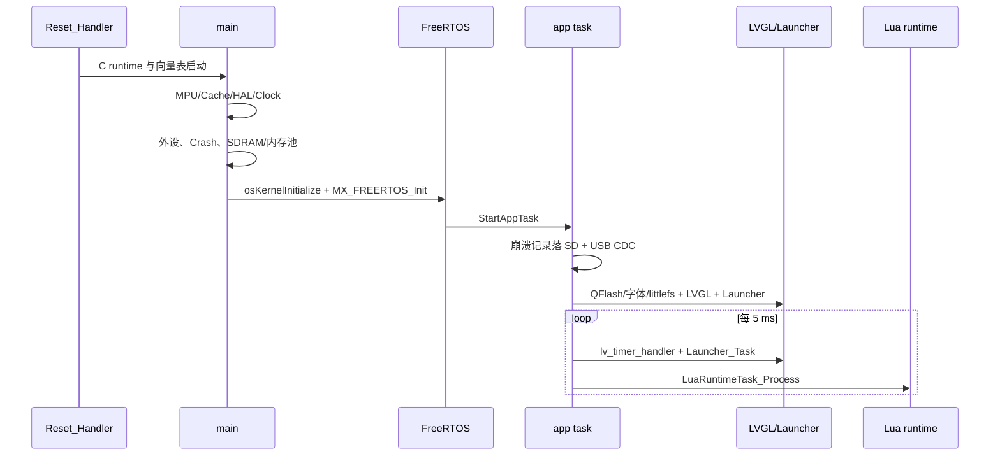
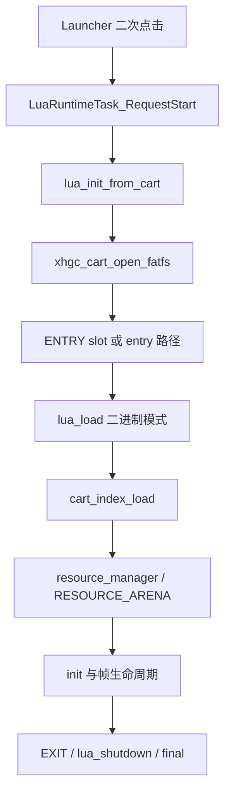

# CartDesk-OS 当前项目进度报告

> 检查日期：2026-08-03（Asia/Tokyo）
>
> 检查范围：当前工作树、最近 20 条 Git 记录、CodeGraph 索引、源码、CubeMX 配置、链接脚本、构建配置、现有文档及 Release 实际构建结果。
>
> 状态口径：本文严格区分“已完成并实际接入”“已实现但尚未接入”“开发中”“仅空壳”“未实现”和“待确认”。未进行板上烧录，因此依赖真实硬件的结论均不会写成已通过实机验证。

## 1. 项目概述

CartDesk-OS 是面向 STM32H743XIH6 的嵌入式桌面/卡带启动器固件。当前主线已经形成可编译的系统骨架：上电初始化 STM32H7 外设和 64 MiB SDRAM，启动 FreeRTOS/CMSIS-RTOS2，在唯一的应用线程中运行 LVGL 9.5、Launcher 和 Lua 生命周期调度器；Launcher 周期探测 SD 卡根目录的 `0:/cart.bin`，读取元数据和 200×200 图标，用户二次点击可启动 cart 中的 Lua 字节码，退出时执行 `final(self)` 并回到 Launcher。

当前工程不是完整桌面系统。Launcher 的卡带槽、信息弹窗、图标持久化和 Lua 应用启动已接入；“相册、手柄、拓展、设置、休眠模式”五个系统入口目前只有选择态 UI，没有页面或业务实现。音频、通用 I/O 和后台任务已经创建，但任务体只是永久等待事件的预留空壳。文件管理、设置、存档/KV、电源管理和看门狗均未实现。

本次 CodeGraph 状态为索引有效且最新：1,951 个文件、41,887 个节点、111,601 条边。实际 Release 构建成功，说明当前已提交代码能够通过交叉编译和链接；尚未做烧录、外设实测或长期稳定性验证。

## 2. 当前分支与 Git 状态

- 当前分支：`main`。
- HEAD：`2c51c22 feat: 添加异常崩溃记录机制`。
- 远端同步：`origin/main...HEAD` 为 `0 0`，当前提交与远端一致。
- 分析开始时 `git status --short` 无输出，工作区完全干净。
- `git diff --stat`、`git diff`、`git diff --cached` 均无输出。
- 暂存修改：无。
- 未暂存修改：无。
- 未跟踪文件：分析开始时无；本次仅新增本报告 `PROJECT_PROGRESS.md`。

因此当前没有可归类为“正在开发中的未提交代码”的实现，也没有明显由未提交修改引入的编译风险。

## 3. 最近完成的工作

最近 20 条提交显示主线工作集中在异常记录、QFlash 字体/图标持久化、Cart 可靠读取、内存统计和任务调度重构：

1. `2c51c22`：新增 HardFault、MemManage、BusFault、UsageFault 现场采集；使用 RTC Backup Registers 跨软件复位保存，启动时打印并在调度器启动后追加至 SD `0:/logs/crash.log`。
2. `20b1ae3`：同步 STM32CubeMX 工程配置。
3. `3763002`：为 Launcher 增加 QFlash littlefs 卡带图标持久化缓存。
4. `b1f03f6`：修正 QFlash littlefs 双 Flash 擦除几何和挂载逻辑；只有 `LFS_ERR_CORRUPT` 才格式化，I/O 错误不再触发擦除。
5. `a9fec4d`：修复 Cart 图片资源间歇性读取失败，资源读取增加 I/O 重试并补充 host 测试场景。
6. `c3ed01d`、`8a2e465`、`fb78e74`：接入 QFlash 全量 A8 字库、Launcher 共享字体和容量查询。
7. `e9dd3ce`、`0b6deab`、`370b79f`：修正应用退出后的内存统计，扩展运行时仪表数据并重构应用任务调度层。
8. `fc1df06`、`2686d45`、`32bf273`、`851d883`：优化 Cart 启动/资源加载、修正 CRC 和 DMA 缓冲问题、增加 DWT 性能审计路径。
9. `343f54b`、`153530d`：同步 USB/中间件并修正 FreeRTOS 与固件链接配置。

这些工作均已提交并进入当前 `main`，不是工作区中的临时实现。

## 4. 当前正在进行的工作

当前工作区没有未提交开发内容，无法从 Git 状态确认某个功能正在编码。根据最新提交顺序，最近完成的开发方向是异常崩溃记录机制；根据现有代码缺口，下一阶段最自然的工作是将已有 host 测试正式接入构建/CTest，并补齐固件产物与板级回归闭环，而不是继续扩展新 UI。

需要特别区分：

- `lua_cart_resource_cache.c` 已实现，但默认 preset 关闭 `XHGC_ENABLE_EXPERIMENTAL_CART_RESOURCE_CACHE`；正式资源 owner 是 `resource_manager`。这是“实验实现、默认未接入”。
- `lvgl_init()` 封装已实现但没有调用者；实际路径在 `CartdeskAppTask_Run()` 中直接调用 `lv_init()`、`lv_port_disp_init()`、`lv_port_indev_init()`。LVGL tick 则由 `SysTick_Handler()` 中的 `lv_tick_inc(1)` 驱动，不依赖该封装。
- `lua_reload()` 和 `on_reload(self)` 已实现，但 Launcher/任务层没有调用者；属于“运行时能力已实现，产品热重载入口未接入”。
- 板级测试函数已实现并参与静态库编译，但没有生产启动调用点，`CARTDESK_ENABLE_BOARD_TESTS` 目前只生成宏定义。

## 5. 核心目录结构

```text
cartdesk-os/
├── cartdesk-os.ioc                 STM32CubeMX 主配置
├── startup_stm32h743xx.s           Cortex-M7 启动与向量表
├── STM32H743XX_FLASH.ld            Flash/片内 RAM/SDRAM 链接布局
├── Core/
│   ├── Src/                        main、CubeMX 外设初始化、FreeRTOS、Lua VM
│   ├── Inc/                        全局配置、外设句柄、内存布局声明
│   ├── APPS/TASK/                  app/audio/io/background 与 Lua 调度控制器
│   ├── APPS/LVGL/                  LVGL 9.5 源码、配置、显示/tick/输入移植
│   ├── Screen/                     Launcher 页面、操作提示、图标 SDRAM 缓存
│   ├── Cart/                       cart.bin 头、MANF、INDEX/DATA 与图标持久化
│   ├── LuaPort/                    Lua 5.4 源码、宿主 API、资源管理和 arena
│   ├── Driver/                     LCD、触摸、SDRAM、QFlash、EEPROM、GPIO 等
│   ├── Memory/                     固定内存布局、D-Cache、meminfo
│   └── Debug/                      崩溃记录、性能统计、板级测试、overlay
├── Drivers/                        STM32H7 HAL 与 CMSIS
├── Middlewares/                    FreeRTOS、FatFs、USB Device 中间件
├── FATFS/                          SD diskio、FatFs 驱动绑定与挂载封装
├── USB_DEVICE/                     USB OTG HS Device CDC 配置与接口
├── cmake/                          工具链、CubeMX 子目标、链接片段、检查脚本
├── tests/                          Cart/Lua runtime host 测试与 Lua smoke 脚本
├── tools/                          host luavm、QFlash 字库构建/烧写工具
├── examples/lua/                   Lua API 与生命周期示例
└── Docs/                           架构、格式、显示、内存、Lua、调试文档
```

真实分层以功能域为主，而非纯 CubeMX 模板：`Core/Src` 保留生成代码和系统入口，业务调度放在 `Core/APPS/TASK`，UI 页面放在 `Core/Screen`，格式与加载放在 `Core/Cart`，Lua 宿主能力集中在 `Core/LuaPort`。`Drivers`/`Middlewares` 是第三方或厂商代码；项目自有硬件封装位于 `Core/Driver`。

构建方式以 CMake + Ninja + STM32CubeMX 生成子目标为主。仓库还保留 `.ioc`、CubeIDE 风格启动文件/链接脚本和 `CartDeck.cfg`，但本次实际验证使用 CMake preset。

## 6. 硬件平台与基础配置

### MCU 与时钟

| 项目 | 已确认配置 | 证据 |
|---|---|---|
| MCU | STM32H743XIH6，TFBGA240，Cortex-M7 | `cartdesk-os.ioc` 的 `Mcu.CPN`/`Mcu.Package`，编译宏 `STM32H743xx` |
| CPU/SYSCLK | 480 MHz | `SystemClock_Config()`：HSE / 5 × 192 / 2；`.ioc` 的 `RCC.CortexFreq_Value` |
| HCLK/AXI/AHB | 240 MHz | HCLK DIV2，`.ioc` 为 240 MHz |
| APB1/2/3/4 | 120 MHz | 各 APB DIV2 |
| PLL2 外设核时钟 | QSPI 200 MHz、SDMMC 200 MHz | `PeriphCommonClock_Config()` 与 `.ioc`；SDMMC 另设 `ClockDiv=8` |
| LTDC 像素时钟 | 27 MHz | `.ioc` 的 `RCC.LTDCFreq_Value` |
| USB 时钟 | HSI48，48 MHz | `.ioc` 的 USB clock selection |
| RTC 时钟 | LSI，约 32 kHz | `Core/Src/rtc.c`、`.ioc` |

### 内部存储与内存

| 区域 | 地址/容量 | 当前用途 |
|---|---:|---|
| Internal Flash | `0x08000000`, 2 MiB | 向量表、代码、只读数据、初始化数据镜像 |
| ITCM | `0x00000000`, 64 KiB | 链接区存在，当前 Release 静态使用 0 |
| DTCM | `0x20000000`, 128 KiB | `.data`、`.bss`、主栈/用户堆栈；Release 使用 65,848 B |
| AXI SRAM | `0x24000000`, 512 KiB | 256 KiB LVGL heap、96 KiB FreeRTOS heap、Lua 调度状态等；Release 使用 364,736 B |
| D2 SRAM | `0x30000000`, 288 KiB | USB 专用 NOLOAD 段；Release 使用 4,128 B |
| D3 SRAM | `0x38000000`, 64 KiB | 当前 Release 静态使用 0 |

`configTOTAL_HEAP_SIZE` 为 98,304 B，使用 `heap_4`，实际 `ucHeap` 放入 AXI SRAM 的 `.ram_runtime`。任务栈由动态线程创建从该 heap 分配：app 32 KiB、audio 8 KiB、io 4 KiB、background 4 KiB。主链接脚本仍保留 newlib `_Min_Heap_Size=0x200` 和 `_Min_Stack_Size=0x400` 的检查区。

### 外部 SDRAM

FMC SDRAM Bank2，32-bit 总线、13 行/9 列、4 banks、CAS 3、SDCLK period 2，初始化后 refresh rate 918。代码和链接脚本共同定义物理范围 `0xD0000000..0xD3FFFFFF`，总计 64 MiB：

| 分区 | 地址范围 | 容量 | 作用 |
|---|---|---:|---|
| Layer1 FB0 | `0xD0000000..0xD0176FFF` | 1.46 MiB | 主图层前/后缓冲之一 |
| Layer1 FB1 | `0xD0177000..0xD02EDFFF` | 1.46 MiB | 主图层双缓冲之一 |
| Layer2 FB0 | `0xD02EE000..0xD0464FFF` | 1.46 MiB | 背景层单缓冲保留 |
| SDRAM_LVGL_HEAP | `0xD0465000..0xD1464FFF` | 16 MiB | 保留/未来用途；当前 LVGL heap 不在这里 |
| DMA_POOL | `0xD1465000..0xD1864FFF` | 4 MiB | 64-byte 对齐线性 DMA 临时池 |
| LAUNCHER_CACHE | `0xD1865000..0xD1C64FFF` | 4 MiB | 10 个 200×200 图标等，静态使用约 1.88 MiB |
| APP_ARENA | `0xD1C65000..0xD3FFFFFF` | 35.61 MiB | Lua heap 2 MiB、resource arena 25.61 MiB、cold pool 8 MiB |

SDRAM 的 MPU region 为 64 MiB、可访问、不可执行、不可缓存/不可缓冲。运行时会调用 `sdram_layout_check()` 和 `xhgc_mem_layout_validate()`，失败进入 `Error_Handler()`。

### 外部存储、显示与接口

- QFlash：双片 W25Q256JV 模式，QSPI `DualFlash=ENABLE`，线性容量 64 MiB，映射基址 `0x90000000`。前 16 MiB 存 QFNT 字库，后 48 MiB 为 littlefs。
- SD 卡：SDMMC1 + FatFs，4-bit 引脚组；diskio 使用 SDMMC 内部 IDMA、CMSIS-RTOS2 消息队列、32-byte 对齐 scratch buffer 和 D-Cache maintenance。SDMMC 内核时钟为 200 MHz，外设 `ClockDiv=8`。
- 显示：LTDC，800×480，ARGB8888；Layer1 使用两个 1,536,000-byte framebuffer，LVGL DIRECT 双缓冲，VBlank page flip；DMA2D 同步绘制后端已启用。
- 触摸：GT911，经 I2C2，EXTI3 下降沿中断，最多 5 点；LVGL pointer indev 已创建并启用。
- USB：USB OTG HS 控制器工作在 Device Only FS（内部 FS PHY）模式，USB Device 类为 CDC，非 HID；PCD DMA 关闭。
- 调试：PA13/PA14 为 Serial Wire（SWDIO/SWCLK）；标准输出通过 `Core/Src/syscalls.c::_write()` 阻塞发送到 USART1。
- 其他已初始化外设：GPIO、MDMA、LTDC、FMC、RTC、USART1、SDMMC1、CRC、DMA2D、QUADSPI、I2C1、I2C2、RNG、TIM2、TIM3、TIM17、USB Device。

### DMA、MDMA、Cache 与 MPU

- DMA2D：LVGL draw unit 开启，`LV_USE_DRAW_DMA2D_INTERRUPT=0`，当前同步运行；中断处理仍存在。
- SDMMC：使用 SDMMC1 IDMA，不是通用 DMA stream；对 DTCM 不可达或未对齐目标使用 `.sdmmc_ram_data` scratch。
- MDMA：CubeMX 配置 Channel0 软件请求；默认工程初始化并启用中断，但正式资源路径未找到实际提交。实验性 `lua_cart_resource_cache` 另有私有 MDMA handle，仅在实验 preset 中使用。
- D-Cache/I-Cache：启动时均开启。SDRAM整体 MPU 配置为 non-cacheable；QFlash 64 MiB 基础 region 可缓存，但 0x91000000 后 48 MiB littlefs 映射窗口被更高优先级 non-cacheable region 覆盖。SD diskio 和 LVGL draw buffer 仍包含显式 cache maintenance。
- MPU：DTCM 128 KiB、AXI SRAM 512 KiB、D2 SRAM 512 KiB、D3 no-access、FMC 0x80000000 no-access、SDRAM 64 MiB non-cacheable、QFlash 64 MiB 及其覆盖子区，共启用 region 0..8。

## 7. 软件架构与启动流程

### 启动流程



真实顺序见 `Core/Src/main.c:main()`：

1. `MPU_Config()`，开启 I-Cache/D-Cache，`HAL_Init()`，Debug/SizeDebug 下初始化 DWT 性能计数。
2. 清零 `.sdmmc_ram`，配置系统时钟与 QSPI/SDMMC 公共时钟。
3. 依次调用 `MX_GPIO_Init()`、`MX_MDMA_Init()`、`MX_LTDC_Init()`、`MX_FMC_Init()`、`MX_RTC_Init()`、`MX_USART1_UART_Init()`。
4. `CrashRecord_Init()` 读取 RTC backup；有记录时通过 USART1 打印摘要。
5. 初始化 SDMMC/FatFs 驱动绑定、CRC、DMA2D、QSPI、I2C1/2、RNG、TIM2/3/17。
6. `SDRAM_Init()` 后校验固定布局，初始化 meminfo、DMA_POOL、APP arena、cold pool；TIM17 启动。
7. `osKernelInitialize()`、`MX_FREERTOS_Init()` 按 app → audio → io → background 顺序创建线程，随后 `osKernelStart()`。

### 任务和主循环

| 任务 | 优先级 | 栈 | 当前状态 |
|---|---:|---:|---|
| `app` / `StartAppTask` | AboveNormal | 32 KiB | 已接入；负责所有 GUI、Launcher、Lua 和同步存储调用 |
| `audio` / `StartAudioTask` | High | 8 KiB | 仅空壳；永久等待 thread flag |
| `io` / `StartIoTask` | Normal | 4 KiB | 仅空壳；永久等待 thread flag |
| `background` / `StartBackgroundTask` | Low | 4 KiB | 仅空壳；永久等待 thread flag |

`StartAppTask()` 先调用 `CrashRecord_FlushPendingToSd()`，再初始化 USB CDC，最后进入 `CartdeskAppTask_Run()`。应用任务初始化 QFlash、QFNT 和 LauncherStore，之后创建 LVGL display/indev、点亮 LCD、创建 Launcher。循环的精确顺序为：

```text
lvgl_task_handler()
→ LuaRuntimeTask_Process(osKernelGetTickCount())
→ Launcher_Task()
→ 可选 memory overlay
→ RuntimeStats_UpdateSnapshot()
→ RuntimeStats_PrintEveryMs(1000)（默认打印开关为关闭）
→ osDelayUntil(5 ms)
```

LVGL tick 由 `Core/Src/stm32h7xx_it.c:SysTick_Handler()` 每 1 ms 调用 `lv_tick_inc(1)`，handler 由 app 任务每 5 ms 调用。`lv_port_tick_init()`/`lvgl_init()` 封装未接入，但 tick 实际链路完整。

### 显示、输入与页面切换

- `lv_port_disp_init()` 调用 `LCD_DoubleBufferInit()`，取 Layer1 front/draw framebuffer，创建 ARGB8888 display，并以 `LV_DISPLAY_RENDER_MODE_DIRECT` 注册两个整屏 buffer。
- `disp_flush()` 先忙等待下一次 VSync（最长 100 ms），再用 `HAL_LTDC_SetAddress(..., layer=1)` 指向 `px_map`，设置 vertical blanking reload，最后 `lv_display_flush_ready()`。
- `HAL_LTDC_LineEventCallback()` 经 LCD 驱动完成 VBlank 翻页并调用 `lv_port_disp_signal_vsync()`；`g_vsync_flag` 在 ISR 与 app 任务间以 `volatile` 共享。
- `lv_port_indev_init()` 初始化 GT911、创建 pointer indev、注册多点读取函数和 EXTI callback。中断只置 pending 标志，I2C 扫描在 app 任务中进行。
- 页面切换不使用独立 page manager。Launcher 由 `Launcher_Init()`/`DesignLauncher_Create()` 直接创建；启动应用时 `prv_show_runtime_screen()` 新建空白 screen 和系统 `EXIT` 按钮；停止 Lua 后 `prv_show_launcher_screen()` 删除 runtime screen 并重建 Launcher。
- 事件机制主要是 LVGL event callback；Lua 自身有 input/message 队列，但当前未找到触摸/LVGL 或其他任务调用 `lua_vm_post_input()`/`lua_vm_post_message()`，所以 `on_input`/`on_message` 的调度能力已实现，产品事件来源尚未接入。

### Cart、资源与 Lua 生命周期

Launcher 每秒调用 `cart_bin_read_info_from_sd("0:/cart.bin")` 探测卡带。新卡带读取固定偏移预览图，放入 `LAUNCHER_CACHE`，再写入 QFlash littlefs 持久化。启动时：



已确认的 Lua 回调：`init`、`final`、`fixed_update`、`update`、`late_update`、`on_message`、`on_input`、`on_reload`。帧调度顺序为 `on_input → fixed_update（0..N 次）→ update → late_update → on_message`。`final` 由 `lua_shutdown()` 对已初始化且未 finalized 的实例调用；`on_reload` 由未接入产品入口的 `lua_reload()` 同步调用。

Cart v2 实现确认 Header magic `XHGC_PAC`、4096-byte header、15-slot address table、Header CRC；支持 MANF、ENTRY、INDEX 和 DATA。INDEX 路径及范围校验存在，但资源/slot CRC 只解析未在读取时验证；DATA 压缩未实现。Launcher 快速预览仍固定读取 `0x1000`，未通过 slot0 通用解析器。

### 日志与异常恢复

- 普通日志：`printf` → `_write()` → `HAL_UART_Transmit(&huart1)`，同步阻塞，超时 100 ms；没有集中式 logger、等级过滤、环形缓冲或后台日志任务。
- Runtime stats 数据始终采集；Release 下 `PERF_MONITOR_ENABLE=0`，Debug/RelWithDebInfo 下为 1。`RUNTIME_STATS_ENABLE_UART_PRINT` 默认 0，所以当前默认构建不会每秒输出 `[stats]`。
- Fault 入口由 `Core/Debug/fault_entry.S` 保存 MSP/PSP/CONTROL/PRIMASK/BASEPRI/FAULTMASK，`CrashRecord_CaptureFromException()` 将现场写 RTC BKP0..27，最后提交 magic 并 `NVIC_SystemReset()`。下次启动验证版本/类型/FNV 校验，串口输出并在调度器运行后可靠追加 SD；任一步失败则保留记录下次重试。

### 耦合判断

- app 线程串行执行 LVGL、Lua、Launcher 和同步 FatFs/QFlash 读取，保证 LVGL 单线程安全，但 SD I/O、Lua 回调或 100 ms VSync 等待都可能直接拉高 UI 延迟。
- `ui_screen_launcher.c` 同时负责页面对象、卡带探测、SD 读取、QFlash 持久化、应用状态机和性能压测 mailbox，职责偏重。
- `cart_bin.c` 的快速元数据/固定预览路径与 `xhgc_cart.c` 通用格式解析重复，格式演进可能产生不一致。
- `resource_manager` 是正式 owner，`lua_cart_resource_cache` 是默认关闭的旧实验路径；两套缓存逻辑继续共存会增加维护成本。

## 8. 模块完成度

### 系统启动

- 状态：基本完成（已完成并实际接入，缺少板级本次验证）
- 入口文件：`Core/Src/main.c`、`Core/Src/freertos.c`
- 核心函数：`main()`、`MPU_Config()`、`MX_FREERTOS_Init()`、`StartAppTask()`
- 当前能力：完成 MPU/Cache、外设、SDRAM、内存池、四任务和调度器启动；初始化失败统一进入 `Error_Handler()`。
- 已知问题：多数错误只关闭中断后死循环；没有统一错误码、降级策略或 watchdog 恢复。
- 下一步：增加启动阶段状态码与板级 smoke 回归，记录初始化失败位置。

### 桌面或主界面

- 状态：基本完成
- 入口文件：`Core/Screen/Page/ui_screen_launcher.c`
- 核心函数：`Launcher_Init()`、`DesignLauncher_Create()`、`Launcher_Task()`
- 当前能力：10 个卡带槽、选择/二次点击启动、信息弹窗、操作提示、缓存图标恢复、插卡轮询、Lua runtime EXIT 返回。
- 已知问题：只有单一固定 `0:/cart.bin` 插卡源；五个系统圆形入口没有业务；页面逻辑与存储/运行时高度耦合。
- 下一步：先拆出卡带探测/应用目录模型，再扩展系统页面。

### 状态栏

- 状态：未实现
- 入口文件：无；`s_status_label` 只是 Launcher 临时错误文本，不是系统状态栏。
- 核心函数：`prv_set_status_text()`（仅局部提示）
- 当前能力：可显示 “App cannot start” 等 Launcher 状态。
- 已知问题：无时间、电量、SD/USB 状态或全局通知。
- 下一步：明确状态数据源后设计独立组件，避免把临时提示误称为状态栏。

### 应用管理

- 状态：开发中
- 入口文件：`Core/Screen/Page/ui_screen_launcher.c`、`Core/Cart/launcher_store.c`
- 核心函数：`prv_probe_game_card()`、`LauncherStore_Upsert()`、`LuaRuntimeTask_RequestStart()`
- 当前能力：识别一个物理 cart 路径，按 cart_id 分配/复用最多 10 个槽，持久化元数据和图标，启动/停止 Lua 应用。
- 已知问题：没有删除、排序、升级、权限、版本兼容检查；只能启动当前插入的 `0:/cart.bin`，缓存槽不是可离线启动的应用安装。
- 下一步：定义安装/卸载和可启动来源模型，校验 `min_fw`。

### 页面管理

- 状态：开发中
- 入口文件：`Core/Screen/Page/ui_screen_launcher.c`
- 核心函数：`prv_show_runtime_screen()`、`prv_show_launcher_screen()`
- 当前能力：Launcher 与 runtime 两屏切换，并清理旧对象。
- 已知问题：没有页面栈、路由、生命周期抽象；所有切换逻辑直接写在 Launcher。
- 下一步：当第二个真实系统页面出现时再提取 page manager，当前不宜空泛重构。

### 设置

- 状态：仅空壳
- 入口文件：`Core/Screen/Page/ui_screen_launcher.c` 中 `circle_names`
- 核心函数：`prv_circle_clicked_cb()`
- 当前能力：可选中“设置”圆形入口并显示标签。
- 已知问题：点击只改变选中边框，无设置页面或持久化配置。
- 下一步：先确定最小设置项和存储格式，再实现页面。

### 文件管理

- 状态：未实现
- 入口文件：无
- 核心函数：无
- 当前能力：底层 FatFs 可供业务直接调用，但没有文件浏览/复制/删除 UI 或服务。
- 已知问题：文件操作散落在 Cart、CrashRecord 等模块。
- 下一步：如确有产品需求，先建立受限文件服务 API，再做 UI。

### SD 卡

- 状态：基本完成
- 入口文件：`FATFS/Target/sd_diskio.c`、`FATFS/App/fatfs.c`
- 核心函数：`SD_initialize()`、`SD_read()`、`SD_write()`、`SD_FATFS_Mount()`
- 当前能力：SDMMC1 IDMA、RTOS 完成队列、多扇区读写、D-Cache maintenance、DTCM/未对齐 bounce buffer、挂载失效后重试。
- 已知问题：没有卡检测/卸载事件服务；同步读写发生在 app 线程；需板级验证热插拔和长时间 I/O。
- 下一步：补充 host 不可覆盖的板级热插拔、超时和损坏卡测试。

### 外部 Flash

- 状态：基本完成
- 入口文件：`Core/Driver/FLASH/flash.c`
- 核心函数：`FLASH_Open()`、`FLASH_BringUp()`、`FLASH_Prog()`、`FLASH_Erase4K()`、`FLASH_EnableMemoryMapped()`
- 当前能力：双 W25Q256、4-byte 地址、单/四线读、擦除/编程、QE、memory-mapped、错误详情。
- 已知问题：默认启动没有 JEDEC 强校验；板级诊断会擦除 offset 0，且当前没有调用者。
- 下一步：增加只读启动身份检查；保持破坏性写测试仅在显式测试固件启用。

### LittleFS 或其他文件系统

- 状态：基本完成
- 入口文件：`Core/Driver/FLASH/lfs_port.c`、`Core/Cart/launcher_store.c`
- 核心函数：`LFS_PortBind()`、`LFS_MountOrFormat()`、`LauncherStore_Init()`
- 当前能力：QFlash 后 48 MiB littlefs，8 KiB dual-flash block/512 B prog，cold pool 缓冲；用于 Launcher 图标/索引持久化。
- 已知问题：只有 Launcher store 使用；无通用用户文件 API。遇 `LFS_ERR_CORRUPT` 会格式化，属于设计行为但会丢失缓存。
- 下一步：增加损坏元数据恢复测试和格式化原因日志。

### USB

- 状态：开发中
- 入口文件：`USB_DEVICE/App/usb_device.c`、`USB_DEVICE/App/usbd_cdc_if.c`
- 核心函数：`MX_USB_DEVICE_Init()`、`CDC_Receive_HS()`、`CDC_Transmit_HS()`
- 当前能力：USB OTG HS Device/FS PHY 的 CDC 类能初始化、收发包。
- 已知问题：接收回调直接重新 arm，数据未交给任何命令/任务；CDC line coding 控制请求为空；日志未路由到 USB。
- 下一步：明确 CDC 用途，接入有界 RX 队列和命令协议，避免在回调中做阻塞工作。

### USB HID 或自定义 HID

- 状态：未实现
- 入口文件：无 HID 类文件；`.ioc` 明确配置 CDC。
- 核心函数：无
- 当前能力：无。
- 已知问题：不要把 USB CDC 误记为 HID。
- 下一步：仅在确定主机交互协议后新增 class/descriptor。

### 日志系统

- 状态：开发中
- 入口文件：`Core/Src/syscalls.c`、`Core/Debug/runtime_stats.c`
- 核心函数：`_write()`、`RuntimeStats_PrintEveryMs()`
- 当前能力：USART1 标准输出、模块直接 `printf`、可选 stats、崩溃日志独立落 SD。
- 已知问题：无统一 logger；同步 UART 最长阻塞；默认 stats 打印实际关闭但 README 声称默认每秒输出。
- 下一步：先修正文档，再决定是否需要非阻塞 logger/后台任务。

### RTC

- 状态：基本完成（仅崩溃保持用途）
- 入口文件：`Core/Src/rtc.c`、`Core/Debug/crash_record.c`
- 核心函数：`MX_RTC_Init()`、`CrashRecord_BackupRegisters()`
- 当前能力：LSI RTC 初始化，BKP0..28 用于异常记录和一次性测试标记。
- 已知问题：LSI 精度不足；没有设置/读取日历；VBAT 保持能力依赖板级硬件，待确认。
- 下一步：避免将崩溃保持 RTC 与准确时钟需求混为一谈。

### 时间显示

- 状态：未实现
- 入口文件：`FATFS/App/fatfs.c`
- 核心函数：`get_fattime()`
- 当前能力：无；`get_fattime()` 固定返回 0。
- 已知问题：FatFs 新文件没有有效时间戳，UI 也不显示时间。
- 下一步：若需要时间，先确认 LSE/VBAT/校时来源，再实现 RTC 日历与 FAT 时间转换。

### 触摸

- 状态：基本完成
- 入口文件：`Core/Driver/TOUCH/touch.c`、`Core/APPS/LVGL/port/lv_port_indev.c`
- 核心函数：`Touch_Init()`、`Touch_IRQHandler()`、`touchpad_read_multitouch()`
- 当前能力：GT911 复位、I2C2 访问、EXTI3 中断、最多五点、LVGL pointer 输入。
- 已知问题：初始化失败只打印不返回错误；产品 ID 不匹配也继续；`touch_data_ready` 标志冗余；单点函数因多点配置而产生 unused warning。
- 下一步：让初始化返回状态并提供降级/诊断；清理冗余标志和警告。

### 显示刷新

- 状态：基本完成
- 入口文件：`Core/Driver/LCD/lcd.c`、`Core/APPS/LVGL/port/lv_port_disp.c`
- 核心函数：`LCD_DoubleBufferInit()`、`disp_flush()`、`HAL_LTDC_LineEventCallback()`
- 当前能力：800×480 ARGB8888、LTDC Layer1 整屏 DIRECT 双缓冲、VBlank reload、DMA2D。
- 已知问题：flush 在高优先级 app 任务中忙等 VSync，最长 100 ms；超时无日志或恢复；当前结论未经本次实机防撕裂验证。
- 下一步：优先板级测量 flush wait，再考虑 event flag/semaphore 替代忙等。

### 字体

- 状态：基本完成
- 入口文件：`Core/APPS/LVGL/font/qflash_font.c`、`ui_font_provider.c`
- 核心函数：`QFlashFont_Mount()`、`QFlashFont_Get()`、`UiFont_GetSystem()`
- 当前能力：QFNT v1 A8，16/20/24 px，默认 20 px，QFlash memory-mapped 读取，内建 Montserrat fallback；有 Python 构建/烧写工具。
- 已知问题：启动依赖预先烧入字库；QFNT payload CRC 在工具中生成，但固件挂载路径未看到 CRC 校验；24 px fallback 指向 Montserrat 20。
- 下一步：明确是否在固件挂载时校验 payload CRC，并补损坏包测试。

### 图片资源

- 状态：基本完成
- 入口文件：`Core/Cart/cart_index.c`、`Core/LuaPort/resource_manager.c`、`Core/LuaPort/modules/lua_ui_image.c`
- 核心函数：`cart_index_load()`、`cart_read_data()`、`res_load_image()`、Lua `ui.image`
- 当前能力：INDEX/DATA 懒加载 BGRA8888 图片到 RESOURCE_ARENA，同场景复用；Launcher 图标存 LAUNCHER_CACHE 并持久化到 littlefs。
- 已知问题：资源 CRC 未验证；同步 SD 读取阻塞 app 线程；支持的格式范围有限。
- 下一步：先补 CRC 和损坏资源测试，再评估异步 I/O。

### 动画

- 状态：开发中
- 入口文件：LVGL 核心；`Core/Debug/board_test.c`
- 核心函数：`lv_anim_start()`（仅板级 moving-box 测试明确使用）
- 当前能力：LVGL 动画引擎已编译；存在移动方块测试。
- 已知问题：生产 Launcher 未找到实际动画；测试入口未接入。
- 下一步：如要加入产品动画，先设定帧预算并用 runtime stats 验证。

### 内存管理

- 状态：基本完成
- 入口文件：`Core/Inc/sdram_layout.h`、`Core/Memory/*`、`Core/Src/lua_vm_memory.c`
- 核心函数：`xhgc_mem_layout_validate()`、`SDRAM_DmaPoolAlloc()`、`lua_vm_memory_init()`、`res_scene_reset()`
- 当前能力：固定 SDRAM 分区、LVGL 256 KiB AXI heap、FreeRTOS heap_4、Lua 2 MiB allocator、resource/cold/DMA linear arenas、meminfo 与可选 self-test。
- 已知问题：AXI RAM 已用 69.57%，余量有限；16 MiB SDRAM_LVGL_HEAP 仍保留未用；多数 arena 只支持整体 reset。
- 下一步：把各 preset 的 RAM 阈值纳入 CI，板上观察 peak/OOM/reset。

### 电源管理

- 状态：未实现
- 入口文件：只有 `Touch_Sleep()`/`Touch_Wakeup()` 的局部驱动能力。
- 核心函数：无系统级函数。
- 当前能力：无系统睡眠、时钟降频、外设 suspend/resume 流程。
- 已知问题：“休眠模式”Launcher 入口只有选择态。
- 下一步：先设计唤醒源、SD/QFlash/LTDC/USB/RTOS 协调和数据保存流程。

### 看门狗

- 状态：未实现
- 入口文件：无 IWDG/WWDG 初始化。
- 核心函数：无
- 当前能力：无。
- 已知问题：`Error_Handler()`、assert 和某些板测路径会永久死循环，生产环境无法自动恢复。
- 下一步：在错误分类和崩溃记录稳定后引入 IWDG，并定义喂狗 owner。

### HardFault 记录

- 状态：基本完成
- 入口文件：`Core/Debug/fault_entry.S`、`Core/Debug/crash_record.c`
- 核心函数：Fault 汇编入口、`CrashRecord_CaptureFromException()`、`CrashRecord_FlushPendingToSd()`
- 当前能力：四类 Fault、核心寄存器/SCB 状态、FNV 校验、跨软件复位、串口摘要、SD 可靠追加、受控 UDF 测试。
- 已知问题：本次未执行破坏性 Fault 板测；完整保持依赖 backup domain/VBAT；没有普通 reset cause（RCC flags）。
- 下一步：用专用 Debug 固件完成一次端到端 UDF 验证并保留日志样例。

### 异常重启原因保存

- 状态：开发中
- 入口文件：`Core/Debug/crash_record.c`
- 核心函数：`CrashRecord_Init()`、`CrashRecord_FaultTypeName()`
- 当前能力：能保存由四类 CPU Fault 触发的软件复位原因和现场。
- 已知问题：没有读取/保存 BOR、POR/PIN、IWDG、WWDG、软件复位等 RCC reset flags；没有时间戳。
- 下一步：增加独立 reset-cause 记录，不要破坏现有 BKP Fault 格式。

### DMA / MDMA

- 状态：开发中
- 入口文件：`Core/Src/dma2d.c`、`Core/Src/mdma.c`、`FATFS/Target/sd_diskio.c`
- 核心函数：`MX_DMA2D_Init()`、`MX_MDMA_Init()`、SDMMC IDMA 读写
- 当前能力：DMA2D 和 SDMMC IDMA 已实际接入；MDMA Channel0 已初始化。
- 已知问题：默认正式路径未找到 MDMA transfer 提交，MDMA 目前接近“配置已接入、业务未使用”；实验缓存另建私有 handle 可能与全局设计重复。
- 下一步：确认 MDMA 的目标用途；无用途则避免仅为配置而长期保留中断负担。

### Cache 一致性处理

- 状态：基本完成
- 入口文件：`Core/Memory/xhgc_dcache.c`、`FATFS/Target/sd_diskio.c`、`Core/APPS/LVGL/port/lvgl_init.c`
- 核心函数：`SCB_CleanDCache_by_Addr()`、`SCB_InvalidateDCache_by_Addr()` 包装/回调
- 当前能力：SDMMC buffer、LVGL draw buffer、QFlash programmer 均有对齐后的 maintenance；SDRAM由 MPU 设为 non-cacheable。
- 已知问题：策略分散；LVGL cache handler 所在 `lvgl_init()` 未被实际调用，因此这些 handler 未安装，但当前 framebuffer/SDRAM non-cacheable，直接显示路径不依赖它。若未来把 SDRAM 改成 cacheable 会成为严重风险。
- 下一步：把 MPU 属性和每条 DMA 路径整理成一张可执行检查表，并在属性变更时强制回归。

### 性能统计

- 状态：基本完成
- 入口文件：`Core/Debug/perf_monitor.c`、`Core/Debug/runtime_stats.c`
- 核心函数：`PerfMonitor_Begin/End()`、`RuntimeStats_UpdateSnapshot()`
- 当前能力：DWT cycle、IRQ/startup/SD trace、frame/LVGL/Lua/Launcher 耗时、heap/arena/队列/栈水位、可选 overlay 和重复启动压测 mailbox。
- 已知问题：Release 关闭 PerfMonitor；UART stats 默认也关闭；README 对默认输出描述错误；板级阈值未自动判定 pass/fail。
- 下一步：修正文档并定义可重复的 SizeDebug 性能基线。

### 单元测试或板上测试

- 状态：开发中
- 入口文件：`tests/xhgc_cart_host_test.c`、`tests/lua_runtime_task_test.c`、`tests/lua/*`、`Core/Debug/board_test.c`
- 核心函数：各测试 `main()`、`BoardTest_*()`
- 当前能力：存在 Cart parser host 用例、Lua runtime 状态机断言、Lua API smoke/style 脚本、内存 self-test 和板级显示/触摸/Flash 测试代码。
- 已知问题：`ctest` 显示 `No tests were found`；`lua_runtime_task_test` 未接 CMake；host parser 目标只是 option 条件目标且未注册测试；板级测试无启动调用者；Flash smoke 会擦除字库分区起点，必须隔离。
- 下一步：优先建立 native host-test 子构建并注册 CTest，随后为板测增加显式、不可误开的入口。

## 9. 未提交修改分析

分析开始时没有未提交或已暂存修改：

- `git diff --stat`：空。
- `git diff`：空。
- `git diff --cached`：空。
- 不存在调试中、冲突中或明显无法编译的工作区代码。

本次任务按要求只新增 `PROJECT_PROGRESS.md`。构建更新了被 Git 忽略的 `build/Release` 产物，不属于源代码修改。

## 10. 当前构建状态

### 实际执行

```text
arm-none-eabi-gcc --version
cmake --build --preset Release
ctest --test-dir build/Release --output-on-failure
arm-none-eabi-size -A build/Release/cartdesk-os.elf
arm-none-eabi-size build/Release/cartdesk-os.elf
```

### 结果

- 构建系统：CMake 3.22+ preset，Ninja，复用已有 `build/Release`，没有重新 configure。
- 编译器：`arm-none-eabi-gcc 14.3.1 20250623`（GNU Tools for STM32 14.3.rel1）。
- Release 构建：成功，133 个步骤完成。
- CTest：命令成功，但输出 `No tests were found!!!`，即没有注册测试。
- ELF：`build/Release/cartdesk-os.elf`，文件大小 1,103,704 bytes（包含符号/调试 section）。
- MAP：`build/Release/cartdesk-os.map`，1,476,289 bytes。
- BIN/HEX：没有生成；CMake 当前只生成 ELF/MAP 和 SDRAM 报告。

### 链接容量

| 区域 | 已用 | 总量 | 使用率 |
|---|---:|---:|---:|
| Flash | 526,884 B | 2 MiB | 25.12% |
| DTCM | 65,848 B | 128 KiB | 50.24% |
| AXI RAM | 364,736 B | 512 KiB | 69.57% |
| D2 RAM | 4,128 B | 288 KiB | 1.40% |
| D3 RAM | 0 | 64 KiB | 0% |
| ITCM | 0 | 64 KiB | 0% |
| Launcher SDRAM | 1,966,848 B | 4 MiB | 46.89% |
| 全部 SDRAM 静态 section | 1.88 MiB | 64 MiB | 2.93% |

`arm-none-eabi-size` 汇总为 text 525,824 B、data 1,048 B、bss 2,400,512 B。这里 bss 包含 NOLOAD SDRAM/片内池，不能直接当作启动时要从 Flash 拷贝的 RAM 数据量。

### 警告

1. `lv_port_indev.c`：多点模式下 `touchpad_read` 未使用。
2. `ui_screen_launcher.c`：`prv_format_file_size()` 有 3 条 `snprintf` 可能截断警告；目标 buffer 24 bytes。
3. `lcd.c`：`Font8x16_ASCII` 未使用。
4. 链接器：工具链 `crtn.o` 缺少 `.note.GNU-stack`，推断 executable stack；行为已弃用。该警告来自工具链对象，但仍应记录。

没有 error，也没有会阻止当前 Release 链接的 warning。

## 11. 已确认的问题

### 阻止编译

- 无。Release 构建成功。

### 阻止运行

- 无法从静态分析确认存在必然阻止启动的问题；但本次未烧录，不能宣称板上启动通过。

### 可能导致崩溃或数据问题

1. Cart slot/resource CRC 字段被解析但读取资源时未校验；损坏 blob 可能进入 Lua/LVGL。
2. Lua/图片资源、Launcher 预览和 QFlash 操作与 LVGL 同处 app 线程；同步 I/O 或 Lua 长回调会阻塞 GUI，进一步放大时序问题。
3. `CDC_Transmit_HS()` 直接解引用 `hUsbDeviceHS.pClassData`，如果未来在 USB class 尚未 ready 时调用，存在空指针风险；当前未找到生产调用者。
4. `get_fattime()` 返回 0，SD 崩溃日志和其他新文件没有有效 FAT 时间戳。
5. Board flash smoke 擦除 QFlash offset 0，正好属于字体分区；虽未接入启动，但误调用会破坏字库。

### 功能不完整

1. Launcher 五个系统入口均没有动作；设置、相册、手柄、拓展、休眠都只是视觉空壳。
2. audio/io/background 三任务只等待事件，无提交 API 和处理逻辑。
3. USB CDC 接收数据被丢弃，控制请求多数为空；HID 未实现。
4. Lua `on_input`、`on_message`、`on_reload` 有 VM 实现但缺少产品侧事件/热重载触发入口。
5. 无文件管理、存档/KV、电源管理、看门狗、通用 reset-cause。
6. Release 不生成可直接刷写的 BIN/HEX。
7. 现有测试没有注册到 CTest，默认构建不执行测试。

### 性能问题

1. `disp_wait_for_vsync()` 在 app 任务中忙等，最坏 100 ms；没有 RTOS 让出或 event flag。
2. Cart INDEX 查找使用线性遍历，当前上限 128，规模较小时可接受，但与格式文档提到的排序/二分能力不一致。
3. Launcher 每秒重新打开/读取 `0:/cart.bin` 头进行探测；没有卡检测 GPIO 或缓存后的轻量状态判断。
4. AXI RAM 已使用 69.57%，新增静态缓存或任务栈的空间比 Flash 更紧张。

### 代码质量问题

1. Release 有 5 条 C 编译 warning 和 1 条 linker warning。
2. `lvgl_init()`、`lv_port_tick_init()` 是未使用封装，注释仍称“在 main 中调用”；实际路径不同。
3. `touch_advanced.c` 存在但未列入 CMake，疑似历史/实验实现；当前正式驱动是 `touch.c`。
4. `ui_screen_launcher.c` 业务职责过多。
5. 直接 `printf` 分散且同步阻塞，没有统一日志边界。

### 后续优化项

- 将生成 BIN/HEX、容量阈值、host tests、Lua lint/smoke 纳入标准构建或 CI。
- 为资源 CRC、损坏 QFNT、littlefs recovery、SD 热插拔和 Fault 落盘建立可重复测试。
- 只有在板级数据证明需要时，才把同步 I/O 移出 app 任务；避免先做大范围线程化重构。

## 12. 潜在风险

1. **硬件验证缺口**：构建通过不代表 SDRAM 时序、双 QFlash、GT911 地址、SD 热插拔、VBlank 或 RTC backup 在目标板上均通过。仓库文档提到历史实测，但本次没有独立复验。
2. **单线程延迟传播**：app 线程是 GUI 一致性的边界，也是集中阻塞点。Lua 脚本、FatFs、QFlash、I2C 触摸和 VSync wait 任一变慢都会影响整帧。
3. **格式与快速路径分叉**：Launcher 预览固定偏移与通用 slot parser 并存；packer 格式演进可能先破坏 Launcher。
4. **资源完整性**：Header 有 CRC，但资源 blob 未验证，损坏图片可能导致错误尺寸/像素访问；当前范围检查能降低但不能消除风险。
5. **内存余量**：AXI SRAM 只剩约 147 KiB 链接余量，且 app 栈/FreeRTOS heap 的运行峰值只能板上确认。
6. **崩溃记录保持**：RTC BKP 跨软件复位有效，但断电保持取决于 VBAT；LSI 不提供准确日志时间。
7. **默认字库依赖**：LVGL 默认字体指向 QFlash font object，虽有 Montserrat fallback，但实际损坏/未烧写字库的完整 UI 降级需要板测。
8. **实验路径重复**：正式 `resource_manager` 与实验 `lua_cart_resource_cache` 都涉及 RESOURCE_ARENA；未来误开或交叉调用需依赖 owner guard。

## 13. 技术债务

- 构建与测试：测试代码存在但不自动运行；没有 BIN/HEX post-build；没有 warning-as-error 或容量回归门槛。
- 架构：Launcher 承担 UI、存储、卡带探测和 runtime 控制；任务空壳多于实际服务。
- 存储：FatFs 时间戳为空，保存/KV 未设计；littlefs 只服务 Launcher 缓存。
- 运行时：Lua 生命周期很完整，但输入/消息/热重载产品链路断开；bytecode-only 入口与格式文档源码示例容易混淆。
- 驱动：MDMA 初始化但默认业务未使用；touch advanced 文件疑似废弃；LCD 含未用 ASCII 字库。
- 可观测性：stats 能力丰富但默认打印关闭，文档却称默认输出；板级性能没有自动 pass/fail 基线。
- 文档：README `Core/APPS/TASK` 仍描述“LVGL、Lua、LED”，实际没有 LED task；README 声称固件每秒默认打印 stats，与宏默认值不符；README 未明确 Release 不生成 BIN/HEX。

## 14. 下一步建议

### P0：当前必须优先处理

1. 建立可运行的 native host-test 子构建，将 `xhgc_cart_host_test` 和 `lua_runtime_task_test` 注册到 CTest，并执行 Lua style/smoke；当前“有测试文件但零测试执行”会让格式和状态机回归失去保护。
2. 清理 Release 编译 warning，尤其是 Launcher 文件大小格式化截断警告；同时在 CI 保存 warning 数量。
3. 为 Cart resource/slot CRC 制定并实现读取校验策略，加入损坏资源用例。
4. 在专用 Debug 固件上完成一次崩溃记录端到端验证：UDF → RTC BKP → reset → UART → SD append → clear。

### P1：近期应完成

1. CMake post-build 生成 `.bin` 和 `.hex`，文档说明刷写产物。
2. 修正 README：stats 默认关闭、TASK 目录无 LED、测试实际入口、BIN/HEX 状态。
3. 为 GT911 初始化、QFlash JEDEC、SD mount 增加可查询状态，而不是只打印或静默继续。
4. 统一 Launcher 预览到通用 slot0 解析，消除固定 `0x1000` 快速路径与格式实现分叉。
5. 接入一个最小 Lua 输入来源或明确标记 `on_input/on_message` 仅为宿主 API，避免文档让人误判为产品已连通。

### P2：后续完善

1. 根据板级耗时决定是否用 RTOS event 替代 VSync 忙等、将 SD/QFlash I/O 提交到 io 任务。
2. 实现 reset cause、有效 FAT 时间戳和可选 RTC 时间显示。
3. 设计存档/KV 后再落地设置、收藏和应用状态，不要直接散落写 FatFs/littlefs。
4. 明确 MDMA 正式用途；清理不用的 `touch_advanced.c`、`lvgl_init()` 重复入口和 LCD ASCII 字库。

### P3：长期优化

1. 在真实需求出现后引入页面路由、应用安装管理、文件管理、电源管理和 IWDG。
2. 建立板端长期测试：SD/QFlash 循环、应用反复启动退出、Lua OOM、资源 arena reset、USB 枚举/收发、触摸压力和帧率基线。
3. 评估是否启用保留的 16 MiB SDRAM_LVGL_HEAP；必须先解决 cache/性能策略，不应仅因空间存在就迁移。

## 15. 推荐的下一次开发任务

**推荐任务：建立 host 测试与固件产物的标准验证闭环。**

范围应控制为：创建独立 native test CMake 入口，编译并运行 `tests/xhgc_cart_host_test.c`、`tests/lua_runtime_task_test.c`，注册 CTest；把 `tests/lua/style_contract_lint.sh` 和可由 host luavm 执行的脚本检查纳入测试；固件 Release 继续使用现有 ARM preset，并在 post-build 生成 BIN/HEX；最后更新 README/构建文档。不要在同一任务中重构 Launcher 或任务模型。

选择该任务的原因：当前源码已经能编译，最大工程风险不是缺少新功能，而是已有 parser/runtime/异常机制缺乏默认可执行回归。先建立验证闭环，后续 CRC、输入、存档或页面开发才有可靠接手基础。

## 16. 需要开发者确认的问题

1. 目标板是否确实安装并给 RTC/VBAT backup domain 持续供电？断电后是否要求保留崩溃记录？
2. QFlash 双 W25Q256、SDRAM 64 MiB 和 GT911 的具体板卡版本/料号是否固定，还是需要兼容不同硬件 revision？
3. `cart.bin` 是否保证 ICON 永远位于 `0x1000`，还是 Launcher 应完全以 slot0 为准？
4. 外部 packer 是否保证 ENTRY 为 Lua bytecode？当前 `lua_load(..., "b")` 不接受源码文本。
5. 资源和 slot CRC 是必须运行时强校验，还是只供 packer/离线工具使用？
6. `on_input`/`on_message` 计划由触摸、手柄、USB 还是内部事件总线驱动？当前没有调用者。
7. `lua_reload()` 是否需要成为产品热重载功能？目前只有 VM API，无 UI/USB/调试触发链。
8. USB CDC 的目标是日志、调试命令、文件传输还是 packer 通信？是否真的需要 HID？
9. `audio`、`io`、`background` 空壳任务是否是近期架构承诺，还是可以在没有消费者前减少任务和 heap 占用？
10. Release 是否要求产出 BIN/HEX，以及实际刷写方式是 ST-Link、CubeProgrammer 还是其他工具？
11. README 所述每秒 stats 是否应该恢复为默认开启，还是文档应改为默认关闭？
12. `Docs/superpowers/` 下的历史计划是否仍有约束力？当前正式文档没有把它列为现状依据。

## 17. 给后续 AI 的上下文摘要

CartDesk-OS 是 STM32H743XIH6（Cortex-M7 480 MHz、2 MiB Flash）的嵌入式桌面/卡带启动器固件，硬件含 64 MiB 32-bit FMC SDRAM、双 W25Q256 QSPI Flash、800×480 LTDC 屏、DMA2D、GT911/I2C2 触摸、SDMMC1、USB OTG HS 的 FS Device PHY、USART1 和 RTC/LSI。软件栈为 STM32Cube H7 HAL 1.13、FreeRTOS/CMSIS-RTOS2、LVGL 9.5、FatFs、littlefs、Lua 5.4。`main()` 初始化 MPU/Cache、外设、SDRAM和内存池后创建 app/audio/io/background 四任务；仅 app 有真实业务，另外三者永久等待事件。app 任务先将 RTC Backup 中的崩溃记录追加到 SD，再启 USB CDC、QFlash 字体/littlefs、LVGL、GT911 和 Launcher，每 5 ms 串行执行 `lv_timer_handler → LuaRuntimeTask_Process → Launcher_Task`。LVGL tick 来自 SysTick ISR，显示为 ARGB8888 DIRECT 整屏双缓冲并在 VBlank 翻页。SDRAM划分为 framebuffer、保留 LVGL 区、DMA pool、Launcher cache、Lua heap、resource arena 和 cold pool；实际 LVGL 256 KiB heap 与 FreeRTOS 96 KiB heap 位于 512 KiB AXI SRAM。

Launcher 可探测 `0:/cart.bin`、读取元数据和 200×200 图标、把图标/索引持久化到 QFlash 后 48 MiB littlefs、二次点击启动 Lua、显示信息弹窗和 EXIT。Cart v2 解析器支持 `XHGC_PAC` header、MANF、ENTRY、INDEX/DATA 和 Header CRC；资源由 `resource_manager` 懒加载。Lua 支持 `init/final/fixed_update/update/late_update/on_input/on_message/on_reload`，帧顺序为 input、若干 fixed、update、late、message，停止时 `lua_shutdown()` 调 final；但 input/message 来源和 `lua_reload()` 产品入口未接入。相册、手柄、拓展、设置、休眠五个入口只有选中 UI；状态栏、文件管理、存档/KV、电源管理、看门狗、HID 未实现。USB CDC RX 数据当前被丢弃；RTC 只服务 Fault backup，`get_fattime()` 返回 0。四类 CPU Fault 会将现场写 BKP0..27，复位后串口打印并重试追加 `0:/logs/crash.log`。

仓库 `main` 位于 `2c51c22` 且与 `origin/main` 同步；分析开始时工作区干净，本报告是唯一新增文件。复用 `build/Release` 构建成功，GCC 14.3.1，Flash 526,884 B（25.12%）、DTCM 50.24%、AXI RAM 69.57%；只有 ELF/MAP，没有 BIN/HEX。警告包括未用触摸单点函数、Launcher `snprintf` 可能截断、未用 LCD 字库和工具链 executable-stack。`ctest` 明确为零测试，现有 Cart parser、Lua runtime、Lua smoke 和板测均未形成默认回归。主要风险是资源/slot CRC 未校验、Launcher 预览固定 `0x1000` 与通用 parser 分叉、app 单线程同步 I/O/VSync 忙等、AXI RAM 余量有限、README 称默认输出 stats 而宏实际关闭。下一任务应建立 native host-test/CTest 闭环、生成 BIN/HEX并修正文档，不要同时重构 Launcher。改代码前必须用 CodeGraph 查调用链和影响范围，保护工作区，不做全仓格式化、依赖升级或大范围重构；功能/API/配置变化要同步 Markdown，架构图用 Mermaid；提交消息采用 Conventional Commit 前缀加简短中文描述。
