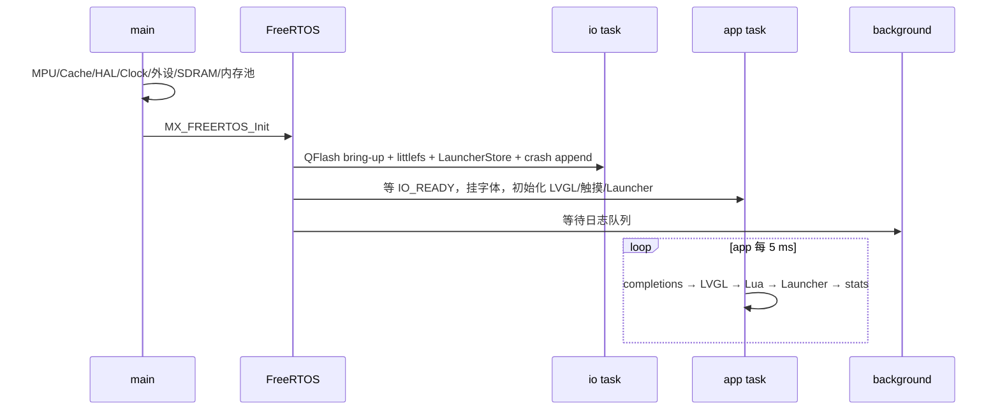
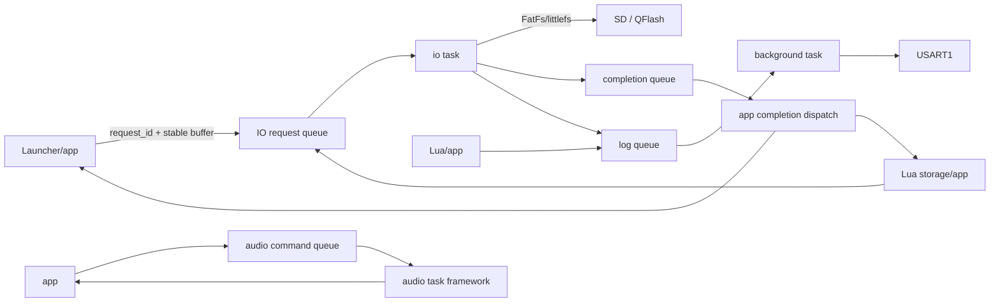

# CartDesk-OS 最新项目进度报告

> 审查日期：2026-08-04（Asia/Tokyo）  
> 审查基线：`main` / `e35ea46`  
> 事实来源：当前工作树、Git 最近 30 条历史、最新 CodeGraph 索引、当前源码/构建配置/文档/生成产物，以及本次实际执行的 Release、SizeDebug 和 host 测试。  
> 状态口径：严格区分“已完成并实际接入”“已实现但尚未完全接入”“开发中”“只有框架”“仅文档设计”“仅测试实现”“已废弃”和“待确认”。本次没有烧录目标板，所有硬件行为均保留“需要实机验证”。

## 1. 报告范围与结论摘要

CartDesk-OS 是面向 STM32H743XIH6 的嵌入式桌面与 Cart 启动器固件。与旧 `PROJECT_PROGRESS.md` 相比，当前主线新增了四组实质能力：Launcher 五个系统入口已显示 Tabler A8 图标；Lua 应用实例在 `init(self)` 前创建五个独立 table；`ui/assets/storage/timer/system/random/log/crc` 八个 Foundation 模块已注册；RTOS 的 io/background 已从空壳变为真实 worker，Launcher 探测、图标缓存、Lua storage、崩溃日志和正常日志 UART 输出已经迁移。

但不能把这些变化解释为整个系统完成：五个系统入口仍无业务页面；audio 只有 STOP/RESET 命令框架；Lua Cart ENTRY、INDEX/DATA 和图片/任意资源读取仍在 app task 同步执行；USB CDC RX 仍丢弃；状态栏、电源管理、看门狗、文件管理和真实音频仍未实现。Release、SizeDebug 均成功，但仍有 5 组 C 编译警告和 1 组链接器警告，且不生成 BIN/HEX。

本次发现一个 P0：`Core/LuaPort/modules/lua_random.c:l_integer()` 没有限制随机区间跨度。跨度大于 `2^32` 且低 32 位为 0 时会把 `range` 截断为 0，再执行取模，Lua 可触发除零/UsageFault；全 64 位边界的有符号减法还可能溢出。另有 P1：标准 host 测试构建已因缺 include path和缺 `CartLog_Write` stub 失效，固件 CTest 仍为 0；storage 声称只支持 32 位 integer，但写入时直接把 Lua 64 位整数强转为 `int32_t`，存在静默截断。

CodeGraph 在审查时为最新：1,967 文件、42,274 节点、112,553 边。它确认 `CartIoService_Submit()` 只有 Launcher 与 Lua storage 共 5 个调用者，`CartIoService_WorkerRun()` 只由 io task 调用，`Launcher_HandleIoCompletion()` 只由 app task 调用，`CartLog_ProcessOne()` 只由 background task 调用。

## 2. 当前 Git 状态

- 当前分支：`main`。
- 当前 HEAD：`e35ea46 refactor: 重构 RTOS 任务与异步 IO 架构`。
- 远端同步：`git rev-list --left-right --count origin/main...HEAD` 为 `0 0`，与 `origin/main` 完全同步。
- 未暂存修改：无，`git diff` 和 `git diff --stat` 均为空。
- 已暂存修改：无，`git diff --cached` 为空。
- 未跟踪文件：审查开始时只有用户已有的 `PROJECT_PROGRESS.md`；本次新增本报告 `PROJECT_PROGRESS_LATEST.md`。
- 冲突：无。
- 调试中代码：没有未提交源码可判定为调试中；提交代码仍含明确的框架、实验路径和待验证部分。
- 继续开发适合度：适合，但应先修复 P0 random 边界和测试入口；不要把当前测试状态当作健康基线。

最近 30 条提交按主题归类如下：

| 提交范围 | 已完成的主要工作 |
|---|---|
| `e35ea46` | 四任务消息协议、真实 io worker、Lua storage 异步化、Launcher 异步探测、background logger、audio 命令框架 |
| `e29ae50` | 八个 Lua Foundation 模块、只读模块代理、owner registry、示例和部分 host 测试 |
| `3a36bfc` | 五个 self table、UI full userdata、安全 owner/generation/alive、删除级联失效 |
| `3fb6474` | 五个 Tabler SVG、MIT License、离线 A8 生成器、统一 ID、Launcher 接入 |
| `2c51c22`～`3763002` | Fault 崩溃记录、CubeMX 同步、Launcher QFlash 图标持久化 |
| `b1f03f6`～`8a2e465` | littlefs 挂载/擦除修正、Cart 图片读取重试、QFlash 字体容量和共享字体 |
| `e9dd3ce`～`370b79f` | 应用退出内存统计、仪表盘、应用任务调度重构 |
| `a6177e3`～`2686d45` | 文档清理、Cart 启动/资源链优化、Header CRC 修正 |
| `04e27da`～`343f54b` | Cart 合并、DWT 审计、链接配置、DMA 缓冲、USB/中间件同步 |
| `fb78e74`～`c6363b7` | QFlash 全量字库、外设同步、CMake preset |
| `3d92c6d`～`4ddc7e6` | 极限压缩 preset、Cart 分支合并、Launcher 标题滚动优化 |

最近工作重点已经从“单 app task 骨架”转为“Lua Foundation + owner 安全 + 异步 I/O 边界”。

## 3. 最近完成的工作

1. 系统入口资源链已经完整接入：原始 Tabler SVG → 离线脚本 → 40×40 A8 C 资源 → `cart_system_icon_id_t` → Launcher `lv_image`。
2. `lua_rt_create_instance_from_loaded()` 在缓存回调之前创建 self、UI owner 和 Foundation owner；每次 restart 会 `lua_shutdown()` 后重新加载，因此 self table 重新创建。
3. Foundation API 通过 `lua_port_bind()` 以只读代理注册，旧 gpio/pwm/delay/rng 模块从正式构建和示例中移除。
4. io task 现在初始化 QFlash/littlefs/LauncherStore，处理 Cart 探测、预览、LauncherStore、Lua storage 和崩溃日志。
5. background task 消费 `CartLog` 队列并拥有正常运行期 UART 阻塞输出；日志生产者不再直接阻塞。
6. audio task 有独立 command/completion queue，但只返回 STOPPED/RESET 状态，没有声音输出。
7. RTOS 任务栈调整为 app 32 KiB、audio 8 KiB、io 12 KiB、background 6 KiB。

## 4. 与旧 PROJECT_PROGRESS.md 的主要变化

| 模块 | 旧报告状态 | 当前状态 | 变化证据 |
|---|---|---|---|
| Launcher 五个系统入口 | 只有选择态 | 图标已显示，业务页仍未实现 | `DesignLauncher_Create()` → `prv_create_circle_area()` → `CartSystemIcon_GetSource()`；点击仍只调用 `prv_set_selection()` |
| 系统图标 | 未实现 | 资源、组件、Launcher 接入完成 | `Core/Screen/Assets/cart_system_icons*.c`、`tools/ui/generate_system_icons.py`、`app_screen` 构建目标 |
| Lua 应用 self 结构 | 旧式或未确认 | 五 table 已实际创建 | `lua_rt_create_instance_from_loaded()` → `lua_rt_build_self()` → `LuaAppInstance_CreateDefaultTables()` |
| Lua UI API | 旧 API/开发中 | 正式 handle API 已注册 | `lua_port_bind()` 注册 `ui`；`lua_ui_owner_test` 本次重新编译产物执行通过 |
| Lua assets API | 未实现 | 已实现并注册，资源读取仍同步 | `luaopen_assets()`；`assets.image` → `res_acquire_image`，`assets.data` → `cart_read_data` |
| Lua storage API | 未实现 | 已实现并通过 io task | `lua_storage_owner_create/l_commit` → `CartIoService_Submit()` → `storage_load/storage_commit()` |
| Lua timer API | 未实现 | 已实现，app task 安全点执行 | `lua_foundation_process()` → `lua_timer_process()`；每 owner 32、每帧 8 回调 |
| Lua system API | 未实现 | 已实现并注册 | `lua_foundation_platform_*` 读取 LVGL、heap、SD、USB；exit/restart 请求 LuaRuntimeTask |
| Lua random API | 旧 rng 或未完成 | 使用 STM32 RNG，但存在 P0 跨度缺陷 | `lua_random.c` → `RNG_GetU32/RNG_Fill`；未调用 `rand()` |
| Lua log API | 同步 printf | 已进 background 队列 | `lua_log.c` → `CartLog_Write()` → queue → `CartLog_ProcessOne()` → `HAL_UART_Transmit()` |
| Lua crc API | 未实现/旧底层 | 已注册 CRC-32/ISO-HDLC | `lua_crc.c` → `CRC32_IEEE_Calculate()`；`lua_crc_test` 固定向量通过 |
| FreeRTOS 任务拆分 | 3 个 worker 空壳 | io/background 有真实职责；audio 仍框架 | `freertos.c`、`cart_io_service.c`、`background_task.c`、`audio_task.c` |
| app task | 所有业务和存储 | 保留 LVGL/Lua；处理 completion；仍有同步 Cart 资源 I/O | `CartdeskAppTask_Run()`；`lua_vm.c/cart_index.c/resource_manager.c` 仍调用 FatFs |
| io task | 空壳 | 部分真实迁移完成 | `StartIoTask()` → `CartdeskPeripheralTask_Run()` → `CartIoService_WorkerRun()` |
| audio task | 空壳 | 有命令队列，无音频能力 | `CartdeskAudioTask_Run()` 只处理 STOP/RESET |
| background task | 空壳 | 正常日志和 stats 输出 owner | `CartdeskBackgroundTask_Run()` → `CartLog_ProcessOne()` / `RuntimeStats_PrintEveryMs()` |
| Cart 探测 | app 同步每秒读取 | Launcher 请求、io 执行、app completion | `prv_probe_game_card()` → `CART_IO_OP_CART_PROBE` → `cart_bin_read_info_from_sd()` |
| LauncherStore | app/QFlash 同步 | io 初始化和写入，app 只读 RAM index | `CartIoService_WorkerInitialize()`；`LauncherStore_Get()` 仅复制 `s_index` |
| QFlash littlefs | Launcher 缓存使用 | 增加每 Cart storage，统一由 io 写 | `/launcher/*` 和 `/apps/<cart_id>/storage.bin`；QFlash exclusive 暂停 app |
| 崩溃记录 | 已实现、app 启动落盘 | 落盘迁到 io 初始化阶段 | `CartdeskPeripheralTask_Run()` → `CrashRecord_FlushPendingToSd()` |
| USB CDC | 初始化但 RX 丢弃 | 无实质变化 | `CDC_Receive_HS()` 只重新 arm；line coding 分支为空 |
| 测试体系 | CTest 0，零散 host 源码 | 新增测试，但标准 host 构建已破坏 | Release/SizeDebug CTest 均 0；Foundation owner 缺 include，runtime test 缺 logger stub |
| BIN/HEX 产物 | 不生成 | 无变化 | CMake post-build 只有 SDRAM 报告；build 目录只有 ELF/MAP |
| 编译警告 | 5 C + 1 linker | 无变化 | 两个 preset 实际构建仍出现同组警告 |

## 5. 当前核心目录结构

```text
Core/Src/                 main、CubeMX 外设、FreeRTOS、Lua VM
Core/APPS/TASK/           app/io/audio/background、消息协议、LuaRuntimeTask
Core/Screen/              Launcher、系统图标、图标 SDRAM 缓存
Core/Cart/                Cart v2、INDEX/DATA、LauncherStore
Core/LuaPort/             Lua 5.4、Foundation、UI/asset/timer owner、resource manager
Core/Driver/              LCD/SDRAM/GT911/QFlash/littlefs/RNG 等硬件封装
Core/Memory/              固定 SDRAM 布局、D-Cache、meminfo
Core/Debug/               Fault、stats、overlay、未接入板测
FATFS/                    SDMMC diskio、FatFs mount
USB_DEVICE/               USB Device CDC
tests/                    host C 测试、Lua 脚本测试
tools/luavm/              host Lua 编译器与部分测试构建
tools/ui/                 系统图标离线生成器
Docs/                     架构、Lua、RTOS、Cart、显示和调试文档
```

## 6. 硬件与基础配置

| 项目 | 当前确认值 | 证据 |
|---|---|---|
| MCU | STM32H743XIH6，TFBGA240，Cortex-M7 | `cartdesk-os.ioc` |
| CPU / SYSCLK | 480 MHz | `.ioc` RCC 与 `SystemClock_Config()` |
| HCLK/AXI/AHB | 240 MHz | `.ioc` `HPRE=DIV2` |
| APB1/2/3/4 | 120 MHz | RCC 配置 |
| Internal Flash | 2 MiB | `STM32H743XX_FLASH.ld` |
| ITCM / DTCM | 64 KiB / 128 KiB | 链接脚本 |
| AXI / D2 / D3 SRAM | 512 / 288 / 64 KiB | 链接脚本 |
| SDRAM | 64 MiB，`0xD0000000..0xD3FFFFFF` | FMC 配置、链接脚本、`sdram_layout.h` |
| QFlash | 双 W25Q256，64 MiB，memory-map `0x90000000` | QSPI DualFlash、`flash.c`；前 16 MiB 字体，后 48 MiB littlefs |
| SD | SDMMC1 4-bit + IDMA + FatFs，200 MHz kernel / ClockDiv 8 | `.ioc`、`sd_diskio.c` |
| 显示 | 800×480 LTDC ARGB8888，Layer1 DIRECT 双缓冲，DMA2D | `.ioc`、`lv_port_disp.c`、`lcd.c` |
| 触摸 | GT911，I2C2 + EXTI3，最多 5 点 | `touch.c`、`lv_port_indev.c` |
| USB | OTG HS 控制器、内部 FS PHY、Device CDC | `.ioc`、`USB_DEVICE/` |
| RTC | LSI 32 kHz，当前主要用于 backup crash record | `rtc.c`、`crash_record.c` |
| RNG / CRC | STM32 硬件 RNG；CRC 外设配置为 IEEE 反射输入/输出 | `rng.c/rng_port.c`、`crc.c` |
| TIM | TIM2/3 PWM 配置但正式 Lua PWM 已移除；TIM17 运行时计时 | `.ioc`、`tim.c` |
| UART | USART1；正常日志由 background 阻塞发送，应急 printf 仍同步 | `cart_log.c`、`syscalls.c` |
| FreeRTOS heap | heap_4，98,304 B，位于 AXI `.ram_runtime` | `FreeRTOSConfig.h`、`freertos_heap.c` |

硬件数字与旧报告基本一致；当前变化主要是任务栈和静态/动态运行时占用，不是硬件配置变化。所有 SDRAM、QFlash、触摸、USB、SD 热插拔和 Fault 保持行为仍需本次之外的实机验证。

## 7. 当前启动流程



`main()` 初始化 MPU、I/D Cache、HAL、时钟、GPIO/MDMA/LTDC/FMC/RTC/UART、CrashRecord、SD/FatFs、CRC/DMA2D/QSPI/I2C/RNG/TIM、SDRAM 和固定内存池，然后创建调度器。USB 仍由 `StartAppTask()` 在进入 app 主循环前初始化。

## 8. 当前 RTOS 任务架构

| 任务 | 优先级 | 栈 | 是否实际工作 | 当前职责 | 队列 |
|---|---:|---:|---|---|---|
| app | AboveNormal | 32 KiB | 是 | LVGL、Lua VM/生命周期/timer、Launcher、completion、stats snapshot | 消费 IO/audio completion |
| io | Normal | 12 KiB | 是 | QFlash/littlefs、LauncherStore、Cart 探测/预览、Lua storage、崩溃 SD append | IO request/completion 各 16 |
| audio | High | 8 KiB | 只有框架 | STOP/RESET 状态机，无播放 | command/completion 各 8 |
| background | Low | 6 KiB | 是 | CartLog UART、RuntimeStats 文本输出 | log queue 24 |

真实 owner：LVGL、Lua VM、Lua callback 均为 app；QFlash/littlefs/LauncherStore 写操作为 io；正常业务日志 UART 为 background；崩溃前/调度器前应急 UART 仍可同步；FatFs 并未完全单 owner，Launcher/crash 已在 io，但 Lua ENTRY、Cart INDEX/DATA/resource manager 仍由 app 调用；audio 硬件 owner 尚不存在；USB CDC 由 USB 中间件回调，不属于 background logger。

app 5 ms 循环精确顺序：最多 8 条 worker completion → 若 QFlash exclusive 则跳过 UI/Lua → `lvgl_task_handler()` → `LuaRuntimeTask_Process()` → `Launcher_Task()` → 可选 overlay → frame stats → heartbeat/stack high-water → snapshot → `osDelayUntil()`。



消息包含 request ID、owner ID、提交 tick、超时和显式 buffer source；不包含 `lua_State *`、`lv_obj_t *`，也未发现局部栈地址。目标端文档记录 request 72 B、completion 40 B；队列 payload 约 6.3 KiB，另有 CMSIS/FreeRTOS 控制块开销，均从固定 96 KiB heap 动态分配。超时只在 worker 开始处理前判断，不能中断已经进入的 FatFs/Flash 操作。取消只对未开始请求生效；running request 允许完成，由 stale completion 路径回收 heap buffer。

## 9. Lua 应用实例与生命周期

- 五个 table 创建位置：`LuaAppInstance_CreateDefaultTables()` 创建 `state/ui/assets/timers/services`；调用链为 `lua_init_from_cart()` → `lua_run_cart_entry()` → `lua_rt_create_instance_from_loaded()` → `lua_rt_build_self()`。
- 独立性：每个实例都有独立 self table、独立 `_ENV`、owner ID、generation、UI root、asset/timer/storage owner。
- restart：`LuaRuntimeTask_Process()` 先 `lua_shutdown()` 再 `lua_init_from_cart()`，因此 VM、self、owner 和 table 均重新创建。
- 初始化失败：self/owner 建立失败会回滚；`init(self)` callback 抛错会清理 Foundation/UI owner 并把实例置 dead，但不会把 `LuaRuntimeTask` 状态转为 ERROR，这是当前 P1 行为缺口。
- `self.children`：源码、测试、示例和正式文档未发现调用；`foundation_runtime_test.lua` 明确断言其不存在。
- 旧 `ui.patch(self,"id",props)` / `ui.patch("id",props)`：未发现调用；当前只接受 `(handle, properties)`。
- 宿主回收不依赖 `self.*` table；owner registry 持有 UI/asset/timer 资源引用。
- 退出顺序：停止调度 → `final(self)` → Foundation owner（timer/asset/storage）销毁与 storage owner 取消 → UI root/handles 删除 → callback/env/self/thread unref → resource arena reset → `lua_close()`。
- 已确认回调：`init/final/fixed_update/update/late_update/on_message/on_input/on_reload`。帧顺序为 input → 0..5 fixed → update → late_update → message。button 的 `input` 属性已经从 LVGL event 投递 owner 定向 `on_input`；通用硬件输入和通用 message 生产者仍缺失。`lua_reload()` 仍无产品触发入口。

## 10. Lua Foundation API

### ui

- 状态：已完成并实际注册；仅支持 root/container/label/button/image。
- Lua 注册位置：`Core/LuaPort/lua_port.c:open_ui()` / `lua_port_bind()`。
- C 实现文件：`lua_ui.c`、`modules/lua_ui_{container,label,button,image}.c`。
- 当前公开 API：`root/container/label/button/image/patch/delete`。
- 实际调用链：Lua callback（app task）→ 模块 C 函数 → owner 校验 → LVGL。
- 使用的底层能力：LVGL 对象、style、event；button event 只投递 Lua input 队列，不在 LVGL callback 直接执行 Lua。
- owner/生命周期：full userdata 含 VM、owner、owner generation、object generation、alive；root 统一回收。
- 参数边界：`patch` 只收 handle；parent 必须为同 owner root/container/button；`id` 仅 debug，不做查找。
- 错误处理：返回 `nil,error`；删除事件使 handle 失效，父删除通过 LVGL 递归使子 handle 失效，跨应用拒绝。
- 测试：`lua_ui_owner_test` 本次执行通过，覆盖跨 owner、删除、父级删除、重复 owner destroy；Lua runtime UI 脚本只完成语法编译，未在完整固件环境执行。
- 文档：`Docs/LUA_FOUNDATION_API.md`、`Docs/lua/lua_runtime_contract.md` 基本一致。
- 已知问题：无板级 LVGL 压力/反复 restart 测试；只有 app task 单线程约束保证线程安全。
- 下一步：补真实 runtime 集成测试和 repeated restart/use-after-delete 测试。

### assets

- 状态：已实现并注册；正式资源读取仍在 app 同步执行。
- Lua 注册位置：`lua_port_bind()` → `luaopen_assets()`。
- C 实现文件：`modules/lua_assets.c`、`cart_index.c`、`resource_manager.c`。
- 当前公开 API：`exists/image/data`。
- 实际调用链：`assets.image` → `res_acquire_image` → `cart_read_data`；`assets.data` 直接 `cart_read_data`。
- 使用的底层能力：正式 `cart_index/resource_manager/RESOURCE_ARENA`；没有新增第二套正式缓存，legacy `lua_cart_resource_cache` 默认关闭。
- owner/生命周期：image asset 是 full userdata，按 owner/generation 校验，退出 release；Lua string 自持有 data 副本。
- 参数边界：相对路径、<256 B；拒绝 `/`、`:`、反斜杠、空 segment 和 `..`；`data` 最大 256 KiB。
- 错误处理：缺 index、路径、资源或读取失败返回 `nil,error`；binary string 使用长度 API，支持 `0x00`。
- 测试：API 源码/脚本存在；没有本次可执行的完整 assets runtime 测试。
- 文档：Foundation 文档基本一致。
- 已知问题：同步 SD 阻塞 app；资源 entry CRC 仍未校验；image handle 需实机退出压力验证。
- 下一步：在不把 Lua/LVGL 指针送入 worker 的前提下异步化 DATA 读取并补 CRC。

### storage

- 状态：已实现、已接 io task；标准集成测试缺失。
- Lua 注册位置：`lua_port_bind()` → `luaopen_storage()`。
- C 实现文件：`modules/lua_storage.c`、`cart_io_service.c`。
- 当前公开 API：`has/get/set/remove/commit/clear`。
- 实际调用链：owner create 异步 load → app completion → init；commit 快照 → io → littlefs temp/sync/close/rename。
- 使用的底层能力：QFlash 后 48 MiB littlefs，按 64 位 cart_id 隔离到 `/apps/<id>/storage.bin`；不会访问 `/launcher`。
- owner/生命周期：每 owner 16 KiB、128 键；退出取消 owner，旧 completion 只回收 buffer。
- 参数边界：key 1..64 B、string ≤4 KiB、总 payload 16 KiB；boolean、32 位 integer、double、string。
- 错误处理：header magic/version/size/file length/CRC 校验；损坏返回 load failed；commit 返回“已入队”，不是落盘完成。
- 测试：`foundation_runtime_test.lua` 有 binary string/CRUD 源码但未实际执行；无 littlefs corruption/atomic recovery 测试。
- 文档：总体一致，但“32 位 integer”与实现不一致。
- 已知问题：Lua 64 位 integer 未做范围检查，直接转 `int32_t` 静默截断；running commit 不可中断；commit 结果不反馈 Lua；QFlash 写期间 app 静默暂停。
- 下一步：先修 integer 边界并建立内存 backend/故障注入测试。

### timer

- 状态：已实现并实际接入 app 帧安全点。
- Lua 注册位置：`lua_port_bind()` → `luaopen_timer()`。
- C 实现文件：`modules/lua_timer.c`、`lua_foundation.c`。
- 当前公开 API：`now_ms/after/every/cancel/active`。
- 实际调用链：`lua_update_task()` → `lua_foundation_process()` → `lua_timer_process()` → `lua_pcall()`。
- 使用的底层能力：FreeRTOS tick 扩展为 64 位，不使用 ISR 或 RTOS software timer 调 Lua。
- owner/生命周期：每 owner 32 个；退出逐个 unref callback/self；handle 为 full userdata。
- 参数边界：5..86,400,000 ms；每帧最多执行 8 个到期 callback。
- 错误处理：callback traceback 写日志并停用 timer；repeating callback 自取消安全。
- 测试：Lua test 源码存在但当前未执行；无 callback storm/restart registry leak 实测。
- 文档：基本一致。
- 已知问题：积压 repeating timer 直接跳到未来，属于丢 tick 策略；实机风暴和堆水位待确认。
- 下一步：补 host fake-clock 测试，覆盖自取消、抛错、退出和每帧预算。

### system

- 状态：已实现并注册；部分状态需实机验证。
- Lua 注册位置：`lua_port_bind()` → `luaopen_system()`。
- C 实现文件：`modules/lua_system.c`、`lua_foundation_platform.c`。
- 当前公开 API：`screen_size/firmware_version/uptime_ms/memory_info/sd_status/usb_status/exit/restart_app`。
- 实际调用链：Lua → platform adapter → LVGL/FreeRTOS/resource manager/FatFs/USB state/LuaRuntimeTask。
- 使用的底层能力：真实 display、heap、disk 和 USB handle 状态。
- owner/生命周期：exit/restart 需要 active owner，只设置 LuaRuntimeTask 请求；不在 Lua C 栈内销毁 VM。
- 参数边界：全部无参；返回表不暴露地址或句柄。
- 错误处理：无 display/snapshot 或请求拒绝返回 `nil,error`。
- 测试：API smoke 源码存在但 host luavm 不绑定模块，未实际运行。
- 文档：API 名称一致。
- 已知问题：firmware version 由 CMake 固定为 `0.1.0`，不是 Git/version artifact；USB connected/configured 语义需板测。
- 下一步：把版本接发布流程并做设备状态板测。

### random

- 状态：已注册并使用硬件 RNG，但有 P0 参数边界缺陷。
- Lua 注册位置：`lua_port_bind()` → `luaopen_random()`。
- C 实现文件：`modules/lua_random.c`、`Driver/RNG/rng_port.c`。
- 当前公开 API：`integer/number/bytes`。
- 实际调用链：Lua → `RNG_GetU32/RNG_Fill` → STM32 HAL RNG；不使用 `rand()`。
- 使用的底层能力：STM32 RNG，驱动含 retry、seed/clock/timeout 错误。
- owner/生命周期：仅 app task 的 Lua 调用，当前无需跨任务锁；未公开 handle。
- 参数边界：bytes 0..4096；integer 当前错误地接受任意 Lua integer。
- 错误处理：硬件失败返回 `nil,"random hardware failed"`；正常 ≤32 位跨度使用 rejection sampling。
- 测试：Lua test 源码未执行；无硬件失败或大跨度固定测试。
- 文档：声称无偏，但未说明只支持 32 位跨度，与实现边界不一致。
- 已知问题：跨度截断为 0 可除零；超大范围分布错误；极端 signed subtraction 可溢出。
- 下一步：唯一 P0 修复任务应限定输入/跨度并增加 host 固定 RNG 边界测试。

### log

- 状态：已实现并通过 background task 输出。
- Lua 注册位置：`lua_port_bind()` → `luaopen_log()`。
- C 实现文件：`modules/lua_log.c`、`cart_log.c`、`background_task.c`。
- 当前公开 API：`debug/info/warn/error`。
- 实际调用链：Lua/app → 非阻塞 queue put → background → `HAL_UART_Transmit`。
- 使用的底层能力：CMSIS message queue 深度 24、USART1 阻塞 100 ms；RuntimeStats 也在 background。
- owner/生命周期：日志 tag 为 app_id；不打印裸指针，userdata 输出安全类型摘要。
- 参数边界：最多 16 参数；Lua 先构造 256 B，但 `CartLog` slot 实际只有 160 B，最终消息最多 159 字节。
- 错误处理：每 app 每秒 32 条；队列满丢弃并统计；计数无原子保护，多 producer 统计可能不精确。
- 测试：无 logger queue/full/rate host 测试。
- 文档：`Docs/LUA_FOUNDATION_API.md` 错写“四槽异步发送队列”和 256 B 最终长度；实现是 24 槽、160 B slot。
- 已知问题：Fault、调度器前 `_write/printf` 和板测仍同步 UART，这是保留的应急边界；USB transport 未接入。
- 下一步：先修正文档并补队列满、截断、rate/dropped 测试。

### crc

- 状态：已实现、注册并有本次通过的 host 固定向量。
- Lua 注册位置：`lua_port_bind()` → `luaopen_crc()`。
- C 实现文件：`modules/lua_crc.c`、`Core/Src/crc.c`。
- 当前公开 API：`crc32/verify32`。
- 实际调用链：Lua binary string + length → `CRC32_IEEE_Calculate()` → STM32 CRC peripheral。
- 使用的底层能力：polynomial `0x04C11DB7`、init `0xFFFFFFFF`、RefIn/RefOut true、XorOut `0xFFFFFFFF`，空数据 `0`。
- owner/生命周期：无 handle；app task 串行调用硬件 CRC。
- 参数边界：输入必须 binary string，≤1 MiB；使用 `lua_tolstring` 长度，不用 `strlen()`；expected 0..`0xFFFFFFFF`。
- 错误处理：返回非负精确数值；非法类型/长度返回 `nil,error`。
- 测试：`lua_crc_test` 本次执行通过，含空、`123456789`、`0x00` 和 verify；Lua vectors 只完成语法编译。
- 文档：算法与 Cart 规范一致。
- 已知问题：Cart resource/slot CRC 字段仍未在所有资源读取路径验证，这不是 Lua crc 函数本身的问题。
- 下一步：复用算法补 Cart chunk/resource 完整性验证。

## 11. Launcher 与系统图标

- 图标资源：已完成。五个官方 SVG、Tabler MIT `LICENSE` 和资源 `README` 均保存在 `Core/Screen/Assets/Icons/Tabler/`。
- 图标组件：已完成。统一 ID 为 `CART_SYSTEM_ICON_GALLERY/GAMEPAD/EXTENSIONS/SETTINGS/SLEEP`，映射函数拒绝非法 ID。
- 生成格式：40×40 A8，每个 1,600 B，五个约 8 KiB 加 descriptor，`static const` 位于 Internal Flash，不占运行期 RAM 图像副本。
- 离线生成：`tools/ui/generate_system_icons.py` 使用仓内 SVG 和 ImageMagick，不联网；生成 C/H 已提交并由 `app_screen` 构建。
- Launcher 接入：`prv_create_circle_area()` 创建 `lv_image` 并通过 `lv_obj_set_style_image_recolor()` 控制黑/青色；页面不直接引用底层 data array，只通过统一 source API。
- 对应功能页面：五个均未实现。`prv_circle_clicked_cb()` 只取消 app launch armed 并改变 selection；“显示图标”不等于相册/手柄/拓展/设置/休眠业务完成。
- 实机状态：40 px 光学校正、颜色和可读性需要目标屏确认。

## 12. Cart、资源与存储

Cart v2 仍支持 `XHGC_PAC`、4096 B header、15 slot、MANF、ENTRY、INDEX、DATA 和 Header CRC。Lua ENTRY 使用 `xhgc_cart_open_fatfs()` 流式送入 `lua_load(...,"b")`；优先 ENTRY slot，回退 header/manifest entry 文件。Launcher 探测和固定 200×200 预览已由 io 执行，但预览仍固定 `0x1000`，未统一到 slot0。

正式图片资源路径为 `cart_index_load()` → `resource_manager` → RESOURCE_ARENA；legacy `lua_cart_resource_cache` 默认 preset 关闭。INDEX entry 和 slot 保存 CRC，但 `xhgc_cart_read_file()` / `cart_read_data()` 未全面校验资源 blob CRC。

LauncherStore 使用 littlefs `/launcher/index.bin` 与独立图标文件，index/icon 均有 CRC，写入采用 temp + sync + rename。Lua storage 使用同一 littlefs 的 `/apps/<cart_id>/storage.bin`，有独立 header/CRC/原子提交，不能覆盖 LauncherStore 路径。QFlash write 前关闭 mapped read，结束恢复；app 在 exclusive counter 非零时暂停 LVGL/Lua，避免字体映射读与写并发，但会造成可见停帧，持续时间待实机测量。

## 13. 显示、触摸和输入

- 显示：LTDC 800×480 ARGB8888、Layer1 全屏 DIRECT 双缓冲、VBlank address reload、DMA2D 同步 draw，仍由 app 单 owner。
- VSync：flush 会等待 VSync，最坏 100 ms；不是 RTOS event 等待，仍可能拖慢 app。
- 触摸：GT911 I2C2 + EXTI3；ISR 只置状态，读取在 app/LVGL；单点 helper 未使用产生 warning。
- Lua 输入：`ui.button({input="..."})` 已把 clicked/pressed/released 定向投递给对应 owner 的 `on_input`；通用触摸坐标、手柄、USB 和系统 action mapping 尚未接入。
- 页面管理：只有 Launcher/runtime 两屏硬编码切换，无 page stack/router；五个系统页面不存在。

## 14. USB、日志与调试

USB CDC 初始化已接入，`system.usb_status()` 可读 device state；`CDC_Receive_HS()` 仍只重新 arm，数据没有进入任务或命令处理，line coding 控制分支为空。background logger 只输出 USART1，没有 USB transport。

普通 Lua/runtime/Launcher 日志大多进入 `CartLog`；`RuntimeStats_PrintEveryMs()` 在 background 调用，但宏默认是否实际打印仍由配置决定。Fault 捕获、启动期错误、`_write()` 和默认关闭的板测保留同步 UART。CrashRecord 保存四类 Fault 到 RTC backup，io 启动时尝试追加 `0:/logs/crash.log`；本次未执行破坏性 Fault 板测。

## 15. 模块完成度

以下“实际调用者”均来自当前调用链，不以 README 单独判定。

### 系统启动
- 状态：已完成并接入，需实机验证。
- 入口文件：`Core/Src/main.c`。
- 核心函数：`main()`、`MPU_Config()`、`MX_FREERTOS_Init()`。
- 实际调用者：Reset_Handler/C runtime。
- 当前能力：外设、SDRAM、内存池、四任务启动。
- 尚未完成：启动分阶段降级和 watchdog。
- 已知问题：多数失败进入永久 `Error_Handler()`。
- 下一步：板级启动 smoke 与错误阶段记录。

### Launcher
- 状态：基本完成并接入。
- 入口文件：`ui_screen_launcher.c`。
- 核心函数：`Launcher_Init/Task/HandleIoCompletion`。
- 实际调用者：app task。
- 当前能力：10 槽、探测、缓存、信息、启动/退出。
- 尚未完成：离线安装/删除/升级和系统页面。
- 已知问题：固定 `0:/cart.bin`，职责仍偏重。
- 下一步：先保持边界，避免与 P0 同时重构。

### 系统图标
- 状态：资源/组件/Launcher 接入完成。
- 入口文件：`cart_system_icons.c`。
- 核心函数：`CartSystemIcon_GetSource()`。
- 实际调用者：`prv_create_circle_area()`。
- 当前能力：五个可 style recolor 的 A8 图标。
- 尚未完成：对应页面。
- 已知问题：视觉效果待实机。
- 下一步：与首个真实系统页一起验收交互。

### 相册入口
- 状态：只有图标和选择态。
- 入口文件：`ui_screen_launcher.c`。
- 核心函数：`prv_circle_clicked_cb()`。
- 实际调用者：LVGL click event。
- 当前能力：显示/选中。
- 尚未完成：相册数据和页面。
- 已知问题：无动作。
- 下一步：产品范围确认后独立实现。

### 手柄入口
- 状态：只有图标和选择态。
- 入口文件：`ui_screen_launcher.c`。
- 核心函数：`prv_circle_clicked_cb()`。
- 实际调用者：LVGL click event。
- 当前能力：显示/选中。
- 尚未完成：手柄连接/映射页面。
- 已知问题：无手柄输入源。
- 下一步：先确认硬件/协议。

### 拓展入口
- 状态：只有图标和选择态。
- 入口文件：`ui_screen_launcher.c`。
- 核心函数：`prv_circle_clicked_cb()`。
- 实际调用者：LVGL click event。
- 当前能力：显示/选中。
- 尚未完成：拓展模型和页面。
- 已知问题：无业务定义。
- 下一步：待产品确认。

### 设置入口
- 状态：只有图标和选择态。
- 入口文件：`ui_screen_launcher.c`。
- 核心函数：`prv_circle_clicked_cb()`。
- 实际调用者：LVGL click event。
- 当前能力：显示/选中。
- 尚未完成：设置页面/系统配置存储。
- 已知问题：Lua storage 不是系统设置 store。
- 下一步：先定义设置 schema。

### 休眠入口
- 状态：只有图标和选择态。
- 入口文件：`ui_screen_launcher.c`。
- 核心函数：`prv_circle_clicked_cb()`。
- 实际调用者：LVGL click event。
- 当前能力：显示/选中。
- 尚未完成：系统 suspend/resume。
- 已知问题：无唤醒源协调。
- 下一步：独立设计电源状态机。

### 状态栏
- 状态：未实现。
- 入口文件：无。
- 核心函数：无；`s_status_label` 只是 Launcher 错误提示。
- 实际调用者：无全局状态栏调用者。
- 当前能力：局部状态文本。
- 尚未完成：时间/SD/USB/电量。
- 已知问题：不要误称已实现。
- 下一步：确认真实数据源后实现。

### 页面管理
- 状态：开发中。
- 入口文件：`ui_screen_launcher.c`。
- 核心函数：`prv_show_runtime_screen/prv_show_launcher_screen`。
- 实际调用者：Launcher runtime 状态机。
- 当前能力：两屏切换。
- 尚未完成：路由/页面栈/系统页。
- 已知问题：与 Launcher 耦合。
- 下一步：第二个真实页面出现后再抽象。

### Lua 生命周期
- 状态：主要能力完成。
- 入口文件：`Core/Src/lua_vm.c`。
- 核心函数：scheduler、`lua_shutdown/lua_reload`。
- 实际调用者：LuaRuntimeTask/app。
- 当前能力：8 callbacks、yield、fixed step、final。
- 尚未完成：通用 message/reload 产品入口。
- 已知问题：init callback 错误不传播到 RuntimeTask ERROR。
- 下一步：补错误传播与集成测试。

### Lua self 实例
- 状态：已完成并接入。
- 入口文件：`lua_app_instance.c`。
- 核心函数：`LuaAppInstance_CreateDefaultTables()`。
- 实际调用者：`lua_rt_build_self()`。
- 当前能力：五个独立 table，restart 重建。
- 尚未完成：`services` 仍为空。
- 已知问题：无。
- 下一步：仅随真实 service 扩展。

### Lua ui
- 状态：已完成并注册。
- 入口文件：`lua_ui.c`。
- 核心函数：owner/handle validate/patch/delete。
- 实际调用者：Lua app callback。
- 当前能力：安全 handle 与 5 类对象。
- 尚未完成：更多 widget/集成压力测试。
- 已知问题：依赖 app 单 owner。
- 下一步：补 restart/UAF 测试。

### Lua assets
- 状态：已实现但 I/O 尚未异步。
- 入口文件：`lua_assets.c`。
- 核心函数：`l_exists/l_image/l_data`。
- 实际调用者：Lua app callback。
- 当前能力：路径检查、图片 handle、binary data。
- 尚未完成：IO worker 化、resource CRC。
- 已知问题：阻塞 app。
- 下一步：在测试闭环后迁移读取。

### Lua storage
- 状态：已实现并接 io。
- 入口文件：`lua_storage.c`。
- 核心函数：owner create、`l_commit`、completion handler。
- 实际调用者：Foundation owner/app completion。
- 当前能力：隔离 KV、CRC、原子异步 commit。
- 尚未完成：结果通知和故障测试。
- 已知问题：整数静默截断。
- 下一步：修边界并测试。

### Lua timer
- 状态：已实现并接入。
- 入口文件：`lua_timer.c`。
- 核心函数：`create_timer/lua_timer_process`。
- 实际调用者：Foundation/app。
- 当前能力：after/every/cancel/active。
- 尚未完成：独立自动测试。
- 已知问题：风暴待验证。
- 下一步：fake-clock host 测试。

### Lua system
- 状态：已实现并注册。
- 入口文件：`lua_system.c`。
- 核心函数：各 `l_*` adapter。
- 实际调用者：Lua callback。
- 当前能力：屏幕/版本/内存/SD/USB/退出重启。
- 尚未完成：发布版本来源。
- 已知问题：版本固定 0.1.0。
- 下一步：接发布版本。

### Lua random
- 状态：已实现但有 P0。
- 入口文件：`lua_random.c`。
- 核心函数：`l_integer/l_number/l_bytes`。
- 实际调用者：Lua callback。
- 当前能力：硬件 RNG、≤32 位跨度 rejection sampling。
- 尚未完成：合法范围定义。
- 已知问题：超大跨度可除零。
- 下一步：本报告唯一推荐任务。

### Lua log
- 状态：已实现并接 background。
- 入口文件：`lua_log.c`、`cart_log.c`。
- 核心函数：`write_log/CartLog_ProcessOne`。
- 实际调用者：Lua/app 与 background。
- 当前能力：等级、app id、限速、drop。
- 尚未完成：USB transport/测试。
- 已知问题：文档队列和长度错误。
- 下一步：修文档并测 backpressure。

### Lua crc
- 状态：已完成并有 host 证据。
- 入口文件：`lua_crc.c`。
- 核心函数：`l_crc32/l_verify32`。
- 实际调用者：Lua callback。
- 当前能力：IEEE CRC、binary safe。
- 尚未完成：无模块内功能缺口。
- 已知问题：Cart 资源校验是外部缺口。
- 下一步：扩展 Cart 校验。

### Lua 输入
- 状态：部分接入。
- 入口文件：`lua_ui_button.c`、`lua_vm.c`。
- 核心函数：`button_event_cb/lua_post_input_for_owner`。
- 实际调用者：LVGL button event。
- 当前能力：button action 定向 owner。
- 尚未完成：通用触摸/手柄/system action。
- 已知问题：队列满只记录日志。
- 下一步：先定义 action mapping。

### Lua 消息
- 状态：VM 能力已实现，产品来源未接入。
- 入口文件：`lua_vm.c`。
- 核心函数：`lua_post_message`、message phase。
- 实际调用者：未找到生产调用者。
- 当前能力：16 深度消息队列和 `on_message` 分发。
- 尚未完成：消息总线/source。
- 已知问题：仅代码能力。
- 下一步：待真实用例。

### Lua 热重载
- 状态：已实现但未接产品入口。
- 入口文件：`lua_vm.c`。
- 核心函数：`lua_reload()`。
- 实际调用者：未找到。
- 当前能力：重载 file/cart/embedded 并 `on_reload`。
- 尚未完成：触发、错误 UX、并发策略。
- 已知问题：不可把 API 存在写成产品完成。
- 下一步：待 USB/debug 需求确认。

### Cart parser
- 状态：基本完成。
- 入口文件：`xhgc_cart.c`。
- 核心函数：open/header/MANF/INDEX/read。
- 实际调用者：Lua loader、cart_index、Launcher helper。
- 当前能力：v2.2 主要结构与 Header CRC。
- 尚未完成：全 slot/resource CRC、压缩。
- 已知问题：预览固定偏移分叉。
- 下一步：先补完整性测试。

### Cart 资源
- 状态：基本完成但同步。
- 入口文件：`cart_index.c`、`resource_manager.c`。
- 核心函数：`cart_index_load/cart_read_data/res_acquire_image`。
- 实际调用者：Lua cart mount、assets/ui.image。
- 当前能力：INDEX/DATA BGRA 图片和 scene cache。
- 尚未完成：异步、CRC、更多格式。
- 已知问题：app 阻塞。
- 下一步：P1 后独立迁移。

### LauncherStore
- 状态：完成并迁入 io。
- 入口文件：`launcher_store.c`。
- 核心函数：Init/Get/ReadIcon/Upsert。
- 实际调用者：io worker；app 只 Get RAM index。
- 当前能力：12 记录、CRC、atomic icon/index。
- 尚未完成：删除/容量 UX。
- 已知问题：littlefs 恢复需板测。
- 下一步：故障注入测试。

### SD/FatFs
- 状态：驱动完成，owner 尚未完全统一。
- 入口文件：`sd_diskio.c`、`fatfs.c`。
- 核心函数：SD read/write/mount。
- 实际调用者：io 及残留 app Lua/资源路径。
- 当前能力：IDMA、cache maintenance、bounce buffer。
- 尚未完成：热插拔服务和完整单 owner。
- 已知问题：`get_fattime()` 固定 0。
- 下一步：板测和分阶段迁移。

### QFlash
- 状态：基本完成。
- 入口文件：`flash.c`、`cart_io_service.c`。
- 核心函数：bring-up/map/prog/erase。
- 实际调用者：io 初始化和 littlefs。
- 当前能力：双 Flash、字体映射、存储写。
- 尚未完成：启动 JEDEC 强校验。
- 已知问题：板测写 smoke 会擦字体区且未接入。
- 下一步：只读诊断。

### littlefs
- 状态：完成并实际使用。
- 入口文件：`lfs_port.c`。
- 核心函数：bind/mount-or-format/mapped read。
- 实际调用者：io/LauncherStore/storage。
- 当前能力：48 MiB partition、缓存和 app KV。
- 尚未完成：完整 corruption/断电测试。
- 已知问题：CORRUPT 可触发格式化丢缓存。
- 下一步：故障注入。

### USB CDC
- 状态：开发中。
- 入口文件：`usbd_cdc_if.c`。
- 核心函数：Init/Receive/Transmit。
- 实际调用者：USB stack；无业务 RX consumer。
- 当前能力：CDC 枚举框架和 TX API。
- 尚未完成：RX queue、协议、line coding、日志。
- 已知问题：RX 丢弃，早期 TX pClassData 风险。
- 下一步：先确认用途。

### RTC
- 状态：局部完成。
- 入口文件：`rtc.c`、`crash_record.c`。
- 核心函数：RTC init、backup record。
- 实际调用者：main/crash。
- 当前能力：LSI 与 Fault 持久记录。
- 尚未完成：日历、FAT 时间、校时。
- 已知问题：精度/VBAT 待确认。
- 下一步：按产品时间需求设计。

### RNG
- 状态：驱动已接，Lua 边界有 P0。
- 入口文件：`rng_port.c`。
- 核心函数：GetU32/Fill/GetRange。
- 实际调用者：Lua random。
- 当前能力：硬件错误与 retry。
- 尚未完成：Lua 大范围契约。
- 已知问题：见 random P0。
- 下一步：修 API 边界。

### CRC
- 状态：硬件驱动已接。
- 入口文件：`Core/Src/crc.c`。
- 核心函数：`CRC32_IEEE_Calculate()`。
- 实际调用者：Cart header、LauncherStore、storage、Lua crc。
- 当前能力：统一 IEEE CRC。
- 尚未完成：资源 blob 全路径校验。
- 已知问题：无锁但当前调用时序基本串行；跨任务未来需审计。
- 下一步：扩展完整性验证。

### 显示
- 状态：基本完成。
- 入口文件：`lv_port_disp.c`、`lcd.c`。
- 核心函数：double buffer/flush/VSync。
- 实际调用者：app/LVGL。
- 当前能力：800×480 双缓冲 DMA2D。
- 尚未完成：本次实机防撕裂验证。
- 已知问题：VSync 最坏忙等 100 ms。
- 下一步：测量后决定 event 化。

### 触摸
- 状态：基本完成。
- 入口文件：`touch.c`、`lv_port_indev.c`。
- 核心函数：Touch_Init/IRQ/multitouch read。
- 实际调用者：app/LVGL。
- 当前能力：GT911 最多 5 点。
- 尚未完成：错误降级和板测。
- 已知问题：未用单点函数 warning。
- 下一步：清晰返回 init 状态。

### 任务拆分
- 状态：部分完成。
- 入口文件：`freertos.c`、`Core/APPS/TASK/*`。
- 核心函数：四 task run。
- 实际调用者：FreeRTOS。
- 当前能力：真实 io/background 和协议。
- 尚未完成：Lua/resource I/O、真实 audio。
- 已知问题：heap 实机低水位未知。
- 下一步：先修测试并测高水位。

### IO service
- 状态：已实现并接入部分业务。
- 入口文件：`cart_io_service.c`。
- 核心函数：Submit/WorkerRun/TryReceive/CancelOwner。
- 实际调用者：Launcher/storage/app/io。
- 当前能力：ID、owner、timeout、cancel、buffer ownership。
- 尚未完成：running cancel、大资源读取。
- 已知问题：无覆盖真实实现的自动测试。
- 下一步：host model 与实现级测试对齐。

### Background logger
- 状态：已实现。
- 入口文件：`background_task.c`、`cart_log.c`。
- 核心函数：ProcessOne/PrintEveryMs。
- 实际调用者：background task。
- 当前能力：normal logger UART owner。
- 尚未完成：USB、priority drop。
- 已知问题：文档参数过时、计数并发精度。
- 下一步：修文档/测试。

### Audio task
- 状态：只有框架。
- 入口文件：`audio_task.c`。
- 核心函数：Submit/Run/TryReceive。
- 实际调用者：app 仅消费 completion；未发现正式 submit caller。
- 当前能力：STOP/RESET 状态回执。
- 尚未完成：Codec、DMA、解码、播放。
- 已知问题：High 优先级和 8 KiB 栈为预留开销。
- 下一步：需求明确前不要写“音频完成”。

### 崩溃记录
- 状态：基本完成，落盘迁入 io。
- 入口文件：`fault_entry.S`、`crash_record.c`。
- 核心函数：Capture/Init/Flush。
- 实际调用者：Fault handler/main/io。
- 当前能力：四 Fault、BKP、UART、SD append。
- 尚未完成：本次板级端到端验证、reset cause。
- 已知问题：依赖 backup domain。
- 下一步：专用 Debug 固件验证。

### 性能统计
- 状态：基本完成。
- 入口文件：`runtime_stats.c`、`perf_monitor.c`。
- 核心函数：snapshot/PrintEveryMs。
- 实际调用者：app snapshot、background print。
- 当前能力：frame、task、queue、heap 指标。
- 尚未完成：板级阈值/CI baseline。
- 已知问题：Release perf 部分关闭。
- 下一步：SizeDebug 板测。

### Host 测试
- 状态：有源码但标准构建损坏。
- 入口文件：`tools/luavm/CMakeLists.txt`、`tests/`。
- 核心函数：各 test main。
- 实际调用者：手工构建；未注册统一 CTest。
- 当前能力：部分目标可独立通过。
- 尚未完成：Foundation/runtime build 修复与集成脚本。
- 已知问题：CTest 0。
- 下一步：P1 修测试闭环。

### 板级测试
- 状态：仅测试源码，未接生产入口。
- 入口文件：`Core/Debug/board_test.c`。
- 核心函数：显示/触摸/Flash tests。
- 实际调用者：未找到启动调用者。
- 当前能力：可供显式调试固件调用。
- 尚未完成：安全 test runner。
- 已知问题：Flash smoke 擦 offset 0 字体区。
- 下一步：隔离破坏性测试。

## 16. 构建状态与容量

正式构建方式为 CMake preset + Ninja + GNU Arm Embedded。编译器：`arm-none-eabi-gcc 14.3.1 20250623`（GNU Tools for STM32 14.3.rel1.20251027-0700）。

| 构建 | 结果 | 步骤 | Flash | DTCM | AXI | D2 | D3 | ITCM | SDRAM static |
|---|---|---:|---:|---:|---:|---:|---:|---:|---:|
| Release | 成功 | 244 | 544,152 B (25.95%) | 68,088 B (51.95%) | 365,216 B (69.66%) | 4,128 B | 0 | 0 | 1,966,848 B |
| SizeDebug | 成功 | 245 | 545,440 B (26.01%) | 71,352 B (54.44%) | 365,216 B (69.66%) | 4,128 B | 0 | 0 | 1,966,848 B |

Release `size`：text 543,064 B、data 1,068 B、bss 2,403,208 B。产物为 `build/Release/cartdesk-os.elf`（1,114,776 B）和 `.map`（1,498,555 B）；SizeDebug ELF 10,943,812 B、MAP 5,202,685 B。两个构建均没有 BIN/HEX。

相对旧报告 Release：Flash `+17,268 B`，DTCM `+2,240 B`，AXI static `+480 B`。主要对应系统 A8 图标、八个 Lua 模块、消息/owner 状态。FreeRTOS heap 配置仍为 98,304 B；任务栈总配置由 48 KiB 增至 58 KiB（`+10 KiB`）。新队列 payload 约 6.3 KiB 加控制块，也从同一 heap 分配，因此运行期 minimum-ever-free 比旧架构更紧，但没有本次板上测量值。Launcher SDRAM 静态占用无变化；图标位于 Flash。

警告：`lv_port_indev.c` 未用 `touchpad_read` 1 组；Launcher 文件大小 `snprintf` 截断 3 组；LCD 未用 `Font8x16_ASCII` 1 组；工具链 `crtn.o` 缺 `.note.GNU-stack` 1 组。无 error。

## 17. 测试状态

- Release CTest 注册/执行：0 / 0，输出 `No tests were found!!!`。
- SizeDebug CTest 注册/执行：0 / 0，同上。
- `xhgc_cart_host_test`：本次直接从当前源码编译执行通过。
- `task_message_contract_test`：本次 `-Wall -Wextra -Werror` 编译执行通过；它测试的是消息模型/尺寸契约，不直接调用真实 queue service。
- `lua_ui_owner_test`：当前对象文件新于当前源码，执行返回 0；覆盖跨 owner、删除失效、父删除、重复 destroy。
- `lua_crc_test`：当前对象文件新于当前源码，执行返回 0；固定向量和 binary zero 通过。
- `luavm --self-test`：通过，验证五 self table 的 host 创建。
- Lua style lint：通过。
- Lua syntax：8 个当前 `tests/lua` 与顶层/basic 示例使用 `luavm --compile` 全部通过。
- `lua_runtime_task_test`：标准 host CMake 链接失败，缺 `CartLog_Write`；本次用链接别名将新 logger 调用指向测试已有 no-op stub 后，当前源码测试返回 0。它不是标准构建通过证据。
- `lua_foundation_owner_test`：标准 host CMake 编译失败，`lua_foundation.h` 新增 `task_messages.h` 后目标未添加 TASK include path；旧可执行文件不计为当前通过。
- `api_smoke_test.lua`、`foundation_runtime_test.lua`、`crc_fixed_vectors_test.lua`：语法通过，但 host `luavm --check` 不注册八模块，不能执行；不能写成 runtime 通过。
- storage/timer/random/log：没有本次实际执行的模块级/集成测试。
- owner/cancellation：只有 contract model 与 UI owner；真实 IO service cancellation/stale completion 未运行。
- use-after-free/double-free：UI host 覆盖部分重复清理；asset/timer/storage、repeated app restart 无完整覆盖。
- 板级测试：0；未烧录、未运行。

## 18. 已确认问题

### P0

1. `random.integer()` 超大跨度可触发除零/UsageFault：`uint64_t span` 被强转为 `uint32_t range`，除 `2^32` 特例外未拒绝 `range==0`；Lua 可传入 64 位整数。验收应覆盖跨度 `1`、`2^32`、`2^32+1`、`2^33`、负边界及全范围，任何输入不得产生 UB/除零。

### P1

1. 固件 CTest 为 0，标准 host build 有两个确定回归：Foundation owner 缺 include path，runtime test 缺 logger stub。
2. storage 文档规定 32 位 integer，`l_set()` 未做范围检查，超范围值静默截断，可能持久化错误数据。
3. Lua Cart ENTRY、INDEX/DATA、assets/resource manager 仍在 app 同步 FatFs，任务拆分没有完成，慢卡或坏卡会阻塞 GUI/Lua。
4. `init(self)` callback 抛错只把实例置 dead，不传播为 LuaRuntimeTask ERROR，runtime screen 可能继续显示为“运行中”。
5. Cart resource/slot CRC 未在所有实际读取路径校验。

### P2

1. 新增 10 KiB 任务栈和约 6.3 KiB queue payload 后，96 KiB FreeRTOS heap 的实机最低余量未知；storage 还会临时分配最多 16 KiB。
2. QFlash 写通过暂停 app 避免并发，但会冻结 UI；持续时间未知。
3. VSync wait 最坏 100 ms；仍可能阻塞 app。
4. CartLog 多 producer 的 dropped/max-depth 计数未原子保护；统计可能不精确。
5. Lua log 文档写 256 B/四槽，实际最终 159 B/24 槽。
6. Release/SizeDebug 仍有 5 C warning + 1 linker warning。
7. BIN/HEX 不生成，发布闭环不完整。

### P3

1. 状态栏、系统页面、HID、文件管理、电源管理、watchdog、真实 audio 均未实现。
2. USB CDC RX、line coding 和协议未实现。
3. `get_fattime()` 固定 0；无有效 FAT 时间戳。
4. MDMA 正式业务用途仍不明确；legacy resource cache 和未用 LVGL init helper 增加维护成本。

## 19. 潜在风险

1. 任务优先级为 audio High、app AboveNormal、io Normal。未来真实 audio 加入后若缺 DMA/队列节流，可能抢占 app；目前 audio 只是阻塞队列，风险尚未发生。
2. QFlash memory-mapped 字体与 littlefs 写依赖 `s_qflash_pending` 静默窗口正确包围所有写路径；新增绕过 service 的 Flash/littlefs 调用会破坏该安全假设。
3. FatFs 当前由 app 和 io 两侧调用，虽然现有产品时序通常避免同时访问，未来新增异步请求可能形成跨任务并发。
4. completion queue 满时 storage heap buffer会回收；Launcher 使用 caller/static buffer。未来新增 buffer source 必须补失败所有权分支，否则会泄漏或 UAF。
5. owner cancellation 容量为 32 的环；owner ID 不复用使 stale 匹配安全，但长期行为依赖单调 ID 和覆盖策略，尚无长时间/回绕测试。
6. 资源、timer、storage 和 UI 都有 owner registry，但只有 UI 有较强 host 清理测试；多次 restart、OOM、callback error 的组合风险仍未量化。

## 20. 技术债务

- 测试目标分散在固件 CMake、host luavm CMake、shell 和手工 cc，接口变化没有统一门禁。
- Launcher 仍同时承担 UI、Cart 状态机、runtime screen 和 completion 状态。
- `cart_bin.c` 固定预览路径与通用 `xhgc_cart.c` 并存。
- Foundation 文档更新总体及时，但 logger 细节已经与实现不符，且 random/storage 边界未写清。
- 任务统计字段很多，但没有板上高水位/队列峰值基线。
- 生成产物只有 ELF/MAP，没有可直接刷写的 BIN/HEX。
- 板测源码存在但无安全入口，且 Flash smoke 具有破坏性。

## 21. 下一步优先级

### P0

修复 `random.integer()` 的整数边界：明确只支持能由单个 32 位 RNG 均匀覆盖的跨度（推荐跨度 1..`2^32`），用无溢出计算拒绝更大跨度，保持 `2^32` 特例，不允许 `range==0` 进入取模。验收：host 可注入固定 RNG；边界/负数/错误路径全通过；Release/SizeDebug 不增加 warning；同步更新 Foundation 文档。

### P1

1. 修复并统一 host test 构建：补 TASK include、logger stub，注册 CTest，实际执行 parser、task message、runtime、UI owner、Foundation owner、CRC 和 Lua syntax/style。
2. 给 storage integer 增加 `INT32_MIN..INT32_MAX` 检查和持久化固定向量。
3. 让 init callback failure 明确反馈 LuaRuntimeTask/Launcher。
4. 在独立任务中补 Cart resource CRC，不与异步 I/O 大改同时进行。

### P2

1. 板上记录四任务 stack high-water、FreeRTOS min heap、queue max depth、QFlash 静默窗口和 VSync wait。
2. 分阶段把 ENTRY/INDEX/DATA 读取迁入 io；worker 只处理 bytes，Lua/LVGL 对象仍由 app 创建。
3. 清理现有编译 warning并生成 BIN/HEX。
4. 修正 logger 和测试文档。

### P3

按产品优先级选择单个真实系统页面、USB 协议、音频或电源管理，不要同时铺开。状态栏、watchdog、RTC 日历和文件管理均应在真实需求与板级数据明确后实现。

## 22. 推荐下一次开发任务

**唯一推荐：修复 Lua `random.integer()` 的大范围崩溃边界，并建立该模块的可注入 host 边界测试。**

优先原因：这是当前唯一可由普通 Lua 参数直接触发 MCU Fault 的已确认 P0，范围小、可独立验证，不要求改 RTOS、Launcher 或存储。验收条件：无 signed overflow、无 modulo-by-zero；对跨度 1、常规区间、`2^32`、`2^32+1`、`2^33`、INT64 边界有固定测试；硬件 RNG 失败返回 `nil,error`；文档明确合法范围；Release/SizeDebug 构建成功且警告不增加。完成后下一任务才应是修复统一 host/CTest 闭环。

## 23. 需要开发者确认的问题

1. `random.integer()` 产品契约应只支持最大 `2^32` 个值，还是必须支持完整 Lua 64 位区间（后者需要多次 RNG 组合）？
2. storage 超出 32 位的 integer 应返回错误，还是升级磁盘格式为 64 位？
3. USB CDC 的目标是日志、调试命令、文件传输还是 Cart 工具链？
4. 五个系统入口中首个真实业务页面是哪一个？
5. audio task 是近期硬件计划还是可接受的预留框架？
6. QFlash 写时暂停 UI 是否符合产品体验，允许的最大时长是多少？
7. Cart ENTRY/资源异步化的 buffer 应优先使用 DMA_POOL、RESOURCE_ARENA 还是 RTOS heap？
8. 资源/slot CRC 为强制运行时校验还是可选 packer 标志？
9. 目标板是否有稳定 VBAT，Fault record 是否要求断电保持？
10. Release 发布是否明确要求 BIN/HEX，以及使用何种烧写流程？

## 24. 给后续 AI 的完整上下文

CartDesk-OS 是运行在 STM32H743XIH6（Cortex-M7 480 MHz、2 MiB Internal Flash）上的嵌入式桌面和 Cart 启动器固件。目标硬件包含 64 MiB 32-bit FMC SDRAM、双 W25Q256 QSPI Flash（合计 64 MiB）、800×480 LTDC 屏、DMA2D、GT911/I2C2 触摸、SDMMC1、USB OTG HS 控制器的内部 FS Device PHY、USART1、RTC/LSI、硬件 RNG/CRC。软件栈是 STM32H7 HAL、FreeRTOS/CMSIS-RTOS2、LVGL 9.5、FatFs、littlefs、Lua 5.4；构建使用 CMake preset、Ninja 和 arm-none-eabi-gcc 14.3.1。

当前 Git 为 `main`，HEAD `e35ea46 refactor: 重构 RTOS 任务与异步 IO 架构`，与 `origin/main` 为 0/0 同步。审查开始时没有 staged/unstaged 源码修改，只有未跟踪的历史 `PROJECT_PROGRESS.md`；不要修改或覆盖它。本报告是允许新增的唯一文件。CodeGraph 索引最新，理解代码应先用 `codegraph status/explore/search/callers/callees/impact`，再读具体文件。

系统启动由 `main()` 完成 MPU/Cache、外设、SDRAM和固定内存池后创建四个任务。app 为 AboveNormal/32 KiB，是 LVGL 和 Lua VM 的唯一 owner；每 5 ms 顺序处理最多 8 条 completion，检查 QFlash exclusive，然后执行 LVGL、LuaRuntimeTask、Launcher、stats。io 为 Normal/12 KiB，已经真实负责 QFlash bring-up、littlefs/LauncherStore、崩溃日志 SD append、Launcher Cart 探测/元数据/200×200 预览、LauncherStore 图标读写和 Lua storage。background 为 Low/6 KiB，消费深度 24 的日志队列，并独占正常运行期 USART1 阻塞输出和 stats 文本。audio 为 High/8 KiB，但只有深度 8 的 STOP/RESET command/completion 框架，没有 Codec、DMA 音频流、解码或播放能力。请求含 request ID、owner ID、timeout、稳定 buffer 和来源，不含 `lua_State *` 或 `lv_obj_t *`；取消只在执行前生效，旧 completion由 app 回收。

任务拆分尚未完成。Lua Cart ENTRY 加载、Cart INDEX/DATA、`assets.data()`、`assets.image()` 和 resource manager 仍在 app 同步调用 FatFs；慢卡会阻塞 GUI。QFlash/littlefs 写入由 io 处理，app 在 mapped mode 被关闭时暂停 LVGL/Lua，避免 QFlash 字体读写冲突，但会产生待实测的停帧。FatFs 目前也不是绝对单 owner：Launcher/crash 已迁入 io，Lua/资源路径仍在 app。正常日志走 background，Fault、调度器前 printf 和 `_write()` 仍可直接阻塞 UART。

Lua 实例通过 `lua_rt_create_instance_from_loaded()` 创建独立 `_ENV`、self、owner 和 coroutine。在 `init(self)` 前宿主自动创建 `self.state/self.ui/self.assets/self.timers/self.services` 五个独立普通 table；restart 会 shutdown 并重建 VM/table。`self.children` 和旧 `ui.patch(self,"id",props)` 已删除。资源回收依赖宿主 owner registry而不是这些 table：退出停止调度，调用 `final(self)`，销毁 timer/asset/storage owner，删除 UI root 和全部 handle，释放 registry refs，reset resource arena，再关闭 VM。已确认回调有 init、final、fixed_update、update、late_update、on_input、on_message、on_reload；帧顺序为 input、0..5 fixed、update、late、message。UI button 的 `input` 属性已连接 owner 定向 on_input；通用触摸/手柄输入、通用 message producer 和产品热重载入口仍未实现。init callback 抛错会清 owner 并禁用实例，但当前不会把 LuaRuntimeTask 切到 ERROR，这是 P1。

八个 Foundation 模块都由 `lua_port_bind()` 以只读代理注册。ui 提供 root/container/label/button/image/patch/delete，使用不可伪造 full userdata，记录 VM、owner、generation、alive；跨 app、已删除和非法 parent 被拒绝，父删除会通过 LVGL 递归使子 handle 失效。assets 提供 exists/image/data，复用 cart_index/resource_manager，拒绝绝对路径、`..` 和反斜杠，data 最大 256 KiB且支持零字节，但读取仍同步。storage 提供 has/get/set/remove/commit/clear，后端为 QFlash littlefs `/apps/<cart_id>/storage.bin`，每 Cart 隔离，16 KiB/128 键，header 与 payload CRC，temp+sync+rename；load/commit 经 io，commit 的 true 只代表入队。其宣称支持 32 位 integer，但实现未检查 Lua 64 位范围并会静默截断，是 P1。timer 提供 now_ms/after/every/cancel/active，每 owner 32、5 ms～24 h、每帧最多 8 callback，只在 app 安全点调用 Lua，退出自动 unref。system 返回真实 display/heap/SD/USB 状态，firmware version 当前硬编码构建宏 `0.1.0`；exit/restart 只设置请求，不在 Lua C 栈销毁 VM。random 使用 STM32 RNG 和 rejection sampling，但 `integer()` 对跨度大于 `2^32` 未限制，32 位截断后可能 modulo-by-zero/UsageFault，是当前唯一 P0。log 有 debug/info/warn/error，每 app 每秒 32 条，写入 background queue；Lua 先构造 256 B，但底层 slot 160 B，最终最多 159 B，文档错误地写成四槽。crc 是 CRC-32/ISO-HDLC：poly 0x04C11DB7、init/xorout 0xFFFFFFFF、RefIn/RefOut true、空数据 0，binary safe、最大 1 MiB，host 固定向量通过。

Launcher 有 10 个 Cart 槽，可异步探测 `0:/cart.bin`、恢复/写入 QFlash 图标缓存、显示信息、二次点击启动 Lua、EXIT 回桌面。五个系统入口“相册、手柄、拓展、设置、休眠模式”已经使用 Tabler Icons：仓库保留官方 SVG 和 MIT License，离线脚本生成 40×40 A8 const C 数据，统一 ID 经 `CartSystemIcon_GetSource()` 交给 Launcher，颜色由 LVGL recolor style 控制，资源位于 Internal Flash。五个入口点击仍只改变选择态，没有任何对应业务页面；不要把图标完成写成功能完成。状态栏、文件管理、系统设置、电源管理、watchdog、HID、真实 audio 均未实现。USB CDC 初始化存在，但 RX 只重新 arm、line coding 为空、无业务协议。

Cart v2 支持 XHGC_PAC、4096 B header、15 slot、MANF、ENTRY、INDEX、DATA 和 Header CRC；Lua bytecode 只以 binary mode加载。Launcher 预览仍固定读取 0x1000，与通用 slot parser 分叉。正式资源 owner 是 resource_manager/RESOURCE_ARENA，legacy lua_cart_resource_cache 默认关闭。slot/resource CRC 字段虽被解析，实际资源 blob 未全面校验。LauncherStore 的 index/icon 有 CRC 和原子重命名；storage 使用不同 `/apps` 路径，不会修改 `/launcher`。

本次 Release 244 步和 SizeDebug 245 步均成功。Release Flash 544,152 B（25.95%）、DTCM 68,088 B（51.95%）、AXI 365,216 B（69.66%）、D2 4,128 B、D3/ITCM 0、Launcher SDRAM static 1,966,848 B；相对旧报告 Flash +17,268 B、DTCM +2,240 B、AXI +480 B。FreeRTOS heap仍为 98,304 B，但任务栈总量增加 10 KiB，新队列还消耗约 6.3 KiB payload及控制块，必须实机测 minimum-ever-free。构建仍有 touch unused、Launcher snprintf 三组、LCD font unused和工具链 executable-stack warning；只有 ELF/MAP，没有 BIN/HEX。

测试现状不能写成完整通过：Release/SizeDebug CTest 都是 0。parser、task message contract、UI owner、Lua CRC、luavm self、Lua style以及 8 个脚本语法在本次可独立通过；标准 host CMake 中 `lua_foundation_owner_test` 因缺 TASK include path编译失败，`lua_runtime_task_test` 因缺 `CartLog_Write` stub 链接失败。runtime test 用手工链接兼容后可过，但不算标准入口通过。Foundation runtime、storage、timer、random、log、真实 IO cancellation、反复 restart和板级测试均没有本次运行证据。

当前最合适的下一任务只有一个：修复 `random.integer()` 大跨度 P0 并建立可注入 RNG 的 host 边界测试。明确最大跨度契约，使用无溢出计算，覆盖 1、2^32、2^32+1、2^33、负数和 INT64 边界，任何 Lua 参数都不能形成除零或 UB；同步更新 Foundation 文档，Release/SizeDebug warning 不增加。该任务不要同时重构 IO、Launcher 或 storage。之后再修统一 host/CTest 闭环。修改约束：先 CodeGraph 查调用链/impact；保护用户工作树；不全仓格式化、不自动升级依赖、不清理构建、不改 CubeMX 生成配置；功能/API/配置变化必须同步 Markdown；架构文档用 Mermaid；提交消息使用 Conventional Commit 前缀加简短中文描述。
