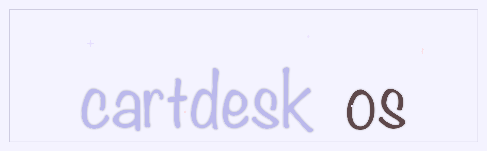

<p align="center">
  
</p>

# cartdesk-os

`cartdesk-os` 是一个运行在 STM32H743 上的嵌入式桌面/启动器固件。它以 LVGL 9.5 为图形层，使用 LTDC + SDRAM 做 800x480 ARGB8888 显示，内置 Lua 运行时，并通过 SD 卡里的 `cart.bin` 读取应用标题、预览图和入口脚本。

打包器仓库：[ExMikuPro/xhgc-pack](https://github.com/ExMikuPro/xhgc-pack)

这个项目目前更像一台小型掌机/桌面终端的固件底座：上电后初始化板级外设，进入 LVGL 启动器界面，用户点击卡带槽后再启动 Lua 应用。

## 当前能力

- LVGL 9.5 图形栈，包含显示、tick、输入设备移植层。
- LTDC 双缓冲显示链路，配合 VBlank/page flip 降低撕裂。
- 64 MiB 外部 SDRAM 固定分区，用于 framebuffer、保留的 SDRAM_LVGL_HEAP、DMA pool、launcher cache 和应用资源区；LVGL runtime heap 当前位于片内 RAM。
- SD 卡 `cart.bin` 读取，launcher 可显示卡带标题和 200x200 ARGB8888 预览图。
- Launcher 原生右下角操作提示栏，用字母和中文显示当前选中项操作。
- Lua VM 运行时，支持生命周期函数和 GPIO/PWM/UI 等宿主 API。
- FreeRTOS/CMSIS-RTOS2 任务模型，LVGL 和 Lua 在独立任务路径中调度。
- 运行时可观测性输出：主循环每秒打印一行 runtime stats，覆盖 LVGL/Lua/Launcher 帧耗时、Lua heap、resource arena、队列长度和 FreeRTOS 基础指标，并对 LVGL slow frame 继续拆分 `lv_timer` / `flush` / `flush_wait` / `input` / `screen` 来源。
- CMake/Ninja 构建，按模块拆成显示、存储、GPIO、Lua、UI、任务等静态库。

## 硬件目标

当前工程面向以下硬件配置：

| 项目 | 配置 |
| --- | --- |
| MCU | STM32H743 |
| 屏幕 | 800x480，ARGB8888 |
| 显示 | LTDC + DMA2D |
| 外部内存 | 64 MiB SDRAM，起始地址 `0xD0000000` |
| 存储 | SD/FatFs，卡带镜像路径 `0:/cart.bin` |
| 触摸 | GT911 路径已接入 LVGL 输入层 |
| 日志 | 标准输出重定向到板级串口路径 |

硬件管脚和 CubeMX 派生配置以仓库根目录的 `cartdesk-os.ioc`、`Core/Inc/main.h` 和 `Core/Src/*` 初始化文件为准。

## 构建

需要准备：

- CMake 3.22+
- Ninja
- `arm-none-eabi-gcc` 工具链
- Python 3，用于构建后打印 SDRAM 使用情况

配置并构建 Debug 固件：

```sh
cmake --preset Debug
cmake --build --preset Debug -j8
```

Release 构建：

```sh
cmake --preset Release
cmake --build --preset Release -j8
```

### CMake Preset 说明

仓库根目录的 `CMakePresets.json` 用来统一管理常用构建配置。当前各个 preset 的用途如下：

| Preset | 作用 | 适用场景 |
| --- | --- | --- |
| `Debug` | 默认开发构建，使用 ARM 交叉工具链，关闭内存自测、LCD memory overlay 和实验性 cart 资源缓存。 | 日常开发、CLion 调试、常规实机验证。 |
| `Debug-Memory-Overlay` | 在 Debug 基础上启用 `XHGC_MEM_OVERLAY_ENABLE` 和启动即显示的 `XHGC_MEM_OVERLAY_BOOT_VISIBLE`。 | 低频观察 LCD 上的 meminfo snapshot，不适合正式固件或日常刷机。 |
| `Debug-MemInfo-SelfTest` | 在 Debug 基础上启用 `XHGC_MEMINFO_SELFTEST_ENABLE`。 | 验证 `APP_ARENA_REST` / meminfo 的 `used`、`peak`、`reset`、`fail` 统计行为。 |
| `Debug-DmaPool-SelfTest` | 在 Debug 基础上启用 `XHGC_DMA_POOL_SELFTEST_ENABLE`。 | 验证 `DMA_POOL` 的临时 buffer 分配、对齐、越界失败记录和 reset 统计。 |
| `Debug-All-Memory-SelfTest` | 同时启用 meminfo 和 DMA_POOL 两组 Debug-only 内存自测。 | 本地集中回归内存统计相关行为，不建议作为默认刷机配置。 |
| `Debug-Experimental-CartCache` | 在 Debug 基础上启用 `XHGC_ENABLE_EXPERIMENTAL_CART_RESOURCE_CACHE`。 | 研究实验性 `lua_cart_resource_cache` 路径，不用于稳定版本。 |
| `Release` | 正式发布构建，关闭所有 Debug-only 自测、overlay 和实验缓存。 | 生成接近正式发布形态的固件。 |
| `Release-MinSize` | 在 `Release` 基础上额外启用 `CARTDESK_EXTREME_SIZE_OPT`，通过 LTO 并排除部分 demo / 调试源码进一步压缩体积。 | 需要尽量缩小固件体积、但又不想改变默认 `Release` 语义时。 |

这些 preset 都继承自隐藏的 `default` 配置：统一使用 `Ninja` 生成器、输出到 `build/<preset-name>/`，并通过 `cmake/gcc-arm-none-eabi.cmake` 选择 `arm-none-eabi` 工具链。

主要产物位于：

```text
build/Debug/cartdesk-os.elf
build/Debug/cartdesk-os.map
```

构建结束后，如果本机能找到 Python 3，CMake 会自动解析 map 文件并打印 SDRAM 各分区的静态使用情况。

CLion / CMake preset、自测构建和实验构建说明见 [Docs/CLion_Build_Presets.md](Docs/CLion_Build_Presets.md)。

### Host LuaVM 工具

固件预设使用 `arm-none-eabi-gcc` 交叉编译。PC 端 `luavm` 工具通过独立的 host CMake 子构建生成，复用 `Core/LuaPort/src` 里的同版本 Lua 源码，不会加入 STM32 固件镜像。

```sh
cmake --build build/Debug --target luavm_tool
cmake --build build/Debug --target copy_luavm_to_packer
```

工具产物路径：

```text
build/host_tools/bin/luavm
packer/tools/luavm
```

Windows 下文件名为 `luavm.exe`。

常用命令：

```sh
build/host_tools/bin/luavm --compile input.lua output.luac
build/host_tools/bin/luavm --check script.lua
```

## 运行入口

固件启动后的主要路径如下：

```text
Core/Src/main.c
  -> 初始化 HAL、时钟、GPIO、LTDC、DMA2D、FMC、SDMMC、FreeRTOS 等外设
  -> StartLvglTask()
      -> lv_init()
      -> lv_port_disp_init()
      -> lv_port_indev_init()
      -> LCD_DisplayON()
      -> Launcher_Init()
      -> 周期调用 lvgl_task_handler()
      -> 周期调用 Task_LUA()，未点击卡带槽时不会初始化 Lua VM
```

`Launcher_Init()` 会创建启动器页面，并尝试从 `0:/cart.bin` 读取第一个卡带槽的标题和预览图。开机默认不创建 Lua VM；点击卡带槽后，launcher 会先调用 `Task_LUA_StartCart("0:/cart.bin")` 提交启动请求，只有请求被接受后才切换到空白运行屏并保留系统 `EXIT` 按钮。随后 `Task_LUA()` 从 `cart.bin` 的 ENTRY 段加载 luac 并推进 `START_REQUESTED -> STARTING -> RUNNING` 生命周期状态机。点击 `EXIT` 只会请求 `Task_LUA_Stop()`，launcher 仅在 Lua task 回到 `IDLE` 后恢复 launcher 页面。

`StartLvglTask()` 同时承载 LVGL 刷新、Lua 生命周期调度和 cart 资源读取，线程栈按 32 KiB 配置，避免 Lua 初始化、FatFs 读取和 LVGL 对象创建叠加时栈空间不足。

launcher 卡槽标题默认使用静态 long mode；当 `CARTDESK_LAUNCHER_TITLE_SCROLL_OPT=1` 时，只有当前选中项且文本超出 label 宽度时才启用 `LV_LABEL_LONG_SCROLL_CIRCULAR`，滚动开始时会统一关闭，滚动结束后再按需恢复。把该宏改为 `0` 可回到旧行为，方便做 A/B 对比。

## Runtime Stats

固件在 `StartLvglTask()` 的主循环里按秒输出一行 `[stats]` 日志，默认走当前标准输出串口（`USART1`）。输出会包含最近一次和峰值的 `lvgl_task_handler()` / `Task_LUA()` / `Launcher_Task()` / 主循环 work time，以及独立的 loop `period`、慢帧计数、Lua state 名称、Lua heap / resource arena / queue 的 runtime global peak、当前任务栈 high-water 和 FreeRTOS heap 剩余量。当前 `lua_runtime_state` 读取的是正式的 `TaskLuaState`，不再直接映射 `lua_vm` 内部执行相位。

当前 `[stats]` 已额外追加 LVGL breakdown 字段：`lv_timer`、`flush`、`flush_wait`、`dma2d`、`input_read`、`screen`、`flush_cnt`、`flush_px`、`input_cnt` 和 `lvgl_reason`。当最近出现新的 LVGL 慢帧时，还会额外输出一行 `[lvgl-slow]` 摘要，帮助判断慢帧主要来自 timer、flush submit、现有等待路径、输入读取还是明确的 screen 切换片段；这些统计只记录数值，不会在 flush/input callback 内打印。

默认不会额外创建屏幕 overlay，也不会改变 Lua、LVGL、launcher 的调用顺序；主循环仍保持 `lvgl_task_handler() -> Task_LUA() -> Launcher_Task() -> osDelay(5)`。如需关闭 stats 串口输出，可在编译期调整 `RUNTIME_STATS_ENABLE_UART_PRINT`，或在运行时调用 `RuntimeStats_SetPrintEnabled(false)`；如需恢复 `ui.image.dump` 大段图片调试输出，可把 `LUA_UI_IMAGE_ENABLE_DUMP` 改为 `1`。

如需观察 launcher title scroll 实验的对象数、scroll begin/end 次数、选中态更新峰值，以及当前启用 circular scroll 的 title 数量，可把 `CARTDESK_DEBUG_LAUNCHER_PROFILE` 改为 `1`；该诊断默认关闭，只在现有每秒 stats 打印点集中输出，不会在高频 callback 内直接打印。

## cart.bin

`cart.bin` 是项目里的“卡带镜像”。当前固件会从 SD 卡根目录读取：

- Header 里的标题字段，用于 launcher 显示。
- 200x200 BGRA8888 预览图，用于启动器卡槽图标。
- ENTRY/INDEX/DATA 等段，用于 Lua 入口脚本和图片资源懒加载。

格式细节见 [Docs/cart/xhgc-cartbin-format-spec-v2.2.md](Docs/cart/xhgc-cartbin-format-spec-v2.2.md)。

## Lua 脚本

Lua 脚本推荐使用生命周期函数：

```lua
function init(self)
end

function update(self, dt)
end

function final(self)
end
```

当前宿主环境暴露了 GPIO、PWM、delay、声明式 UI children（button / slider / image）等 API。`ui.image()` 使用 cart 内部相对路径从 INDEX/DATA 资源区同步懒加载 BGRA8888 图片，并在同一场景内共享相同 `src` 的像素数据。脚本示例在 [examples/lua](examples/lua)，完整 API 文档在 [Docs/lua/lua_api.md](Docs/lua/lua_api.md)。

## 目录结构

```text
Core/
  APPS/LVGL/        LVGL 9.5 源码、配置和移植层
  APPS/TASK/        FreeRTOS 任务封装：LVGL、Lua、LED
  Cart/             cart.bin / XHGC 卡带格式解析
  Driver/           LCD、SDRAM、触摸、Flash、EEPROM、GPIO、RNG 等驱动
  LuaPort/          Lua VM、宿主 API 和硬件绑定模块
  Screen/           启动器 UI、图标缓存、预览图工具
  Src/              CubeMX 生成代码、main.c、系统调用、Lua VM 封装

Docs/
  cart/             cart.bin 格式规范
  display/          DMA2D / 显示链路说明
  lua/              Lua 生命周期和 API 文档
  memory/           SDRAM 固定分区规范

cmake/              工具链、CubeMX 子工程和构建后脚本
examples/lua/       Lua 示例脚本
tests/              host 侧解析测试和 Lua smoke test
```

## 重要文档

- [Docs/memory/SDRAM_Layout_Spec_v1.0.md](Docs/memory/SDRAM_Layout_Spec_v1.0.md)：SDRAM 固定分区。
- [Docs/CLion_Build_Presets.md](Docs/CLion_Build_Presets.md)：CLion / CMake preset、内存自测和实验构建入口。
- [Docs/display/DMA2D_适配逻辑.md](Docs/display/DMA2D_适配逻辑.md)：DMA2D 与显示链路说明。
- [Docs/display/launcher_action_hints.md](Docs/display/launcher_action_hints.md)：Launcher 操作提示栏说明和手动测试步骤。
- [Docs/cart/xhgc-cartbin-format-spec-v2.2.md](Docs/cart/xhgc-cartbin-format-spec-v2.2.md)：卡带镜像格式。
- [Docs/lua/lua_runtime_contract.md](Docs/lua/lua_runtime_contract.md)：Lua 运行时约定。
- [Core/LuaPort/LuaPort_API.md](Core/LuaPort/LuaPort_API.md)：LuaPort C 侧 API。
- [Core/Driver/TOUCH/INTEGRATION_GUIDE.md](Core/Driver/TOUCH/INTEGRATION_GUIDE.md)：触摸驱动接入说明。

## 开发提示

- `Core/Driver/LCD/lcd.c` 是当前显示提交和 page flip 的主要所有者，改 LTDC/VBlank 时优先从这里追链路。
- `Core/APPS/LVGL/port/` 是 LVGL 与板级显示/输入之间的移植层。
- `Core/Screen/Page/ui_screen_launcher.c` 负责 launcher 页面、卡槽和 `cart.bin` 预览图接入。
- `Core/APPS/TASK/LUA.c` 负责 Lua 启停请求；默认卡带路径是 `0:/cart.bin`。
- `Core/Src/lua_vm.c` 负责 Lua VM、cart entry 加载和生命周期调度。
- `Docs/memory/SDRAM_Layout_Spec_v1.0.md` 与链接脚本/`sdram_layout.h` 应保持一致。

如果要临时开启板级 bring-up 测试，可以在配置时打开：

```sh
cmake --preset Debug -DCARTDESK_ENABLE_BOARD_TESTS=ON
```

如果只想构建 host 侧卡带解析测试，可以使用本机工具链单独配置 `CARTDESK_BUILD_HOST_TESTS=ON`。

## 项目状态

这是一个开发中的固件工程，README 描述的是当前代码库的真实结构和主要运行路径。硬件显示、触摸、SD 卡和 Lua 行为最终仍以实际板子验证为准。
